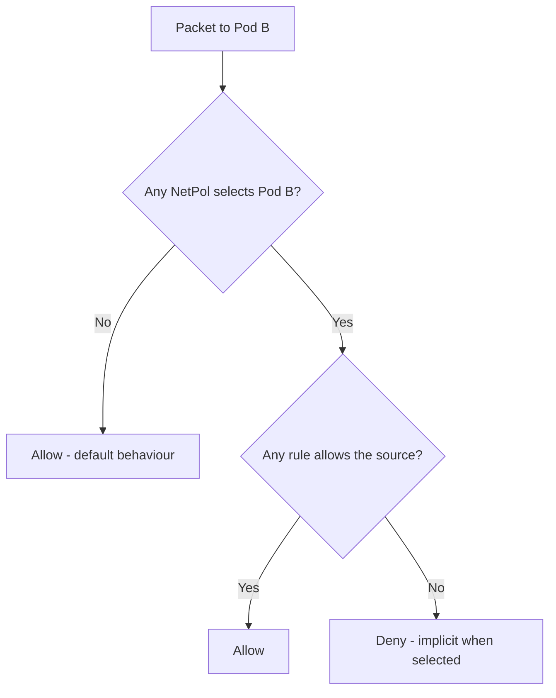

# 03 - Network Policies

By default, **all pods can talk to all pods** in a Kubernetes cluster — a flat L3 network. NetworkPolicies turn that into segmentation. They are namespaced, additive (any matching policy that allows = allowed), and enforced by the **CNI**, not the API server.

## CNI Enforcement Matters

| CNI | NetworkPolicy support |
|-----|----------------------|
| Calico | Full (ingress + egress, L3/4, plus their own GlobalNetworkPolicy at L7) |
| Cilium | Full + L7 (HTTP, gRPC, Kafka) via CiliumNetworkPolicy |
| Weave | Basic |
| Flannel | **None** — policies are silently ignored |
| AWS VPC CNI | Yes (since v1.14 of the CNI) |

**Verify**: apply a default-deny, then try to curl between pods. If it still works, your CNI doesn't enforce.

## Decision Flow



The trap: once *any* policy selects a pod for a direction, **everything else for that direction is denied** unless explicitly allowed. This is why default-deny + targeted allows is the right pattern.

## Selectors

- `podSelector` — pods in the **same namespace**
- `namespaceSelector` — pods in **any matching namespace**
- `namespaceSelector` + `podSelector` (in the same `from`/`to` element) — AND
- Two list elements — OR
- `ipBlock` — CIDR (cluster-external)

```yaml
# AND: pods labeled role=db in namespaces labeled tier=prod
- from:
    - namespaceSelector: { matchLabels: { tier: prod } }
      podSelector:       { matchLabels: { role: db } }
# OR: any pod in tier=prod, OR any pod labelled role=db (any namespace)
- from:
    - namespaceSelector: { matchLabels: { tier: prod } }
    - podSelector:       { matchLabels: { role: db } }
```

## Files
- `default-deny.yaml` — block all ingress + egress in a namespace
- `allow-from-namespace.yaml` — allow ingress from a specific namespace
- `egress-to-dns.yaml` — minimal egress to kube-dns (paired with default-deny-egress)

## Common Patterns

1. Default-deny **per namespace**, then add allows
2. Always allow egress to kube-dns (port 53 UDP/TCP) — apps break without DNS
3. Allow egress to API server CIDR if pods need it
4. Label namespaces (`name: foo`) so other policies can reference them by selector
