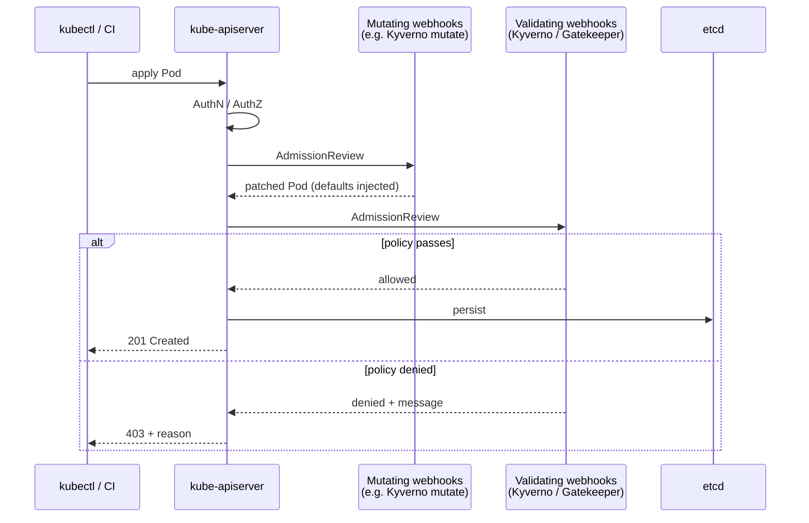

# 06 - Policy as Code

Policy engines run in the **admission chain** — every API write hits them before persistence. They turn security/compliance rules into versioned, testable code.

## Admission flow



## Engines compared

| Engine | Language | Pros | Cons |
|--------|----------|------|------|
| **Kyverno** | YAML (CRD-native) | Easy to write, mutate + validate + generate + cleanup, image verify built-in | Less expressive than Rego for complex logic |
| **OPA Gatekeeper** | Rego (Constraint + ConstraintTemplate) | Most powerful, share policies across non-K8s systems | Steep learning curve, Rego syntax |
| **jsPolicy** | JavaScript / TypeScript | Familiar to most devs, full programming language | Smaller ecosystem |
| **CEL (built-in ValidatingAdmissionPolicy)** | CEL expressions | No webhook, in-process, GA in 1.30 | Validation only, no mutate / generate |

**Default to Kyverno** unless you have a Rego/OPA investment elsewhere or need cross-platform policy sharing.

## Patterns to enforce (everywhere)

1. Disallow `:latest` and require digest pinning
2. Require resource requests/limits
3. Require labels (`team`, `cost-center`, `app.kubernetes.io/name`)
4. Require non-root + readOnlyRootFilesystem
5. Disallow `hostPath`, `hostNetwork`, `hostPID`
6. Allow only signed images from approved registries
7. Force labels on namespaces (e.g. `pod-security.kubernetes.io/enforce`)
8. Restrict LoadBalancer / NodePort services

## Files

- `kyverno-require-labels.yaml` — every Pod must carry `app` and `team`
- `kyverno-disallow-latest.yaml` — block `:latest` across the cluster
- `gatekeeper-constraint.yaml` — equivalent rule using OPA Gatekeeper

## Test policies in CI

- Kyverno CLI: `kyverno test ./policies/`
- Conftest (OPA): `conftest test --policy ./policies ./manifests`

## ValidatingAdmissionPolicy (built-in CEL)

Since 1.30 GA — webhook-free policy. Use for simple checks.

```yaml
apiVersion: admissionregistration.k8s.io/v1
kind: ValidatingAdmissionPolicy
metadata:
  name: deny-latest-tag
spec:
  failurePolicy: Fail
  matchConstraints:
    resourceRules:
      - apiGroups:   [""]
        apiVersions: ["v1"]
        operations:  ["CREATE","UPDATE"]
        resources:   ["pods"]
  validations:
    - expression: "object.spec.containers.all(c, !c.image.endsWith(':latest'))"
      message: "Image tag :latest is not allowed."
```
