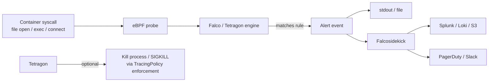

# 07 - Runtime Security

Admission policy stops bad pods from being **created**. Runtime security catches what happens **after** they start — exec'ing into containers, syscalls a process shouldn't make, files being written to suspicious paths, reverse shells, cryptominers.

Modern runtime tools use **eBPF** — kernel-level observation without kernel modules.

## Detection flow

## Tools

| Tool | Vendor | Strengths |
|------|--------|-----------|
| **Falco** | CNCF (Sysdig) | Mature, huge rule library, output to anything |
| **Tetragon** | CNCF (Isovalent / Cilium) | eBPF-native, can **enforce** (kill process), namespace-aware |
| **Tracee** | Aqua | eBPF, signature-based, deep behavioural detection |

Run **one** of Falco or Tetragon — both observe the same kernel events.

## Falco architecture

- Agent DaemonSet on every node
- Rules in YAML (the [default ruleset](https://github.com/falcosecurity/rules) covers MITRE ATT&CK basics)
- Events go to stdout → Falcosidekick → fanout to Slack/SIEM/PagerDuty/S3

## Categories of rules to deploy

1. **Shell in container** — `bash` / `sh` running where it shouldn't
2. **Sensitive file read** — `/etc/shadow`, AWS metadata, kubeconfigs
3. **Outbound to crypto-mining pools** — known IP/DNS lists
4. **Mount of `/proc`, `/var/run/docker.sock`** — escape attempts
5. **Privilege escalation** — `chmod +s`, capability changes
6. **Tampering with system binaries** — write to `/bin`, `/usr/bin`
7. **Container drift** — process not in original image

## Files
- `falco-rules.yaml` — custom Falco rule set
- `tetragon-policy.yaml` — Tetragon TracingPolicy that detects + blocks shell exec

## Operational tips
- Tune in **dry-run** for at least a week — default rules are noisy
- Forward to durable storage (S3, Splunk) — alerts must outlive the agent
- Add namespace/team tags to alerts for routing
- Pair runtime alerts with PSA + NetPol — defence in depth, not in series
