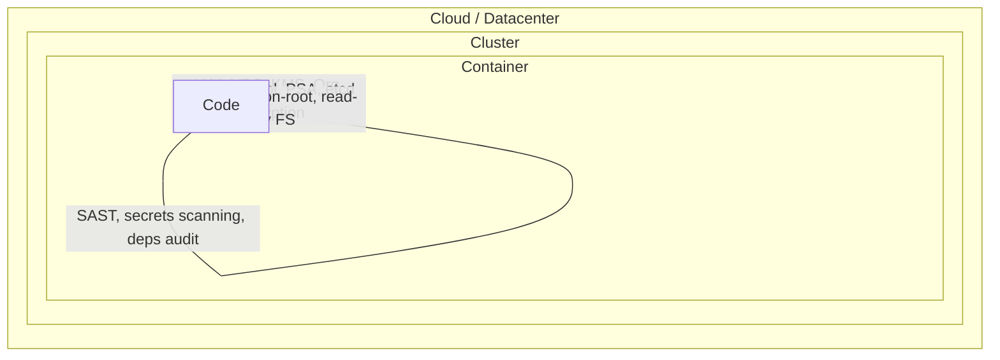

# 08 - Kubernetes & DevOps Security

Security is not a feature — it's a layered discipline. The CNCF defines the **4Cs of Cloud-Native Security**: every layer protects the one above it. Misconfigure any layer and the layers above inherit the risk.

## The 4Cs

| Layer | Concerns | Tools |
|-------|----------|-------|
| **Cloud** | IAM, network boundaries, KMS, audit logs | AWS IAM, GCP Org Policy, Azure PIM |
| **Cluster** | RBAC, admission control, network policy, etcd encryption, API server flags | kube-bench, OPA, Kyverno |
| **Container** | Image provenance, runtime privileges, non-root, read-only FS | Trivy, cosign, distroless |
| **Code** | SAST, dependency scanning, secret detection, SBOM | Semgrep, Snyk, gitleaks, Syft |

## Folder Index

| # | Topic | Focus |
|---|-------|-------|
| 01 | RBAC Deep Dive | Subjects, verbs, resources, least privilege |
| 02 | Pod Security Admission | Privileged / Baseline / Restricted |
| 03 | Network Policies | Default-deny, CNI enforcement |
| 04 | Secrets Management | ESO, Sealed Secrets, Vault |
| 05 | Image Security | Trivy, cosign, SBOM |
| 06 | Policy as Code | Kyverno, Gatekeeper, jsPolicy |
| 07 | Runtime Security | Falco, Tetragon (eBPF) |
| 08 | Supply Chain | SLSA, in-toto, provenance |
| 09 | Cluster Hardening | CIS, kube-bench, etcd encryption |
| 10 | Secrets in CI | OIDC trust to cloud |
| 11 | Zero Trust Mesh | mTLS, SPIFFE, AuthZ Policy |
| 12 | Compliance | PCI / HIPAA / SOC2 mapping |

## Golden Rules

1. **Never** run containers as root unless required.
2. **Always** set `resources.limits` and `requests`.
3. **Default-deny** NetworkPolicy in every namespace.
4. **Never** use `:latest` image tags — pin by digest.
5. **Sign and verify** every production image.
6. **Rotate** secrets via short-lived tokens, not long-lived keys.
7. **Audit** RBAC quarterly — entropy creeps in.
8. Store nothing sensitive in ConfigMaps; encrypt etcd at rest.

See `cheatsheet.md` for one-page command reference.
