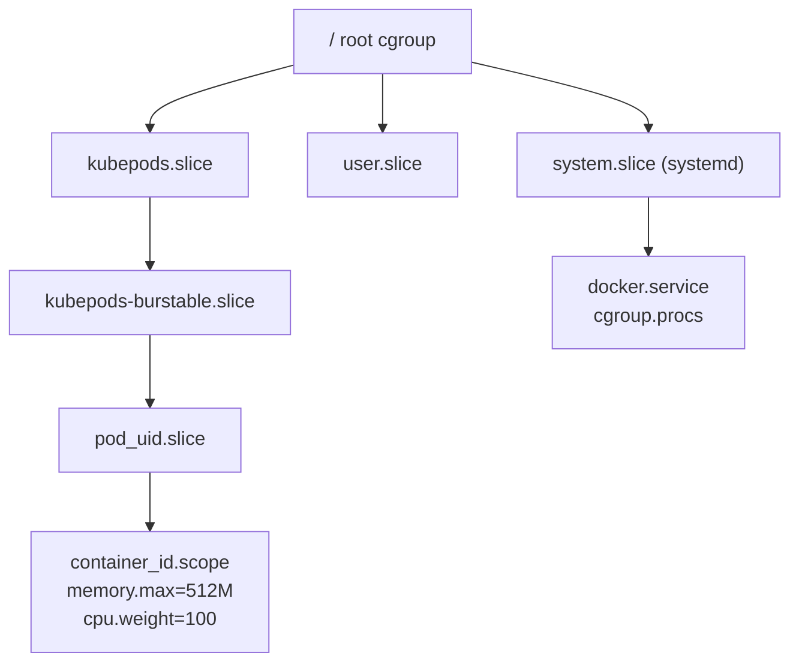
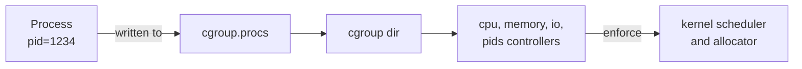

# cgroups v2 — Unified Hierarchy

## Why this matters

Every container runtime, every Kubernetes pod limit, every systemd service slice — they all collapse onto cgroups v2. If you can describe `memory.high` vs `memory.max` and explain why a Java container with `-Xmx` tuned to the limit still gets OOM-killed, you signal real systems depth. Interviewers use cgroups as a proxy for "have you actually debugged a noisy-neighbor incident in production, or only read about it?"

## Mental model

cgroups v2 is a single tree of directories under `/sys/fs/cgroup/`. Each directory is a "cgroup". Files inside the directory are knobs (limits) and meters (usage). Processes are placed by writing PIDs into `cgroup.procs`. Controllers (cpu, memory, io, pids) are enabled per-subtree via `cgroup.subtree_control`.

<!-- mermaid:rendered -->
<p align="center"></p>

<details><summary>Mermaid source</summary>



</details>

<!-- mermaid:rendered -->
<p align="center"></p>

<details><summary>Mermaid source</summary>



</details>

Key insight v1 vs v2: v1 had separate hierarchies per controller (a process could be in different cgroups for cpu vs memory). v2 has ONE hierarchy — every controller applies to the same group. Simpler, fewer footguns.

## Walkthrough

### Inspect the current cgroup of a process

```bash
cat /proc/self/cgroup
# 0::/user.slice/user-1000.slice/session-3.scope
```

The `0::` prefix means cgroup v2. v1 would show `cpu:/...`, `memory:/...` etc.

### Create a cgroup and apply a memory limit

```bash
sudo mkdir /sys/fs/cgroup/demo
echo "+memory +cpu" | sudo tee /sys/fs/cgroup/cgroup.subtree_control
echo "200M" | sudo tee /sys/fs/cgroup/demo/memory.max
echo "150M" | sudo tee /sys/fs/cgroup/demo/memory.high
echo $$    | sudo tee /sys/fs/cgroup/demo/cgroup.procs
# now this shell and any child is bounded by 200M
```

### Memory knobs

| File | Meaning |
|------|---------|
| `memory.max` | Hard limit. Exceed it -> OOM kill within the cgroup. |
| `memory.high` | Soft throttle. Above it, kernel reclaims aggressively and stalls allocations. |
| `memory.low` | Best-effort protection from reclaim. |
| `memory.min` | Hard protection. Reclaim will not touch up to this much. |
| `memory.swap.max` | Per-cgroup swap cap. |
| `memory.current` | Current usage. |
| `memory.events` | Counters: low, high, max, oom, oom_kill. |

`memory.high` is the kill-saver. Set it ~80% of `memory.max` so the process slows down (gets throttled, sees latency) before it gets killed. Most production tuning sets `memory.high`.

### CPU knobs

| File | Meaning |
|------|---------|
| `cpu.weight` | Relative share, default 100, range 1-10000 (analogous to v1 cpu.shares). |
| `cpu.max` | `<quota> <period>` in microseconds. `100000 100000` = 1 CPU. `max 100000` = no limit. |
| `cpu.stat` | Throttled time, periods, etc. |

### IO knobs

| File | Meaning |
|------|---------|
| `io.weight` | Per-device weight (default 100). |
| `io.max` | `MAJ:MIN rbps=N wbps=N riops=N wiops=N` |
| `io.stat` | Per-device stats. |

### How systemd, docker, k8s use it

- **systemd** owns the root cgroup. Each `.service`, `.slice`, `.scope` is a cgroup directory. `systemctl set-property nginx.service MemoryMax=512M` writes to `memory.max`.
- **Docker** creates `/sys/fs/cgroup/system.slice/docker-<id>.scope`. `--memory=512m` -> `memory.max`. `--cpus=1.5` -> `cpu.max=150000 100000`.
- **Kubernetes** kubelet creates the `kubepods.slice` tree. QoS class -> sub-slice (`kubepods-besteffort.slice`, `kubepods-burstable.slice`, guaranteed pods sit at the top). `resources.limits.memory` -> `memory.max`. `resources.requests.cpu` -> `cpu.weight` (proportional). `resources.limits.cpu` -> `cpu.max` (throttle).

```yaml
resources:
  requests:
    cpu: "500m"     # cpu.weight ~ 51
    memory: "256Mi" # informational + scheduler
  limits:
    cpu: "1"        # cpu.max=100000 100000
    memory: "512Mi" # memory.max=536870912
```

!!! info "Common interview questions"

    **Q: Difference between cgroups v1 and v2?**
    A: v1 has per-controller hierarchies (process can live in different cgroups per controller). v2 unifies them into one tree. v2 also has a saner OOM model (kill the whole cgroup with `memory.oom.group=1`) and proper IO control with `io.weight`.

    **Q: Why use `memory.high` over `memory.max`?**
    A: `memory.max` is a cliff — exceed it and the OOM killer fires. `memory.high` throttles allocation rate above the threshold so the workload feels backpressure (latency) instead of dying. Use `high` to stay alive, `max` as the safety net.

    **Q: A pod has `limits.cpu: 1` and `requests.cpu: 100m`. What gets written?**
    A: `cpu.weight ~ 10` (from the request, scaled from the 1024 default) and `cpu.max=100000 100000` (from the limit). The pod can burst above its weight if the node is idle, but never above 1 CPU.

    **Q: Container shows 8 CPUs in `nproc` even though limit is 1. Why?**
    A: `nproc` reads `/proc/cpuinfo` which is host-global and not namespaced. The kernel only enforces the limit at scheduling time; userspace count detection lies. Java pre-10 famously misread this; modern JVMs read `cpu.max` directly.

    **Q: Where does kubelet decide cgroup driver?**
    A: kubelet flag `--cgroup-driver=systemd|cgroupfs`. Must match the container runtime (containerd `SystemdCgroup = true`). Mismatch leads to two trees, broken accounting.

    **Q: How do you find which cgroup a runaway process belongs to?**
    A: `cat /proc/<pid>/cgroup` -> path under `/sys/fs/cgroup/`. Then `cat /sys/fs/cgroup/<path>/memory.current` for usage and `memory.events` for OOM history.

    **Q: What is a `.scope` vs `.service` vs `.slice` in systemd?**
    A: `.slice` groups for resource management (a tree node). `.service` is a systemd-managed daemon (a leaf). `.scope` wraps externally-created processes (e.g. session, container).

    **Q: How does cgroup v2 OOM differ from v1?**
    A: v2 adds `memory.oom.group=1`: kill ALL processes in the cgroup atomically rather than picking one. Closer to "container died" semantics k8s expects.

!!! warning "Gotchas"

    - **Cgroup driver mismatch** (cgroupfs vs systemd) silently breaks pod metrics and CPU throttling. Always align kubelet + runtime.
    - **`memory.max` includes page cache** for the cgroup. Heavy file IO in a tight memory cgroup -> reclaim storms. Use `memory.high` to soften.
    - **Hybrid mode (v1 + v2 simultaneously)** still exists on some distros (`systemd.unified_cgroup_hierarchy=0`). Check `mount | grep cgroup`. Mixed mode confuses tooling.
    - **CPU throttling on bursty workloads** is the #1 cause of mysterious p99 latency spikes in k8s. Often the right fix is to raise `cpu.max` or remove the limit and rely on `cpu.weight`.
    - **`pids.max`** exhaustion looks like "fork failed" / "Resource temporarily unavailable". Always set it for untrusted workloads (default unlimited can crash the node).
    - Writing to `cgroup.procs` requires the target cgroup to be a leaf (no child cgroups) once controllers are enabled — "no internal process" rule.
    - Don't `rmdir` a non-empty cgroup; move processes to parent first.

## Sources

- Kernel docs: https://www.kernel.org/doc/html/latest/admin-guide/cgroup-v2.html
- systemd resource control: https://www.freedesktop.org/software/systemd/man/systemd.resource-control.html
- Kubernetes cgroup v2 design: https://kubernetes.io/docs/concepts/architecture/cgroups/
- LWN "Understanding the new control groups API": https://lwn.net/Articles/679786/
- man 7 cgroups: https://man7.org/linux/man-pages/man7/cgroups.7.html
