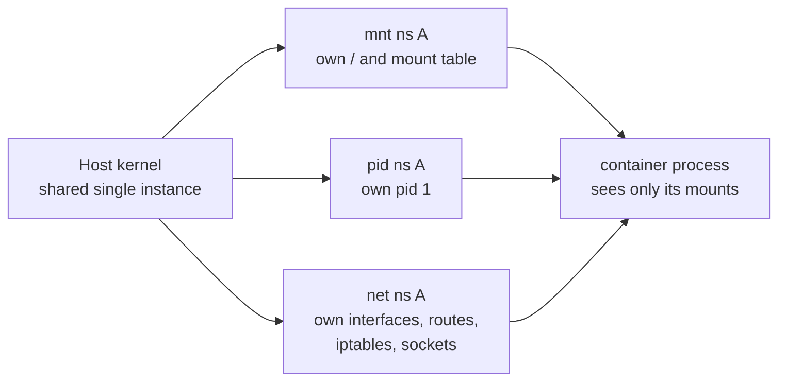
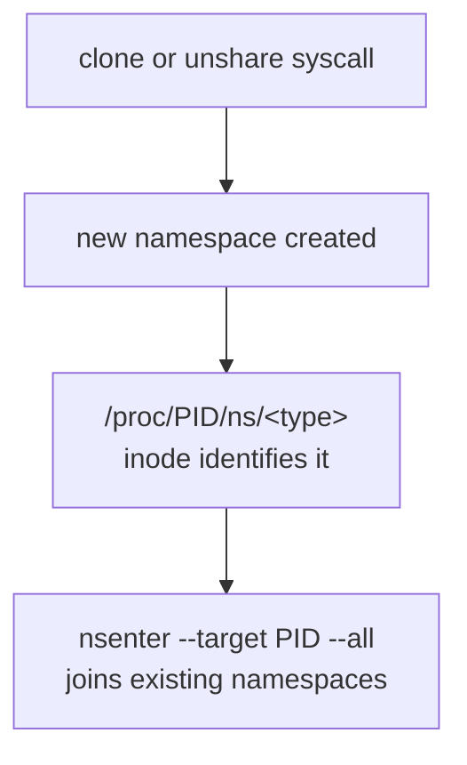

# Linux Namespaces — The Other Half of Containers

## Why this matters

Containers are not a kernel feature. They are a userspace convention built from two primitives: **cgroups** (how much) and **namespaces** (what you can see). Every interviewer's favorite test is "what is a container, kernel-level?" — the only correct answer names the namespaces involved. If you can list all 8 and explain user-namespace ID mapping, you've cleared the bar.

## Mental model

A namespace is a kernel data structure that wraps a global resource (mount table, PID space, network stack, ...) so the processes inside see their own private copy. A process belongs to exactly one namespace of each type, identified by inode under `/proc/<pid>/ns/`.





## The 8 namespaces (as of kernel 5.6+)

| Namespace | Isolates | `unshare` flag | Created year |
|-----------|----------|----------------|--------------|
| **mnt**   | mount table, filesystem view | `--mount` / `CLONE_NEWNS` | 2002 |
| **pid**   | process IDs (own pid 1) | `--pid --fork` / `CLONE_NEWPID` | 2008 |
| **net**   | network devices, IPs, routes, ports, iptables, sockets | `--net` / `CLONE_NEWNET` | 2009 |
| **ipc**   | SysV IPC, POSIX message queues | `--ipc` / `CLONE_NEWIPC` | 2006 |
| **uts**   | hostname and NIS domain | `--uts` / `CLONE_NEWUTS` | 2006 |
| **user**  | UIDs/GIDs, capabilities | `--user` / `CLONE_NEWUSER` | 2013 |
| **cgroup**| cgroup root (hides parent path) | `--cgroup` / `CLONE_NEWCGROUP` | 2016 |
| **time**  | CLOCK_MONOTONIC, CLOCK_BOOTTIME offsets | `--time` / `CLONE_NEWTIME` | 2020 |

## Walkthrough

### See your namespaces

```bash
ls -li /proc/self/ns/
# 4026531835 cgroup -> 'cgroup:[4026531835]'
# 4026531839 ipc    -> 'ipc:[4026531839]'
# 4026531840 mnt    -> 'mnt:[4026531840]'
# ...
```

The number in brackets is the namespace inode. Two processes share a namespace iff they show the same inode.

### Create a network + UTS namespace shell

```bash
sudo unshare --net --uts --fork --pid --mount-proc bash
# inside: hostname new and ip link only shows lo
hostname inside-ns
ip link
# 1: lo: <LOOPBACK> ...
ps -ef
# only this bash and its children
```

### Enter another container's namespaces

```bash
# find a container PID
docker inspect -f '{{.State.Pid}}' my-container
# 12345
sudo nsenter --target 12345 --all
# you are now inside that container
```

### How docker uses them

When you run `docker run alpine sh`:

1. Docker calls `clone()` with `CLONE_NEWNS|NEWPID|NEWNET|NEWIPC|NEWUTS|NEWCGROUP` (and `NEWUSER` if user-ns remap is on).
2. The new process pivot_roots into the image rootfs (mnt namespace).
3. Networking: docker creates a `veth` pair, moves one end into the container's net ns, attaches the other to the `docker0` bridge.
4. Cgroup: docker writes the container PID into `/sys/fs/cgroup/system.slice/docker-<id>.scope/cgroup.procs`.

The container has no idea it's in a namespace — `getpid()` returns 1, `gethostname()` returns whatever was set, `ip a` shows only `eth0` and `lo`.

### User namespace ID mapping

User namespaces let an unprivileged user be "root" inside a namespace without being root on the host. The trick: a UID mapping translates between the inside view and the host view.

```bash
unshare --user --map-root-user bash
id
# uid=0(root) gid=0(root)
cat /proc/self/uid_map
# 0          1000          1
# inside-uid host-uid     length
```

You appear as root inside but you are still UID 1000 on the host — files you create are owned by 1000, you cannot touch host root-owned files.

!!! info "Common interview questions"

    **Q: Name the namespaces in Linux.**
    A: mnt, pid, net, ipc, uts, user, cgroup, time. Eight total. (Bonus: time was added in 5.6, 2020.)

    **Q: What's the difference between cgroups and namespaces?**
    A: Namespaces isolate WHAT a process can see (its own filesystem, PIDs, network). Cgroups limit HOW MUCH it can use (CPU, memory, IO). Containers need both.

    **Q: What does pid 1 inside a container do that's special?**
    A: pid 1 reaps zombies, gets `SIGTERM` translated specially (no default handler), and if it dies the whole pid namespace dies. That's why `tini` / `dumb-init` exist — most apps don't handle pid 1 duties.

    **Q: How do two containers share a network?**
    A: Either share the same net namespace (k8s pod model — a pause container holds the net ns, others join via `nsenter`), or connect via veth + bridge.

    **Q: What's a user namespace and why is it security-relevant?**
    A: It maps host UIDs to container UIDs. A "root" inside a user-ns is unprivileged on the host. Mitigates kernel-exploit-then-root-on-host attacks. Default in podman, opt-in in docker.

    **Q: What is `nsenter`?**
    A: `setns(2)` syscall wrapper. Joins an existing namespace by pointing at `/proc/<pid>/ns/<type>` symlinks. Used by `kubectl exec`, `docker exec`.

    **Q: Why do `top` and `free` show host values inside a container?**
    A: They read `/proc/meminfo` and `/proc/stat`, which are not namespaced. Modern kernels added some cgroup-aware files but the legacy ones lie. Use `cgroup-aware` tools or `lxcfs`.

    **Q: How do k8s pods share a network namespace?**
    A: The "pause" container is created first and holds the net + ipc namespaces. Application containers in the pod join via `--net=container:<pause>`. That's why all containers in a pod share `localhost`.

    **Q: What happens to a network namespace when its last process exits?**
    A: It's destroyed (along with all interfaces inside) unless something pinned it via `ip netns add` (creates a bind mount under `/var/run/netns/`).

    **Q: Why can't unprivileged users create mount namespaces normally?**
    A: They can — but only if combined with a user namespace (`unshare -rm`). Creating a mount namespace as raw root would let an attacker shadow `/etc`.

!!! warning "Gotchas"

    - **`unshare --pid` without `--fork`** doesn't put the current shell in the new pid ns — only its children. Always `--fork`. And `--mount-proc` to get a proper `/proc`.
    - **Network namespace leaks**: forgetting `ip netns delete` leaves orphaned namespaces consuming kernel memory. Check `ls /var/run/netns/`.
    - **User namespace + setuid binaries**: setuid is disabled inside user namespaces by default — ping, sudo etc. won't work without capability tricks.
    - **`/proc/<pid>/ns/<type>` is a magic symlink** — readlink gives `type:[inode]`, but you can't follow it normally. Use `nsenter` or `setns()`.
    - **Time namespace** only virtualizes monotonic and boot clocks, NOT wall-clock (CLOCK_REALTIME). You can't fake "the year is 2099" inside a container.
    - **k8s `hostNetwork: true`** disables the net namespace — pod sees host interfaces and ports. Useful for ingress, dangerous for everything else.
    - **Joining a pid namespace requires fork** because pid is determined at process creation; `setns()` to a pid ns affects only future children.

## Sources

- man 7 namespaces: https://man7.org/linux/man-pages/man7/namespaces.7.html
- man 7 user_namespaces: https://man7.org/linux/man-pages/man7/user_namespaces.7.html
- man 7 pid_namespaces: https://man7.org/linux/man-pages/man7/pid_namespaces.7.html
- man 1 unshare: https://man7.org/linux/man-pages/man1/unshare.1.html
- man 1 nsenter: https://man7.org/linux/man-pages/man1/nsenter.1.html
- LWN namespaces in operation series: https://lwn.net/Articles/531114/
- Kernel time namespace: https://www.kernel.org/doc/html/latest/admin-guide/namespaces/index.html
