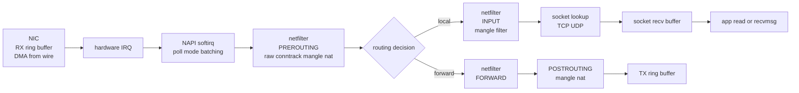

# Linux Networking Stack — Packet's Journey

## Why this matters

When a packet is dropped, slow, NATed wrong, or a service mesh sidecar mangles it, you need to trace where it died. NIC -> driver -> netfilter -> conntrack -> socket -> app is the universal mental model. Half of all "Kubernetes networking" interview questions reduce to "where in this pipeline is your packet?"

## Mental model

A packet enters via a NIC ring buffer (DMA from hardware), the driver raises a soft interrupt (NAPI), the kernel runs it through netfilter hooks, optionally tracks connection state (conntrack), routes it, hands it to a socket, and the app `read()`s it. Egress is the same in reverse.




## Walkthrough — ingress in detail

### 1. NIC + ring buffer

The NIC writes incoming packets via DMA into a circular buffer in RAM (the RX ring), one descriptor per packet slot. When the buffer fills past a threshold the NIC raises a hardware IRQ.

Inspect:

```bash
ethtool -g eth0
# Pre-set maximums:
# RX:        4096
# Current hardware settings:
# RX:        1024

ethtool -S eth0 | grep -i drop
# rx_no_buffer_count: 0
# rx_missed_errors: 12   <-- ring overflow, increase buffer
```

Increase ring size:
```bash
ethtool -G eth0 rx 4096
```

### 2. NAPI / softirq

Modern drivers don't process one packet per IRQ — that would melt the CPU at line rate. NAPI: the IRQ handler disables further IRQs, schedules a softirq (`NET_RX_SOFTIRQ`), which polls the ring in batches (`netdev_budget`, default 300 packets) per CPU.

Watch:
```bash
cat /proc/softirqs | grep -E "NET_RX|NET_TX"
mpstat -P ALL 1   # %soft column = softirq CPU
```

If one CPU is 100% softirq while others idle: enable RPS (Receive Packet Steering) or RSS (multiple hardware queues) to spread.

### 3. netfilter hooks

The kernel exposes 5 hook points; both iptables and nftables register at these.

| Hook | Fires when |
|------|-----------|
| **PREROUTING** | packet arrives, before routing decision (DNAT lives here) |
| **INPUT** | routing chose "local delivery" |
| **FORWARD** | routing chose "another host" |
| **OUTPUT** | locally-generated packet, before routing |
| **POSTROUTING** | after routing, before egress (SNAT/MASQUERADE lives here) |

Tables (which sets of rules run at which hook):
- **raw** — runs first, used to mark `NOTRACK` (skip conntrack)
- **mangle** — packet header rewriting (TOS, TTL)
- **nat** — DNAT / SNAT / MASQUERADE
- **filter** — accept/drop policy (the classic "firewall")
- **security** — SELinux marks

Inspect:
```bash
sudo iptables -t nat -L -n -v
sudo nft list ruleset
```

### 4. conntrack

Connection tracking remembers (src, dst, sport, dport, proto) -> state (NEW, ESTABLISHED, RELATED). Required for stateful NAT and stateful filtering. Also for k8s `kube-proxy iptables/ipvs` mode.

```bash
sudo conntrack -L | head
# tcp 6 431999 ESTABLISHED src=10.0.0.5 dst=10.0.0.6 sport=44321 dport=80 ...

cat /proc/sys/net/netfilter/nf_conntrack_count
cat /proc/sys/net/netfilter/nf_conntrack_max
# if count nears max -> "table full" drops in dmesg
```

Conntrack table full = dropped connections. Symptom: random connection resets under load.

### 5. socket buffer + app

Once routed locally, the packet is enqueued onto the matching socket's receive buffer (`/proc/sys/net/ipv4/tcp_rmem`). The app `read()` drains it. If the buffer fills, TCP advertises a smaller window -> sender slows down (flow control).

```bash
ss -tinm sport = :443
# Recv-Q  Send-Q
# 0       128
# skmem:(r0,rb425984,t0,tb46080,...)
# rb = recv buffer size
```

## Egress notable additions

- **qdisc / tc** controls egress shaping (HTB, fq_codel, etc.). `tc -s qdisc show dev eth0` shows drops/backlog.
- **GSO/GRO/TSO** offload large segmentation to NIC.

## How k8s uses this

- **kube-proxy iptables mode** writes thousands of nat-table rules; PREROUTING does DNAT to the pod IP.
- **kube-proxy ipvs mode** uses IPVS in the INPUT hook for O(1) lookup.
- **Calico/Cilium** install eBPF programs at TC ingress / XDP, often bypassing the iptables path entirely.
- **CNI veth** pair: host end attached to bridge or routed; pod end is the pod's `eth0`.

!!! info "Common interview questions"

    **Q: Walk me through what happens when a packet arrives.**
    A: NIC DMAs to RX ring -> hardware IRQ -> NAPI softirq polls -> PREROUTING (raw, conntrack, mangle, nat) -> routing -> INPUT or FORWARD -> socket lookup -> recv buffer -> app `read()`.

    **Q: Where does DNAT happen vs SNAT?**
    A: DNAT in PREROUTING (rewrite destination so routing picks the right path). SNAT/MASQUERADE in POSTROUTING (rewrite source after routing decided egress interface).

    **Q: Conntrack table full — symptoms and fix?**
    A: Symptom: `nf_conntrack: table full, dropping packet` in dmesg, random TCP resets. Fix: `sysctl net.netfilter.nf_conntrack_max=1048576`, tune `nf_conntrack_tcp_timeout_*` to expire faster, or use `NOTRACK` for high-volume internal traffic via raw table.

    **Q: What is NAPI and why does it exist?**
    A: New API for receive: instead of one IRQ per packet, the IRQ disables itself and a softirq polls the ring in batches. Avoids livelock under heavy traffic.

    **Q: Difference between RSS, RPS, RFS?**
    A: RSS = hardware multi-queue, NIC hashes packets to queues -> multiple CPUs handle IRQs. RPS = software equivalent for single-queue NICs (steer in software). RFS = like RPS but tries to land the packet on the CPU running the consuming app (cache locality).

    **Q: Why are iptables rules slow in big k8s clusters?**
    A: O(n) linear chain walk per packet. 10k services -> 10k rules processed per packet. IPVS hash-table is O(1). eBPF cilium bypasses entirely.

    **Q: What is `tcpdump`'s viewpoint in this stack?**
    A: tcpdump uses AF_PACKET to tap raw frames. Default attachment point is BEFORE iptables on ingress and AFTER iptables on egress. So a packet seen by tcpdump may still be dropped by netfilter on ingress.

    **Q: What's a softirq and why does high `%soft` matter?**
    A: Softirqs run network/timer/block work outside hardirq context. High `%soft` on one CPU = packet processing bottleneck. Spread via RSS/RPS.

    **Q: Order of netfilter tables on a single hook?**
    A: raw -> mangle -> nat -> filter (-> security). Same hook, different priorities.

    **Q: How does a Kubernetes service's ClusterIP get to a pod?**
    A: kube-proxy iptables mode: PREROUTING DNAT rule rewrites dst from ClusterIP:port -> podIP:targetPort, conntrack remembers it, response packet's POSTROUTING SNAT rewrites back. ipvs mode: INPUT hook redirects via ipvs virtual server.

!!! warning "Gotchas"

    - **conntrack on UDP** uses 30s default timeout for unanswered streams; high-cardinality UDP (DNS, NTP) can fill the table fast.
    - **DNAT after policy routing** can confuse you: `ip rule` runs before iptables nat in some kernels. Trace with `iptables -t raw -A PREROUTING -j TRACE`.
    - **`tcpdump` sees packets pre-iptables** on ingress — packet appearing in capture doesn't prove the app received it.
    - **MTU mismatches** silently drop packets when DF bit is set; ICMP Frag Needed often blocked. Always check path MTU when "TCP works for small payloads, hangs for large".
    - **NIC ring overruns** (`rx_missed_errors`) look like packet loss but happen before any kernel code runs. Increase ring size via ethtool.
    - **GRO** can merge packets before tcpdump sees them — captures show jumbo-sized packets that never appeared on the wire.
    - **Per-CPU softirq imbalance** is common after VM migration; re-pin IRQs (`/proc/irq/<n>/smp_affinity`).
    - **kube-proxy iptables with 5k+ services** literally takes seconds to install rules; pod startup network latency suffers. Move to ipvs or eBPF.

## Sources

- Kernel networking: https://www.kernel.org/doc/html/latest/networking/index.html
- netfilter architecture: https://www.netfilter.org/documentation/HOWTO/netfilter-hacking-HOWTO-3.html
- man 8 conntrack: https://manpages.debian.org/conntrack
- NAPI design: https://wiki.linuxfoundation.org/networking/napi
- Cloudflare blog "Linux Network Stack Tuning": https://blog.cloudflare.com/how-to-receive-a-million-packets/
- Cilium eBPF datapath: https://docs.cilium.io/en/stable/network/ebpf/
- Kubernetes networking: https://kubernetes.io/docs/concepts/services-networking/
