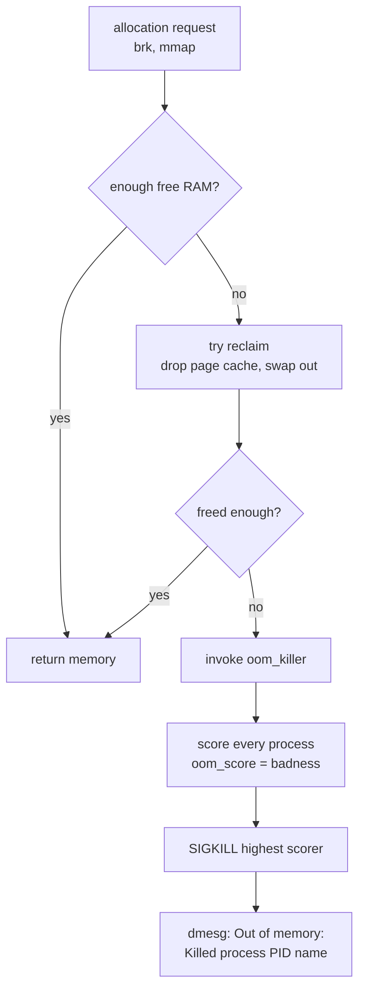
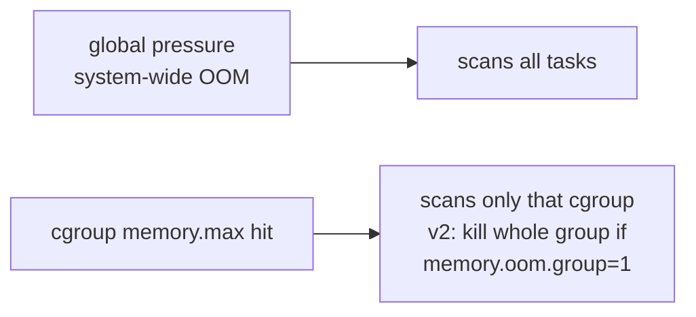

# The OOM Killer — When the Kernel Picks a Victim

## Why this matters

Production memory exhaustion is one of the most common SRE incidents. Every responder must read `dmesg`, identify the victim, understand the score, and explain why THAT process died. If you can recite the OOM score formula and the difference between system OOM and cgroup OOM, you've shown you've owned a real outage.

## Mental model

Linux overcommits memory. `malloc()` returns a non-NULL pointer for memory the kernel hasn't actually backed. The accounting moment is page-fault time — when a process touches a page, the kernel must give it real RAM. If RAM is gone and reclaim (page cache eviction, swap) cannot free enough, the kernel calls the OOM killer.

<!-- mermaid:rendered -->
<p align="center"></p>

<details><summary>Mermaid source</summary>



</details>

<!-- mermaid:rendered -->
<p align="center"></p>

<details><summary>Mermaid source</summary>



</details>

## OOM score calculation

Modern kernels (`mm/oom_kill.c`, function `oom_badness`):

```text
points = (process_RSS + process_swap + pgtables) / total_pages * 1000
points += oom_score_adj * 10   // operator override
```

- `total_pages` is total memory available to the OOM domain (system or cgroup limit).
- The result is roughly "what percent of memory does this process own, scaled to 1000".
- `oom_score_adj` ranges -1000 to +1000. -1000 means "never kill this", +1000 means "kill me first". Default 0.
- Final score visible in `/proc/<pid>/oom_score`.

Examples:
- A 4 GB process on a 16 GB box: `4/16 * 1000 = 250`.
- Same process with `oom_score_adj = -500`: `250 + (-500*10/1000) = 250 - 500 = -250` -> protected.
- sshd, systemd typically run with `oom_score_adj = -1000` -> immune.

## Walkthrough

### Find the OOM event

```bash
dmesg -T | grep -i "out of memory" -A 2
# [Tue Mar  4 14:22:01 2026] Out of memory: Killed process 4521 (java) total-vm:8123456kB, anon-rss:6234567kB, ...
# [Tue Mar  4 14:22:01 2026] oom_reaper: reaped process 4521 (java)

journalctl -k --since "1 hour ago" | grep -i killed
```

What to extract:
- Victim PID and name
- `total-vm` (virtual size, mostly meaningless), `anon-rss` (real memory it owned)
- Whether it was a global OOM or cgroup OOM (look for `Memory cgroup out of memory` line)

### Inspect a running process's score

```bash
cat /proc/$(pgrep -n java)/oom_score
# 412
cat /proc/$(pgrep -n java)/oom_score_adj
# 0
```

### Protect a critical process

```bash
echo -1000 | sudo tee /proc/$(pgrep sshd)/oom_score_adj
# now sshd will not be picked
```

systemd unit equivalent:

```ini
[Service]
OOMScoreAdjust=-900
```

### Cgroup v2 OOM behaviour

```bash
cat /sys/fs/cgroup/myapp.slice/memory.events
# low 0
# high 12
# max 3
# oom 1
# oom_kill 1
```

- `oom` increments when the cgroup hit its limit and OOM was invoked.
- `oom_kill` increments per process killed.
- `memory.oom.group=1` -> kill ALL processes in the cgroup atomically (k8s expects this).

### Make a process opt out via PR_SET_DUMPABLE

Privileged daemons can call `prctl(PR_SET_DUMPABLE, 0)` and then no user can read their `oom_score_adj` to manipulate it.

### Investigate which container died in k8s

```bash
kubectl get events --field-selector reason=OOMKilling
kubectl describe pod <pod>
# State: Terminated
#   Reason: OOMKilled
#   Exit Code: 137  (= 128 + SIGKILL=9)
```

Exit 137 = OOM. Always.

!!! info "Common interview questions"

    **Q: Walk me through what triggers the OOM killer.**
    A: An allocation can't be satisfied even after reclaim (dropping clean cache, swapping). Kernel scores all candidate tasks via `oom_badness()`, picks the highest score, sends SIGKILL. Logs to dmesg.

    **Q: How is the score computed?**
    A: Roughly `(RSS + swap + page-tables) / total_pages * 1000 + oom_score_adj*10`. Bigger processes die first.

    **Q: How do you protect a process from OOM?**
    A: Write -1000 to `/proc/<pid>/oom_score_adj`, or set `OOMScoreAdjust=-1000` in the systemd unit. Don't protect application processes — protect supervisors (sshd, systemd, kubelet).

    **Q: What's exit code 137 in Kubernetes?**
    A: 128 + 9 (SIGKILL). Almost always OOMKilled by the cgroup limit. Confirm via `kubectl describe pod` -> `Reason: OOMKilled`.

    **Q: Difference between cgroup OOM and system OOM?**
    A: Cgroup OOM fires when a cgroup hits `memory.max`; only processes in that cgroup are candidates. System OOM fires when the host runs out; any process is a candidate. cgroup v2 can `oom.group=1` to kill the whole cgroup atomically.

    **Q: Why does Java in a container get OOMKilled even with `-Xmx` matching the limit?**
    A: `-Xmx` only sets the heap. JVM also has metaspace, code cache, direct buffers, thread stacks (~1MB each), JIT scratch. RSS is heap + everything else. Set `-Xmx` to ~70-80% of `memory.max`, or use `-XX:MaxRAMPercentage=75`.

    **Q: What's the OOM reaper?**
    A: A kernel thread that asynchronously reaps the victim's anonymous memory after SIGKILL, so memory comes back even if the dying process is stuck in uninterruptible sleep.

    **Q: How can you avoid OOM altogether?**
    A: Use `memory.high` (cgroup v2) for soft throttling -> process slows down with allocation stalls before hitting the cliff. Prefer this over `memory.max` alone.

    **Q: What is `vm.overcommit_memory`?**
    A: Sysctl controlling allocation policy. 0 (default) = heuristic. 1 = always overcommit (Redis recommends this for fork()). 2 = strict, never overcommit beyond `vm.overcommit_ratio` of (RAM + swap). Mode 2 disables OOM but causes ENOMEM at malloc time.

    **Q: A box has 64 GB RAM, no swap, you set vm.panic_on_oom=1. What happens at OOM?**
    A: Kernel panics instead of killing. Used when you'd rather reboot (orchestrator reschedules) than have a degraded node.

!!! warning "Gotchas"

    - **`vm.swappiness=0` does NOT disable swap**, it just makes the kernel reluctant. To truly disable: `swapoff -a` + remove from fstab. k8s historically required this; cgroup v2 made it OK to keep swap.
    - **The OOM killer can pick the wrong victim** — the biggest is not always the cause. Often a memory leak in a small daemon allocates pressure that kills the legitimately large database.
    - **`oom_score_adj` is inherited** by child processes. Setting it on a shell affects everything you launch.
    - **Cgroup v1 OOM semantics are different**: it kills one process per OOM event in the cgroup. v2 with `oom.group=1` kills all. Mismatched expectations cause "why is half my pod still alive after OOM?" tickets.
    - **`/proc/sys/vm/oom_dump_tasks=1`** dumps EVERY task at OOM time — huge log spam on big boxes, but invaluable for forensics.
    - **MMAP'd files don't count toward anon-rss** but they DO count toward `memory.current` in cgroup accounting. A container heavy on file IO can OOM "with no memory leak".
    - On NUMA boxes, `mempolicy` constraints can cause OOM despite plenty of free memory on a different node. Look for "Node X has no free memory" in dmesg.

## Sources

- Kernel OOM source: https://github.com/torvalds/linux/blob/master/mm/oom_kill.c
- man 5 proc -> `/proc/[pid]/oom_score_adj`: https://man7.org/linux/man-pages/man5/proc.5.html
- LWN "Taming the OOM killer": https://lwn.net/Articles/317814/
- LWN "The OOM killer in cgroup v2": https://lwn.net/Articles/761118/
- Kubernetes OOM exit codes: https://kubernetes.io/docs/tasks/configure-pod-container/assign-memory-resource/
- Sysctl docs: https://www.kernel.org/doc/Documentation/sysctl/vm.txt
