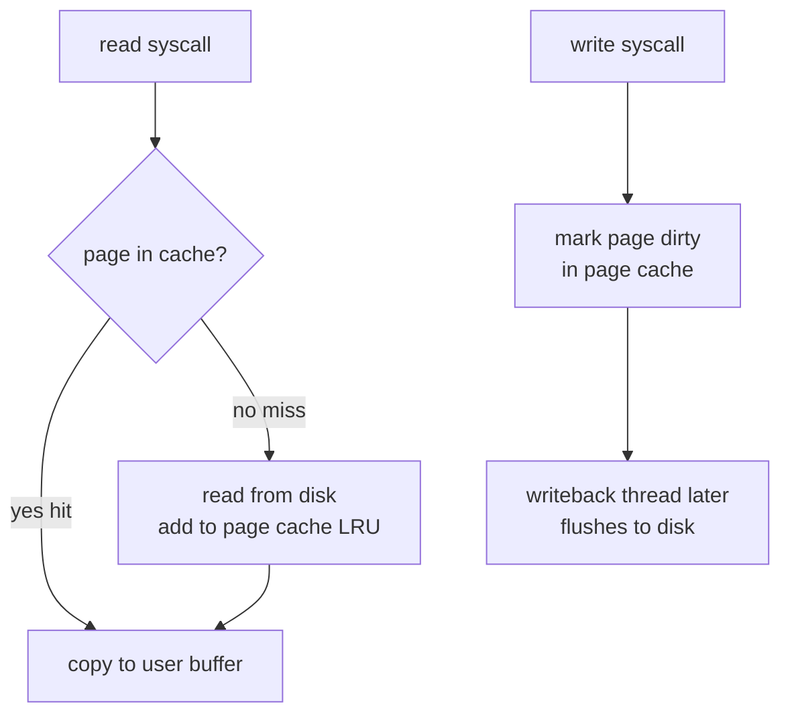
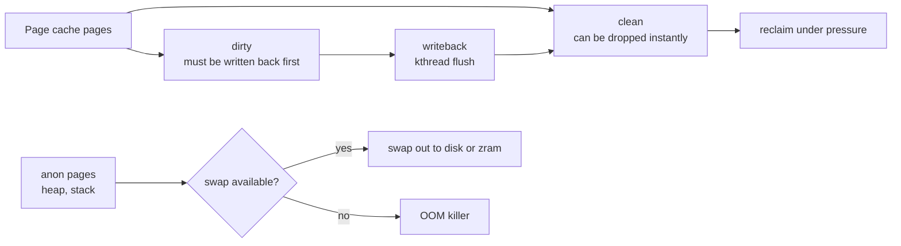

# Page Cache and Swap — How Linux Lies About Memory

## Why this matters

`free -h` shows "0 free" and operators panic. Wrong instinct. Linux uses every byte of unused RAM as page cache. Understanding the dirty/clean/active/inactive lists, writeback, and modern swap (zswap, zram, cgroup v2 swap controls) separates "I read a blog" from "I tuned a database server". Interviewers love this because it's where naive admins reach for `drop_caches` in production.

## Mental model

Every file read populates page cache. Every write goes to a page cache page first (marked dirty), then writeback flushes it to disk asynchronously. Free memory = wasted memory; the kernel reclaims clean pages on demand.

<!-- mermaid:rendered -->
<p align="center"></p>

<details><summary>Mermaid source</summary>



</details>

<!-- mermaid:rendered -->
<p align="center"></p>

<details><summary>Mermaid source</summary>



</details>

## Reading `free -h`

```text
              total        used        free      shared  buff/cache   available
Mem:           62Gi        12Gi       1.2Gi       512Mi        49Gi        49Gi
Swap:           8Gi       2.1Gi       5.9Gi
```

- `used` = anon + slab + page tables, NOT including cache
- `buff/cache` = page cache + buffer cache + slab reclaimable
- `available` = the realistic "free for new allocations" number (free + reclaimable cache). USE THIS, not `free`.

## Walkthrough

### Watch dirty pages and writeback

```bash
grep -E "Dirty|Writeback|Cached" /proc/meminfo
# Cached:         48234112 kB
# Dirty:             18432 kB
# Writeback:             0 kB
```

- **Dirty** = pages modified, not yet on disk
- **Writeback** = pages in flight to disk

Tunables (`/proc/sys/vm/`):

| Knob | Default | Meaning |
|------|---------|---------|
| `dirty_ratio` | 20 | % of available memory before sync writes block the writer |
| `dirty_background_ratio` | 10 | % triggers background writeback |
| `dirty_expire_centisecs` | 3000 | dirty pages older than this are written |
| `dirty_writeback_centisecs` | 500 | how often the flusher wakes |
| `swappiness` | 60 | bias 0-100, higher = swap anon sooner instead of dropping cache |
| `vfs_cache_pressure` | 100 | reclaim pressure on inode/dentry cache |

### Force a flush

```bash
sync                           # flush all dirty pages
echo 3 > /proc/sys/vm/drop_caches   # drop clean cache (don't do this in prod)
# 1 = pagecache, 2 = dentry+inode, 3 = both
```

`drop_caches` is for benchmarks only. Doing it on a busy server tanks performance until cache rewarms.

### Swap inspection

```bash
swapon --show
# NAME      TYPE      SIZE  USED PRIO
# /dev/zram0 partition   8G  2.1G   100
# /swapfile  file        4G    0B    -2

cat /proc/swaps
free -h
```

Per-process swap usage:

```bash
for f in /proc/[0-9]*/status; do
  awk '/VmSwap|Name/{printf "%s ", $2}END{print ""}' "$f"
done | sort -k2 -n -r | head
```

### Why swap is OK in 2026

Old wisdom: "disable swap on servers." That came from era when:
- Swap on spinning disks meant 100ms latency stalls
- cgroup v1 didn't isolate swap per workload
- k8s kubelet refused to start with swap on

What changed:
- **NVMe swap** is microseconds, not milliseconds
- **cgroup v2** has `memory.swap.max` per cgroup -> noisy workload can't eat all swap
- **k8s 1.28+** supports `NodeSwap` feature gate; can run with swap enabled per QoS class
- **zswap / zram** swap to compressed RAM (no disk at all)

Without swap: anon pages have nowhere to go under pressure -> kernel must drop file-backed code pages -> thrashing executable text -> system grinds. With swap: cold anon pages migrate out, cache stays warm.

### zswap vs zram

| Feature | zswap | zram |
|---------|-------|------|
| What | Compressed cache in front of real swap | Compressed RAM block device used AS swap |
| Backing | Falls through to disk swap when full | Pure RAM, no disk |
| Use case | Has disk swap, want to reduce IO | No swap disk available, e.g. embedded / containers |

Enable zram (common on modern Fedora, Ubuntu desktop):

```bash
sudo modprobe zram
echo lz4 | sudo tee /sys/block/zram0/comp_algorithm
echo 4G  | sudo tee /sys/block/zram0/disksize
sudo mkswap /dev/zram0
sudo swapon /dev/zram0 -p 100
```

### Cgroup v2 swap control

```bash
echo 256M | sudo tee /sys/fs/cgroup/myapp.slice/memory.swap.max
cat /sys/fs/cgroup/myapp.slice/memory.swap.current
```

Per-cgroup `memory.swap.max=0` disables swap for just that workload.

!!! info "Common interview questions"

    **Q: What does `free -h` `available` mean vs `free`?**
    A: `free` is truly idle pages; `available` adds reclaimable cache. `available` is what your next allocation can actually get.

    **Q: Should we set swappiness to 0 in production?**
    A: Generally no. 0 makes the kernel refuse to swap until reclaim is desperate, which can cause latency spikes and OOM-kills of file-backed pages first. 10-30 is usually a saner choice. Database vendors recommend 1-10.

    **Q: A web server has high `Dirty:` and slow writes. What's happening?**
    A: Dirty pages crossed `dirty_background_ratio` (10%) -> background flusher running. If they hit `dirty_ratio` (20%), the writing process itself blocks until pages flush. Lower the ratios for SSD-backed systems to smooth bursts.

    **Q: Why did my container OOM despite the heap looking fine?**
    A: Cgroup memory accounting includes page cache. Heavy file IO + tight `memory.max` -> reclaim storm + OOM. Use `memory.high` to throttle, or raise `memory.max`.

    **Q: When would you intentionally `drop_caches`?**
    A: Benchmark setup, reproducing a cold-cache scenario, NOT production cleanup. It just causes the next reads to refault from disk.

    **Q: Page cache vs buffer cache?**
    A: Historically separate; since 2.4 they're unified. "buffer" in `free` means raw block-device IO (filesystem metadata, dd from /dev/sdX); "cache" is file-backed page cache. Both reclaimable.

    **Q: What's a major fault vs minor fault?**
    A: Minor = page in cache, just needs to be mapped (no IO). Major = page must be read from disk. `ps -o min_flt,maj_flt`.

    **Q: Explain swappiness arithmetic.**
    A: It's a bias when reclaim chooses anon vs file pages. Score = `(swappiness * anon_priority) + ((200-swappiness) * file_priority)`. swappiness=0 -> almost never anon. =100 -> equal preference. =200 (modern kernels) -> prefer anon.

    **Q: Why is swap-on-zram useful inside a 1 GB container?**
    A: Cold anon pages compress 3-4x, so you effectively get more memory without touching disk. Used heavily in ChromeOS, Android, embedded.

    **Q: Difference between `vm.dirty_ratio` and `vm.dirty_bytes`?**
    A: ratio is percent of available memory; bytes is absolute. Set one or the other (the other becomes 0). On big-RAM boxes, prefer bytes — 20% of 256 GB is 51 GB of dirty data, way too much.

!!! warning "Gotchas"

    - **`drop_caches` in production** = cache warmup penalty + IO storm. Almost never the right answer.
    - **Cgroup memory.max counts page cache** — file-heavy workloads OOM unexpectedly. Tune limits with cache in mind.
    - **swappiness=0 ≠ no swap** — it just biases against. To disable entirely: `swapoff -a` or `memory.swap.max=0` per cgroup.
    - **k8s used to refuse swap** (`--fail-swap-on=true` was default). 1.28+ has the `NodeSwap` feature gate; check your cluster.
    - **NFS clients have their own dirty page accounting** — `nfs.dirty_ratio` semantics differ. Heavy NFS writes can hang clients invisible to local `vm.dirty_*`.
    - **THP (transparent huge pages)** can cause latency spikes during compaction. Many DBs (MongoDB, Redis) recommend disabling: `echo never > /sys/kernel/mm/transparent_hugepage/enabled`.
    - **`buffers` in `free`** is tiny on most systems now — block-device cache mostly subsumed by filesystem layer. Don't fixate on it.

## Sources

- Kernel mm docs: https://www.kernel.org/doc/html/latest/admin-guide/mm/index.html
- man 5 proc -> `/proc/meminfo`: https://man7.org/linux/man-pages/man5/proc.5.html
- man 5 sysctl -> vm.*: https://www.kernel.org/doc/Documentation/sysctl/vm.txt
- LWN "Toward improved page replacement": https://lwn.net/Articles/495543/
- zswap docs: https://www.kernel.org/doc/html/latest/admin-guide/mm/zswap.html
- zram docs: https://www.kernel.org/doc/html/latest/admin-guide/blockdev/zram.html
- Kubernetes swap: https://kubernetes.io/blog/2023/08/24/swap-linux-beta/
