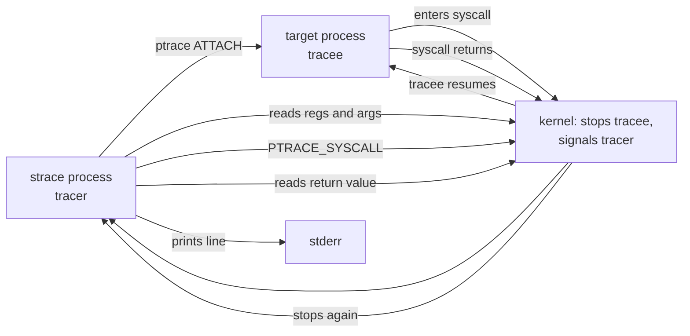
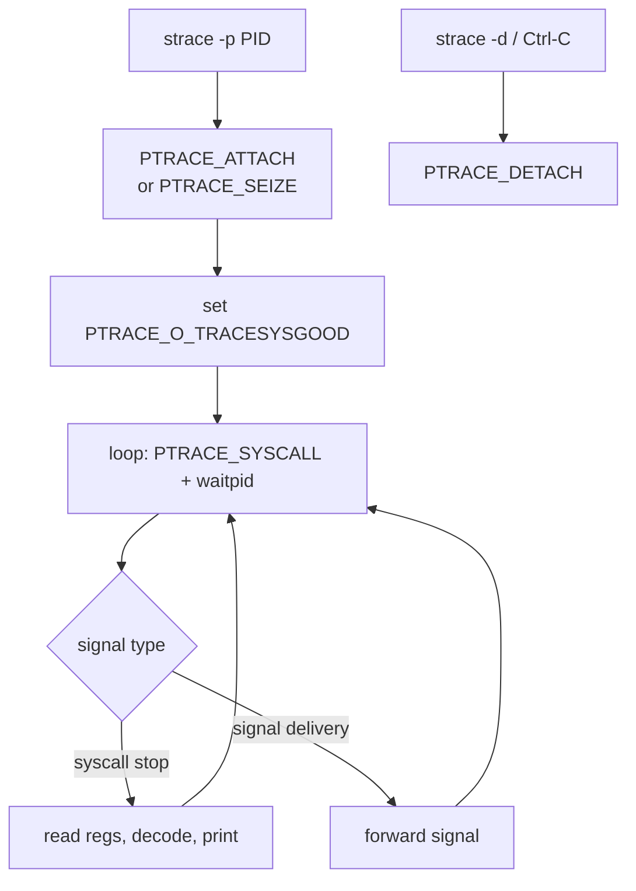

# strace and ptrace — Watching Syscalls in the Wild

## Why this matters

When an app hangs, fails silently, or "just does nothing", strace tells you what kernel calls it's making. It's the universal "what is this binary actually doing?" tool — works on closed-source binaries, doesn't need recompilation. Understanding the underlying ptrace mechanism (and its overhead) separates "I copy-paste strace commands" from "I know why production strace is dangerous".

## Mental model

`ptrace(2)` is a kernel syscall that lets one process inspect/control another: read its memory, registers, single-step, stop on syscalls. `strace` uses `PTRACE_SYSCALL` to intercept every syscall entry and exit. Each interception is two context switches and a copy of arguments — substantial overhead.

<!-- mermaid:rendered -->
<p align="center"></p>

<details><summary>Mermaid source</summary>



</details>

<!-- mermaid:rendered -->
<p align="center"></p>

<details><summary>Mermaid source</summary>



</details>

## Walkthrough

### Trace a command from start

```bash
strace -f -e trace=openat,connect,read,write -o app.trace ./myapp
# -f follow forks
# -e trace=... filter syscall set
# -o write to file (don't pollute app stderr)
```

Sample output:
```
openat(AT_FDCWD, "/etc/resolv.conf", O_RDONLY|O_CLOEXEC) = 3
read(3, "nameserver 1.1.1.1\n", 4096) = 19
connect(4, {sa_family=AF_INET, sin_port=htons(53), sin_addr=inet_addr("1.1.1.1")}, 16) = 0
```

### Attach to a running process

```bash
sudo strace -p 12345 -f -tt -T -s 200
# -p attach
# -tt timestamps to microsecond
# -T print syscall duration in <0.000123>
# -s 200 print up to 200 chars of strings
```

Detach: Ctrl-C. The traced process resumes normally.

### Production debugging recipes

**Why is my web server slow?** — count syscalls and time spent:
```bash
sudo strace -c -p $(pgrep -n nginx) -f
# wait 30s, Ctrl-C
# % time     seconds  usecs/call     calls    errors syscall
# 67.21    0.231140         154      1500           epoll_wait
# 21.12    0.072650          12      6020           read
```

**Why is the app silent?** — see what file it can't open:
```bash
strace -e trace=openat ./app 2>&1 | grep ENOENT
# openat(AT_FDCWD, "/etc/myapp/secret.key", O_RDONLY) = -1 ENOENT (No such file or directory)
```

**Network call hanging?** — focus on net:
```bash
strace -e trace=network -tt -T -p $(pgrep -n curl)
# 14:22:01.234 connect(3, {... 10.0.0.5:443}, 16) = -1 EINPROGRESS
# 14:22:31.243 <... connect resumed>) = -1 ETIMEDOUT (Connection timed out)  <0.030001>
```

That 30-second gap between entry and resume is the diagnosis.

### ptrace primitives (raw)

| Request | Effect |
|---------|--------|
| `PTRACE_ATTACH` | Attach to PID, send SIGSTOP. Old style. |
| `PTRACE_SEIZE` | Attach without stopping (modern). |
| `PTRACE_DETACH` | Release tracee. |
| `PTRACE_SYSCALL` | Continue, stop on next syscall entry/exit. |
| `PTRACE_SINGLESTEP` | Continue, stop after one instruction. |
| `PTRACE_CONT` | Continue, no syscall stop. |
| `PTRACE_PEEKDATA` / `POKEDATA` | Read/write tracee memory. |
| `PTRACE_GETREGS` / `SETREGS` | Read/write registers. |

This is what gdb is built on. strace, ltrace, gdb, rr-debug all use ptrace.

### Modern alternatives

`strace` is high-overhead because each syscall = 4 context switches. For high-throughput servers, prefer:

- **`bpftrace`** — eBPF tracer. Near-zero overhead, can trace any kernel function:
  ```bash
  sudo bpftrace -e 'tracepoint:syscalls:sys_enter_openat /comm == "nginx"/ { printf("%s\n", str(args->filename)); }'
  ```
- **`perf trace`** — perf-events based, lower overhead than strace
- **`sysdig`** / **`falco`** — eBPF based, container-aware
- **`bpftrace -e 'profile:hz:99 ...'`** for sampled stack traces

## Performance overhead — be careful

Rule of thumb: strace makes a process 10-100x slower per syscall. A web server doing 10k req/s with 5 syscalls each = 50k syscalls/s. Stracing it can cause queues to back up, timeouts, cascading failures.

| Tool | Overhead per syscall |
|------|----------------------|
| strace | few microseconds (context switches) |
| perf trace | hundreds of nanoseconds |
| bpftrace tracepoint | tens of nanoseconds |
| eBPF kprobe | tens of nanoseconds |

For a heavily-loaded production process: use `bpftrace` or take a 1-second sample and detach.

!!! info "Common interview questions"

    **Q: How does strace work under the hood?**
    A: Uses `ptrace(PTRACE_SEIZE/ATTACH)`, then loops `PTRACE_SYSCALL + waitpid`. Each syscall causes the tracee to stop, kernel signals tracer, tracer reads registers/memory to decode args, then resumes the tracee. Two stops per syscall (entry + exit).

    **Q: Why is strace bad for production?**
    A: Each syscall becomes 2 context switches + memory reads. A high-syscall-rate process can slow 10-100x. Use eBPF / bpftrace / perf trace instead.

    **Q: How do you trace a single syscall across all processes on a host?**
    A: `bpftrace -e 'tracepoint:syscalls:sys_enter_unlinkat { printf("%s %s\n", comm, str(args->pathname)); }'` — eBPF tracepoint, system-wide, microseconds overhead.

    **Q: What's the difference between strace and ltrace?**
    A: strace traces SYSCALLS (kernel boundary). ltrace traces dynamic LIBRARY CALLS (e.g. malloc, printf). ltrace uses breakpoints on PLT entries.

    **Q: How does gdb relate to ptrace?**
    A: gdb is the canonical ptrace consumer. It uses PTRACE_ATTACH, sets breakpoints by writing INT3 (0xCC) into target memory via PTRACE_POKEDATA, single-steps with PTRACE_SINGLESTEP.

    **Q: Can two tracers attach to the same process?**
    A: No. ptrace is exclusive — one tracer per tracee. If gdb is attached, strace fails with EPERM. Detach first.

    **Q: What is Yama ptrace_scope?**
    A: Security sysctl restricting who can ptrace whom. 0 = classic (any process owned by you). 1 = only direct child or with CAP_SYS_PTRACE. 2 = root only. 3 = disabled. Most distros default to 1.

    **Q: How would you debug a process stuck in D state?**
    A: D state means blocked in kernel uninterruptible sleep. ptrace can't help. Use `cat /proc/<pid>/stack` for kernel call trace, `cat /proc/<pid>/wchan` for waiting function. Common cause: NFS hang, broken disk.

    **Q: Trace child processes too?**
    A: `strace -f` to follow forks. `-ff -o file.trace` writes per-PID files (`file.trace.PID`).

    **Q: How do you decode a syscall number?**
    A: `ausyscall <arch> <num>` or `grep <num> /usr/include/asm/unistd_64.h`. Different per architecture (x86_64 read=0, arm64 read=63).

!!! warning "Gotchas"

    - **strace on a production database** can cause replication lag, timeouts, leader elections. Always sample briefly or use eBPF.
    - **PTRACE_ATTACH sends SIGSTOP** — if your monitoring kills stopped processes, strace can crash production. PTRACE_SEIZE avoids this; recent strace uses it.
    - **Detaching cleanly matters** — Ctrl-C is fine, `kill -9` of strace can leave tracee stopped. Recover with `kill -CONT <pid>`.
    - **Yama=1 blocks attaching to siblings** — sudo or CAP_SYS_PTRACE needed.
    - **Containers** — strace inside a container can't see processes outside its pid namespace. Run from host with `nsenter` or container-aware tools.
    - **Static binaries with prctl(PR_SET_DUMPABLE, 0)** refuse ptrace.
    - **`-e trace=%file`** is shorthand for the file-related set; `%network` for network.
    - **Strings get truncated** at 32 bytes by default — use `-s 1024` to see full paths/buffers.
    - **Multi-threaded apps**: each thread is a separate tracee; `-f` covers them. Without `-f`, you only see the main thread.
    - **`strace -k`** prints userspace stack on each syscall — incredibly useful, but multiplies overhead ~5x.

## Sources

- man 2 ptrace: https://man7.org/linux/man-pages/man2/ptrace.2.html
- man 1 strace: https://man7.org/linux/man-pages/man1/strace.1.html
- strace site: https://strace.io/
- Brendan Gregg "Linux strace overhead": https://www.brendangregg.com/blog/2014-05-11/strace-wow-much-syscall.html
- bpftrace reference: https://github.com/bpftrace/bpftrace/blob/master/docs/reference_guide.md
- Yama ptrace_scope: https://www.kernel.org/doc/Documentation/security/Yama.txt
- LWN "Ptrace, syscalls, and seccomp": https://lwn.net/Articles/600250/
