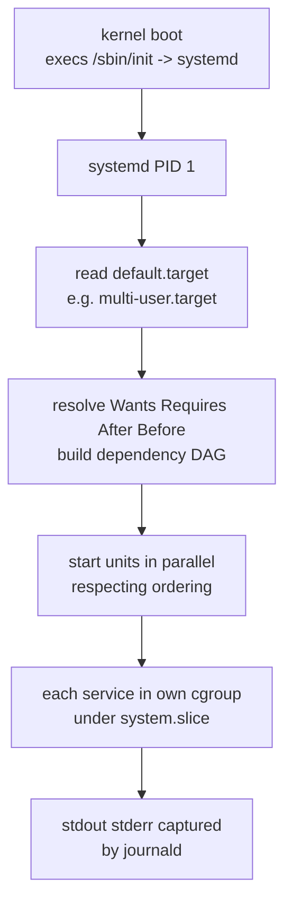
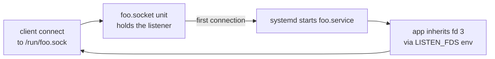

# systemd Internals — PID 1 in Modern Linux

## Why this matters

systemd owns PID 1 on essentially every modern Linux distro. It manages services, sockets, mounts, timers, network, login sessions, and is the cgroup-v2 manager. Knowing units, dependencies, journald, and socket activation tells the interviewer you can debug a misbehaving service end-to-end without resorting to "just reboot it."

## Mental model

Everything is a **unit**. Units have a type (`.service`, `.socket`, `.timer`, `.mount`, `.target`, `.slice`, `.scope`, `.path`, `.device`). systemd reads unit files, builds a dependency graph, and starts units in parallel respecting ordering.





## Unit anatomy

```ini
# /etc/systemd/system/myapp.service
[Unit]
Description=My Application
After=network-online.target postgresql.service
Wants=network-online.target
Requires=postgresql.service

[Service]
Type=notify
ExecStart=/usr/local/bin/myapp --config /etc/myapp/config.yaml
ExecReload=/bin/kill -HUP $MAINPID
Restart=on-failure
RestartSec=5s
User=myapp
Group=myapp

# Resource control (cgroup v2)
MemoryMax=512M
MemoryHigh=400M
CPUQuota=150%
TasksMax=1024

# Hardening
NoNewPrivileges=yes
ProtectSystem=strict
ProtectHome=yes
PrivateTmp=yes
CapabilityBoundingSet=CAP_NET_BIND_SERVICE
SystemCallFilter=@system-service

[Install]
WantedBy=multi-user.target
```

### Dependency directives

| Directive | Effect |
|-----------|--------|
| `Wants=` | Soft dep: try to start, OK if it fails |
| `Requires=` | Hard dep: if it fails, we fail too |
| `Requisite=` | Hard dep: must already be running, don't start it |
| `BindsTo=` | Hard dep: if it stops, we stop |
| `After=` | Ordering: start after this unit |
| `Before=` | Ordering: start before this unit |
| `Conflicts=` | Mutex: stopping the conflict starts us |

Critical: `After=` is ORDERING, not dependency. `After=foo.service` without `Wants=foo.service` means "if foo is starting, wait — but I don't need foo to start at all".

### Service types

| Type | Semantics |
|------|-----------|
| `simple` | ExecStart runs, the process IS the service. Default. |
| `forking` | ExecStart forks, parent exits, daemon child is the service (legacy). |
| `oneshot` | Runs to completion, then unit is "active (exited)". For scripts. |
| `notify` | App calls `sd_notify(READY=1)` when ready; systemd waits for it. |
| `dbus` | Service registers a D-Bus name; systemd waits for it. |
| `idle` | Like simple but delayed until other jobs settle. |

`Type=notify` is the most reliable for "is the service actually ready?" — used by postgres, nginx with the systemd module, etc.

## Walkthrough

### Common operations

```bash
systemctl status nginx
systemctl start|stop|restart|reload nginx
systemctl enable|disable nginx        # creates/removes wants symlink
systemctl daemon-reload               # re-read unit files after edit
systemctl cat nginx                   # show unit + drop-ins
systemctl edit nginx                  # create override.conf in /etc/systemd/system/nginx.service.d/
systemctl list-dependencies nginx     # tree
systemctl list-units --failed
systemctl show nginx -p MainPID,ExecStart,MemoryMax
```

### Inspect cgroup placement

```bash
systemd-cgls
# Control group /:
# -.slice
# +-system.slice
# | +-nginx.service
# | | +-1234 nginx: master process
# | | +-1235 nginx: worker
```

Every service lives in `/sys/fs/cgroup/system.slice/<name>.service/`. systemd is the cgroup manager for v2.

### journald — binary structured logs

journald captures stdout/stderr of all units, plus syslog-via-`/dev/log`, plus kernel ring buffer. Stored in `/var/log/journal/<machine-id>/system.journal` as a binary indexed format.

```bash
journalctl -u nginx --since "1 hour ago"
journalctl -u nginx -f                 # tail
journalctl -p err -b                   # priority err+ since boot
journalctl _PID=1234                   # filter by structured field
journalctl -k                          # kernel only
journalctl --disk-usage
journalctl --vacuum-time=7d            # truncate
journalctl -o json-pretty -n 5         # full structured fields
```

Why binary? Indexed (fast filtering), seal-able (forward-secure cryptographic hash chain via `journalctl --setup-keys`), preserves all metadata (UID, GID, cgroup, audit session).

### Socket activation

The classic pattern: systemd opens the listening socket, writes the fd into the env, execs the service when a client connects.

```ini
# /etc/systemd/system/myapp.socket
[Unit]
Description=MyApp socket

[Socket]
ListenStream=/run/myapp.sock
SocketMode=0660
SocketUser=myapp
Accept=no

[Install]
WantedBy=sockets.target
```

```ini
# /etc/systemd/system/myapp.service
[Service]
ExecStart=/usr/local/bin/myapp
# app reads LISTEN_FDS env, fd 3 is the inherited socket
```

Benefits:
- **Lazy start** — service starts on first connection, idle systems stay light
- **Zero-downtime upgrade** — restart service, socket fd survives, in-flight connects queue
- **Privilege separation** — systemd opens the privileged port (80, <1024), drops privs, hands fd to unprivileged app

This is why `CAP_NET_BIND_SERVICE` is rarely needed for modern services.

### Timers (cron replacement)

```ini
# backup.timer
[Timer]
OnCalendar=daily
RandomizedDelaySec=600
Persistent=true

[Install]
WantedBy=timers.target
```

```bash
systemctl list-timers
```

Advantages over cron: dependency tracking, journald output, missed-run handling (`Persistent=true` runs on next boot if the trigger time was missed).

### Common service patterns

**Long-running daemon with healthcheck:**
```ini
[Service]
Type=notify
WatchdogSec=30s            # systemd kills if no sd_notify(WATCHDOG=1) within 30s
ExecStart=/app
Restart=on-failure
```

**Hardened service (least privilege):**
```ini
[Service]
DynamicUser=yes
ProtectSystem=strict
ProtectHome=yes
ProtectKernelTunables=yes
ProtectKernelModules=yes
PrivateDevices=yes
PrivateTmp=yes
NoNewPrivileges=yes
RestrictAddressFamilies=AF_INET AF_INET6 AF_UNIX
SystemCallFilter=@system-service
SystemCallArchitectures=native
```

`systemd-analyze security myapp.service` scores a unit's hardening 0-10.

!!! info "Common interview questions"

    **Q: How does systemd parallelize boot?**
    A: It builds a DAG from `After=`/`Before=`/`Wants=`/`Requires=`. Units with no ordering constraint start concurrently. Socket activation lets dependent services start before their dependency is fully ready (queue connections on the socket).

    **Q: Difference between `Wants=` and `Requires=`?**
    A: Wants = soft (failure of dep doesn't fail us). Requires = hard (failure cascades). Most service files want soft deps.

    **Q: Why use `Type=notify` over `Type=simple`?**
    A: simple considers the service "started" the moment ExecStart returns, which lies for apps with init time. notify waits for the app to call sd_notify(READY=1) — accurate readiness. Used by databases, web servers.

    **Q: How does socket activation work?**
    A: systemd opens the listening socket in advance, exports it via LISTEN_FDS=N env. Service inherits fd 3+. App calls `sd_listen_fds()` to discover them. Useful for lazy start, zero-downtime restart, privilege drop.

    **Q: How does systemd integrate with cgroups v2?**
    A: systemd is the cgroup manager. Each service unit gets its own cgroup under `system.slice/<name>.service`. `MemoryMax=`, `CPUQuota=`, `TasksMax=` directives translate directly to cgroup files.

    **Q: Where are unit files?**
    A: Lookup order: `/etc/systemd/system/` (admin overrides) -> `/run/systemd/system/` (runtime) -> `/usr/lib/systemd/system/` (vendor). Drop-ins go in `<unit>.d/*.conf`.

    **Q: How do you override a vendor unit safely?**
    A: `systemctl edit nginx` creates `/etc/systemd/system/nginx.service.d/override.conf`. Survives package upgrades.

    **Q: What's a `.target`?**
    A: A grouping unit, like a runlevel. `multi-user.target` (no GUI), `graphical.target` (GUI). `WantedBy=multi-user.target` makes a service start at boot.

    **Q: How does journald differ from syslog?**
    A: Binary indexed format, structured fields (not just text), captures kernel + service stdout + syslog in one stream, supports forward-secure sealing. Can forward to syslog if needed.

    **Q: Service won't start, where do you look?**
    A: `systemctl status name` (last lines + exit code), `journalctl -u name -e` (full log), `systemctl cat name` (effective config), `systemd-analyze verify name.service` (syntax). Check `daemon-reload` was run.

    **Q: How to limit a service's resources?**
    A: Add `MemoryMax=`, `MemoryHigh=`, `CPUQuota=`, `IOWeight=`, `TasksMax=` to `[Service]`. These are cgroup-v2 backed.

    **Q: What is `systemd-resolved`?**
    A: Local DNS stub listening on 127.0.0.53. Caches, supports DNSSEC, mDNS, LLMNR. Hands `/etc/resolv.conf` to point at itself.

!!! warning "Gotchas"

    - **Forgetting `daemon-reload`** after editing a unit — systemd uses cached version. Symptom: changes don't take effect.
    - **`After=network.target`** is NOT enough for services needing the network up. Use `network-online.target` + `Wants=network-online.target` (and ensure `NetworkManager-wait-online` or `systemd-networkd-wait-online` is enabled).
    - **`Restart=always` + crash loop** burns CPU and fills journal. Add `StartLimitBurst=` and `StartLimitIntervalSec=` to give up after N restarts.
    - **`Type=simple` + `ExecStart=/bin/bash -c '...'`** — bash exits when the inner command exits, but if the inner command was a daemon that forked, systemd sees "exited successfully" and considers the service dead. Use `Type=forking` or unfork the app.
    - **journald rate limiting** drops messages: defaults `RateLimitIntervalSec=30s`, `RateLimitBurst=10000`. Symptom: "Suppressed N messages from /system.slice/foo.service". Tune in `/etc/systemd/journald.conf`.
    - **`PrivateTmp=yes`** breaks apps that share `/tmp` between services (e.g. socket files). Each service gets its own private `/tmp`.
    - **`DynamicUser=yes`** allocates a UID at runtime; UID won't be stable across reboots. Don't use for services that own persistent files outside `StateDirectory=`.
    - **Socket activation requires app cooperation** — must use `sd_listen_fds()` or be socket-activation-aware.
    - **Cgroup driver mismatch** with k8s/docker — systemd v246+ defaults to unified hierarchy; runtime must match.
    - **Logs ephemeral by default** if `/var/log/journal/` doesn't exist. `mkdir /var/log/journal && systemctl restart systemd-journald` to persist.

## Sources

- systemd man pages index: https://www.freedesktop.org/software/systemd/man/
- man systemd.unit / systemd.service / systemd.socket / systemd.timer
- man journalctl / man journald.conf
- man systemd.exec (security/hardening directives): https://www.freedesktop.org/software/systemd/man/systemd.exec.html
- man systemd.resource-control (cgroup directives): https://www.freedesktop.org/software/systemd/man/systemd.resource-control.html
- "systemd for Administrators" series (Lennart Poettering): http://0pointer.de/blog/projects/systemd-for-admins-1.html
- sd_notify protocol: https://www.freedesktop.org/software/systemd/man/sd_notify.html
- systemd source: https://github.com/systemd/systemd
