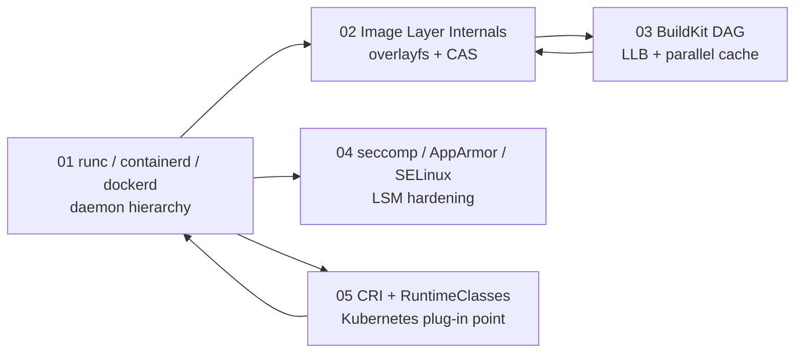

# Container Internals Deep Dive

## Why this matters

Containers are not magic — they are Linux primitives (namespaces, cgroups, overlayfs, seccomp) glued together by a layered runtime stack. In senior interviews you are expected to explain what happens between `docker run` (or `kubectl apply`) and a process actually starting on a host: which daemon talks to which, what the OCI spec is, how images are stored on disk, how BuildKit parallelizes builds, and how isolation is enforced. Hand-waving "Docker runs the container" will fail you.

This module breaks the runtime stack into 5 sub-topics. Read them in order — each builds on the previous.

## Sub-topic Map

<!-- mermaid:rendered -->

Mermaid source

## Files in this module

| # | File | Topic |
|---|------|-------|
| 1 | [runc-containerd-dockerd.md](./runc-containerd-dockerd.md) | Daemon hierarchy and the OCI runtime spec |
| 2 | [image-layer-internals.md](./image-layer-internals.md) | overlayfs, content-addressable storage, copy-up |
| 3 | [buildkit-dag.md](./buildkit-dag.md) | LLB graph, parallel build, cache export |
| 4 | [seccomp-apparmor-selinux.md](./seccomp-apparmor-selinux.md) | Linux Security Modules and capability dropping |
| 5 | [cri-and-runtime-classes.md](./cri-and-runtime-classes.md) | CRI gRPC and pluggable runtimes (kata, gvisor) |

## Hot Context (memorize)

- `dockerd` is a thin client to `containerd`; `containerd` calls `runc` via `containerd-shim`
- `runc` is a one-shot OCI runtime — it execs and exits; the shim keeps the container alive
- Image layers live under `/var/lib/containerd/io.containerd.snapshotter.v1.overlayfs/`
- Layer IDs are `sha256` of their tar content — content-addressable, dedup-friendly
- BuildKit compiles Dockerfile to LLB (a DAG), then schedules independent nodes in parallel
- Default seccomp profile blocks ~44 syscalls (`keyctl`, `kexec_load`, `userfaultfd`, etc.)
- Kubernetes never talks to Docker — it talks to a CRI implementation (containerd, cri-o)
- `RuntimeClass` lets one cluster run `runc`, `kata` (VM), and `gvisor` (user-space kernel) side-by-side

## Critical Rules

1. **Never confuse `docker` (CLI) with `dockerd` (daemon) with `containerd` (runtime).** Three different processes.
2. **`runc` does not run containers — the shim does.** runc just sets up namespaces/cgroups and execs.
3. **Image layers are immutable.** Writes go to the upper dir via copy-up; layer below is untouched.
4. **Dropping capabilities > running as non-root.** A root container with `--cap-drop=ALL` is safer than non-root with all caps.
5. **CRI is the contract Kubernetes cares about** — Dockershim was removed in K8s 1.24 because Docker did not speak CRI natively.

## Sources

- https://opencontainers.org/
- https://containerd.io/
- https://github.com/moby/buildkit
- https://kubernetes.io/docs/concepts/containers/
