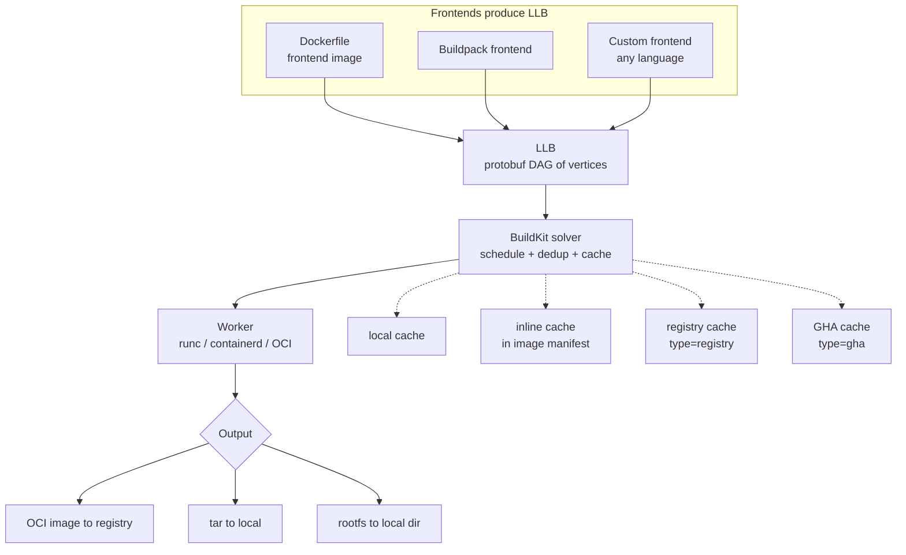
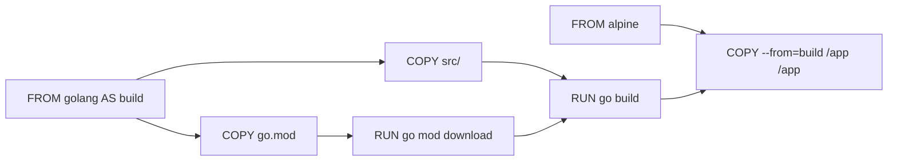

# BuildKit — DAG-Based Image Building

## Why this matters

Classic `docker build` was sequential and dumb: it walked the Dockerfile line by line, committing one layer at a time, with one global cache. BuildKit reimagined the build as a **DAG of operations** in an intermediate language called **LLB**, enabling parallel execution, fine-grained caching (including remote registry cache), `RUN --mount=type=cache` for package managers, and frontends beyond Dockerfile (Buildpacks, Mockerfile, raw LLB). If you build container images at scale and you are not on BuildKit, you are leaving 5-10x build speed on the table.

## Architecture

<!-- mermaid:rendered -->
<p align="center"></p>

<details><summary>Mermaid source</summary>



</details>

<!-- mermaid:rendered -->
<p align="center"></p>

<details><summary>Mermaid source</summary>



</details>

D and C run in parallel. F runs in parallel with the entire build chain.

## Mental Model

- **Frontend** turns a build definition (Dockerfile) into LLB.
- **LLB (Low-Level Build)** is a typed DAG. Vertices are operations: `source.image`, `exec`, `copy`, `mount`. Edges are dependencies on outputs.
- **Solver** walks the DAG, identifies independent vertices, schedules them in parallel on workers, and consults caches before executing each.
- **Worker** actually runs the operation in a container (via runc/containerd).
- **Exporter** writes the final result somewhere: OCI image, tar, local filesystem, registry.

The crucial mental shift: **a multi-stage Dockerfile is not sequential** — independent stages run in parallel. Within a stage, instructions whose inputs do not depend on each other also run in parallel.

## Walkthrough

### Enable BuildKit (default since Docker 23, but verify)

```bash
export DOCKER_BUILDKIT=1
docker buildx version
docker buildx create --use --name multi --driver docker-container
docker buildx inspect --bootstrap
```

### A parallel-friendly Dockerfile

```dockerfile
# syntax=docker/dockerfile:1.7

FROM golang:1.22 AS deps
WORKDIR /src
COPY go.mod go.sum ./
RUN --mount=type=cache,target=/go/pkg/mod \
    go mod download

FROM deps AS build
COPY . .
RUN --mount=type=cache,target=/go/pkg/mod \
    --mount=type=cache,target=/root/.cache/go-build \
    CGO_ENABLED=0 go build -o /out/app ./cmd/app

FROM node:20 AS web
WORKDIR /web
COPY web/package*.json ./
RUN --mount=type=cache,target=/root/.npm npm ci
COPY web/ .
RUN npm run build

FROM gcr.io/distroless/static AS final
COPY --from=build /out/app /app
COPY --from=web /web/dist /static
ENTRYPOINT ["/app"]
```

The `web` stage and the `build` stage have no dependency between them — BuildKit runs them in parallel.

### Cache mounts

```dockerfile
RUN --mount=type=cache,target=/var/cache/apt,sharing=locked \
    --mount=type=cache,target=/var/lib/apt/lists,sharing=locked \
    apt-get update && apt-get install -y curl
```

`sharing=locked` serializes concurrent builds. `sharing=shared` (default) lets them race. `private` gives each build its own.

### Registry cache

```bash
docker buildx build \
  --cache-to   type=registry,ref=ghcr.io/me/app:buildcache,mode=max \
  --cache-from type=registry,ref=ghcr.io/me/app:buildcache \
  --tag ghcr.io/me/app:1.2.3 \
  --push .
```

`mode=max` exports cache for every layer (including intermediates). `mode=min` only exports cache for the final image layers. CI builds want `max`.

### Inspect the LLB

```bash
docker buildx build --print=llb . > llb.json
buildctl debug dump-llb < llb.json | jq .
```

### Multi-platform build (uses QEMU)

```bash
docker buildx build \
  --platform linux/amd64,linux/arm64,linux/arm/v7 \
  --tag me/app:multi --push .
```

BuildKit forks a sub-build per platform, runs them in parallel, and produces a multi-arch manifest list.

## Common Interview Questions

> **Q1: What is LLB?**
> Low-Level Build — a protobuf-based DAG IR. Each vertex is an operation (image source, exec, copy, mount). Frontends compile to it; the solver consumes it.

> **Q2: Why is BuildKit faster than legacy builder?**
> Three reasons: (1) parallel execution of independent DAG vertices; (2) much finer cache granularity including `--mount=type=cache`; (3) lazy layer pulls — only fetches base layers it actually needs.

> **Q3: What does `--mount=type=cache` do?**
> Mounts a persistent directory into a `RUN` step that survives across builds but is **not committed to the image layer**. Perfect for `apt`, `npm`, `pip`, `go mod`, `cargo` caches.

> **Q4: What does `--mount=type=secret` do?**
> Mounts a file from the host into the build step at a path you choose, without baking it into any layer. The secret is unavailable in the final image.

> **Q5: Difference between `cache-from` inline and registry?**
> Inline cache embeds metadata in the image manifest itself — pulling the image gives you the cache. Registry cache stores cache as a separate manifest (`mode=max` includes intermediates). Registry is more powerful; inline is zero-config.

> **Q6: Why does multi-stage parallelize automatically?**
> Because the LLB DAG only has edges where stage A's output is consumed by stage B (`COPY --from`). Stages without such edges have no dependency and the solver schedules them concurrently.

> **Q7: How does BuildKit decide a cache hit?**
> By the deterministic hash of the operation: source layer digest + command + mount specs + the digests of any input files. Change one byte → cache miss.

> **Q8: Can I write a custom frontend?**
> Yes. Frontends are container images that read a build definition from `/var/run/buildkit/frontend` and emit LLB on stdout. `# syntax=` in Dockerfile pins the frontend version.

> **Q9: What is `buildx`?**
> The Docker CLI plugin that drives BuildKit. It manages "builders" (BuildKit instances), supports multi-platform via QEMU, and exposes all the cache/output options.

> **Q10: Difference between `docker build` and `docker buildx build`?**
> `docker build` (with BUILDKIT=1) uses the in-process BuildKit. `docker buildx build` uses an external BuildKit instance (often a container) and supports advanced features like multi-platform, multiple outputs, advanced cache backends.

## Gotchas

> **WARNING — `COPY . .` is still the #1 cache buster**
> A `.dockerignore` is mandatory. Without it, every git change invalidates everything after the COPY.

> **WARNING — `--mount=type=cache` is per-builder**
> Switch builders (or run in CI on a fresh runner) and the cache is empty. Use a registry-backed cache for CI persistence.

> **WARNING — `mode=max` cache can be huge**
> A repo with many large intermediate layers can produce GBs of cache manifests. Garbage-collect periodically with `docker buildx prune`.

> **WARNING — Multi-platform builds via QEMU are SLOW**
> arm64 emulated on amd64 via QEMU user-mode is ~10x slower than native. For production, use native arm64 runners and `--platform` to merge manifests.

> **WARNING — `# syntax=` directive must be the FIRST line**
> Comments before it are ignored. The frontend image is pulled fresh per build unless cached locally.

> **WARNING — Secrets leak via `RUN echo $SECRET > /tmp/x`**
> `--mount=type=secret` keeps the file out of layers, but if your RUN copies the value into a layer file, it is in the image. Audit your build steps.

## Sources

- https://github.com/moby/buildkit
- https://github.com/moby/buildkit/blob/master/docs/buildkitd.toml.md
- https://docs.docker.com/build/buildkit/
- https://docs.docker.com/build/cache/backends/
- https://github.com/moby/buildkit/blob/master/frontend/dockerfile/docs/reference.md
