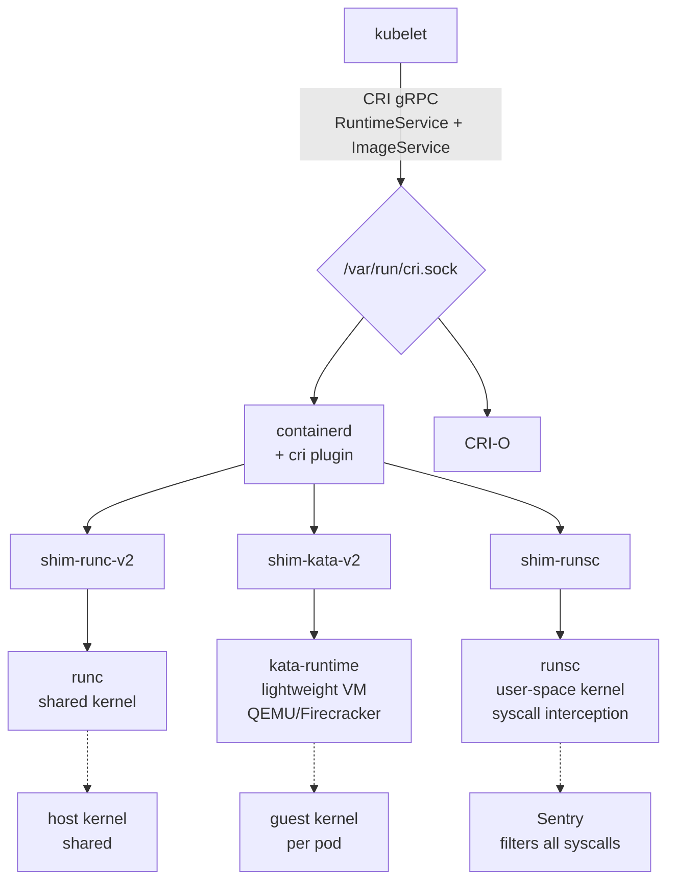
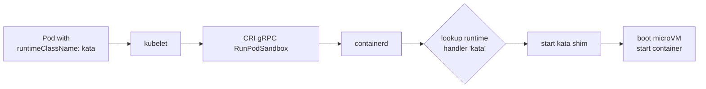

# CRI and RuntimeClasses — Kubernetes' Pluggable Runtime Layer

## Why this matters

Kubernetes does not run containers — it asks a **CRI (Container Runtime Interface)** implementation to run them. CRI is a stable gRPC contract; on the other side of the socket can be containerd, CRI-O, or anything else that speaks it. **RuntimeClass** is Kubernetes' mechanism to pick *which* runtime per Pod, enabling secure-by-default `runc` for normal workloads, **kata-containers** (lightweight VM) for untrusted multi-tenancy, and **gVisor** (`runsc`, user-space kernel) for syscall-level isolation. If you cannot explain why Dockershim was removed in 1.24 or how to schedule a Pod onto Kata, you are not ready for a senior Kubernetes interview.

## Architecture

<!-- mermaid:rendered -->
<p align="center"></p>

<details><summary>Mermaid source</summary>



</details>

<!-- mermaid:rendered -->
<p align="center"></p>

<details><summary>Mermaid source</summary>



</details>

## Mental Model

- **CRI** is the *contract* between kubelet and the runtime. Two services: `RuntimeService` (sandbox + container lifecycle, exec, attach, logs) and `ImageService` (pull, list, remove images).
- The **CRI socket** at `/var/run/containerd/containerd.sock` (or `/var/run/crio/crio.sock`) is what kubelet connects to.
- **RuntimeClass** is a Kubernetes object that names a *runtime handler*. The runtime (containerd/cri-o) is configured to map handler names to actual OCI runtime binaries (`runc`, `kata-runtime`, `runsc`).
- A Pod sets `spec.runtimeClassName: kata` and gets scheduled (with the right node selector/toleration) onto a node that has Kata installed.

## Walkthrough

### Inspect kubelet's CRI socket

```bash
# What socket is kubelet using?
ps -ef | grep kubelet | tr ' ' '\n' | grep -E 'container-runtime|cri-socket'

# Direct CRI calls with crictl
sudo crictl info | jq .config.containerdEndpoint
sudo crictl pods
sudo crictl ps
sudo crictl images

# /etc/crictl.yaml
runtime-endpoint: unix:///run/containerd/containerd.sock
image-endpoint: unix:///run/containerd/containerd.sock
```

### containerd config for multiple runtimes

`/etc/containerd/config.toml`:

```toml
version = 2

[plugins."io.containerd.grpc.v1.cri".containerd]
  default_runtime_name = "runc"

[plugins."io.containerd.grpc.v1.cri".containerd.runtimes.runc]
  runtime_type = "io.containerd.runc.v2"
  [plugins."io.containerd.grpc.v1.cri".containerd.runtimes.runc.options]
    SystemdCgroup = true

[plugins."io.containerd.grpc.v1.cri".containerd.runtimes.kata]
  runtime_type = "io.containerd.kata.v2"

[plugins."io.containerd.grpc.v1.cri".containerd.runtimes.gvisor]
  runtime_type = "io.containerd.runsc.v1"
  [plugins."io.containerd.grpc.v1.cri".containerd.runtimes.gvisor.options]
    TypeUrl = "io.containerd.runsc.v1.options"
    BinaryName = "/usr/local/bin/runsc"
```

```bash
sudo systemctl restart containerd
```

### Define RuntimeClasses

```yaml
apiVersion: node.k8s.io/v1
kind: RuntimeClass
metadata:
  name: kata
handler: kata
scheduling:
  nodeSelector:
    runtime: kata
  tolerations:
    - key: runtime
      operator: Equal
      value: kata
---
apiVersion: node.k8s.io/v1
kind: RuntimeClass
metadata:
  name: gvisor
handler: gvisor
---
apiVersion: node.k8s.io/v1
kind: RuntimeClass
metadata:
  name: runc
handler: runc
```

### Use a RuntimeClass in a Pod

```yaml
apiVersion: v1
kind: Pod
metadata:
  name: untrusted-tenant
spec:
  runtimeClassName: kata          # this Pod runs in a microVM
  containers:
    - name: app
      image: customer/code:latest
      resources:
        limits:
          memory: 512Mi
          cpu: 500m
```

### Verify which runtime a pod uses

```bash
kubectl get pod untrusted-tenant -o jsonpath='{.spec.runtimeClassName}'
sudo crictl inspectp $(sudo crictl pods --name untrusted-tenant -q) | jq .info.runtimeType
# expect: io.containerd.kata.v2
```

### CRI gRPC interface (the contract)

Roughly (from k8s.io/cri-api):

```protobuf
service RuntimeService {
  rpc Version(VersionRequest) returns (VersionResponse) {}
  rpc RunPodSandbox(RunPodSandboxRequest) returns (RunPodSandboxResponse) {}
  rpc StopPodSandbox(StopPodSandboxRequest) returns (StopPodSandboxResponse) {}
  rpc CreateContainer(CreateContainerRequest) returns (CreateContainerResponse) {}
  rpc StartContainer(StartContainerRequest) returns (StartContainerResponse) {}
  rpc StopContainer(StopContainerRequest) returns (StopContainerResponse) {}
  rpc ExecSync(ExecSyncRequest) returns (ExecSyncResponse) {}
  rpc PortForward(PortForwardRequest) returns (PortForwardResponse) {}
  // ... ~30 RPCs total
}

service ImageService {
  rpc PullImage(PullImageRequest) returns (PullImageResponse) {}
  rpc ListImages(ListImagesRequest) returns (ListImagesResponse) {}
  rpc RemoveImage(RemoveImageRequest) returns (RemoveImageResponse) {}
}
```

## Common Interview Questions

> **Q1: Why was Dockershim removed in Kubernetes 1.24?**
> Docker did not implement CRI. The kubelet had to translate CRI calls into Docker API calls (the "shim"), which Docker then translated into containerd calls, which then called runc. Two extra hops, more code to maintain. Removing Dockershim lets kubelet talk to containerd directly via CRI.

> **Q2: containerd vs CRI-O?**
> Both implement CRI. containerd is general-purpose (used outside k8s too — Docker, nerdctl). CRI-O is purpose-built for k8s, smaller surface, default in OpenShift. Functionality is largely equivalent.

> **Q3: What is a RuntimeClass?**
> A Kubernetes API object that maps a name (e.g. "kata") to a runtime handler configured in the CRI implementation. Pods reference it via `spec.runtimeClassName`. Optional `scheduling` section adds node selectors/tolerations automatically.

> **Q4: Difference between Kata Containers and gVisor?**
> Kata runs each pod in a **lightweight VM** with its own guest kernel (QEMU or Firecracker). Strong isolation, ~150-300ms startup, ~50MB overhead per pod. gVisor (`runsc`) implements a **user-space kernel** in Go that intercepts all syscalls — no separate kernel, no VM, but app sees a limited/slower syscall surface. Kata = better compatibility, more overhead. gVisor = better startup, worse compatibility.

> **Q5: How does CRI handle pod-level shared resources (network, IPC)?**
> CRI introduces the concept of a **PodSandbox** — a placeholder container that owns the pod's network namespace, IPC namespace, and cgroup parent. Subsequent containers in the pod join the sandbox's namespaces. The sandbox is also called the "pause" container.

> **Q6: What is the pause container?**
> A tiny container that runs `/pause` — a process that just sleeps. Its only job is to hold open the pod's namespaces so workload containers can join them, and to act as PID 1 reaping zombies. With cgroup namespaces and idmap mounts, some runtimes can avoid it.

> **Q7: Can I use multiple runtimes on the same node?**
> Yes — that is exactly what RuntimeClass is for. Configure containerd with handlers for each, then pods choose via `runtimeClassName`. Operators usually label nodes ("runtime=kata") and use the RuntimeClass `scheduling` field to direct pods.

> **Q8: How does kubelet pull images via CRI?**
> Kubelet calls `ImageService.PullImage` over the CRI socket. The runtime handles registry auth (passed in the request), digests, layer download, snapshotter prep. Kubelet itself never touches a registry.

> **Q9: What happens if the CRI socket is down?**
> kubelet cannot create or stop pods. Existing containers keep running (they are owned by containerd shims, not kubelet). Pod state in the API drifts until the runtime is back and kubelet reconciles.

> **Q10: How is logging handled in CRI?**
> Runtime writes container stdout/stderr to a file at a kubelet-controlled path (`/var/log/pods/<ns>_<pod>_<uid>/<container>/0.log`) in CRI log format (timestamp, stream, tag, message). kubelet reads this for `kubectl logs`. Cluster log shippers (Fluent Bit, Loki) tail these files.

## Gotchas

> **WARNING — Mixing cgroup drivers breaks pods**
> kubelet's `cgroupDriver` (systemd or cgroupfs) MUST match containerd's `SystemdCgroup` setting. Mismatch causes pods to start then immediately go OOM/Restart. Standardize on `systemd` everywhere.

> **WARNING — RuntimeClass without node labels schedules anywhere**
> If only some nodes have Kata installed, you MUST set `scheduling.nodeSelector` on the RuntimeClass or pods will land on nodes without Kata and fail.

> **WARNING — gVisor breaks some workloads silently**
> No `ptrace`, restricted `/proc`, slower syscalls. JVMs, profilers, eBPF tools, anything using io_uring may fail or perform terribly.

> **WARNING — Kata pods cannot share host PID namespace**
> Because they run in a VM. `hostPID: true` is incompatible. Same for `hostNetwork: true` and several `hostPath` patterns.

> **WARNING — `crictl` is not `kubectl`**
> crictl talks directly to the CRI socket, bypassing kubelet. Don't use it to "fix" pods — kubelet will recreate/reconcile and clobber your changes. Use it for forensics only.

> **WARNING — Image pull credentials live in two places**
> Pod-level `imagePullSecrets` (kubelet passes them via CRI) AND node-level `/etc/containerd/config.toml` registry mirrors/auth. Mismatched config leads to mysterious 401s.

## Sources

- https://kubernetes.io/docs/concepts/architecture/cri/
- https://github.com/kubernetes/cri-api
- https://kubernetes.io/docs/concepts/containers/runtime-class/
- https://kubernetes.io/blog/2022/02/17/dockershim-faq/
- https://containerd.io/docs/
- https://katacontainers.io/
- https://gvisor.dev/docs/
- https://cri-o.io/
