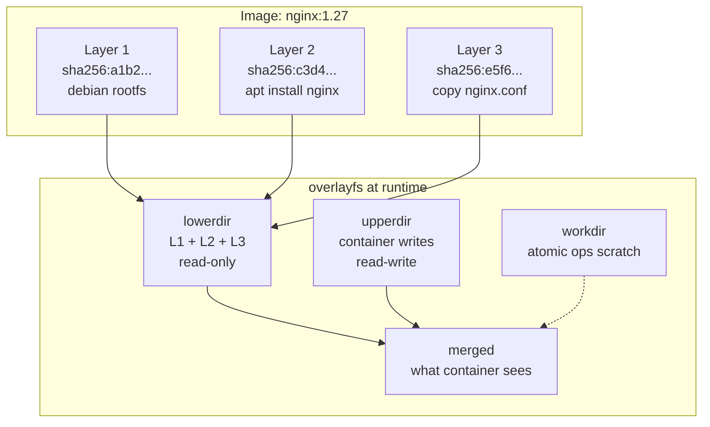
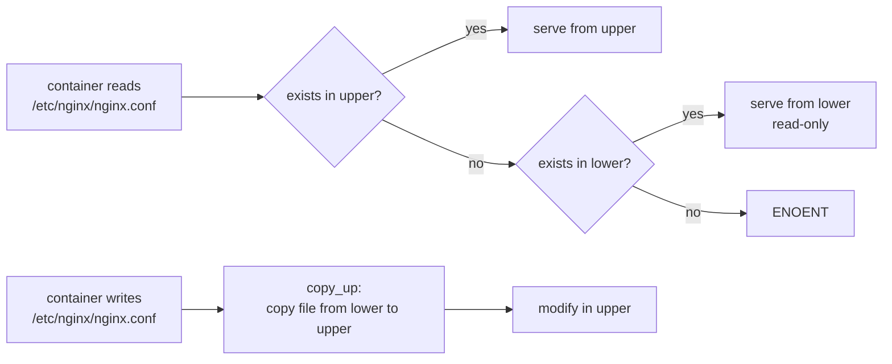

# Image Layer Internals — overlayfs + Content-Addressable Storage

## Why this matters

Container images are not files — they are stacks of immutable tarballs joined by a union filesystem (overlayfs) and addressed by SHA256. This design enables **layer dedup across thousands of images**, **fast container start** (no copy of the rootfs), and **reproducible distribution**. Interviewers ask "what happens when a container writes to a file from the base image?" to test if you actually understand copy-up vs whiteout.

## Architecture

<!-- mermaid:rendered -->
<p align="center"></p>

<details><summary>Mermaid source</summary>



</details>

<!-- mermaid:rendered -->
<p align="center"></p>

<details><summary>Mermaid source</summary>



</details>

## Mental Model

Three concepts, in order:

1. **Content-Addressable Storage (CAS)** — every layer's blob ID is `sha256(tar contents)`. Same layer pulled by 10 images = stored once. The registry, the local store, and the manifest all reference layers by digest.
2. **Union Mount (overlayfs)** — at runtime, all layers are stacked read-only as `lowerdir`. A new empty `upperdir` is added on top. Reads search top-to-bottom; writes go to upper only.
3. **Copy-Up** — on first write to a file from a lower layer, overlayfs copies the entire file to upper, then modifies. The original layer is never touched.

Deletion uses **whiteouts** — a special character device (`c 0/0`) in upper that hides the file in lower. Directory deletion uses an opaque xattr (`trusted.overlay.opaque=y`).

## Walkthrough

### Inspect image layers

```bash
docker pull nginx:alpine
docker history --no-trunc nginx:alpine

# Manifest shows layer digests
docker manifest inspect nginx:alpine | jq '.layers[].digest'

# Where layers live on disk (containerd snapshotter)
sudo ls /var/lib/containerd/io.containerd.snapshotter.v1.overlayfs/snapshots/
sudo ls /var/lib/containerd/io.containerd.content.v1.content/blobs/sha256/ | head

# Or for docker's own overlay2 driver
sudo ls /var/lib/docker/overlay2/
sudo cat /var/lib/docker/image/overlay2/layerdb/sha256/<id>/diff
```

### Watch overlayfs in action

```bash
docker run -d --name demo nginx:alpine

# Find the merged + upper dir
MERGED=$(docker inspect demo -f '{{.GraphDriver.Data.MergedDir}}')
UPPER=$(docker inspect demo -f '{{.GraphDriver.Data.UpperDir}}')
LOWER=$(docker inspect demo -f '{{.GraphDriver.Data.LowerDir}}')

echo "Lower (RO): $LOWER"
echo "Upper (RW): $UPPER"
echo "Merged    : $MERGED"

# Upper is empty initially
sudo ls -la $UPPER

# Write something in the container
docker exec demo sh -c 'echo hacked > /etc/nginx/nginx.conf'

# Now upper has the copied-up file
sudo find $UPPER -type f
sudo cat $UPPER/etc/nginx/nginx.conf

# Lower file is unchanged
sudo find $LOWER -name nginx.conf -exec md5sum {} \;
```

### See whiteout in action

```bash
docker exec demo rm /etc/nginx/nginx.conf
sudo ls -la $UPPER/etc/nginx/
# nginx.conf appears as character device 0/0 — that's the whiteout
```

### Layer dedup proof

```bash
docker pull nginx:1.27-alpine
docker pull nginx:1.26-alpine
# Both share the alpine base layer. Total disk used << sum of image sizes
docker system df -v | grep -A2 nginx
```

### Manual overlayfs mount

```bash
mkdir -p /tmp/{lower1,lower2,upper,work,merged}
echo "from lower1" > /tmp/lower1/a.txt
echo "from lower2" > /tmp/lower2/b.txt

sudo mount -t overlay overlay \
  -o lowerdir=/tmp/lower2:/tmp/lower1,upperdir=/tmp/upper,workdir=/tmp/work \
  /tmp/merged

ls /tmp/merged          # a.txt, b.txt
echo modified > /tmp/merged/a.txt   # copy-up triggers
ls /tmp/upper           # a.txt now exists here
cat /tmp/lower1/a.txt   # unchanged: "from lower1"

sudo umount /tmp/merged
```

## Common Interview Questions

> **Q1: What happens when a container writes to a file from the base image?**
> Copy-up. overlayfs copies the entire file from the lower (read-only) layer to the upper (writable) layer, then applies the write. The lower layer is never modified. This is why writing to a 1 GB file in a base image briefly costs 1 GB of upper-layer space.

> **Q2: How are deletes represented?**
> A **whiteout** — a character device with major/minor 0/0 placed in upper at the path of the deleted file. overlayfs interprets it as "hide whatever is below." Directory deletes get the `trusted.overlay.opaque=y` xattr.

> **Q3: Why is the image content-addressable?**
> Three benefits: (1) **dedup** — identical layers stored once across all images; (2) **integrity** — the digest is also a checksum; (3) **caching** — `docker pull` only fetches layers whose digests aren't already local.

> **Q4: What's the difference between an image layer and a snapshot?**
> A layer is the immutable tar-gz blob in the registry / content store. A snapshot is the writable overlayfs view that containerd creates when starting a container — it has a lowerdir built from the image's layers and a fresh upperdir.

> **Q5: Can two containers share the same image's lower layers?**
> Yes — that is the whole point. Each container gets its own upperdir but they share lowerdirs. So 100 nginx containers consume ~100 small upperdirs + 1 image worth of layers.

> **Q6: What happens to upperdir when the container is removed?**
> It is deleted with the snapshot. To persist data, mount a volume — volumes bypass overlayfs entirely (they are bind mounts).

> **Q7: Why does `RUN apt-get update && apt-get install` belong on one line in a Dockerfile?**
> Each `RUN` creates a new layer. Splitting them creates a layer with the apt cache, then a layer with installed packages — the cache layer is committed and bloats the image. Combining them lets you `rm -rf /var/lib/apt/lists/*` in the same RUN so the cache never enters a layer.

> **Q8: What is overlay2 vs overlay?**
> `overlay` is the old single-lower-layer driver. `overlay2` supports up to 128 lower layers natively (via comma-separated `lowerdir`). Always use overlay2.

> **Q9: How does BuildKit cache layers across builds?**
> By the digest of the build instruction + inputs. If `RUN apt install nginx` produces a layer with digest X today, tomorrow's identical instruction reuses X without re-running apt.

> **Q10: What if I need >128 layers?**
> Run into a kernel limit. Squash with `docker build --squash` or use `--output type=image,compression=zstd` in BuildKit to flatten.

## Gotchas

> **WARNING — Writing huge files triggers expensive copy-up**
> A `dd if=/dev/zero of=/var/log/big bs=1M count=1024` against a file from the base image copies the whole 1 GB before the first byte of writing. Use a volume for write-heavy paths.

> **WARNING — overlayfs has subtle POSIX violations**
> `rename()` across layers is not atomic. `fanotify` and `inotify` may miss events on copy-up. Some databases (older PostgreSQL) refused to run on overlayfs for this reason. Always put database data dirs on a volume.

> **WARNING — Layer cache invalidation cascades**
> Changing line N of a Dockerfile invalidates layer N and **every layer after it**. Order Dockerfile instructions stable→volatile (deps before code).

> **WARNING — `COPY . /app` busts cache on every git change**
> Use a `.dockerignore` and copy package manifests first, install deps, then copy source.

> **WARNING — Layer digests differ between docker save and registry**
> `docker save` produces uncompressed tar with different digest than the gzipped layer in the registry. The "image digest" you see in `docker images --digests` is the registry manifest digest, not a layer digest.

## Sources

- https://docs.kernel.org/filesystems/overlayfs.html
- https://github.com/opencontainers/image-spec/blob/main/spec.md
- https://containerd.io/docs/managing/snapshotters/
- https://docs.docker.com/storage/storagedriver/overlayfs-driver/
- https://kubernetes.io/docs/concepts/containers/images/
