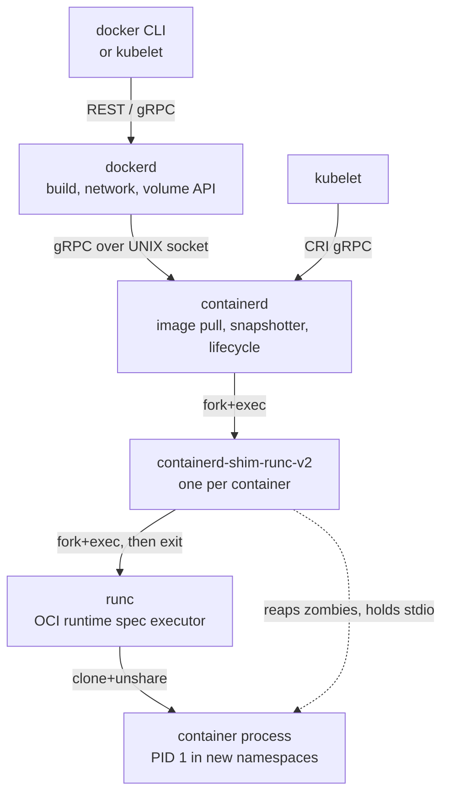
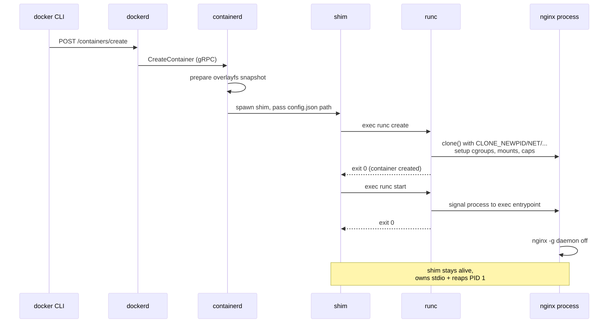
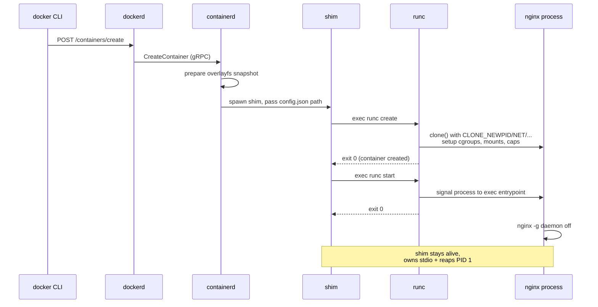

# runc, containerd, dockerd — The Daemon Hierarchy

## Why this matters

"What happens when I type `docker run nginx`?" is the single most common container-internals interview question. The honest answer touches four processes (`docker`, `dockerd`, `containerd`, `runc`) plus a per-container `containerd-shim`. If you cannot draw the layering and explain *why* each layer exists, you do not understand containers — you understand a CLI. This file is the canonical breakdown.

## Architecture

<!-- mermaid:rendered -->
<p align="center"></p>

<details><summary>Mermaid source</summary>



</details>

<!-- mermaid:rendered -->
<p align="center"></p>

<details><summary>Mermaid source</summary>



</details>

## Mental Model

Think of it as a **factory line**, not a stack:

- **`docker` (CLI)** — your shopping list. Talks HTTP to dockerd.
- **`dockerd`** — store manager. Knows about builds, networks, volumes, swarm. Delegates "actually run a container" to containerd.
- **`containerd`** — warehouse + dispatcher. Pulls images, manages snapshots, tracks container metadata, exposes a clean gRPC API.
- **`containerd-shim-runc-v2`** — one foreman per container. Stays alive for the lifetime of the container. Holds stdio FDs, reaps the PID 1 process, reports exit status.
- **`runc`** — the actual builder. Reads `config.json` (OCI runtime spec), unshares namespaces, sets up cgroups, applies seccomp/capabilities, execs your process, and **exits immediately**.

The shim exists so that **containerd can be restarted without killing your containers**. If runc held the parent role, restarting containerd would orphan/kill everything.

## OCI Runtime Spec

The contract between containerd and runc is the **OCI Runtime Specification**: a `config.json` file plus a root filesystem.

```json
{
  "ociVersion": "1.1.0",
  "process": {
    "terminal": false,
    "user": { "uid": 0, "gid": 0 },
    "args": ["nginx", "-g", "daemon off;"],
    "env": ["PATH=/usr/local/sbin:/usr/local/bin:/usr/sbin:/usr/bin:/sbin:/bin"],
    "cwd": "/",
    "capabilities": {
      "bounding": ["CAP_CHOWN", "CAP_NET_BIND_SERVICE"],
      "effective": ["CAP_CHOWN", "CAP_NET_BIND_SERVICE"]
    },
    "noNewPrivileges": true
  },
  "root": { "path": "rootfs", "readonly": false },
  "linux": {
    "namespaces": [
      { "type": "pid" }, { "type": "ipc" }, { "type": "uts" },
      { "type": "mount" }, { "type": "network" }
    ],
    "resources": {
      "memory": { "limit": 536870912 },
      "cpu": { "shares": 1024 }
    },
    "seccomp": { "defaultAction": "SCMP_ACT_ERRNO", "syscalls": [...] }
  }
}
```

Any OCI-compliant runtime (`runc`, `crun`, `youki`, `kata-runtime`, `runsc`/gVisor) can consume this.

## Walkthrough

### Trace the full chain on a host

```bash
# 1. Confirm dockerd talks to containerd
sudo systemctl status docker
sudo systemctl status containerd
ps -ef | grep -E 'dockerd|containerd|shim|runc'

# 2. Watch the shim spawn when you run a container
sudo strace -f -e trace=execve -p $(pidof containerd) 2>&1 | grep -E 'shim|runc' &
docker run -d --name demo nginx:alpine

# 3. Find the container's shim
ps -ef | grep containerd-shim | grep $(docker inspect -f '{{.Id}}' demo)

# 4. Inspect the OCI bundle (config.json)
sudo find /run/containerd -name config.json | head
sudo cat /run/containerd/io.containerd.runtime.v2.task/moby/$(docker inspect -f '{{.Id}}' demo)/config.json | jq .process

# 5. Use ctr (containerd CLI) directly — bypassing dockerd
sudo ctr -n moby containers list
sudo ctr -n moby tasks list

# 6. Use runc directly (advanced)
sudo runc list
sudo runc state $(docker inspect -f '{{.Id}}' demo)
```

### Restart containerd without killing containers

```bash
docker run -d --name survives nginx
sudo systemctl restart containerd
docker ps                    # still running, thanks to the shim
docker logs survives         # logs preserved
```

### Replace runc with crun (faster, written in C)

```bash
# /etc/docker/daemon.json
{
  "default-runtime": "crun",
  "runtimes": {
    "crun": { "path": "/usr/bin/crun" }
  }
}
sudo systemctl restart docker
docker run --rm hello-world
```

## Common Interview Questions

> **Q1: Why does the shim exist?**
> So containerd can restart without killing containers. The shim owns the container's PID 1 stdio and reaps it on exit. It also reports exit status back to containerd asynchronously.

> **Q2: What does runc actually do?**
> It reads `config.json`, calls `clone()` with the requested namespace flags, sets up cgroups, applies seccomp filters, drops capabilities, mounts the rootfs, and `exec`s the entrypoint. Then it exits. It is a one-shot tool.

> **Q3: Difference between containerd and Docker?**
> containerd is a low-level runtime focused on image pull, storage, and container lifecycle via gRPC. Docker (dockerd) wraps containerd and adds higher-level features: build (BuildKit), networks, volumes, swarm, registry auth UI. Kubernetes does not need any of dockerd's extras — it talks to containerd directly.

> **Q4: What is an OCI bundle?**
> A directory containing `config.json` (runtime spec) and `rootfs/` (extracted image). Any OCI runtime can run it.

> **Q5: Why was Dockershim removed in Kubernetes 1.24?**
> Docker did not implement CRI natively. The kubelet had to maintain a shim translating CRI to Docker API to containerd to runc — three hops. Removing it lets kubelet talk to containerd directly via CRI.

> **Q6: Can I run containers without dockerd?**
> Yes. `nerdctl` is a Docker-compatible CLI that talks directly to containerd. Or use `ctr` (containerd's native CLI). Or `podman` which is daemonless and forks runc directly.

> **Q7: What namespaces does runc create by default?**
> mount, PID, network, IPC, UTS, and (optionally) user. Cgroup namespace too on modern kernels.

> **Q8: How does container exit propagate back?**
> Process exits, kernel signals shim (parent), shim writes exit status to a file, shim notifies containerd via task service event, containerd notifies dockerd, dockerd updates container state, returns to `docker wait`.

> **Q9: What happens to logs?**
> The shim captures stdout/stderr to FIFOs. containerd's logger plugin (json-file by default) writes them to disk under `/var/lib/docker/containers/<id>/<id>-json.log`.

> **Q10: Difference between runc and crun?**
> runc is in Go (slower startup due to runtime). crun is in C (~2x faster, lower memory). Both implement the same OCI spec — fully swappable.

## Gotchas

> **WARNING — Killing containerd does NOT kill containers**
> `kill -9 $(pidof containerd)` leaves all shims running. To stop containers you must stop the shims (or `docker stop` them first).

> **WARNING — runc is not always at `/usr/bin/runc`**
> On some distros it is bundled inside containerd's binary. Check with `containerd config dump | grep -i runtime`.

> **WARNING — `docker exec` does not go through runc again**
> It uses `runc exec` against the running container's namespaces. Different code path. Process inherits container's seccomp/cgroups but is parented to the shim, not the entrypoint.

> **WARNING — Multiple shims per container in older versions**
> v1 shim spawned per-task. v2 shim is per-container and multiplexes tasks. Always prefer v2 (`io.containerd.runc.v2`).

> **WARNING — `--privileged` disables almost everything in this stack**
> No seccomp, all capabilities, host devices accessible, AppArmor unconfined. Only use for kernel-debugging containers.

## Sources

- https://opencontainers.org/
- https://opencontainers.org/release-notices/v1.1.0/
- https://containerd.io/docs/
- https://github.com/containerd/containerd/blob/main/docs/PLUGINS.md
- https://kubernetes.io/docs/concepts/containers/
- https://github.com/opencontainers/runc
