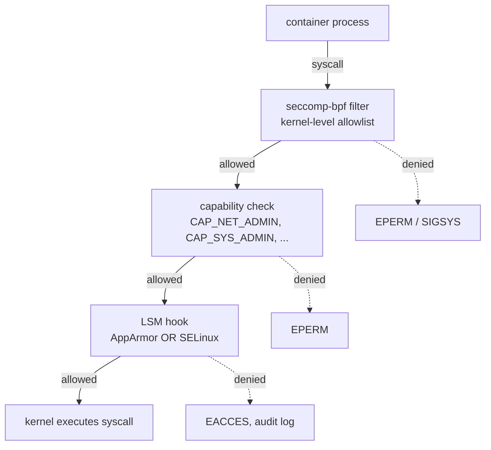
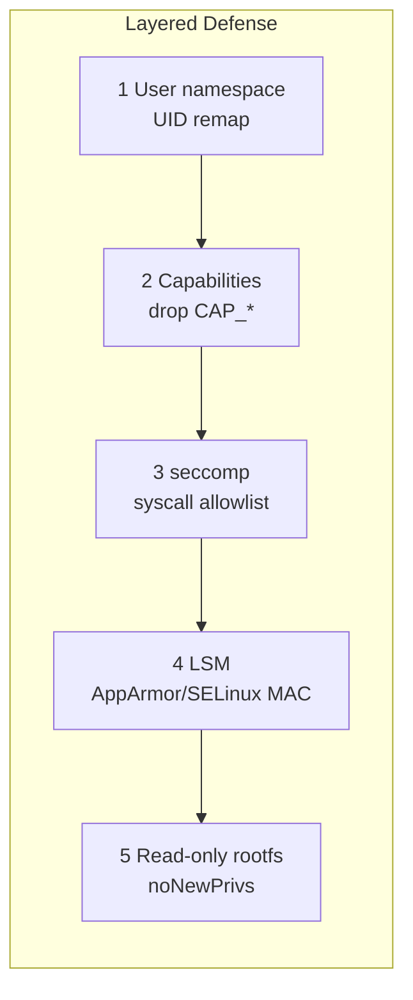

# seccomp, AppArmor, SELinux — Container Hardening with LSMs

## Why this matters

Namespaces and cgroups isolate **resources**. They do not stop a process from calling dangerous syscalls or reading host files via a misconfigured mount. That is the job of **Linux Security Modules (LSMs)** plus **seccomp-bpf** plus **capability dropping**. A container running as root with default seccomp + dropped caps is far safer than one running as non-root with `--privileged`. Interviews probe whether you understand the layered defense and can pick the right tool for the threat.

## Architecture





## Mental Model

Three orthogonal mechanisms, applied in this order on every syscall:

1. **seccomp** — coarse, kernel-level syscall allowlist. "Is this process even allowed to call `mount()`?" Cheap and universal.
2. **Capabilities** — Linux's split of root's powers into ~40 distinct privileges (`CAP_NET_ADMIN`, `CAP_SYS_ADMIN`, `CAP_NET_BIND_SERVICE`...). "Even if you can call `mount()`, do you have CAP_SYS_ADMIN?"
3. **LSM (AppArmor or SELinux)** — fine-grained Mandatory Access Control on resources. "Can this binary write `/etc/shadow` regardless of UID?"

You can run **all three** simultaneously. Docker/containerd do by default.

## Walkthrough

### Default seccomp profile

Docker ships a default profile blocking ~44 syscalls including `keyctl`, `add_key`, `kexec_load`, `userfaultfd`, `bpf` (in some configs), `clone` with new namespaces, `mount`, `umount2`, `reboot`, `swapon`, `mknod`...

```bash
# Default profile location (Docker)
curl -sL https://raw.githubusercontent.com/moby/moby/master/profiles/seccomp/default.json | jq '.syscalls | length'

# Run with no seccomp (DANGEROUS — for testing only)
docker run --rm --security-opt seccomp=unconfined alpine sh -c 'mount -t tmpfs none /mnt'

# Run with default seccomp — same command fails
docker run --rm alpine sh -c 'mount -t tmpfs none /mnt'
# mount: permission denied
```

### Custom seccomp profile

```json
{
  "defaultAction": "SCMP_ACT_ERRNO",
  "architectures": ["SCMP_ARCH_X86_64", "SCMP_ARCH_X86", "SCMP_ARCH_X32"],
  "syscalls": [
    {
      "names": ["read", "write", "open", "openat", "close", "fstat",
                "mmap", "mprotect", "munmap", "brk", "rt_sigaction",
                "execve", "exit_group", "arch_prctl"],
      "action": "SCMP_ACT_ALLOW"
    }
  ]
}
```

```bash
docker run --rm --security-opt seccomp=./minimal.json alpine echo hi
```

### Capabilities

```bash
# See default caps for a container
docker run --rm alpine sh -c 'apk add -q libcap; capsh --print'

# Drop all, add only what you need (e.g. nginx needs NET_BIND_SERVICE for port 80)
docker run --rm --cap-drop=ALL --cap-add=NET_BIND_SERVICE -p 80:80 nginx

# Inspect capabilities of a running process
grep Cap /proc/$(pidof nginx)/status
capsh --decode=$(grep CapEff /proc/$(pidof nginx)/status | awk '{print $2}')
```

### AppArmor (Ubuntu/Debian default)

```bash
# Check AppArmor is loaded
sudo aa-status

# Default Docker profile
sudo cat /etc/apparmor.d/docker-default

# Custom profile
cat <<'EOF' | sudo tee /etc/apparmor.d/docker-nginx
#include <tunables/global>
profile docker-nginx flags=(attach_disconnected,mediate_deleted) {
  #include <abstractions/base>
  network inet tcp,
  network inet udp,
  deny /etc/shadow rwklx,
  deny /root/** rwklx,
  /usr/sbin/nginx ix,
  /var/log/nginx/** w,
}
EOF
sudo apparmor_parser -r /etc/apparmor.d/docker-nginx

docker run --rm --security-opt apparmor=docker-nginx nginx
```

### SELinux (RHEL/CentOS/Fedora default)

```bash
# Check SELinux mode
getenforce  # Enforcing | Permissive | Disabled

# Container labels under container_t domain
ps -eZ | grep nginx
# system_u:system_r:container_t:s0:c123,c456 ...

# Volume mount labels — :z (shared) or :Z (private)
docker run -v /host/data:/data:Z alpine ls /data
# :Z relabels /host/data to a unique container category — only this container can access

# Disable SELinux for one container (DANGEROUS)
docker run --security-opt label=disable alpine sh
```

### Combine everything (production posture)

```bash
docker run -d \
  --read-only \
  --tmpfs /tmp \
  --cap-drop=ALL \
  --cap-add=NET_BIND_SERVICE \
  --security-opt no-new-privileges:true \
  --security-opt seccomp=/etc/docker/seccomp/strict.json \
  --security-opt apparmor=docker-nginx \
  --user 101:101 \
  --pids-limit 200 \
  --memory 256m --cpus 0.5 \
  nginx:alpine
```

## Common Interview Questions

> **Q1: Difference between seccomp and capabilities?**
> seccomp filters **syscalls** (e.g. block `kexec_load` regardless of caller). Capabilities gate **privileged operations** that cross multiple syscalls (e.g. CAP_NET_ADMIN gates `socket(AF_NETLINK)`, `setsockopt(SO_BINDTODEVICE)`, etc.). They are complementary.

> **Q2: AppArmor vs SELinux?**
> AppArmor is **path-based** — easier to write profiles, weaker because paths can be aliased. Default on Ubuntu, SUSE. SELinux is **label-based** — every file/process has a security context (`type`); rules say which types can access which. Stronger and harder. Default on RHEL/Fedora.

> **Q3: What does `--privileged` actually do?**
> Disables seccomp (unconfined), grants ALL capabilities, disables AppArmor/SELinux confinement (unconfined_t), exposes all host devices, allows mounting anything. Effectively makes the container as powerful as host root.

> **Q4: Why is `--cap-drop=ALL --cap-add=X` better than non-root user alone?**
> A container running as UID 1000 with default caps still has CAP_NET_BIND_SERVICE (sometimes), CAP_KILL on its own processes, etc. Conversely, a container running as root with no caps cannot do anything privileged — root in user namespace + no caps is very weak.

> **Q5: What is `no-new-privileges`?**
> Sets the prctl that prevents the process and its children from ever gaining privileges via setuid binaries or file capabilities. Equivalent to `security.NoNewPrivileges` in OCI spec. Always on.

> **Q6: What happens when seccomp blocks a syscall?**
> Default action is `SCMP_ACT_ERRNO` returning EPERM. Other actions: `SCMP_ACT_KILL` (SIGSYS, kills process), `SCMP_ACT_TRAP`, `SCMP_ACT_LOG`, `SCMP_ACT_ALLOW`.

> **Q7: How to find which syscalls your app needs?**
> Run with `--security-opt seccomp=unconfined` plus `strace -ff -o trace` or use `seccomp-tools` / Falco / `bpftrace` to record syscalls, then build a minimal allowlist.

> **Q8: Why does Docker default seccomp block `keyctl`?**
> Kernel keyring CVEs (CVE-2016-0728 et al.) — the keyring is shared across containers and not properly namespaced.

> **Q9: What is `:z` vs `:Z` on volume mounts?**
> SELinux only. `:z` relabels with a shared label (multiple containers can share). `:Z` relabels with a unique label per container (only that one can access). Without it, container cannot read the volume in enforcing mode.

> **Q10: How does seccomp interact with user namespaces?**
> seccomp filter applies to the process; user namespace remaps UIDs. Both are independent layers — you can have either, both, or neither. Modern hardened setups use both.

## Gotchas

> **WARNING — `--privileged` blanket-disables seccomp AND AppArmor AND caps**
> Never use it in production. If you need a specific capability, add it precisely with `--cap-add`.

> **WARNING — SELinux denials on volume mounts are silent (in default config)**
> Container fails with EACCES, you assume permissions issue. Always `sudo ausearch -m AVC -ts recent` to find SELinux denials.

> **WARNING — Custom seccomp profiles break unexpectedly across kernels**
> A new kernel adds a syscall (e.g. `clone3`) that your allowlist doesn't include. glibc starts using it. Container breaks. Test against new kernels and add `clone3` to allowlist.

> **WARNING — AppArmor profile must be loaded BEFORE container starts**
> `apparmor_parser -r /etc/apparmor.d/foo` is required after edits. Profile name in `--security-opt apparmor=foo` must match.

> **WARNING — Capabilities are not transitive across exec**
> A privileged process forking a child and `exec()`ing a non-suid binary loses caps unless `keepcaps` or file capabilities are set. This is usually what you want.

> **WARNING — `CAP_SYS_ADMIN` is the new root**
> If you grant it, you have effectively granted root. It controls mount, sethostname, swap, namespaces, and dozens more. Avoid like the plague.

## Sources

- https://docs.kernel.org/userspace-api/seccomp_filter.html
- https://man7.org/linux/man-pages/man7/capabilities.7.html
- https://apparmor.net/
- https://selinuxproject.org/
- https://docs.docker.com/engine/security/seccomp/
- https://docs.docker.com/engine/security/apparmor/
- https://kubernetes.io/docs/tutorials/security/seccomp/
