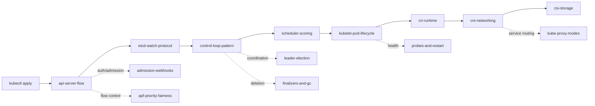

# Kubernetes Internals — Deep Dives

> Interview-grade walkthroughs of how Kubernetes actually works under the hood. Not "what is a Pod" — *how does a Pod become a running container, byte by byte*.

## Why this section exists

Most candidates can recite `kubectl` commands. Few can explain what happens between `kubectl apply` and the kubelet starting a container. This section closes that gap with 14 focused deep-dives mapped to the real source-of-truth: SIG repos, KEPs, and the 1.30+ codebase.

## Map of sub-topics

<!-- mermaid:rendered -->

Mermaid source

## File index

| # | File | Topic | Status |
|---|------|-------|--------|
| 1 | [control-loop-pattern.md](control-loop-pattern.md) | Reconcile loops, level vs edge, work queues | done |
| 2 | [scheduler-scoring.md](scheduler-scoring.md) | Scheduler framework, plugins, profiles | done |
| 3 | [api-server-flow.md](api-server-flow.md) | Auth -> authz -> admission -> etcd write | done |
| 4 | [etcd-watch-protocol.md](etcd-watch-protocol.md) | Raft, MVCC, watches, compaction | done |
| 5 | [leader-election.md](leader-election.md) | Lease object, holder identity, jitter | done |
| 6 | [finalizers-and-gc.md](finalizers-and-gc.md) | Owner refs, foreground/background deletion | done |
| 7 | kubelet-pod-lifecycle.md | PLEG, pod worker, syncPod | pending |
| 8 | cri-runtime.md | CRI gRPC, containerd shim, runc | pending |
| 9 | cni-networking.md | CNI spec, IPAM, pod networking | pending |
| 10 | csi-storage.md | CSI driver, attach/mount/publish | pending |
| 11 | admission-webhooks.md | MutatingWebhook, ValidatingAdmissionPolicy (CEL) | pending |
| 12 | probes-and-restart.md | liveness/readiness/startup, restart backoff | pending |
| 13 | kube-proxy-modes.md | iptables vs IPVS vs nftables | pending |
| 14 | apf-priority-fairness.md | PriorityLevelConfiguration, FlowSchema | pending |

## How to use this section

- **Studying for interviews?** Read top-down (1 -> 14). Each file ends with Q&A.
- **Hit a real bug?** Jump to the relevant file — gotchas section first.
- **Designing a controller?** Files 1, 5, 6 are mandatory.
- **Writing an admission webhook?** Files 3, 11.

## Key 1.30+ context

- **ValidatingAdmissionPolicy** (GA in 1.30) — CEL-based admission without webhook latency.
- **Scheduler Framework** is the default and only scheduling architecture; old `policy.cfg` is gone.
- **Structured authentication config** (beta in 1.30) replaces flag-based OIDC plumbing.
- **APF** is mandatory; max-in-flight flags are deprecated.
- **etcd 3.5+** is the supported version; defrag is operator-managed.

## Sources

- Kubernetes docs: https://kubernetes.io/docs/concepts/
- KEP index: https://github.com/kubernetes/enhancements/tree/master/keps
- API server: https://github.com/kubernetes/kubernetes/tree/master/staging/src/k8s.io/apiserver
- Kubelet: https://github.com/kubernetes/kubernetes/tree/master/pkg/kubelet
- Scheduler: https://github.com/kubernetes/kubernetes/tree/master/pkg/scheduler
- Controller-runtime: https://github.com/kubernetes-sigs/controller-runtime
