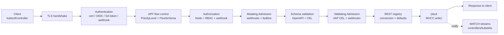

# API Server Request Flow

> What happens between `kubectl apply -f pod.yaml` and the bytes hitting etcd. Every interview question about RBAC, admission webhooks, OIDC, or rate limiting lives inside this pipeline.

## Why this matters

The API server is the *only* component that talks to etcd. Every other component — kubelet, scheduler, controllers — talks to the API server. If you understand this pipeline you can reason about: failed auth, mysterious 403s, webhook timeouts, namespace-scope leaks, audit gaps, APF throttling, and admission-time mutation bugs.

## High-level pipeline

<!-- mermaid:rendered -->
<p align="center"></p>

<details><summary>Mermaid source</summary>



</details>

Order is **fixed**. You cannot put authn after authz, you cannot run validating before mutating, you cannot bypass admission for a built-in resource.

## Detailed sequence

```mermaid
sequenceDiagram
    autonumber
    participant Client
    participant APIServer as kube-apiserver
    participant Webhook as Mutating Webhook
    participant VAP as ValidatingAdmissionPolicy CEL
    participant Etcd as etcd

    Client->>APIServer: POST /api/v1/namespaces/default/pods
    Note over APIServer: TLS handshake; client cert presented
    APIServer->>APIServer: Authenticate<br/>try chain: cert -> SA token -> OIDC -> webhook
    APIServer->>APIServer: Map to user + groups
    APIServer->>APIServer: APF classify into FlowSchema -> PriorityLevel
    APIServer->>APIServer: Authorize<br/>Node -> RBAC -> Webhook (allow if any allows)
    APIServer->>Webhook: AdmissionReview MUTATING (parallel)
    Webhook-->>APIServer: JSONPatch (e.g. inject sidecar)
    APIServer->>APIServer: Apply patch, re-decode object
    APIServer->>APIServer: OpenAPI schema validation
    APIServer->>VAP: Evaluate ValidatingAdmissionPolicy CEL
    VAP-->>APIServer: allow / deny / warn
    APIServer->>APIServer: REST conversion to internal version
    APIServer->>APIServer: Set defaults, generate UID, set creationTimestamp
    APIServer->>Etcd: Transaction: Put key with revision check
    Etcd-->>APIServer: revision N committed
    APIServer-->>Client: 201 Created<br/>response body with applied object
    Etcd-->>APIServer: WATCH event delivered to subscribers
```

## Phase-by-phase

### 1. Authentication

Goal: identify the caller. **Tries each authenticator in order; first success wins; failure if all fail.**

| Method | Mechanism | Used by |
|--------|-----------|---------|
| Client certs | x509 cert signed by cluster CA; `CN`=username, `O`=group | kubelet, kube-controller-manager, kubeadm admins |
| Service account tokens | JWT signed by SA signing key; bound to projected volume in pods | In-cluster workloads |
| OIDC | JWT from external IdP; `--oidc-issuer-url`, `--oidc-client-id`, claim mappings | Human users via dex/keycloak/okta |
| Bootstrap tokens | Short-lived for kubeadm join | New nodes |
| Webhook | TokenReview to external server | Custom auth |
| Authentication config (1.30+ beta) | Structured config file replacing flags | Multi-issuer OIDC, advanced claim mapping |

Result: a `user.Info` with `Name`, `UID`, `Groups`, `Extra`.

**SA token specifics (1.30+)**: tokens are projected, audience-bound, and time-limited (default 1 hour, kubelet rotates). The legacy non-expiring token in a Secret is deprecated. The `--service-account-issuer` URL is the JWT `iss` claim and must be reachable for OIDC discovery if external systems verify SA tokens.

### 2. APF (API Priority and Fairness)

Replaces the old `--max-requests-inflight` flag. APF prevents loud clients from starving control-plane traffic.

```yaml
apiVersion: flowcontrol.apiserver.k8s.io/v1
kind: FlowSchema
metadata:
  name: my-controller
spec:
  priorityLevelConfiguration:
    name: workload-high
  matchingPrecedence: 1000
  rules:
  - subjects:
    - kind: ServiceAccount
      serviceAccount:
        name: my-sa
        namespace: my-ns
    resourceRules:
    - verbs: ["*"]
      apiGroups: ["apps"]
      resources: ["deployments"]
  distinguisherMethod:
    type: ByUser
---
apiVersion: flowcontrol.apiserver.k8s.io/v1
kind: PriorityLevelConfiguration
metadata:
  name: workload-high
spec:
  type: Limited
  limited:
    nominalConcurrencyShares: 100
    limitResponse:
      type: Queue
      queuing:
        queues: 64
        handSize: 6
        queueLengthLimit: 50
```

If a client exceeds its share, it gets queued or 429-rejected. The `Retry-After` header tells well-behaved clients when to come back.

### 3. Authorization

Goal: is this user allowed to perform this verb on this resource? **Each authorizer says allow / deny / no-opinion. First non-no-opinion wins (almost — see below).**

| Mode | Purpose |
|------|---------|
| Node | kubelet only — restricts to Pods/Secrets/ConfigMaps bound to its own node |
| RBAC | Standard role/binding evaluation |
| Webhook | SubjectAccessReview to external server |
| ABAC | Legacy file-based policies (avoid) |
| AlwaysAllow / AlwaysDeny | Test/debug |

`--authorization-mode=Node,RBAC` is the standard production setting. The chain is OR: if Node allows, RBAC is not consulted.

> RBAC is purely additive. There is no "deny" rule. To revoke, you remove the binding.

### 4. Mutating Admission

Built-in mutating controllers (always on unless explicitly disabled): `NamespaceLifecycle`, `LimitRanger`, `ServiceAccount`, `DefaultStorageClass`, `DefaultTolerationSeconds`, `MutatingAdmissionWebhook`, `RuntimeClass`, `PodTopologyLabels`.

Then external webhooks fire. The webhook returns a **JSONPatch** that the API server applies. Webhooks **run in parallel** but the patches are applied serially by `webhookConfiguration.reinvocationPolicy`:

- `Never` (default): each webhook fires once.
- `IfNeeded`: re-fire if a later webhook modified the object — used for sidecar injection that must inspect final pod spec.

```yaml
apiVersion: admissionregistration.k8s.io/v1
kind: MutatingWebhookConfiguration
metadata:
  name: sidecar-injector
webhooks:
- name: inject.example.com
  clientConfig:
    service: { name: injector, namespace: kube-system, path: /mutate }
    caBundle: LS0tLS1CRUdJTi...
  rules:
  - operations: ["CREATE"]
    apiGroups: [""]
    apiVersions: ["v1"]
    resources: ["pods"]
  failurePolicy: Fail
  sideEffects: None
  admissionReviewVersions: ["v1"]
  timeoutSeconds: 5
  reinvocationPolicy: IfNeeded
```

### 5. Schema validation

OpenAPI v3 schema check. CRDs use the schema in their `spec.versions[].schema.openAPIV3Schema`. CEL `x-kubernetes-validations` rules run here for CRDs.

### 6. Validating Admission

`ValidatingAdmissionPolicy` (GA in 1.30) — CEL-based, runs in-process (no webhook RTT):

```yaml
apiVersion: admissionregistration.k8s.io/v1
kind: ValidatingAdmissionPolicy
metadata:
  name: no-host-network
spec:
  failurePolicy: Fail
  matchConstraints:
    resourceRules:
    - apiGroups: [""]
      apiVersions: ["v1"]
      operations: ["CREATE", "UPDATE"]
      resources: ["pods"]
  validations:
  - expression: "!has(object.spec.hostNetwork) || object.spec.hostNetwork == false"
    message: "hostNetwork is forbidden"
    reason: Forbidden
---
apiVersion: admissionregistration.k8s.io/v1
kind: ValidatingAdmissionPolicyBinding
metadata:
  name: no-host-network-binding
spec:
  policyName: no-host-network
  validationActions: [Deny]
  matchResources:
    namespaceSelector:
      matchLabels: { tier: prod }
```

Then `ValidatingAdmissionWebhook` runs external webhooks. These cannot mutate. Same `failurePolicy` semantics as mutating.

### 7. Persistence

REST registry converts to internal version, applies defaults, generates `metadata.uid` and `creationTimestamp`, then issues an etcd transaction. The etcd write uses MVCC: a new revision is created. Watchers on this resource type receive an event with the new revision.

The response sent to the client is the **decoded object after persistence**, including server-generated fields.

## Common pitfalls

> [!WARNING] Gotchas
> - **Webhook `failurePolicy: Fail` on a self-hosted webhook** = whole cluster bricks if the webhook pod is down. Either use `Ignore`, scope to specific namespaces excluding `kube-system`, or use a `namespaceSelector` to skip the webhook's own namespace.
> - **Mutating webhook order is non-deterministic** unless you use `reinvocationPolicy: IfNeeded` and write idempotent patches.
> - **Forgetting `sideEffects: None` or `NoneOnDryRun`** prevents `kubectl --dry-run=server` from working.
> - **OIDC username collisions** with built-in users (system:* prefix is reserved). Use `--oidc-username-prefix=oidc:` to namespace.
> - **APF default rules** allow leader-election traffic to bypass throttling. Custom controllers using leader election but with non-standard SA names won't get this exemption.
> - **RBAC `*` is greedy**: `resources: ["*"]` includes future resources you haven't thought of.
> - **Audit logging happens after admission but the request body is what arrived**. If you need the post-mutation object, use `RequestResponse` audit level.
> - **Long admission webhook latency** counts against the request timeout; clients see 504s.
> - **CRDs without conversion webhooks** can't have multiple stored versions safely. Only one storage version; others are conversion via no-op.

## Interview Q&A

> [!NOTE] Common interview questions
>
> **Q1: What's the order of operations in the API server pipeline?**
> Authn -> APF -> Authz -> Mutating admission -> Schema validation -> Validating admission -> Persistence. Watches fire after etcd commit.
>
> **Q2: Mutating vs validating webhooks — order and capabilities?**
> Mutating run first and may modify the object. Validating run last and can only accept/reject. Both use the same `AdmissionReview` API but validating webhooks ignore any patch in the response.
>
> **Q3: How does ValidatingAdmissionPolicy differ from a validating webhook?**
> VAP uses CEL evaluated in-process; no network RTT, no external pod to maintain, no webhook downtime concerns. Webhooks remain necessary for stateful checks (e.g. querying external systems).
>
> **Q4: What is APF and what problem does it solve?**
> API Priority and Fairness. Replaces flat in-flight limits with priority levels and per-flow fair queuing. Prevents one busy controller from starving leader-election heartbeats.
>
> **Q5: A user gets 403 on `kubectl get pods` but the role looks correct. How do you debug?**
> `kubectl auth can-i get pods --as user@x.com -v=8`. Check the SubjectAccessReview that's logged. Verify groups by decoding the user's JWT. Check namespace scope on RoleBinding vs ClusterRoleBinding. Check if a Webhook authorizer is deny-overriding (it shouldn't, but custom configs can).
>
> **Q6: Webhook returns in 30s, request fails. Why?**
> `timeoutSeconds` defaults to 10s and max is 30s. The API server enforces it. Either reduce webhook latency or split the work — admission is not the place for slow operations.
>
> **Q7: Pod creation succeeds but the sidecar isn't injected. Why?**
> Webhook may have `failurePolicy: Ignore` and timed out silently — check API server logs. Or namespace selector excluded the namespace. Or the webhook doesn't watch `CREATE` operations.
>
> **Q8: How is a service account token validated?**
> The API server has the SA signing public key. JWT signature is verified, `aud` claim must match a configured audience, `exp` checked, `kubernetes.io/serviceaccount/secret.name` (legacy) or projected token's bound object reference is verified to still exist.
>
> **Q9: What's the difference between `system:masters` group and a cluster-admin role?**
> `system:masters` is hardcoded to bypass RBAC entirely (Node and RBAC authorizers always allow it). cluster-admin is a ClusterRole granting `*/*` via RBAC. If you revoke cluster-admin you can still recover via system:masters, which is why cert-based admin access exists.
>
> **Q10: How does the API server handle two clients writing the same object simultaneously?**
> Optimistic concurrency. Each object has `metadata.resourceVersion` (etcd revision). Updates include the rv they read; etcd transaction fails if the current rv differs. Loser gets 409 Conflict and must re-Get and retry.
>
> **Q11: What's `dryRun=All`?**
> Runs the entire pipeline including admission, but skips the etcd write. Webhooks must declare `sideEffects: None` or `NoneOnDryRun` to be invoked in dry-run.

## Sources

- Kubernetes docs — Controlling access: https://kubernetes.io/docs/concepts/security/controlling-access/
- Admission controllers reference: https://kubernetes.io/docs/reference/access-authn-authz/admission-controllers/
- ValidatingAdmissionPolicy: https://kubernetes.io/docs/reference/access-authn-authz/validating-admission-policy/
- APF docs: https://kubernetes.io/docs/concepts/cluster-administration/flow-control/
- KEP-3488 CEL admission: https://github.com/kubernetes/enhancements/tree/master/keps/sig-api-machinery/3488-cel-admission-control
- Source: https://github.com/kubernetes/kubernetes/tree/master/staging/src/k8s.io/apiserver
- SIG Auth: https://github.com/kubernetes/community/tree/master/sig-auth
- Structured authn config KEP-3331: https://github.com/kubernetes/enhancements/tree/master/keps/sig-auth/3331-structured-config
