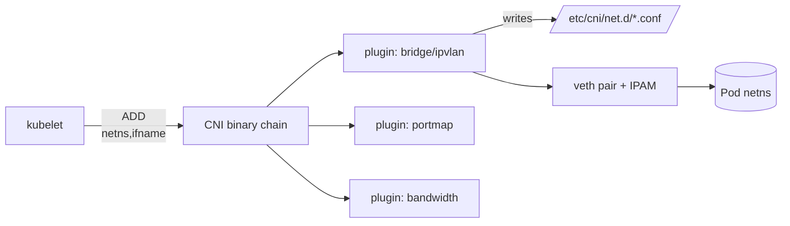
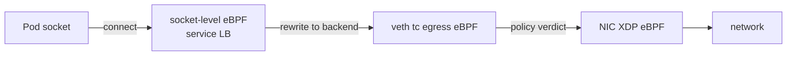

# CNI Deep Dive — Calico, Cilium, Flannel & the eBPF Dataplane

The Container Network Interface (CNI) is the contract between the kubelet and the pod network. Understanding it is the difference between "pods can't talk" being a 5-minute fix and a 5-hour outage.

---

## Mental Model



When kubelet creates a pod sandbox, it invokes CNI plugins listed in `/etc/cni/net.d/` in order. Each plugin is a binary in `/opt/cni/bin/` that reads JSON from stdin (containing the pod's netns path, container ID, ifname) and writes JSON to stdout.

Three operations: `ADD` (create), `DEL` (cleanup), `CHECK` (verify).

---

## The Plugin Chain

A real-world chain on a node:

```json
{
  "cniVersion": "1.0.0",
  "name": "k8s-pod-network",
  "plugins": [
    {"type": "calico", "ipam": {"type": "calico-ipam"}},
    {"type": "portmap", "capabilities": {"portMappings": true}},
    {"type": "bandwidth", "capabilities": {"bandwidth": true}}
  ]
}
```

- **Main plugin** (calico/cilium/flannel) — provisions the veth pair, IP, routes
- **portmap** — handles `hostPort` via iptables NAT
- **bandwidth** — applies `kubernetes.io/ingress-bandwidth` annotations via tc

Each plugin's stdout becomes stdin for the next. If any returns non-zero, the pod sandbox creation fails and you see `NetworkPluginNotReady`.

---

## Calico vs Cilium vs Flannel

| Dimension | Flannel | Calico | Cilium |
|---|---|---|---|
| Dataplane | VXLAN / host-gw | iptables / eBPF / VPP | eBPF (XDP capable) |
| Routing | Overlay default | BGP native, overlay optional | Direct routing or VXLAN/Geneve |
| NetworkPolicy | No (needs Calico) | Full L3/L4 + GlobalNetworkPolicy | L3/L4/L7 (HTTP, gRPC, Kafka, DNS) |
| IPAM | host-local | calico-ipam (IP pools, blocks) | cluster-pool / multi-pool |
| Encryption | No (without overlay tricks) | WireGuard | WireGuard or IPsec |
| Service implementation | kube-proxy | kube-proxy or eBPF | eBPF (replaces kube-proxy) |
| Observability | minimal | Felix metrics | Hubble (flow logs, service map) |
| Complexity | Low | Medium | High |
| Best for | Dev clusters, simple prod | Enterprise, BGP-aware datacenters | Performance-critical, L7 policy needs |

---

## Flannel — The Simple One

Each node gets a /24 subnet from a central pool stored in etcd (or k8s API). Default backend is VXLAN — the kernel encapsulates pod-to-pod traffic in UDP 8472 and decapsulates on the other side.

```
Pod A (10.244.1.5) -> cni0 bridge -> flannel.1 (VXLAN) -> eth0 (UDP) -> remote node
```

Pros: easy to understand, works anywhere.
Cons: no policy, no encryption, ~5–10% overhead from encap.

---

## Calico — BGP + iptables

Two key daemons per node:
- **Felix** — programs iptables/ipsets from policy
- **BIRD** — speaks BGP to advertise pod CIDRs (no overlay needed if your underlay supports BGP)

In BGP mode, packets are routed natively. Policy is enforced via iptables `cali-*` chains. Calico can also run in eBPF dataplane mode, replacing kube-proxy.

```
Pod A -> caliXXXXX veth -> kernel route table -> eth0 (BGP-advertised) -> remote
```

When a `NetworkPolicy` is created, Felix translates selectors to ipsets and emits iptables rules. New pods are matched by label, added to the right ipset.

---

## Cilium — eBPF Native

Cilium attaches eBPF programs at multiple hook points: tc ingress/egress on each veth, XDP on the NIC, socket-level for service translation.



Service translation happens at `connect()` time — the socket is rewritten directly to a backend pod IP. No NAT, no conntrack pollution, no kube-proxy.

L7 policy (e.g. "only allow GET /api/users") is enforced via Envoy proxy that Cilium injects transparently.

---

## eBPF Dataplane Wins

| Concern | iptables/kube-proxy | eBPF (Cilium) |
|---|---|---|
| Service rule lookup | O(n) linear chain | O(1) hash map |
| Rule update latency | seconds (rebuild table) | milliseconds (map update) |
| Conntrack | kernel conntrack (limited) | per-CPU eBPF maps |
| Visibility | iptables -L (opaque) | Hubble flow logs |
| L7 policy | requires sidecar | native via Envoy |

At scale (>1000 services), iptables update times become quadratic. eBPF maps update in constant time.

---

## Walkthrough — Pod gets an IP

1. kubelet calls CRI `RunPodSandbox`
2. Container runtime (containerd) creates the netns
3. Runtime invokes `/opt/cni/bin/calico` with stdin: `{netns: /var/run/netns/abc, ifname: eth0, ...}`
4. calico binary calls IPAM (calico-ipam) → allocates 10.244.5.7
5. calico creates veth pair: one end (caliXXX) on host, other (eth0) inside netns
6. Routes added: host has `10.244.5.7 dev caliXXX`, pod has `default via 169.254.1.1 dev eth0`
7. Felix observes new endpoint, programs iptables policy chains
8. portmap plugin runs (no-op if no hostPort)
9. CNI returns IP to kubelet, kubelet patches `pod.status.podIP`

---

## Common Failures

| Symptom | Likely cause |
|---|---|
| `NetworkPluginNotReady` | `/etc/cni/net.d/` empty or `/opt/cni/bin/` missing binary |
| Pods stuck `ContainerCreating` | IPAM exhaustion (check pool free count) |
| Cross-node pods can't reach | Overlay MTU mismatch, BGP not peering, security groups blocking VXLAN UDP 8472 |
| Random connection resets | Conntrack table full (`net.netfilter.nf_conntrack_max`) |
| Policy not enforced | Felix down, or policy applied to wrong namespace selector |

---

## Interview Questions

**Q: Why might a pod be stuck in ContainerCreating?**
A: CNI ADD failed. Check kubelet logs for the CNI error. Common causes: IPAM pool exhausted, CNI plugin binary missing/wrong version, MTU misconfig, IPAM datastore unreachable (etcd in Calico mode).

**Q: Calico vs Cilium — which would you pick for a 5000-node cluster?**
A: Cilium — eBPF service map updates are O(1), iptables-based kube-proxy degrades quadratically. Plus Hubble flow visibility is invaluable at that scale.

**Q: How does Cilium replace kube-proxy?**
A: eBPF programs at the socket layer rewrite the destination IP at `connect()` time, so the packet leaves the pod already addressed to a backend. No DNAT, no conntrack overhead.

**Q: What's the MTU concern with VXLAN?**
A: VXLAN adds 50 bytes of header. If underlay MTU is 1500, pod MTU must be ≤1450. Mismatch causes silent fragmentation or black-holed large packets — DNS works, large HTTP responses don't.

**Q: How does NetworkPolicy actually get enforced?**
A: Depends on CNI. Calico: Felix watches `NetworkPolicy` objects, translates label selectors to ipsets, emits iptables rules in `cali-*` chains. Cilium: agent compiles policy to eBPF maps consulted on every packet.

---

## Sources

- CNI spec — https://github.com/containernetworking/cni/blob/main/SPEC.md
- Calico architecture — https://docs.tigera.io/calico/latest/reference/architecture/overview
- Cilium concepts — https://docs.cilium.io/en/stable/overview/intro/
- Flannel backends — https://github.com/flannel-io/flannel/blob/master/Documentation/backends.md
- eBPF host routing — https://docs.cilium.io/en/stable/operations/performance/tuning/
