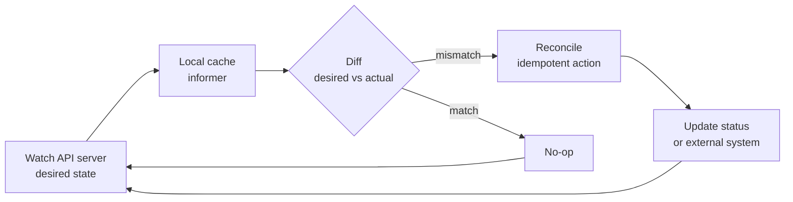
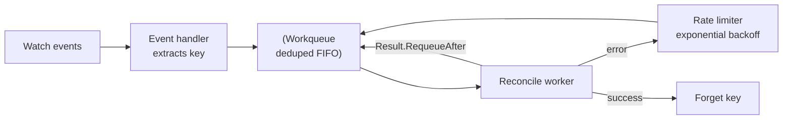

# Control Loop Pattern

> The single idea that makes Kubernetes work. Every controller — built-in or custom — implements this loop. If you understand this file, you can read the source code of any operator on GitHub.

## Why this matters

Kubernetes is not an orchestration engine that *issues commands*. It is a **set of reconcilers that observe state and try to make reality match desired state**, forever. This shift — from imperative to declarative + reconciliation — is what gives Kubernetes its self-healing properties. Misunderstand this and you will write controllers that race, deadlock, or silently drop events.

## Mental model

<!-- mermaid:rendered -->
<p align="center"></p>

<details><summary>Mermaid source</summary>



</details>

The loop is **infinite**. It does not run "on event" — it runs continuously, *triggered* by events but *not depending* on them.

## Level-triggered vs edge-triggered

This is the most-tested concept in K8s interviews. Get it wrong and your controller drops work.

| Property | Edge-triggered | Level-triggered |
|----------|----------------|-----------------|
| Reacts to | The *event* (transition) | The *current state* |
| Misses an event? | Behavior diverges forever | Catches up on next sync |
| Example | "Increment counter on click" | "Make light = switch position" |
| K8s uses | Never alone | Always |

Kubernetes is **level-triggered with edge-triggered hints**. Watches push events (edge), but the reconciler always reads the *current* object state from the cache and reconciles toward the spec. If a watch event is dropped, the periodic resync (default 10 hours, also relist on watch errors) catches it.

> If your reconciler reads the event payload instead of the current object, you wrote an edge-triggered controller. It will break.

## The reconcile contract

A reconciler in controller-runtime looks like this:

```go
func (r *Reconciler) Reconcile(ctx context.Context, req ctrl.Request) (ctrl.Result, error) {
    var obj appsv1.MyApp
    if err := r.Get(ctx, req.NamespacedName, &obj); err != nil {
        // NotFound => object was deleted; nothing to do
        return ctrl.Result{}, client.IgnoreNotFound(err)
    }

    // 1. Compute desired state from obj.Spec
    desired := buildDesired(&obj)

    // 2. Read actual state
    actual, err := r.fetchActual(ctx, &obj)
    if err != nil {
        return ctrl.Result{}, err  // requeue with backoff
    }

    // 3. Take idempotent action to converge
    if !equal(desired, actual) {
        if err := r.apply(ctx, desired); err != nil {
            return ctrl.Result{}, err
        }
    }

    // 4. Update status (separate subresource write)
    obj.Status.Phase = "Ready"
    return ctrl.Result{}, r.Status().Update(ctx, &obj)
}
```

Three rules:

1. **Idempotent** — calling Reconcile 10 times with the same input must produce the same result.
2. **No state in memory** — re-derive everything from the API. The next call may run on a different replica.
3. **Return, don't loop** — never put a `for` loop inside Reconcile waiting for state. Return and let the work queue re-enqueue you.

## Work queue + rate limiter

Between the informer (which receives watch events) and the reconciler sits a **work queue**. This is where production-grade backoff lives.

<!-- mermaid:rendered -->
<p align="center"></p>

<details><summary>Mermaid source</summary>



</details>

Key properties of `workqueue.RateLimitingInterface`:

- **Dedup** — adding the same key twice while not yet processed = one entry. Crucial because watches deliver bursty updates.
- **Per-key backoff** — failure on key `default/foo` does not slow processing of `default/bar`.
- **Default rate limiter** — `BucketRateLimiter(10 qps, 100 bucket)` AND `ItemExponentialFailureRateLimiter(5ms, 1000s)`, takes the *max* delay.
- **Forget on success** — must call `queue.Forget(key)` to reset the per-key backoff counter, otherwise next failure starts from where the last one left off.

## Walkthrough: how a Deployment scales up

1. User runs `kubectl scale deploy/web --replicas=5`.
2. API server validates, writes new `spec.replicas=5` to etcd.
3. etcd notifies watchers. Deployment controller's informer receives `MODIFIED` event.
4. Informer extracts key `default/web`, adds to workqueue.
5. Worker pops key, calls `Reconcile`.
6. Reconciler reads current Deployment + owned ReplicaSet from local cache.
7. Computes desired ReplicaSet `spec.replicas=5`. Current is 3.
8. Issues `PATCH` to ReplicaSet — **idempotent**: if the value is already 5, no-op.
9. ReplicaSet controller (different controller, same pattern) sees its own object change.
10. Creates 2 new Pods.
11. Scheduler watches unscheduled Pods. Each goes through its own scoring loop.
12. Kubelets watch Pods bound to their node. Each reconciles container state.

Every arrow is a separate level-triggered loop. There is no central orchestrator.

## Resync period

Informers periodically re-deliver `UPDATE` events for every object in cache, even if nothing changed. This is the backstop for missed watches and bugs in your reconciler.

- Default: 10 hours (controller-manager) or whatever you pass to `informerFactory.Start`.
- Setting to 0 disables resync — only do this if you trust watches absolutely.
- Resync is **NOT** a relist from the API server. It is a re-fire from local cache.
- A relist (full GET of all objects) happens when the watch breaks (HTTP 410 Gone or expired resource version).

## Common pitfalls

> [!WARNING] Gotchas
> - **Reading the event, not the object**: if you write `func handler(obj *Pod) { if obj.Status.Phase == "Pending" {...} }` you have a race. Always re-Get from cache by key inside Reconcile.
> - **Status writes to the wrong subresource**: writing `obj.Status` on the main object is rejected for resources with status subresource. Use `r.Status().Update()`.
> - **Forgetting to Forget**: `queue.Forget(key)` after success resets the rate limiter. Skip it and your healthy controller crawls.
> - **Optimistic concurrency 409s**: if you see `Conflict` on update, **don't retry blindly with the same object**. Re-Get and re-apply your mutation. The workqueue handles the requeue.
> - **Watch your finalizers**: a finalizer that loops on the same condition without progress will spin the workqueue at max QPS forever.
> - **Cache staleness**: writes go to etcd, but your local cache is updated only after the watch event arrives (~ms). After a Create/Update, do not immediately Get from cache expecting your write — it may not be there yet.
> - **Cross-namespace owner refs**: not allowed. The GC will refuse to track them and your child objects become orphans.

## Interview Q&A

> [!NOTE] Common interview questions
>
> **Q1: What is the difference between level-triggered and edge-triggered, and which does Kubernetes use?**
> Edge-triggered reacts to a transition (the event itself). Level-triggered reacts to current state. Kubernetes is level-triggered: even if a watch event is missed, the next resync or reconcile reads current state and converges. Watches are an *optimization* for latency, not a correctness requirement.
>
> **Q2: What happens if my reconciler crashes mid-execution?**
> Nothing bad. The work queue still holds the key (it's only Done() after the worker finishes). When the controller restarts, the informer relists, all objects appear as ADDED, and reconciliation resumes from current state. Idempotency makes mid-execution crash safe.
>
> **Q3: Two replicas of my controller are running. Will they double-process events?**
> Yes, unless one holds a leader-election lease. Built-in controllers in kube-controller-manager use leases. For custom controllers, use `--leader-elect=true` (controller-runtime exposes this as a manager option).
>
> **Q4: My reconciler returns `RequeueAfter: 30s`. Does that prevent watch-driven requeues?**
> No. Watch events still enqueue the key normally. `RequeueAfter` is a *minimum* — if a watch fires at 5s, the key processes at 5s.
>
> **Q5: Why does Kubernetes have both watches and periodic resync?**
> Watches provide low-latency event delivery. Resync provides correctness backstop: any missed event, any bug in event handling, any external state drift gets caught on the next resync cycle. Defense in depth.
>
> **Q6: What's the difference between Update and Patch in a controller?**
> Update sends the full object and uses optimistic concurrency on `resourceVersion`. Patch sends only the diff. Strategic merge patch and server-side apply (SSA) are preferred in modern controllers — SSA tracks field ownership so multiple controllers can co-own different fields without fighting.
>
> **Q7: What is `resourceVersion=0` in a List request?**
> "Serve me from any cache, freshness not required." Used by informers on initial list to reduce etcd load. `resourceVersion=""` means "must be fully consistent (latest)."
>
> **Q8: How do you avoid hot-looping a reconciler?**
> Use the rate limiter (default in controller-runtime). Don't return errors for expected states (e.g. "waiting for child to be ready" — return `RequeueAfter` instead, no error). Always `queue.Forget(key)` on success.
>
> **Q9: My CRD has 50,000 instances. What breaks?**
> Informer cache memory (full copy of every object). Mitigations: indexers for efficient lookups, `metav1.PartialObjectMetadata` informers (metadata only), label/field selectors to scope the watch, or sharding controllers.
>
> **Q10: What is server-side apply and why does it matter for controllers?**
> SSA (`fieldManager` + Apply patch type) lets multiple writers own non-overlapping fields on the same object. Pre-SSA, two controllers writing to the same object would clobber each other. Post-SSA, each declares the fields it owns, and conflicts are explicit.

## Sources

- Kubernetes docs — Controllers: https://kubernetes.io/docs/concepts/architecture/controller/
- client-go workqueue: https://github.com/kubernetes/client-go/tree/master/util/workqueue
- controller-runtime: https://github.com/kubernetes-sigs/controller-runtime
- Sample controller: https://github.com/kubernetes/sample-controller
- KEP-555 server-side apply: https://github.com/kubernetes/enhancements/tree/master/keps/sig-api-machinery/555-server-side-apply
- Talk: "Writing Controllers" by Daniel Smith — https://github.com/kubernetes/community/blob/master/contributors/devel/sig-api-machinery/controllers.md
