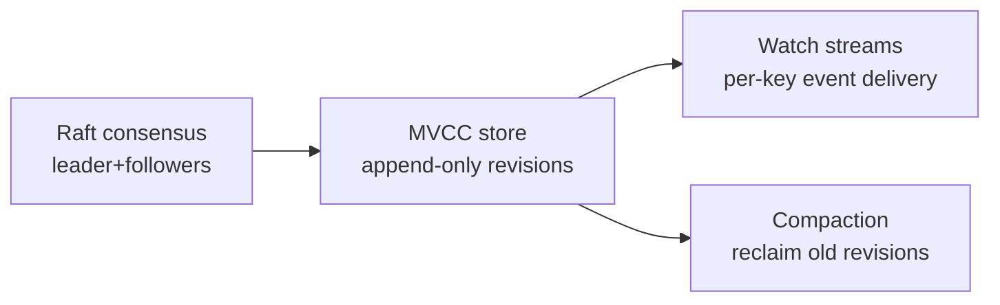
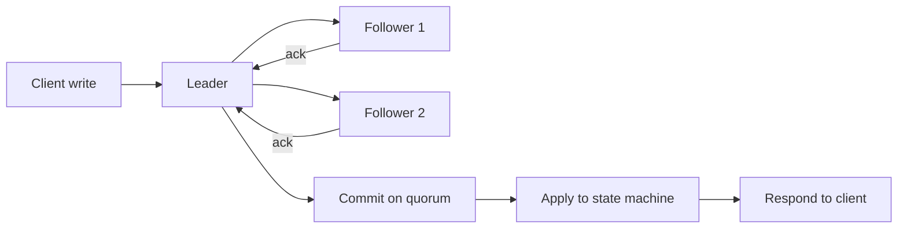
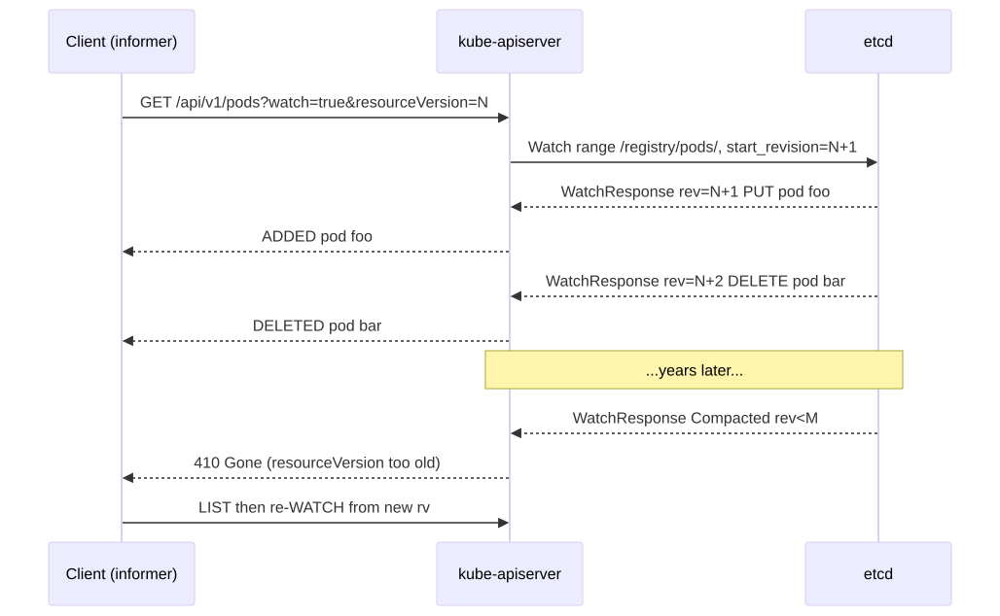
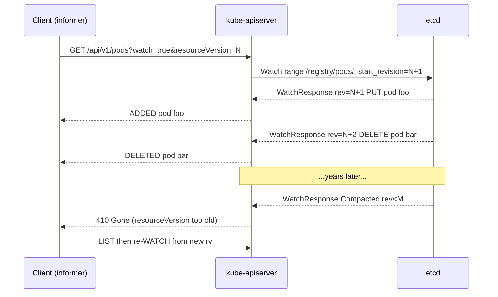

# etcd Watch Protocol

> etcd is the only stateful component in Kubernetes. Every Kubernetes guarantee — consistency, ordering, watch reliability — descends from etcd's design. Understand Raft + MVCC + watches and you understand why Kubernetes behaves the way it does.

## Why this matters

Most "weird Kubernetes bugs" trace back to etcd: split-brain after network partition, watches that miss events, "resource version too old" errors, slow API responses correlating with high disk latency, controllers that lag behind reality. None of it makes sense without the watch protocol.

## Mental model

etcd is a **strongly-consistent, replicated, MVCC key-value store with a streaming watch API**. Three pillars:

<!-- mermaid:rendered -->
<p align="center"></p>

<details><summary>Mermaid source</summary>



</details>

- **Raft** ensures every committed write is durable on a majority of nodes. No write is acknowledged until a quorum has it.
- **MVCC** stores each write as a new revision. Old revisions remain readable until compacted.
- **Watch** streams revision-ordered events to clients, enabling Kubernetes' level-triggered controllers.

## Raft consensus

<!-- mermaid:rendered -->
<p align="center"></p>

<details><summary>Mermaid source</summary>



</details>

Properties:
- **Quorum** = `(N/2) + 1`. For N=3, quorum=2. For N=5, quorum=3.
- **Leader-only writes**. Followers proxy or redirect.
- **Election** triggered by missed heartbeats (`--heartbeat-interval`, default 100ms; `--election-timeout`, default 1000ms).
- **Linearizable reads** by default — every read goes through the leader (`ReadIndex` protocol). Set `--consistency=s` for serializable reads from any node (faster, can read slightly stale data).
- **Network partition**: minority side stops accepting writes (no quorum). Reads on minority can return stale data unless linearizable.

Cluster-size sweet spot is 3 or 5 members. 7 is the practical max — write latency = slowest of the quorum. Even numbers offer no fault-tolerance benefit (4 still tolerates 1 failure, same as 3) but increase write latency.

## MVCC and revisions

Every write increments a global **revision** counter. Each key has a key-revision history:

```
key=/registry/pods/default/foo
  rev 1052 = {pod object v1}
  rev 1078 = {pod object v2}
  rev 1099 = {tombstone}    <-- delete
```

You can read at a specific revision: "give me /registry/pods/default/foo at rev 1078." This is how watches resume after disconnection — the client says "give me events since rev N" and etcd replays.

Kubernetes exposes etcd's revision as `metadata.resourceVersion` on every object. **Never compare resourceVersions arithmetically across resource types** — they share a global counter but a comparison only makes sense within the same key.

## Watch streams

Watch is a **gRPC bidirectional stream**. Client sends a `WatchRequest` (key range + start revision), server streams `WatchResponse` events forever.

<!-- mermaid:rendered -->
<p align="center"></p>

<details><summary>Mermaid source</summary>



</details>

Key behaviors:
- Events are **ordered by revision** within a watch.
- **Per-key ordering** is guaranteed — you'll never see rev 1078 of key X before rev 1052 of key X.
- **No cross-key ordering guarantee in general**, but the API server's storage layer preserves global ordering by revision for a single watch.
- **Bookmark events** (sent periodically, no payload) advance the client's known revision so re-LIST after disconnect is cheap.

### How the API server amplifies watches

If 5,000 kubelets watch their pods, etcd does NOT see 5,000 watches. The API server has a **watch cache**: it holds one watch to etcd per resource type, fans out events to all subscribers, filters by namespace/label/field selector locally. This is why the API server's memory usage scales with object count, not client count.

## Compaction

Old revisions consume disk forever unless compacted. Compaction marks revisions <= a threshold as deletable; defragmentation actually reclaims disk space.

```bash
# Auto-compaction (etcd flag, set on cluster)
etcd --auto-compaction-mode=periodic --auto-compaction-retention=5m

# Manual
etcdctl compact <revision>
etcdctl defrag
```

Kubernetes' kube-apiserver triggers compaction every 5 minutes by default (`--etcd-compaction-interval`).

**Why this matters for you**: if compaction lags (busy etcd, paused process), disk fills, etcd goes read-only, the whole cluster API hangs. Watch the `etcd_mvcc_db_total_size_in_bytes` and `etcd_disk_backend_commit_duration_seconds` metrics.

## Tombstones

A `DELETE` does not remove the key — it writes a **tombstone** revision. The tombstone is visible to watchers as a `DELETE` event, and it consumes space until compaction. Until then, you can still read the previous version of the key at its prior revision.

This is why Kubernetes deletion is a *write* in etcd. It is also why you cannot "really delete" anything pre-compaction — historical revisions are still in the bbolt file.

## etcd in Kubernetes: where keys live

```
/registry/<resource>/<namespace>/<name>     # namespaced
/registry/<resource>/<name>                 # cluster-scoped
/registry/pods/default/foo                  # actual pod
/registry/services/specs/default/svc1
/registry/leases/kube-system/kube-controller-manager
/registry/secrets/default/sa-token-xyz
```

Encoded as protobuf (default, smaller, faster) or JSON (`--storage-media-type=application/json` — only for debugging).

Secrets can be encrypted at rest via `EncryptionConfiguration` — the API server encrypts before writing. Etcd sees ciphertext. Without this, anyone with raw etcd access reads all secrets.

## Common pitfalls

> [!WARNING] Gotchas
> - **`resourceVersion="0"`** on a LIST means "any cache, freshness not required" — the API server may serve from its watch cache. Used by informers on initial relist for performance.
> - **`resourceVersion` is opaque** to clients. Don't parse, compare, or arithmetic on it. Treat as a token to pass back.
> - **Watch from rev=0** = "from beginning" but if compacted, you get 410 Gone. Always LIST first to get a current rv, then watch from there.
> - **Linearizable reads on the leader** — if the leader is partitioned from a majority, those reads block (correctness over availability). Don't blame "etcd is slow," check leadership.
> - **Defrag is per-member, not per-cluster**. Run sequentially with a delay; defragging a member makes it briefly unavailable.
> - **Cluster size 5 vs 3**: 5 tolerates 2 failures (vs 1) but write latency increases (need 3 acks vs 2). Don't use 5+ unless you've measured.
> - **etcd 3.4 -> 3.5 upgrade had data corruption issues**. Always run the latest patch version of 3.5+ for K8s 1.28+.
> - **Backups**: `etcdctl snapshot save` is online-safe. Restore is offline (must stop all etcd members). Test restores quarterly — most teams discover broken backups during real outages.
> - **Single etcd cluster per kube-apiserver, period**. "Sharding by namespace" exists in research papers, not production.

## Interview Q&A

> [!NOTE] Common interview questions
>
> **Q1: Why does Kubernetes use etcd specifically?**
> Strong consistency (linearizability) is required for the API server's watch+compare-and-swap semantics. etcd's watch stream with revision-based replay is what enables level-triggered controllers and informers.
>
> **Q2: What happens if I lose 1 of 3 etcd members?**
> Cluster continues — quorum is still met (2 of 3). Lost member can rejoin or be replaced via `member remove` + `member add`. Lose 2 of 3 and writes stop until you restore from snapshot or recover quorum.
>
> **Q3: How does a watch survive an API server restart?**
> It doesn't. The TCP/gRPC connection breaks, client reconnects (informers do this automatically) and resumes via `resourceVersion`. If too much time passed and revisions were compacted, client gets 410 Gone and must re-LIST.
>
> **Q4: My controller logs `too old resource version`. What do I do?**
> Catch the 410, drop your local state, LIST from the API server, then start a fresh WATCH from the LIST's resourceVersion. Informers in client-go handle this automatically.
>
> **Q5: What's MVCC and why does etcd need it?**
> Multi-Version Concurrency Control: each write creates a new revision; readers see a snapshot. Enables non-blocking reads and watch-from-revision semantics.
>
> **Q6: Are watches reliable?**
> Yes, within a single connection. Across reconnects, you may need to re-LIST if compaction passed your last revision. Bookmarks reduce this risk by advancing your known revision even when no real events occur.
>
> **Q7: How are secrets stored in etcd?**
> By default, base64-encoded plaintext. With `EncryptionConfiguration` (KMS, aescbc, aesgcm, secretbox), the API server encrypts before writing. Without KMS, the encryption key sits on the API server disk — better than nothing but not zero-trust.
>
> **Q8: My API server p99 latency spiked. What etcd metrics do I check?**
> `etcd_disk_wal_fsync_duration_seconds` (disk write latency), `etcd_disk_backend_commit_duration_seconds`, `etcd_server_leader_changes_seen_total` (leader churn), `etcd_mvcc_db_total_size_in_bytes` (compaction lagging?), `grpc_server_handling_seconds`.
>
> **Q9: What's the difference between linearizable and serializable reads in etcd?**
> Linearizable: read goes through leader's ReadIndex, guaranteed to see all committed writes. Serializable: read from any member's local state, may be stale by milliseconds. Kubernetes uses linearizable for correctness; some custom tooling uses serializable for cheap monitoring reads.
>
> **Q10: How big can an etcd object be?**
> Default 1.5 MB per request (`--max-request-bytes`). The cluster aggregate (db size limit) is 8 GB by default in modern etcd; raise with `--quota-backend-bytes` carefully — large dbs slow startup, defrag, and snapshot.
>
> **Q11: Can I run etcd on the same node as the API server?**
> Yes (kubeadm does this for control-plane nodes). For HA, use 3 control-plane nodes each running both. Don't put workloads on the same disk — fsync contention will tank etcd latency.

## Sources

- etcd docs: https://etcd.io/docs/
- etcd watch API: https://etcd.io/docs/v3.5/learning/api/#watch-api
- Raft paper: https://raft.github.io/raft.pdf
- Kubernetes etcd backup/restore: https://kubernetes.io/docs/tasks/administer-cluster/configure-upgrade-etcd/
- Encryption at rest: https://kubernetes.io/docs/tasks/administer-cluster/encrypt-data/
- Source: https://github.com/etcd-io/etcd
- API server storage layer: https://github.com/kubernetes/kubernetes/tree/master/staging/src/k8s.io/apiserver/pkg/storage
- SIG API Machinery: https://github.com/kubernetes/community/tree/master/sig-api-machinery
