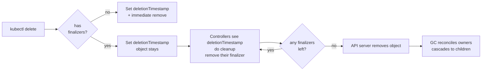

# Finalizers and Garbage Collection

> Why your namespace has been "Terminating" for 47 minutes. Why deleting a Deployment didn't delete its Pods. Why your CRD instance won't go away even after `kubectl delete --force`. All answered here.

## Why this matters

Kubernetes deletion is not a single atomic operation — it's a multi-phase protocol involving owner references, finalizers, and the garbage collector. Most production incidents involving "stuck deletion" stem from finalizer misuse. Every operator author needs to internalize this.

## Mental model



Deletion is **cooperative**. The API server sets a tombstone-in-progress (`deletionTimestamp`); finalizer-owners do their cleanup; when the last finalizer is removed, the object actually disappears.

## Owner references

Owner refs link a child object to a parent. When the parent is deleted, the GC controller cascades to children.

```yaml
apiVersion: v1
kind: Pod
metadata:
  name: web-7f8d9-abc
  ownerReferences:
  - apiVersion: apps/v1
    kind: ReplicaSet
    name: web-7f8d9
    uid: 1234-5678
    controller: true
    blockOwnerDeletion: true
```

Fields:
- **`uid`**: must match the parent's current UID. If the parent was deleted and recreated, the UID differs and the owner ref is invalid (orphan).
- **`controller: true`**: marks this as the *managing* owner. Only one ref per object can have this. Used by controllers to know which one of multiple owners is theirs.
- **`blockOwnerDeletion: true`**: foreground deletion waits for this child before deleting parent.

> Owner refs **must be in the same namespace** for namespaced parents, and cluster-scoped objects cannot have namespaced owners. The GC enforces this; cross-namespace refs are silently dropped (and warned about in events).

## Three deletion propagation policies

```bash
kubectl delete deploy web --cascade=background   # default
kubectl delete deploy web --cascade=foreground
kubectl delete deploy web --cascade=orphan
```

| Policy | What happens |
|--------|-------------|
| `background` (default) | Parent deleted immediately. GC controller asynchronously deletes children. |
| `foreground` | Parent stays in `Terminating` state until ALL children with `blockOwnerDeletion: true` are gone. Parent finalizer `foregroundDeletion` is set automatically. |
| `orphan` | Parent deleted; children's owner refs are stripped, children stay alive (orphaned). |

API form:

```yaml
# DELETE request body
{
  "kind": "DeleteOptions",
  "apiVersion": "v1",
  "propagationPolicy": "Foreground"
}
```

## Finalizers

A finalizer is a string in `metadata.finalizers[]`. Its presence prevents the API server from removing the object even after `deletionTimestamp` is set.

```yaml
metadata:
  name: my-resource
  finalizers:
  - kubernetes.io/pv-protection
  - my-operator.example.com/cleanup
  deletionTimestamp: "2026-04-26T10:00:00Z"
```

Lifecycle:

```mermaid
sequenceDiagram
    participant U as User
    participant API as API Server
    participant Op as Operator
    U->>API: DELETE /myresource/foo
    API->>API: Set deletionTimestamp; finalizers present so keep object
    API-->>U: 200 OK (but object remains)
    API-->>Op: WATCH MODIFIED with deletionTimestamp set
    Op->>Op: Run cleanup<br/>(deprovision external resource)
    Op->>API: PATCH remove finalizer<br/>my-operator.example.com/cleanup
    API->>API: No finalizers left -> actually delete
    API-->>Op: DELETED event
```

Built-in finalizers you'll encounter:

| Finalizer | Owner | Purpose |
|-----------|-------|---------|
| `kubernetes.io/pv-protection` | PV controller | Prevents PV deletion while bound to a PVC |
| `kubernetes.io/pvc-protection` | PVC controller | Prevents PVC deletion while in use by a Pod |
| `service.kubernetes.io/load-balancer-cleanup` | cloud-controller-manager | Releases external LB before Service deletion |
| `foregroundDeletion` | Garbage collector | Set by foreground propagation; removed when all blocking children gone |
| `kubernetes` | Namespace controller | Holds Namespace until all namespaced resources deleted |

## Walkthrough: Deployment deletion (background)

1. `kubectl delete deploy web` (background, default).
2. API server sets `deletionTimestamp` on Deployment. No finalizer, so it's removed from etcd immediately.
3. GC controller's informer notices Deployment vanished. Looks at all objects with owner ref pointing to this UID.
4. Finds 1 ReplicaSet (`web-7f8d9`). Issues DELETE on it.
5. ReplicaSet has owner ref to Deployment (now-deleted UID). GC deletes the ReplicaSet.
6. ReplicaSet's deletion cascades: 3 Pods point to its UID. GC deletes them.
7. Each Pod has its own deletion path (pre-stop hooks, terminationGracePeriodSeconds, finalizers from CSI/CNI, kubelet tear-down, container kill).

Total time depends on grace periods, not on the GC. The GC only initiates the chain.

## Walkthrough: Namespace deletion

1. `kubectl delete ns dev`.
2. API server sets `deletionTimestamp` on Namespace and adds `kubernetes` finalizer.
3. Namespace controller (in kube-controller-manager) wakes up.
4. Discovers all API resource types via the discovery API.
5. For each resource type, lists objects in the namespace.
6. Issues DELETE on each. Waits for them to actually disappear.
7. Once empty, removes the `kubernetes` finalizer from the Namespace.
8. API server actually deletes the Namespace.

This is why namespaces stuck in Terminating are usually due to a child object with a finalizer that's not being honored — typically a CRD whose operator is gone, or an APIService backing an aggregated API that's down.

To debug:

```bash
kubectl get namespace dev -o json | jq '.spec.finalizers, .status'
kubectl api-resources --verbs=list --namespaced -o name |
  xargs -n1 kubectl get -n dev --ignore-not-found 2>&1 | grep -v "No resources"
```

## Removing a stuck finalizer (last resort)

```bash
kubectl patch myresource foo -p '{"metadata":{"finalizers":[]}}' --type=merge
```

This bypasses cleanup. **You will leak whatever the finalizer was supposed to clean up** — orphaned cloud LBs, dangling PVs, external DB users. Use only when the owning controller is permanently gone.

For namespaces, the legacy "finalize" subresource:

```bash
kubectl get ns dev -o json | jq 'del(.spec.finalizers)' | \
  kubectl replace --raw "/api/v1/namespaces/dev/finalize" -f -
```

## Common pitfalls

> [!WARNING] Gotchas
> - **Finalizer with no owner**: if your operator was uninstalled but its CRDs and finalizers remain, every instance is permanently stuck. Always remove finalizers in your operator's uninstall procedure.
> - **Finalizer that requires the object's spec**: read spec ONCE on first reconcile; don't assume it's stable across the deletion window. Users may have edited spec right before deleting.
> - **Cross-namespace owner refs**: silently dropped. Children become orphans on parent deletion. For cross-namespace ownership, write your own controller-managed cleanup, don't use ownerRefs.
> - **`controller: true` on multiple refs**: only one can have it. Conflicts cause the second-to-set ref to fail.
> - **`blockOwnerDeletion: true` requires UPDATE permission on the parent**. RBAC rejection silently drops the field.
> - **Foreground deletion is slow** when there are many children — the parent waits for all `blockOwnerDeletion: true` children to be fully gone (not just marked for deletion).
> - **Deleting a CRD removes all its CRs**, but the GC handles them like any other resource — they may still have finalizers and stick around.
> - **`kubectl delete --force --grace-period=0`** removes the object from the API server WITHOUT honoring finalizers when combined with `--wait=false`. Actually it doesn't; it sets grace period to 0 but finalizers still apply. The "force delete a pod" technique uses `--force --grace-period=0` which bypasses graceful kubelet shutdown but the API object is still subject to finalizers.
> - **Patching `metadata.finalizers` to `[]`** on a Namespace doesn't work via normal patch on `/api/v1/namespaces/X` — must go through the `/finalize` subresource (or the namespace controller).
> - **Adding a finalizer in a mutating webhook** without an owner controller to remove it = guaranteed stuck object. Don't.

## Interview Q&A

> [!NOTE] Common interview questions
>
> **Q1: My namespace has been Terminating for an hour. How do I unblock it?**
> Find what's stuck. `kubectl api-resources --namespaced=true -o name | xargs -I{} kubectl get {} -n NS`. Look for objects with finalizers and no live owner. Remove the finalizer via patch (last resort, you'll leak resources). Often the root cause is an APIService backing an aggregated API that's unreachable — `kubectl get apiservice` and look for `Available: False`.
>
> **Q2: Difference between background, foreground, and orphan deletion?**
> Background: parent deleted immediately, GC reaps children async (default). Foreground: parent stays until children with `blockOwnerDeletion: true` are gone. Orphan: parent deleted, children survive without an owner.
>
> **Q3: I deleted a Deployment but the Pods are still there. Why?**
> Check owner references on the Pods. If they were created by a ReplicaSet which was created by the Deployment, both should cascade. If you used `--cascade=orphan` they survive. If the GC controller is wedged or the ReplicaSet's owner ref UID doesn't match, the chain breaks.
>
> **Q4: When should I use a finalizer in my operator?**
> When deleting your CR requires cleaning up something the API server doesn't know about — external resources (cloud LBs, DNS records, DB users), files on disk, kafka topics. NOT for cleaning up other Kubernetes objects (use owner refs for that).
>
> **Q5: A finalizer must be removed by whom?**
> The owner of that finalizer. The finalizer string is conventionally `<owner-domain>/<purpose>` so the owner is identifiable. The API server doesn't enforce ownership — anyone with PATCH permission on the object can remove any finalizer. RBAC carefully.
>
> **Q6: Can I add a finalizer to a built-in resource like Pod?**
> Yes. The Pod stays in Terminating until you remove your finalizer. Be very careful — kubelet won't remove the Pod from etcd while finalizers remain, and node-pressure eviction may behave oddly.
>
> **Q7: How does the GC know which children belong to which parent?**
> It maintains a graph in memory built from `ownerReferences`. On startup it does a full discovery and builds the graph; then it watches all resource types for owner-ref changes. With many objects this graph can be sizable.
>
> **Q8: What's `metadata.deletionTimestamp` exactly?**
> Set by the API server when DELETE is received. Once set, the only allowed mutations are: removing finalizers, removing owner refs (to orphan), and updating status. Spec changes are rejected.
>
> **Q9: Why is my PVC stuck in Terminating?**
> The `kubernetes.io/pvc-protection` finalizer holds it until no Pod uses it. Either delete the Pods first, or check the PVC controller logs. If a Pod that mounted the PVC was force-deleted leaving a stale mount, the finalizer logic may not see "in use" but the kubelet still has it open.
>
> **Q10: Two operators add finalizers to the same CR. Order of removal?**
> They run independently and remove in whatever order they finish their cleanup. The object survives until both are gone. There's no global ordering — design each finalizer to be independent.

## Sources

- Kubernetes docs — Garbage Collection: https://kubernetes.io/docs/concepts/architecture/garbage-collection/
- Owners and dependents: https://kubernetes.io/docs/concepts/overview/working-with-objects/owners-dependents/
- Finalizers: https://kubernetes.io/docs/concepts/overview/working-with-objects/finalizers/
- Source — GC: https://github.com/kubernetes/kubernetes/tree/master/pkg/controller/garbagecollector
- Source — Namespace controller: https://github.com/kubernetes/kubernetes/tree/master/pkg/controller/namespace
- KEP-1847 namespace deletion: https://github.com/kubernetes/enhancements/tree/master/keps/sig-api-machinery/1847-namespace-deletion
- SIG API Machinery: https://github.com/kubernetes/community/tree/master/sig-api-machinery
