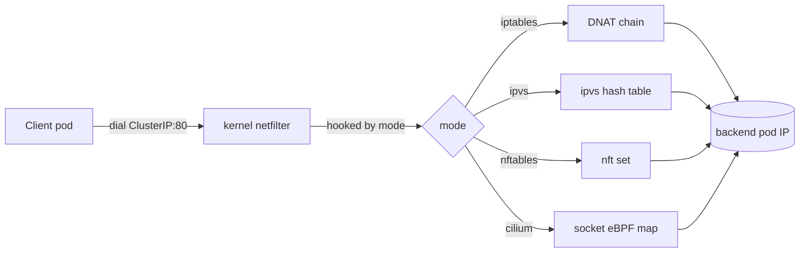

# kube-proxy Modes — iptables vs ipvs vs nftables vs Cilium eBPF

kube-proxy turns Service abstractions into actual packet routing. The mode you pick decides whether your cluster handles 100 services or 100,000.

---

## Mental Model



A Service has a virtual ClusterIP. kube-proxy watches Services and Endpoints from the API server and programs the kernel so packets to that VIP land on a real pod IP.

---

## Mode 1 — iptables (default)

**How it works:** kube-proxy generates one chain per service (`KUBE-SVC-<hash>`) and one chain per endpoint (`KUBE-SEP-<hash>`). The service chain uses statistical matching to round-robin across endpoints.

```
-A KUBE-SVC-XYZ -m statistic --mode random --probability 0.33 -j KUBE-SEP-A
-A KUBE-SVC-XYZ -m statistic --mode random --probability 0.50 -j KUBE-SEP-B
-A KUBE-SVC-XYZ -j KUBE-SEP-C
```

**Pros:** widely supported, no extra kernel modules, works everywhere.
**Cons:** O(n) lookup per packet, O(n²) rule update time. At 5k services, programming a single new service can stall traffic for seconds.

---

## Mode 2 — ipvs

**How it works:** Uses the Linux IPVS (IP Virtual Server) module — a purpose-built L4 load balancer in the kernel. Service VIPs are added as `dummy0` interface addresses; backends are programmed as ipvs destinations.

```
ipvsadm -L -n
TCP  10.96.0.10:53 rr
  -> 10.244.1.5:53    Masq    1
  -> 10.244.2.7:53    Masq    1
```

**Lookup:** O(1) hash table.
**Algorithms:** `rr`, `wrr`, `lc`, `dh`, `sh`, `sed`, `nq` (configurable per service via annotation).
**Pros:** sub-millisecond updates even at 10k services, multiple LB algorithms.
**Cons:** still depends on iptables for NodePort/masquerade and policy. Conntrack still in play.

---

## Mode 3 — nftables (Beta in 1.29, GA in 1.31)

**How it works:** Like iptables mode but uses the modern nftables backend, which is a single unified table with native sets and maps.

```
nft list table ip kube-proxy
table ip kube-proxy {
  map service-ips {
    type ipv4_addr . inet_proto . inet_service : verdict
    elements = { 10.96.0.10 . tcp . 53 : jump svc-coredns }
  }
}
```

**Pros:** O(1) lookups via maps, atomic ruleset replacement (no half-state during reloads), better performance than iptables, no extra kernel modules unlike ipvs.
**Cons:** newer — fewer tools and SREs comfortable debugging it. Older kernels lack support.

---

## Mode 4 — Cilium eBPF (kube-proxy replacement)

Cilium can fully replace kube-proxy. eBPF programs at the socket layer translate ClusterIP → backend pod IP at `connect()` time, before a packet exists.

```c
// Pseudocode of socket-level translation
SEC("cgroup/connect4")
int sock4_connect(struct bpf_sock_addr *ctx) {
  svc = map_lookup_elem(&services, ctx->user_ip4 + ctx->user_port);
  if (svc) {
    backend = pick_backend(svc);
    ctx->user_ip4 = backend->ip;
    ctx->user_port = backend->port;
  }
  return 1;
}
```

**Pros:** zero conntrack overhead for cluster-internal calls, no NAT, sub-microsecond service lookup, handles 100k+ services.
**Cons:** requires kernel 4.19+ (5.10+ recommended), Cilium-specific.

---

## Comparison Table

| Dimension | iptables | ipvs | nftables | Cilium eBPF |
|---|---|---|---|---|
| Service lookup | O(n) | O(1) | O(1) | O(1) |
| Rule update at scale | O(n²) seconds | O(1) ms | O(1) ms | O(1) µs |
| Conntrack required | Yes | Yes | Yes | Optional (skipped for cluster traffic) |
| LB algorithms | Round-robin only | rr/wrr/lc/dh/sh | Round-robin only | Maglev / random / least-conn |
| L7 awareness | No | No | No | Yes (via Envoy) |
| Kernel deps | iptables | IPVS module | nf_tables (4.18+) | eBPF (5.10+ ideal) |
| Debug story | `iptables-save` (verbose) | `ipvsadm -L` (clean) | `nft list ruleset` (clean) | `cilium service list` |
| Maturity | GA, ubiquitous | GA since 1.11 | GA in 1.31 | Production at scale (Datadog, Adobe) |
| Best for | Small/medium clusters | Large clusters needing simplicity | Modern clusters going forward | Performance-critical, observability needs |

---

## Performance Numbers (rough, varies by hardware)

For 5000 services, 50 endpoints each:

| Mode | First packet latency | Rule sync time | CPU overhead |
|---|---|---|---|
| iptables | 200–500 µs | 5–15 sec per change | High at scale |
| ipvs | 50 µs | <100 ms | Low |
| nftables | 50 µs | <100 ms | Low |
| Cilium eBPF | <10 µs | <10 ms | Lowest |

---

## Walkthrough — A Packet's Journey (iptables mode)

1. Pod A calls `connect(10.96.0.10:80)` (ClusterIP)
2. Packet enters kernel, hits `nat OUTPUT` → `KUBE-SERVICES` chain
3. Match on dst-ip `10.96.0.10:80` → jump to `KUBE-SVC-XYZ`
4. Statistical match selects `KUBE-SEP-A`
5. `KUBE-SEP-A` does DNAT: dst becomes `10.244.5.7:8080` (pod IP)
6. Conntrack records the translation
7. Packet routed via CNI to node hosting pod
8. Reply packet hits conntrack, src is rewritten back to `10.96.0.10:80`
9. Pod A sees a normal TCP response from the ClusterIP

---

## Common Failures

| Symptom | Cause |
|---|---|
| Service works to some pods, not others | Endpoints out of sync — check `kubectl get endpointslice` |
| Connection resets after ~5 min | Conntrack timeout, or pod restarted but kube-proxy didn't update |
| Sluggish service updates | iptables mode at scale — switch to ipvs/nftables/eBPF |
| `KUBE-SVC` chain missing | kube-proxy crashed or pod label selector matches no pods |
| Sticky sessions broken | Set `service.spec.sessionAffinity: ClientIP` |

---

## Interview Questions

**Q: Why do many enterprises move from iptables to ipvs?**
A: Rule update time is the killer. With 5k+ services, every endpoint change rebuilds chains and can stall data path for seconds. ipvs uses a hash table so updates are O(1).

**Q: When would you use nftables over ipvs?**
A: Going forward, nftables is the default direction (1.31 GA). It avoids the dual iptables+ipvs complexity ipvs mode has, and has cleaner tooling. ipvs still wins if you need non-RR LB algorithms.

**Q: How does Cilium skip conntrack?**
A: Service translation happens at the socket via eBPF before the packet exists. The kernel sees the packet already addressed to the backend IP, so no NAT, no conntrack entry needed for east-west.

**Q: What's `externalTrafficPolicy: Local`?**
A: For NodePort/LoadBalancer services. With `Cluster`, traffic can hop nodes (extra latency, masks source IP). With `Local`, only nodes with a backend pod accept traffic — preserves client source IP, avoids the extra hop, but uneven load if pods aren't spread.

**Q: How do you debug "service exists but I get connection refused"?**
A: Check `kubectl get endpointslice -o wide` — empty means selector matches no ready pods. Check pod `readinessProbe`. Verify kube-proxy logs. Try `iptables-save | grep KUBE-SVC-` for the chain. From a node, `curl <ClusterIP>:port` to bypass DNS.

---

## Sources

- kube-proxy modes — https://kubernetes.io/docs/reference/networking/virtual-ips/
- nftables mode KEP — https://github.com/kubernetes/enhancements/tree/master/keps/sig-network/3866-nftables-proxy
- IPVS docs — http://www.linuxvirtualserver.org/software/ipvs.html
- Cilium kube-proxy replacement — https://docs.cilium.io/en/stable/network/kubernetes/kubeproxy-free/
- BPF performance benchmarks — https://cilium.io/blog/2021/05/11/cni-benchmark/
