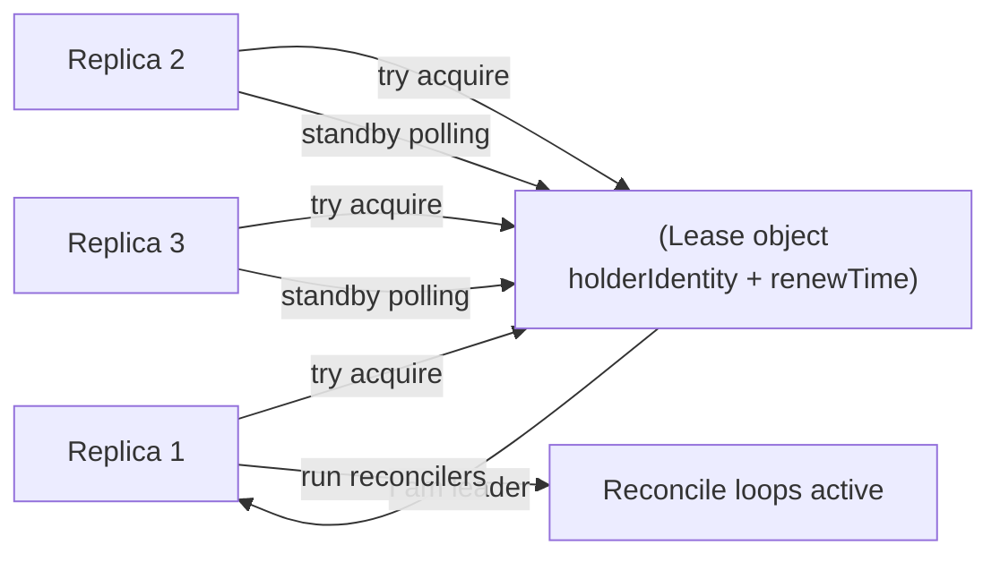
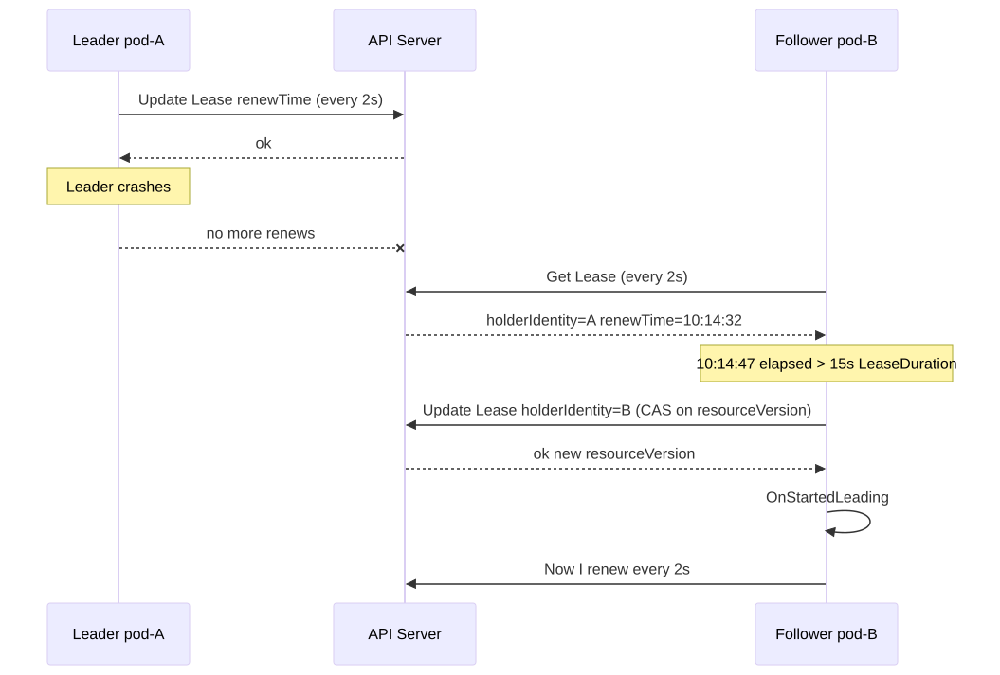
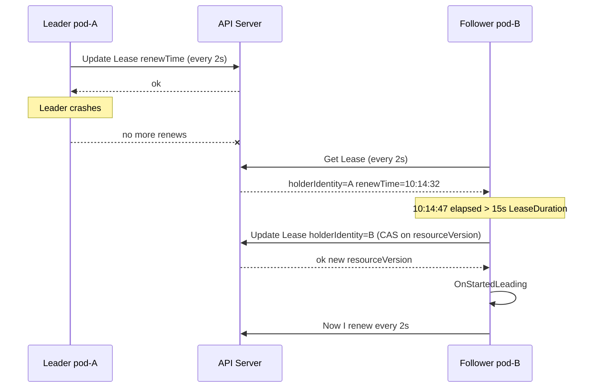

# Leader Election

> Why every multi-replica controller in Kubernetes — kube-controller-manager, kube-scheduler, cloud-controller-manager, custom operators — votes for a leader. And how it's implemented in ~200 lines of Go using a single `coordination.k8s.io/v1` Lease object.

## Why this matters

If two replicas of the deployment controller both reconcile the same Deployment, they will fight: each computes a desired ReplicaSet, each issues a write, each sees the other's write as drift, repeat forever. Leader election ensures **only one replica acts**, while the others sit ready as hot standbys for failover. This is also how custom operators avoid double-scheduling work.

## Mental model

<!-- mermaid:rendered -->
<p align="center"></p>

<details><summary>Mermaid source</summary>



</details>

The Lease is the source of truth. Whoever atomically updates it with their identity and a fresh `renewTime` is leader. The leader must keep renewing; if it dies, a follower notices the stale renewTime and takes over.

## The Lease object

```yaml
apiVersion: coordination.k8s.io/v1
kind: Lease
metadata:
  name: my-controller
  namespace: kube-system
spec:
  holderIdentity: pod-7f8d9-xyz_uuid-abc123
  leaseDurationSeconds: 15
  acquireTime: "2026-04-26T10:00:00Z"
  renewTime: "2026-04-26T10:14:32Z"
  leaseTransitions: 4
```

Fields:
- **`holderIdentity`**: who currently holds the lease. Convention is `<podname>_<uuid>`. The UUID prevents stale process-restart confusion (same pod, different process instance).
- **`leaseDurationSeconds`**: how long the lease is valid after `renewTime`. Defaults vary: 15s for kube-controller-manager, 30s for some operators.
- **`renewTime`**: last successful renewal. Leader updates this on every renew.
- **`acquireTime`**: when the current holder first acquired (since last transition).
- **`leaseTransitions`**: monotonic counter of how many times leadership changed. Useful for debugging flapping.

## The acquire/renew loop

```go
import "k8s.io/client-go/tools/leaderelection"

leaderelection.RunOrDie(ctx, leaderelection.LeaderElectionConfig{
    Lock: &resourcelock.LeaseLock{
        LeaseMeta: metav1.ObjectMeta{
            Name:      "my-controller",
            Namespace: "kube-system",
        },
        Client: clientset.CoordinationV1(),
        LockConfig: resourcelock.ResourceLockConfig{
            Identity: hostname + "_" + uuid.New().String(),
        },
    },
    LeaseDuration:   15 * time.Second,
    RenewDeadline:   10 * time.Second,
    RetryPeriod:     2 * time.Second,
    ReleaseOnCancel: true,
    Callbacks: leaderelection.LeaderCallbacks{
        OnStartedLeading: func(ctx context.Context) {
            startReconcilers(ctx)
        },
        OnStoppedLeading: func() {
            klog.Fatalf("leadership lost")
        },
        OnNewLeader: func(identity string) {
            klog.Infof("new leader: %s", identity)
        },
    },
})
```

Three timing parameters that confuse everyone:

| Param | Default | Meaning |
|-------|---------|---------|
| `LeaseDuration` | 15s | How long the lease is valid after renew. Followers wait this long before assuming dead. |
| `RenewDeadline` | 10s | Leader must successfully renew within this window or it stops being leader (self-demote). Must be < LeaseDuration. |
| `RetryPeriod` | 2s | How often leader/followers retry the API call to renew/acquire. |

> Why is `RenewDeadline` < `LeaseDuration`? So the leader notices it failed to renew **before** followers think the lease has expired. This prevents two leaders running simultaneously.

## Failover sequence

<!-- mermaid:rendered -->
<p align="center"></p>

<details><summary>Mermaid source</summary>



</details>

Key points:
- The CAS (compare-and-swap on `resourceVersion`) ensures only one follower can take over. The losers see 409 Conflict and retry next cycle.
- Failover latency = `LeaseDuration` + `RetryPeriod` + a renewal RTT. With defaults, ~17 seconds.
- During failover **nothing is reconciling**. If you need lower failover, reduce `LeaseDuration` — but be aware of API server load (every replica polling every `RetryPeriod`).

## Jitter

If 100 controllers all schedule renewal at exactly T+10s, they hit the API server in a thundering herd. client-go adds jitter to retry intervals (`wait.Jitter`) — a small randomized delay so requests spread out. You don't configure this, but you should be aware: a "lease that should renew at exactly 10s" actually renews at 10-11s.

## Why every controller does this

| Controller | Lease name | Why |
|------------|------------|-----|
| kube-controller-manager | `kube-controller-manager` in `kube-system` | Avoid two replicas issuing duplicate reconciles |
| kube-scheduler | `kube-scheduler` in `kube-system` | Two schedulers would race on Bind, double-binding |
| cloud-controller-manager | `cloud-controller-manager` | Cloud API calls are expensive and rate-limited |
| Operators | Custom name in operator's namespace | Same reason — avoid duplicate work and write conflicts |

What about kubelet? **No leader election** — each node has exactly one kubelet, so there's nothing to elect. Same for kube-proxy.

## Lease vs Endpoints vs ConfigMap (history)

Old code used Endpoints or ConfigMaps with annotations as the lease object. This was hacky and inflated those resource types. KEP-1432 introduced the dedicated `coordination.k8s.io/v1` Lease type in 1.14, GA in 1.20. Modern code uses `LeaseLock`. If you see `EndpointsLeasesResourceLock` or `ConfigMapsLeasesResourceLock` in legacy code, those are the migration paths — they wrote to *both* old and new for compatibility.

## Common pitfalls

> [!WARNING] Gotchas
> - **Same `Identity` across pod restarts** = a restarted pod thinks it's still leader and steps on the new leader. Always include a per-process UUID.
> - **`OnStoppedLeading` does not stop your goroutines**. You must use the `ctx` that was passed to `OnStartedLeading` and check it. Many controllers `os.Exit(1)` on stop-leading and let the pod restart — simpler than cleanly tearing down everything.
> - **Reconciler started before leadership** = work happens on standby pods. Always gate work-starts on `OnStartedLeading`.
> - **`LeaseDuration < RenewDeadline + RetryPeriod`**: the leader cannot possibly renew in time. Validation prevents this in client-go but custom locks may not.
> - **API server unavailable** during a renewal window = leader loses leadership even though no follower could acquire either. Cluster has zero leaders for a moment.
> - **Watching the Lease yourself** — don't. The leaderelection package polls; adding a watch is more code, more failures, and not faster.
> - **Single lease across many controllers**: don't share. Each logical controller should have its own Lease so they can fail over independently.
> - **Network partition + multiple control-plane nodes**: the partitioned leader keeps thinking it's leader (it doesn't know its renewals are failing if the API server it talks to is also partitioned). Combined with stale-read possibilities, this is why you need RBAC and idempotency — leader election is not a hard fence.

## Interview Q&A

> [!NOTE] Common interview questions
>
> **Q1: How does Kubernetes leader election work?**
> Replicas race to update a `Lease` object with their identity and a fresh `renewTime`. The API server's optimistic concurrency on `resourceVersion` ensures atomicity. Leader keeps renewing on a timer; if renewal fails for `RenewDeadline`, leader self-demotes. Followers poll, and when `renewTime + LeaseDuration` is in the past, one of them claims it.
>
> **Q2: Why must the leader self-demote before the lease expires?**
> So that no follower has yet decided the lease is dead while the previous leader still believes it is leader. `RenewDeadline < LeaseDuration` guarantees this gap.
>
> **Q3: Can two leaders exist simultaneously?**
> In theory: yes, briefly, if a leader is partitioned from the API server but doesn't notice fast enough, OR if clocks drift significantly. In practice with proper config and bounded clock skew: no, because of the RenewDeadline self-demote and the CAS on resourceVersion. This is why all controllers must still be idempotent — leader election is a performance optimization, not a correctness fence.
>
> **Q4: What's the failover time?**
> Roughly `LeaseDuration + RetryPeriod + RTT`. With defaults: ~17s. To reduce, lower `LeaseDuration` (and `RenewDeadline` proportionally) at the cost of more API server traffic.
>
> **Q5: Why isn't there leader election for the kubelet?**
> Each node has exactly one kubelet. Two would conflict over CRI, CNI, port bindings, mounts. Kubernetes prevents this by design.
>
> **Q6: Why use a Lease object instead of just running one replica?**
> Hot standby. Failover in seconds vs minutes. With one replica, a pod restart leaves the controller down for the duration of pull+boot. With three replicas + leader election, a follower takes over in ~15s.
>
> **Q7: What happens if the API server is briefly down during a renew?**
> Leader retries within `RenewDeadline`. If still failing, self-demotes via `OnStoppedLeading`. When API recovers, all replicas race; one becomes leader. There may be zero leaders for a window.
>
> **Q8: How would you debug "leader keeps changing every minute"?**
> `kubectl get lease -n kube-system <name> -w` and watch `holderIdentity` and `leaseTransitions`. Likely causes: API server slowness pushing renewals over `RenewDeadline`, network instability, OOM kills, or someone else using the same Lease name.
>
> **Q9: Can my custom controller use the kube-system namespace for its Lease?**
> Yes if it has RBAC for `coordination.k8s.io/leases` in that namespace. Convention is to put your Lease in your operator's own namespace to keep things tidy.
>
> **Q10: What's `ReleaseOnCancel`?**
> When the program shuts down cleanly (SIGTERM, ctx canceled), explicitly clears the Lease's `holderIdentity` and writes a past `renewTime` so the next replica can take over instantly instead of waiting for `LeaseDuration` to expire.

## Sources

- Lease API reference: https://kubernetes.io/docs/concepts/architecture/leases/
- client-go leaderelection: https://github.com/kubernetes/client-go/tree/master/tools/leaderelection
- KEP-1432 Lease API: https://github.com/kubernetes/enhancements/tree/master/keps/sig-api-machinery/1432-lease-api
- Coordination API: https://kubernetes.io/docs/reference/generated/kubernetes-api/v1.30/#lease-v1-coordination-k8s-io
- controller-runtime manager (uses leaderelection): https://github.com/kubernetes-sigs/controller-runtime/tree/main/pkg/leaderelection
- SIG API Machinery: https://github.com/kubernetes/community/tree/master/sig-api-machinery
