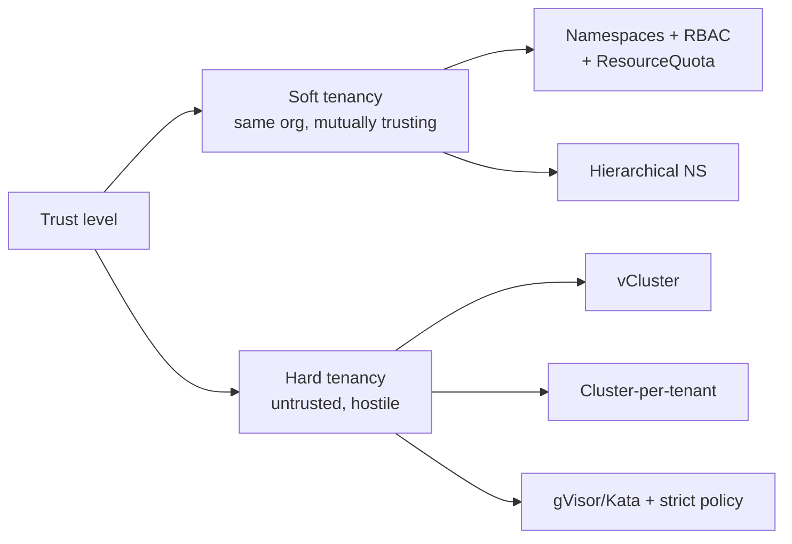
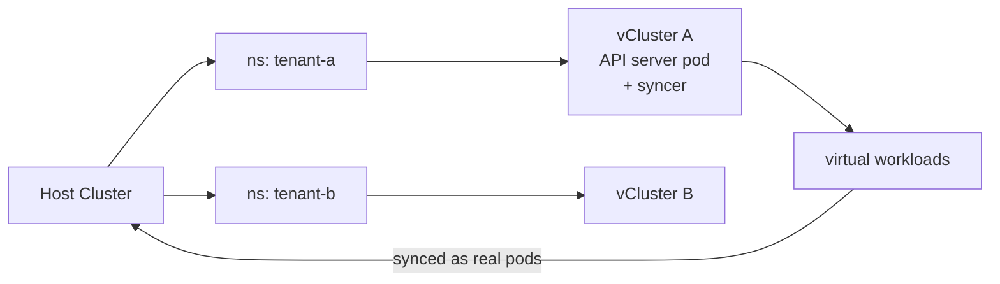

# Multi-Tenancy Models — Namespaces, vCluster, Hierarchical Namespaces

Multi-tenancy in Kubernetes is a spectrum. From "share a namespace" to "share absolutely nothing", you trade isolation for cost and complexity. Picking the right model shapes the next 3 years of your platform.

---

## Mental Model — Soft vs Hard Tenancy



- **Soft tenancy** — internal teams, you accept that a malicious team COULD break out. Goal: prevent accidents, fair resource sharing, RBAC isolation.
- **Hard tenancy** — paying customers running untrusted code (think a SaaS platform). Goal: prevent intentional breakouts, strict resource isolation, no cross-tenant data leak even with kernel exploits.

---

## Model 1 — Plain Namespaces (Soft Tenancy)

The cheapest, lightest option. Each tenant gets a namespace.

```yaml
apiVersion: v1
kind: Namespace
metadata: { name: team-orders }
---
apiVersion: v1
kind: ResourceQuota
metadata: { name: quota, namespace: team-orders }
spec:
  hard:
    requests.cpu: "20"
    requests.memory: 40Gi
    pods: "100"
---
apiVersion: networking.k8s.io/v1
kind: NetworkPolicy
metadata: { name: deny-cross-ns, namespace: team-orders }
spec:
  podSelector: {}
  policyTypes: [Ingress]
  ingress:
    - from:
        - podSelector: {}      # only same-namespace
```

**Required guardrails:**
- ResourceQuota — caps CPU/memory/pod count
- LimitRange — default per-pod requests/limits
- RBAC — Role/RoleBinding scoped to namespace
- NetworkPolicy — namespace-isolated by default
- PodSecurity admission (Restricted profile)

**Limits:**
- Tenants share kubelet, kernel, CRDs, controllers
- A tenant CAN list cluster-scoped resources unless RBAC blocks them
- Cluster-scoped CRD instances visible across tenants
- Noisy neighbor at API server level (no per-tenant API rate limiting natively)

---

## Model 2 — Hierarchical Namespaces (HNC)

Namespaces gain parent-child relationships. Policies (RBAC, NetworkPolicy, ResourceQuota) propagate from parent to children.

```
team-orders (parent)
├── orders-dev
├── orders-staging
└── orders-prod
```

A `RoleBinding` in `team-orders` automatically appears in all children. Edit one place, applies everywhere.

```yaml
apiVersion: hnc.x-k8s.io/v1alpha2
kind: SubnamespaceAnchor
metadata:
  name: orders-dev
  namespace: team-orders
```

**Use when:** you want logical hierarchy (team → service → environment) without inventing your own propagation logic.

**Doesn't fix:** the underlying soft-tenancy weaknesses. It's organizational sugar, not isolation.

---

## Model 3 — vCluster (Stronger Isolation)

vCluster runs an entire control plane (k3s/k8s in a pod) inside a host namespace. Tenants get full cluster-admin inside their virtual cluster. Workloads still run on the host's nodes (synced via syncer).



**Wins:**
- Tenants get full cluster admin (CRDs, cluster-scoped resources, custom controllers)
- Each tenant has their own etcd + API server — no shared API noise
- Tenants think they're alone

**Limits:**
- Pods still run on shared kernel — kernel exploit = breakout
- Tenant CRDs/controllers run in the virtual control plane, not the host
- Storage/network still shared

**Use when:** internal platform teams need isolated control planes for policy testing, multi-team CRD experiments, or per-customer logical clusters in a SaaS.

---

## Model 4 — Cluster-per-Tenant (Hardest Tenancy)

One Kubernetes cluster per tenant. Total isolation: no shared control plane, no shared kernel, no shared anything. Use Cluster API or your cloud's managed K8s for cheap provisioning.

**Wins:** trivially achieves hard tenancy, blast radius is contained.
**Costs:** $$$, ops burden multiplies, you need a meta-control-plane (fleet management) — Cluster API + ArgoCD ApplicationSets, Anthos, Rancher, or Karmada.

---

## Model 5 — Sandboxed Runtimes (Defense in Depth)

When you must let untrusted code run on shared nodes, replace runc with a sandboxed runtime:

| Runtime | Isolation | Cost |
|---|---|---|
| **gVisor** | User-space kernel intercepts syscalls | 5-30% perf hit |
| **Kata Containers** | Lightweight VM per pod | More memory, near-VM isolation |
| **Firecracker** | microVM (used by AWS Lambda/Fargate) | <125ms boot, strong isolation |

Configured via `RuntimeClass`:

```yaml
apiVersion: node.k8s.io/v1
kind: RuntimeClass
metadata: { name: gvisor }
handler: runsc
---
spec:
  runtimeClassName: gvisor
```

Combine with NetworkPolicy + PodSecurity Restricted + read-only rootfs + no privilege escalation.

---

## Comparison Matrix

| Need | Plain NS | HNC | vCluster | Cluster-per-tenant | Sandboxed |
|---|---|---|---|---|---|
| Cost | $ | $ | $$ | $$$$ | $$ |
| Tenant gets cluster-admin | No | No | Yes | Yes | No |
| Custom CRDs per tenant | No | No | Yes | Yes | No |
| Strong API isolation | No | No | Yes | Yes | No |
| Strong kernel isolation | No | No | No | Yes | Yes |
| Resource quota | Yes | Yes (inherited) | Yes (host quota on tenant ns) | Yes | Yes |
| Operational overhead | Low | Low | Medium | High | Medium |
| Best for | Internal teams | Multi-env teams | SaaS w/ customer admin | Regulated/untrusted | Multi-tenant FaaS |

---

## A Common Layered Setup

Real platforms combine these:

1. **Cluster-per-environment** (dev / staging / prod)
2. **Inside prod, namespaces per team** with quotas + NetworkPolicy + RBAC
3. **Inside team namespaces, HNC** for service hierarchy
4. **For untrusted workloads (ML jobs, customer code)**, gVisor RuntimeClass
5. **For SaaS customers wanting cluster admin**, vCluster

---

## Common Failures

| Symptom | Cause |
|---|---|
| Tenant sees other tenants' nodes | `ClusterRole` accidentally bound; restrict to namespace-scoped Role |
| One tenant exhausts cluster resources | No ResourceQuota; or sum of quotas exceeds cluster capacity |
| Cross-namespace pods can talk | No default-deny NetworkPolicy in target namespace |
| Tenant escapes via privileged pod | PodSecurity admission not enforced (Restricted profile) |
| API server overloaded | One tenant's controller spamming watches; APF (API Priority and Fairness) tuning needed |

---

## Interview Questions

**Q: What's the difference between soft and hard multi-tenancy?**
A: Soft = mutually trusting tenants, isolation prevents accidents. Hard = potentially malicious tenants, isolation must withstand intentional attacks. Plain namespaces only achieve soft tenancy. Hard tenancy needs sandboxed runtimes or full cluster separation.

**Q: How do you prevent one tenant from starving others?**
A: ResourceQuota (per namespace, caps total CPU/memory/pods), LimitRange (default requests/limits), PriorityClasses (critical workloads preempt), API Priority and Fairness (rate-limit API calls per service account).

**Q: When would you reach for vCluster?**
A: When tenants need cluster-admin permissions but you don't want to spin up a real cluster per tenant. They get their own control plane and CRDs while sharing the host's nodes.

**Q: gVisor vs Kata — which would you pick?**
A: gVisor for low-overhead syscall sandboxing of mostly-network workloads (FaaS, simple HTTP). Kata for stronger isolation when running untrusted binaries that do heavy I/O or kernel calls — closer to VM semantics with slightly higher cost.

**Q: A tenant is hammering the API server with watches. Mitigation?**
A: Configure API Priority and Fairness (APF) to assign that service account to a low-priority FlowSchema with a small concurrency share. Long-term, reduce watches in the tenant controller (e.g., use shared informers).

**Q: How do you isolate networking between tenants?**
A: Default-deny NetworkPolicy in every tenant namespace. Allow only explicit ingress from same namespace and named external services. For stronger isolation use Cilium ClusterwideNetworkPolicy or service mesh mTLS with authz policies.

---

## Sources

- Multi-tenancy concepts — https://kubernetes.io/docs/concepts/security/multi-tenancy/
- Hierarchical Namespace Controller — https://github.com/kubernetes-sigs/hierarchical-namespaces
- vCluster — https://www.vcluster.com/docs/what-are-virtual-clusters
- gVisor — https://gvisor.dev/docs/
- Pod Security Standards — https://kubernetes.io/docs/concepts/security/pod-security-standards/
- API Priority and Fairness — https://kubernetes.io/docs/concepts/cluster-administration/flow-control/
