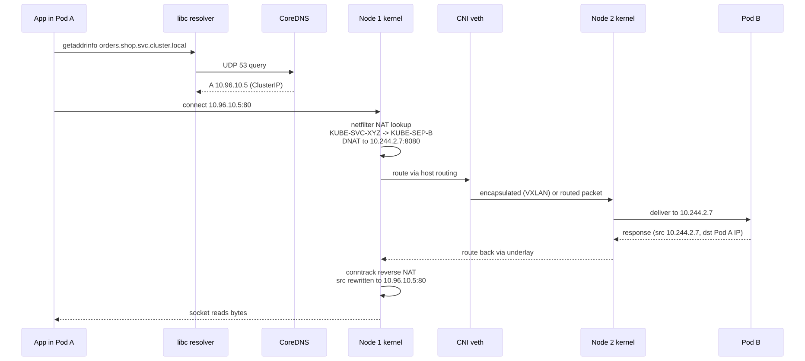
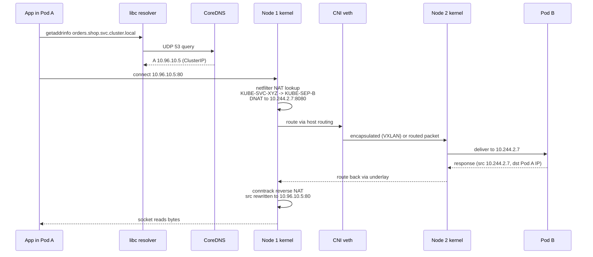

# Networking End-to-End — Pod to Service to Backend Pod

This is the canonical "what actually happens when a pod calls another pod's service" walkthrough. Every Kubernetes engineer should be able to draw this on a whiteboard.

---

## The Question

Pod A on Node 1 runs:
```bash
curl http://orders.shop.svc.cluster.local
```
What happens between the syscall and the response landing back?

---

## End-to-End Sequence

<!-- mermaid:rendered -->
<p align="center"></p>

<details><summary>Mermaid source</summary>



</details>

---

## Step-by-Step

### Step 1 — DNS Resolution
- App calls `getaddrinfo("orders.shop.svc.cluster.local")`
- libc reads `/etc/resolv.conf` → nameserver `10.96.0.10` (kube-dns ClusterIP)
- Query goes to CoreDNS (or NodeLocal DNSCache)
- CoreDNS `kubernetes` plugin resolves → returns `10.96.10.5` (the Service's ClusterIP)

### Step 2 — TCP Connect
- App calls `connect(10.96.10.5:80)`
- Kernel creates socket, generates SYN
- Packet enters netfilter `OUTPUT` → `nat` table → `KUBE-SERVICES` chain

### Step 3 — Service Translation (kube-proxy)
- iptables/ipvs/nftables rule matches dst `10.96.10.5:80`
- Round-robin selects backend, e.g. `KUBE-SEP-B`
- DNAT applied: dst becomes `10.244.2.7:8080`
- conntrack records the mapping

(If Cilium eBPF: this happens at the socket layer via `cgroup/connect4` BPF hook BEFORE the packet exists. Same outcome, different mechanism.)

### Step 4 — Routing Decision
- Kernel looks up `10.244.2.7` in routing table
- It's not a local pod → next-hop is the underlay route to Node 2 (or VXLAN tunnel)

### Step 5 — Cross-Node Transit
Two main models:

**Overlay (VXLAN, e.g. default Flannel):**
- Packet is encapsulated: outer IP src=Node1, dst=Node2, UDP 8472, inner IP src=Pod A, dst=10.244.2.7
- Travels underlay
- Node 2's kernel decapsulates

**Direct routing (Calico BGP, Cilium native routing):**
- Underlay router knows route to `10.244.2.0/24` via Node 2 (BGP advertised)
- Plain IP packet, no encap
- Lower overhead, requires routing-aware underlay

### Step 6 — Pod B Reception
- Node 2 kernel sees inner packet dst=10.244.2.7
- Routes to veth interface `caliXXXX` (or equivalent)
- veth's other end is Pod B's eth0
- Packet arrives in Pod B's netns, delivered to listening socket

### Step 7 — Response Path
- Pod B sends reply: src=10.244.2.7:8080, dst=Pod A IP
- Returns via Node 2's veth → routing → underlay → Node 1
- Node 1's kernel hits conntrack for the existing flow
- Reverse SNAT/DNAT: src rewritten back to `10.96.10.5:80` (so Pod A's socket sees the ClusterIP it dialed)
- Bytes delivered to Pod A's TCP socket

---

## What changes per CNI

| CNI | Cross-node | Service LB |
|---|---|---|
| Flannel | VXLAN encap | kube-proxy iptables |
| Calico (default) | BGP routing | kube-proxy iptables/ipvs |
| Calico eBPF | BGP routing | eBPF dataplane |
| Cilium | Direct or VXLAN/Geneve | eBPF socket-level |

---

## Edge Cases that confuse people

### Same-node pod-to-pod
Steps 4-6 are local. Packet goes pod veth → host bridge/route table → other pod veth. No encapsulation, no underlay.

### `externalTrafficPolicy: Local`
Affects NodePort/LoadBalancer. With `Cluster`, NodePort traffic SNATs to the node's IP and may hop nodes. With `Local`, only nodes with a backend pod accept (no extra hop, source IP preserved, but uneven LB).

### Service hairpin
Pod A connects to a Service whose only backend is Pod A itself. Default kernel rejects it ("hairpin"). CNI plugins enable hairpin-veth or use kube-proxy's `--masquerade-all` to fix.

### Headless service
ClusterIP=None → DNS returns pod IPs directly, no kube-proxy involved at all. Client picks backend.

### NetworkPolicy
Inserted between veth and routing — eBPF hook (Cilium) or iptables `cali-*` chain (Calico). Drops packet before it leaves the source pod.

---

## Common Failures Mapped to Steps

| Failure | Step | Diagnosis |
|---|---|---|
| `getaddrinfo` failed | 1 | CoreDNS down, broken resolv.conf, NetworkPolicy blocking DNS |
| Connection timeout | 3 | Service has no endpoints (selector mismatch), or kube-proxy crashed |
| Connection refused | 6 | Pod has IP but app not listening, or wrong port |
| Reply never arrives | 7 | Conntrack table full, asymmetric routing, MTU issue |
| Random connection resets | 7 | Conntrack timeout (TCP_TW), or pod restarted mid-flow |
| Works locally, fails cross-node | 5 | MTU mismatch (VXLAN), security group blocking 8472/UDP, BGP not peered |

---

## Diagnostic Commands

```bash
# Service has endpoints?
kubectl get endpointslice -l kubernetes.io/service-name=orders

# Pod can resolve DNS?
kubectl exec pod-a -- nslookup orders.shop

# Curl the ClusterIP from node:
ssh node1
curl 10.96.10.5

# kube-proxy programmed the rule?
iptables-save | grep KUBE-SVC

# Cross-node connectivity?
kubectl exec pod-a -- ping 10.244.2.7

# Conntrack?
conntrack -L | grep 10.96.10.5

# Cilium service map?
kubectl exec -n kube-system cilium-xxx -- cilium service list
```

---

## Interview Questions

**Q: Walk me through what happens when one pod calls another via a service.**
A: Use the diagram above. DNS lookup → ClusterIP → kernel netfilter DNAT (or eBPF socket translation) → route to backend node → cross-node transport (overlay or direct) → veth into target pod → reply path with reverse NAT.

**Q: Why does the source pod see the ClusterIP in its socket, even though the packet went to a real pod IP?**
A: Conntrack records the original 5-tuple. On reply, kernel rewrites src back to the original dst the client connected to. The client's TCP stack is none the wiser.

**Q: Cross-node pod-to-pod fails but same-node works. Where do you start?**
A: Underlay reachability between nodes (ping node-to-node), MTU (overlay needs lower pod MTU), CNI backend health (BGP peering or VXLAN module), security groups blocking VXLAN UDP 8472 or pod CIDR routing.

**Q: How does Cilium remove the conntrack overhead for east-west traffic?**
A: Service translation happens at socket connect() via eBPF, so the packet is born already addressed to the backend pod. No NAT happens on the data path, no conntrack entry needed for the cluster traffic — only for ingress that crosses node boundaries.

**Q: What's the difference between overlay and underlay routing?**
A: Overlay encapsulates pod packets (VXLAN, Geneve) inside underlay packets — works on any L3 network but adds 50-byte header and CPU cost. Underlay routing advertises pod CIDRs directly into the physical network (BGP), zero overhead but requires the network to participate.

---

## Sources

- Kubernetes networking model — https://kubernetes.io/docs/concepts/services-networking/
- Service implementation — https://kubernetes.io/docs/reference/networking/virtual-ips/
- Conntrack basics — https://conntrack-tools.netfilter.org/manual.html
- Cilium architecture — https://docs.cilium.io/en/stable/overview/component-overview/
- Calico routing modes — https://docs.tigera.io/calico/latest/networking/configuring/
