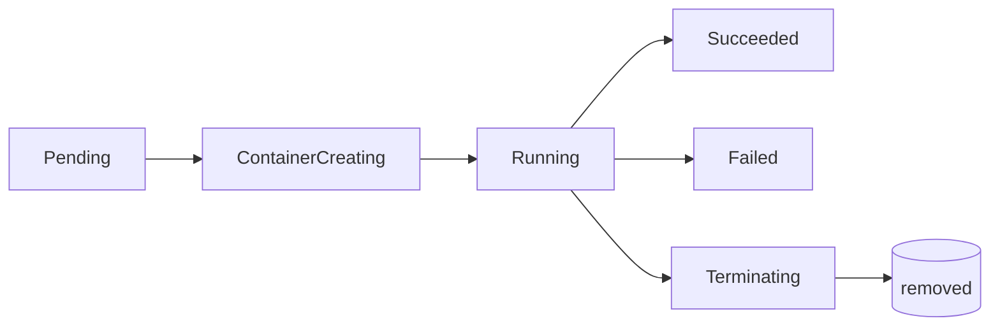
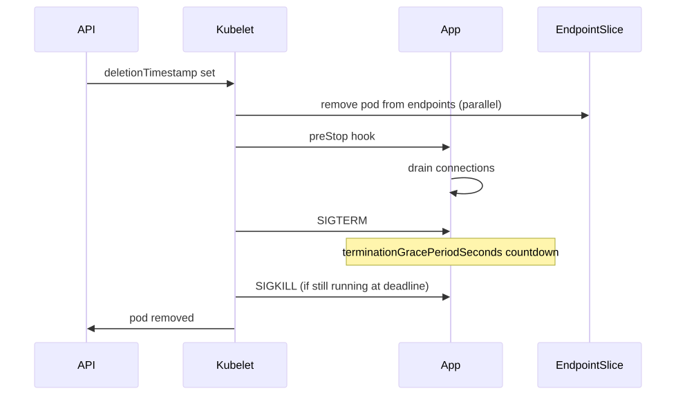
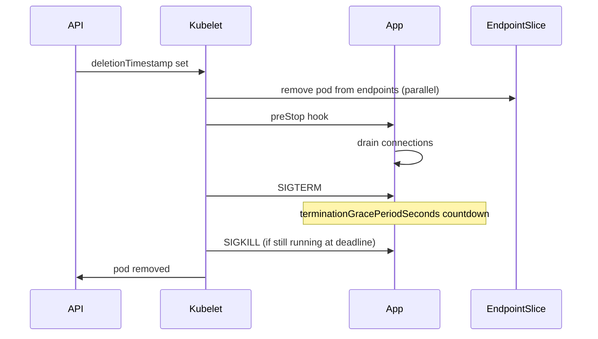

# Pod Lifecycle — Pending to Terminated

A Pod's life is a state machine. Each transition involves the kubelet, the runtime, the network plugin, the storage plugin, and probes. When a pod misbehaves, you debug by knowing exactly where it sits in this machine.

---

## Mental Model

<!-- mermaid:rendered -->
<p align="center"></p>

<details><summary>Mermaid source</summary>



</details>

Phase is a *coarse* status. The real story lives in `pod.status.conditions` (PodScheduled, Initialized, ContainersReady, Ready) and `pod.status.containerStatuses[].state` (waiting/running/terminated).

---

## Phase Walkthrough

### 1. Pending

Pod accepted by API server but not yet running. Three sub-states matter:

- **No node assigned** — scheduler hasn't picked one. Causes: insufficient resources, taints not tolerated, node selectors/affinity unsatisfied, PVC not bound.
- **Image pulling** — `ContainerCreating` reason `ContainerCreating`. Slow registry, ImagePullBackOff if creds wrong.
- **CNI provisioning** — sandbox created but network not ready. Failure: `NetworkPluginNotReady`.

Debug: `kubectl describe pod` → look at Events.

### 2. ContainerCreating

Sandbox container exists, app containers being pulled and started. Volumes mounting. Init containers running.

### 3. Running

At least one container is running OR is starting/restarting. **Note:** "Running" doesn't mean "Ready". Readiness probes determine traffic eligibility.

### 4. Succeeded

All containers exited with code 0 and won't restart. Only with `restartPolicy: OnFailure` or `Never`.

### 5. Failed

All containers terminated, at least one failed. With `restartPolicy: Always`, you'd see CrashLoopBackOff in Running phase rather than this terminal state.

### 6. Unknown (rare)

API server can't reach the kubelet on the pod's node.

---

## Init Containers

Run sequentially before app containers. Each must exit 0 before the next starts. Common uses:

- Wait for a dependency (`until nslookup db; do sleep 1; done`)
- Pre-populate a shared volume (clone git repo, download config)
- Run schema migrations
- Set up sidecar config files

```yaml
spec:
  initContainers:
    - name: wait-db
      image: busybox
      command: ['sh', '-c', 'until nc -z db 5432; do sleep 2; done']
  containers:
    - name: app
      image: myapp:1.0
```

Failure of an init container blocks the pod; restart per `restartPolicy`.

---

## Native Sidecar Containers (1.29 beta, 1.33+ GA)

Before 1.29: sidecars were just regular containers — they had to handle their own lifecycle, and Jobs hung when the sidecar didn't exit.

Now: declare a sidecar as a special init container with `restartPolicy: Always`.

```yaml
spec:
  initContainers:
    - name: log-shipper
      image: fluent-bit
      restartPolicy: Always   # <- makes it a sidecar
  containers:
    - name: app
      image: myapp:1.0
```

**Guarantees:**
- Sidecar starts BEFORE main containers (init container ordering)
- Sidecar terminates AFTER main containers (reverse-order shutdown)
- Job pods complete cleanly even with running sidecars
- preStop hooks honored on sidecars

---

## Probes — liveness, readiness, startup

| Probe | What it controls | Failure consequence |
|---|---|---|
| **liveness** | Is the container healthy? | Container is killed and restarted (per restartPolicy) |
| **readiness** | Should it receive traffic? | Pod removed from Service Endpoints (no restart) |
| **startup** | Has it finished starting up? | Liveness/readiness deferred until startup passes |

Startup probe exists so slow-starting JVM apps don't get killed by an aggressive liveness probe during warmup.

```yaml
startupProbe:
  httpGet: { path: /healthz, port: 8080 }
  failureThreshold: 30
  periodSeconds: 10   # 5 minutes total grace
livenessProbe:
  httpGet: { path: /healthz, port: 8080 }
  periodSeconds: 10
readinessProbe:
  httpGet: { path: /ready, port: 8080 }
  periodSeconds: 5
```

---

## Termination Flow

When you `kubectl delete pod`:

<!-- mermaid:rendered -->
<p align="center"></p>

<details><summary>Mermaid source</summary>



</details>

Key params:

- **terminationGracePeriodSeconds** (default 30) — total time from deletion to SIGKILL
- **preStop hook** — runs BEFORE SIGTERM; counts against grace period
- **SIGTERM** — app should drain and exit
- **SIGKILL** — sent at the deadline, no grace

**Common pattern — graceful shutdown:**

```yaml
lifecycle:
  preStop:
    exec:
      command: ['sh', '-c', 'sleep 15']  # let endpoints propagate
terminationGracePeriodSeconds: 60
```

The `sleep` gives kube-proxy / ingress controllers time to remove this pod from rotation before traffic is cut. Without it, in-flight requests get connection-refused.

---

## restartPolicy

| Policy | Behavior | Use |
|---|---|---|
| Always | Restart on any exit | Default for Deployments, StatefulSets |
| OnFailure | Restart only on non-zero exit | Job that should retry on failure |
| Never | No restart | Job that should fail-fast |

CrashLoopBackOff isn't a state — it's the kubelet exponentially backing off restarts (10s, 20s, 40s, ..., max 5m).

---

## Common Failures

| State | Reason | Likely cause |
|---|---|---|
| Pending | `Unschedulable` | No node fits resources/taints/affinity |
| Pending | `FailedScheduling` (PVC) | StorageClass missing or provisioner broken |
| ContainerCreating | `ImagePullBackOff` | Wrong image name, missing pull secret |
| ContainerCreating | `CreateContainerConfigError` | Missing ConfigMap/Secret referenced by env |
| Running not Ready | readiness fails | App not listening, wrong port, slow start |
| CrashLoopBackOff | exit 1/2/137 | App crashing or OOMKilled (137 = SIGKILL) |
| Terminating forever | finalizer set, controller gone | Manually patch out the finalizer |

---

## Interview Questions

**Q: Pod stuck Terminating — how do you fix it?**
A: Check `pod.metadata.finalizers`. A controller (or operator) is supposed to clean up but isn't. Either fix the controller or `kubectl patch pod X --type=merge -p '{"metadata":{"finalizers":[]}}'` as a last resort.

**Q: What's the difference between liveness and readiness?**
A: Liveness failure restarts the container (says "you're dead, reboot"). Readiness failure removes from Service endpoints (says "you're alive but busy, no traffic"). A misconfigured liveness probe causes a restart loop; a misconfigured readiness probe just hides the pod from traffic.

**Q: Why use a startup probe?**
A: Slow-starting apps (JVM, Rails). Without it, you'd need a long `initialDelaySeconds` on liveness, which delays detecting actual hangs once it's running. Startup probe lets liveness be aggressive after startup.

**Q: How do native sidecars (1.29+) differ from regular sidecar containers?**
A: Native sidecars are init containers with `restartPolicy: Always`. They're guaranteed to start before app containers and shut down after them. Crucially, Job pods complete properly even when sidecars are running — fixed a long-standing pain point.

**Q: What's `terminationGracePeriodSeconds` and why include a preStop sleep?**
A: It's the time from SIGTERM (or preStop start) to SIGKILL. The preStop sleep lets endpoint propagation happen — kube-proxy/ingress rules need a few seconds to remove this pod, otherwise new traffic still arrives mid-shutdown.

**Q: Why is my pod Running but not Ready?**
A: Readiness probe failing. Check the probe definition vs what the app actually serves. Common: probe hits `/health` but app serves `/healthz`, or wrong port, or app needs DB connection that's down.

---

## Sources

- Pod lifecycle — https://kubernetes.io/docs/concepts/workloads/pods/pod-lifecycle/
- Init containers — https://kubernetes.io/docs/concepts/workloads/pods/init-containers/
- Sidecar containers (1.29+) — https://kubernetes.io/docs/concepts/workloads/pods/sidecar-containers/
- Probes — https://kubernetes.io/docs/tasks/configure-pod-container/configure-liveness-readiness-startup-probes/
- Termination — https://kubernetes.io/docs/concepts/workloads/pods/pod-lifecycle/#pod-termination
