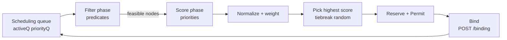
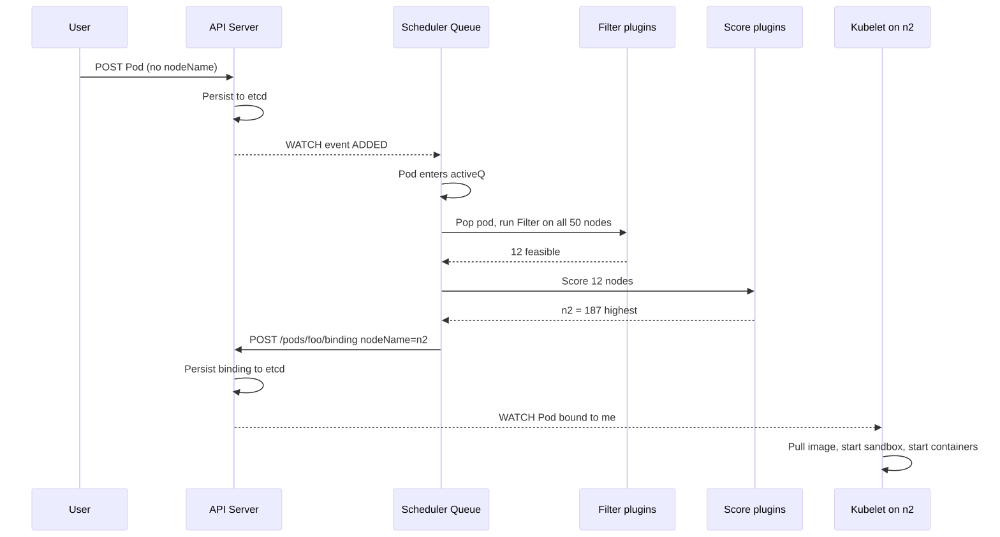
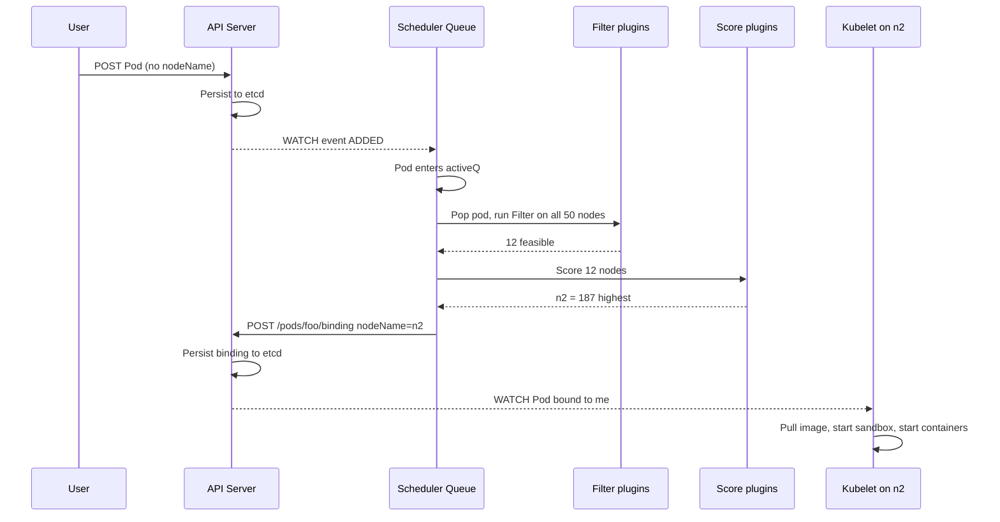

# Scheduler Scoring

> How `kube-scheduler` chooses the node a Pod runs on, end to end. The 1.30+ scheduler is **Scheduler Framework** only — the legacy `policy.cfg` and predicate/priority configs are gone.

## Why this matters

Misunderstanding the scheduler causes pods to "stick in Pending" with no obvious reason, hot nodes to stay hot, and topology constraints to be silently ignored. Every platform engineer eventually has to debug a scheduling decision — and the only way to do that is to know which plugin is running at which extension point.

## Mental model

The scheduler is a **two-phase pipeline per Pod**:

<!-- mermaid:rendered -->
<p align="center"></p>

<details><summary>Mermaid source</summary>



</details>

- **Filter phase** = "is this node *able* to run the pod?" Boolean. Yes/no.
- **Score phase** = "*how good* is this node?" 0-100 per plugin, weighted, summed.

Filter eliminates infeasible nodes. Score ranks the survivors. The winner is bound via a `POST /api/v1/namespaces/X/pods/Y/binding` — a separate REST call that writes only `spec.nodeName`.

## Scheduler Framework: extension points

The framework defines extension points ("plugin types") that fire in order. Each built-in scheduler behavior is a plugin.

| # | Extension point | Purpose |
|---|-----------------|---------|
| 1 | QueueSort | Order pods in scheduling queue (default: priority then arrival) |
| 2 | PreFilter | Compute pod-level state used by Filter (e.g. resource request totals) |
| 3 | Filter | Reject infeasible nodes (predicates) |
| 4 | PostFilter | Run when no node passed Filter — Preemption lives here |
| 5 | PreScore | Compute pre-score state across feasible nodes |
| 6 | Score | Score each feasible node 0-100 |
| 7 | NormalizeScore | Rescale scores within a plugin |
| 8 | Reserve | Reserve resources on chosen node (revertible) |
| 9 | Permit | Approve, deny, or wait (used by gang scheduling) |
| 10 | PreBind | Run before binding (e.g. provision PV) |
| 11 | Bind | Issue the actual Bind API call |
| 12 | PostBind | Cleanup / notify after successful bind |

## Built-in plugins (1.30+)

| Plugin | Extension points | What it does |
|--------|------------------|--------------|
| `NodeResourcesFit` | PreFilter, Filter, Score | CPU/memory/ephemeral-storage requests vs Allocatable. Score = `LeastAllocated` (default), `MostAllocated`, or `RequestedToCapacityRatio` |
| `NodeAffinity` | Filter, Score | `nodeAffinity` and `nodeSelector` |
| `PodTopologySpread` | PreFilter, Filter, Score | `topologySpreadConstraints`; replaced legacy `EvenPodsSpread` |
| `InterPodAffinity` | PreFilter, Filter, Score | `podAffinity` / `podAntiAffinity` |
| `TaintToleration` | Filter, Score | `NoSchedule` / `PreferNoSchedule` taints |
| `VolumeBinding` | PreFilter, Filter, Reserve, PreBind | WaitForFirstConsumer PVCs |
| `VolumeRestrictions` | Filter | RWO PVC already attached elsewhere? |
| `NodeUnschedulable` | Filter | Honors `spec.unschedulable` (cordon) |
| `NodeName` | Filter | Pod with `spec.nodeName` set: only that node passes |
| `NodePorts` | PreFilter, Filter | hostPort conflicts |
| `ImageLocality` | Score | Prefers nodes that already have the image |
| `DefaultPreemption` | PostFilter | Evicts lower-priority pods to make room |
| `SchedulingGates` | PreEnqueue | Blocks pods with `spec.schedulingGates` from entering queue |

## Profiles (multiple schedulers in one binary)

A **profile** is a named bundle of plugins and weights. One scheduler binary can run many profiles; pods select via `spec.schedulerName`.

```yaml
apiVersion: kubescheduler.config.k8s.io/v1
kind: KubeSchedulerConfiguration
profiles:
- schedulerName: default-scheduler
  plugins:
    score:
      enabled:
      - name: NodeResourcesFit
        weight: 1
      - name: PodTopologySpread
        weight: 2
      disabled:
      - name: ImageLocality
  pluginConfig:
  - name: NodeResourcesFit
    args:
      scoringStrategy:
        type: LeastAllocated
        resources:
        - name: cpu
          weight: 1
        - name: memory
          weight: 1

- schedulerName: bin-pack-scheduler
  plugins:
    score:
      enabled:
      - name: NodeResourcesFit
        weight: 1
  pluginConfig:
  - name: NodeResourcesFit
    args:
      scoringStrategy:
        type: MostAllocated  # bin-packing
```

Pod opts in:

```yaml
spec:
  schedulerName: bin-pack-scheduler
```

## Scoring math

Each Score plugin returns 0-100 per node. The framework:

1. Calls `NormalizeScore` on each plugin to rescale (optional).
2. Multiplies by plugin weight.
3. Sums across all plugins per node.
4. Picks the highest. Random tiebreak among nodes within 0 of max.

Example with two plugins:

| Node | NodeResourcesFit (w=1) | PodTopologySpread (w=2) | Total |
|------|------------------------|--------------------------|-------|
| n1   | 80                     | 50 -> 100               | 180   |
| n2   | 60                     | 50 -> 100               | 160   |
| n3   | 90                     | 0                        | 90    |

n1 wins.

## Walkthrough: where does Pod foo land?

<!-- mermaid:rendered -->
<p align="center"></p>

<details><summary>Mermaid source</summary>



</details>

If Filter returns zero feasible nodes, **PostFilter** fires. The default-preemption plugin looks for lower-priority pods on candidate nodes whose eviction would make this pod schedulable, and issues a deletion with a grace period. The pod returns to the queue and tries again next cycle.

## Performance: percentageOfNodesToScore

On clusters with thousands of nodes, scoring every node is wasteful. Set:

```yaml
profiles:
- schedulerName: default-scheduler
  percentageOfNodesToScore: 50  # only score half the feasible nodes
```

Default is adaptive: `max(5, 50 - cluster_size/125)` percent, with a minimum of 100 nodes. The scheduler iterates through nodes in a round-robin to ensure fairness across cycles.

## Common pitfalls

> [!WARNING] Gotchas
> - **`requests` not `limits` drive scheduling**. Setting only `limits` means request defaults to limit (only with LimitRange) or zero — leading to bin-packing surprises.
> - **`topologySpreadConstraints` with `whenUnsatisfiable: DoNotSchedule`** can pin pods Pending forever if the topology is impossible. Use `ScheduleAnyway` for soft.
> - **Pod priority + preemption** ignores PDBs in the *decision* but respects them at *eviction time* — kind of. Actually, preemption only honors PDBs as a best-effort signal; if no other choice, it preempts anyway.
> - **`schedulerName` typo**: the pod stays Pending silently. There's no validation that the named scheduler exists.
> - **Volume zone affinity** is enforced by `VolumeBinding` plugin: a pod with a PVC in zone `us-east-1a` cannot land in `us-east-1b`. Common cause of "Pending after node failure."
> - **Custom scheduler weights summing too high** can drown out important signals. Keep weights in the 1-10 range.
> - **`SchedulingGates`** (1.27+ stable in 1.30): a pod with non-empty `spec.schedulingGates` will not even be considered. Useful but easy to forget.
> - **Image locality** can cause "first scheduled wins" stickiness — once a node has the image, it scores higher than peers, perpetuating imbalance.

## Interview Q&A

> [!NOTE] Common interview questions
>
> **Q1: Walk me through what happens between `kubectl run` and a container starting on a node.**
> kubectl -> API server (auth/authz/admission) -> etcd write -> scheduler watches new pods -> Filter -> Score -> Bind (write `spec.nodeName`) -> kubelet on that node watches its pods -> CRI calls to runtime -> CNI for network -> containers start.
>
> **Q2: A pod is stuck Pending. How do you diagnose?**
> `kubectl describe pod` -> Events. Common causes: insufficient resources (Filter), no matching node selector/affinity, taint not tolerated, PVC unbound, scheduler down, FailedScheduling messages naming the failing predicate. `kubectl get events --field-selector involvedObject.name=foo`.
>
> **Q3: Filter vs Score?**
> Filter is hard — node either can or cannot run the pod. Score is soft — ranks feasible nodes. Filter eliminates, Score chooses among survivors.
>
> **Q4: How does preemption work?**
> When Filter returns zero nodes, PostFilter (default-preemption plugin) finds nodes where evicting lower-priority pods would make space. Marks victims for deletion with grace period, sets `nominatedNodeName` on the high-priority pod, and re-queues. Next cycle it usually fits.
>
> **Q5: What changed in the Scheduler Framework vs the legacy scheduler?**
> Legacy had hardcoded predicates and priorities, configurable via JSON `policy.cfg`. Framework is plugin-based with extension points; everything (including built-ins) is a plugin. Multi-profile support, better extensibility, mandatory in 1.25+.
>
> **Q6: How would you implement a custom scheduling rule?**
> Write a plugin satisfying the relevant extension-point interface (e.g. `framework.FilterPlugin`), register it via `Registry`, and add it to a profile in `KubeSchedulerConfiguration`. Run as a separate scheduler binary or compile into kube-scheduler.
>
> **Q7: Two pods with anti-affinity for `app=web`. How does the scheduler handle them?**
> The InterPodAffinity Filter rejects nodes that already host a matching pod. With `requiredDuringSchedulingIgnoredDuringExecution`, no node hosting another `app=web` is feasible. With `preferred`, it's a Score penalty.
>
> **Q8: PodTopologySpread vs InterPodAntiAffinity?**
> Spread allows balanced distribution across topology keys (e.g. zones) with a `maxSkew`. AntiAffinity is binary "no other matching pod here." Spread is more expressive and cheaper to evaluate at scale.
>
> **Q9: What's `nominatedNodeName`?**
> Set by preemption: "this pod will go to node N once victims drain." Visible in pod status, helps debugging.
>
> **Q10: What's the cost of `requiredDuringSchedulingIgnoredDuringExecution` vs `requiredDuringSchedulingRequiredDuringExecution`?**
> Only the first exists today. The second was a proposal that would re-evaluate at runtime and evict — never implemented because of complexity. So affinity is enforced *only at scheduling time*; if labels change later, pods are not evicted.

## Sources

- Kubernetes docs — Scheduling: https://kubernetes.io/docs/concepts/scheduling-eviction/
- Scheduler Framework KEP-624: https://github.com/kubernetes/enhancements/tree/master/keps/sig-scheduling/624-scheduling-framework
- Source: https://github.com/kubernetes/kubernetes/tree/master/pkg/scheduler
- Plugin docs: https://kubernetes.io/docs/reference/scheduling/config/
- Scheduling Gates KEP-3521: https://github.com/kubernetes/enhancements/tree/master/keps/sig-scheduling/3521-pod-scheduling-readiness
- SIG Scheduling: https://github.com/kubernetes/community/tree/master/sig-scheduling
