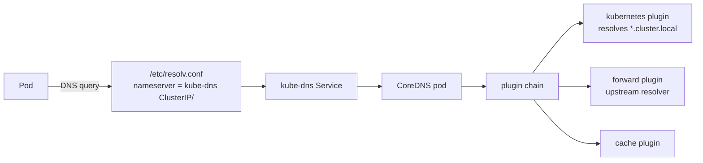
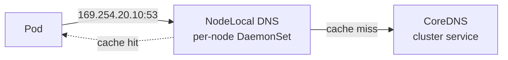

# Service Discovery & CoreDNS

In Kubernetes, every service gets a DNS name. Behind that simplicity sits CoreDNS — a pluggable, chained DNS server that serves the cluster's namespace. Understanding its plugin chain is the difference between debugging "DNS is slow" in 5 minutes vs 5 hours.

---

## Mental Model

<!-- mermaid:rendered -->
<p align="center"></p>

<details><summary>Mermaid source</summary>



</details>

Every pod's `/etc/resolv.conf` points at the kube-dns ClusterIP (typically `10.96.0.10`). That ClusterIP fronts CoreDNS pods. CoreDNS handles the query through its plugin chain.

---

## Pod resolv.conf Anatomy

```text
nameserver 10.96.0.10
search myns.svc.cluster.local svc.cluster.local cluster.local
options ndots:5
```

- **search** — domain suffixes appended for short names
- **ndots:5** — if the queried name has fewer than 5 dots, try search domains FIRST before treating it as absolute

This `ndots:5` is famous for slow DNS. `api.example.com` (2 dots) gets queried as:
1. `api.example.com.myns.svc.cluster.local` (NXDOMAIN)
2. `api.example.com.svc.cluster.local` (NXDOMAIN)
3. `api.example.com.cluster.local` (NXDOMAIN)
4. `api.example.com.` (success)

Four queries instead of one. Fix: trailing dot (`api.example.com.`) or `dnsConfig.options: [{name: ndots, value: "1"}]`.

---

## Service DNS Names

| Service Type | DNS Name | Returns |
|---|---|---|
| ClusterIP | `<svc>.<ns>.svc.cluster.local` | A record → ClusterIP |
| Headless (clusterIP: None) | `<svc>.<ns>.svc.cluster.local` | A records → all pod IPs |
| Headless StatefulSet pod | `<pod>.<svc>.<ns>.svc.cluster.local` | A record → that pod's IP |
| ExternalName | `<svc>.<ns>.svc.cluster.local` | CNAME → external host |
| SRV record | `_<port>._<proto>.<svc>.<ns>.svc.cluster.local` | port + target |

---

## CoreDNS Corefile

The config is a chain — order matters. Each "block" applies to a zone.

```text
.:53 {
    errors
    health {
       lameduck 5s
    }
    ready
    kubernetes cluster.local in-addr.arpa ip6.arpa {
       pods insecure
       fallthrough in-addr.arpa ip6.arpa
       ttl 30
    }
    prometheus :9153
    forward . /etc/resolv.conf {
       max_concurrent 1000
    }
    cache 30
    loop
    reload
    loadbalance
}
```

**Plugin order — read top to bottom:**

1. **errors** — log errors
2. **health** — `/health` endpoint for liveness probe
3. **ready** — `/ready` endpoint, returns 200 only when all plugins are ready
4. **kubernetes** — answers `*.cluster.local` from API server watch cache
5. **prometheus** — exposes metrics
6. **forward** — fallback for non-cluster names → upstream nameserver
7. **cache** — TTL-based cache (default 30s)
8. **loop** — detect resolver loops
9. **reload** — auto-reload Corefile changes
10. **loadbalance** — randomize A record order in responses

---

## Walkthrough — Pod queries `api.myns.svc.cluster.local`

1. Pod libc calls `getaddrinfo("api.myns")` — appends search domain
2. Query sent to `10.96.0.10:53` (kube-dns)
3. kube-proxy DNATs to a CoreDNS pod
4. CoreDNS receives query → enters plugin chain
5. **kubernetes** plugin matches zone `cluster.local` → looks up Service in watched cache → returns ClusterIP
6. **cache** plugin stores result for TTL=30s
7. Response sent back

If the same pod queries `google.com`:
1. kubernetes plugin doesn't match → falls through
2. **forward** plugin sends query to upstream (`/etc/resolv.conf` from CoreDNS's host)
3. cache stores result

---

## NodeLocal DNSCache

A DaemonSet that runs a DNS cache on every node, listening on a link-local IP (typically `169.254.20.10`). Pods are configured (via kubelet `--cluster-dns`) to query this local cache first.

<!-- mermaid:rendered -->
<p align="center"></p>

<details><summary>Mermaid source</summary>



</details>

**Why use it:**
- Eliminates conntrack entries for cluster DNS (UDP DNS through kube-proxy creates conntrack entries that fill the table at scale)
- Sub-ms cache hits, no inter-node hop
- Survives CoreDNS restarts (queries served from local cache)
- Solves the [Linux kernel DNAT race condition](https://github.com/kubernetes/kubernetes/issues/56903) for UDP

**Setup:** deploy `node-local-dns` DaemonSet, configure kubelet `--cluster-dns=169.254.20.10`. Each node's iptables intercepts DNS to the link-local IP.

---

## Common DNS Failures

| Symptom | Cause | Fix |
|---|---|---|
| 5-second DNS lookups | UDP/IPv6 race in kernel | NodeLocal DNSCache, or use TCP, or `single-request-reopen` in resolv.conf |
| Random NXDOMAIN | CoreDNS pod restarted, cache cleared | Increase replicas, autoscale by CPU |
| All DNS broken | CoreDNS down or kubernetes plugin can't reach API server | Check CoreDNS logs, RBAC for `coredns` ServiceAccount |
| Slow external DNS | upstream resolver slow | Add a more aggressive `cache` block for external zones |
| `loop` plugin shouts | CoreDNS forwarding to itself | Fix `/etc/resolv.conf` on host (don't point at the same CoreDNS) |

---

## Scaling CoreDNS

Default deployment is 2 replicas — fine for small clusters, breaks at scale.

- **HPA** — scale on CPU; `cluster-proportional-autoscaler` scales on node count
- **Anti-affinity** — spread replicas across nodes
- **PodDisruptionBudget** — `minAvailable: 1` to survive rolling node updates
- **Cache TTL** — bump from 30s to 300s for stable services
- **Negative cache** — `cache 30 { denial 9984 5 }` to cache NXDOMAIN

---

## Interview Questions

**Q: Why does my pod take 5 seconds to resolve a service?**
A: Classic Linux kernel race in UDP conntrack with parallel A/AAAA queries (musl, glibc). The kernel drops one of the conntrack entries. Fix: NodeLocal DNSCache eliminates the conntrack hop, or set `options single-request-reopen` in pod resolv.conf.

**Q: What does `ndots:5` do and why does it matter?**
A: Names with fewer than 5 dots are treated as relative — search domains are appended first. External lookups become 4+ queries. Mitigate with FQDN (trailing dot) or set `ndots:1` via `dnsConfig`.

**Q: How does CoreDNS know about Services?**
A: The `kubernetes` plugin uses client-go to watch Services and Endpoints from the API server. Updates land in an in-memory cache. No polling, push-driven.

**Q: When would you use a headless service?**
A: When clients need to connect to specific pods (StatefulSet members like Cassandra, Kafka brokers) or do their own client-side load balancing. Headless returns all pod IPs as A records.

**Q: NodeLocal DNSCache — what problem does it solve?**
A: (1) Eliminates DNAT-induced conntrack entries for DNS, (2) avoids the 5-second UDP race, (3) provides resilience during CoreDNS restarts, (4) cuts query latency to local-cache speed.

**Q: How do you debug "intermittent DNS failure"?**
A: Check CoreDNS pod logs (`kubectl logs -n kube-system -l k8s-app=kube-dns`), CoreDNS Prometheus metrics (`coredns_dns_request_count_total`), conntrack table fill (`conntrack -C`), and run `dig` from inside a pod with `+trace`.

---

## Sources

- CoreDNS plugins — https://coredns.io/plugins/
- Kubernetes DNS spec — https://github.com/kubernetes/dns/blob/master/docs/specification.md
- NodeLocal DNSCache — https://kubernetes.io/docs/tasks/administer-cluster/nodelocaldns/
- Pod DNS config — https://kubernetes.io/docs/concepts/services-networking/dns-pod-service/
- 5-second DNS bug — https://www.weave.works/blog/racy-conntrack-and-dns-lookup-timeouts
