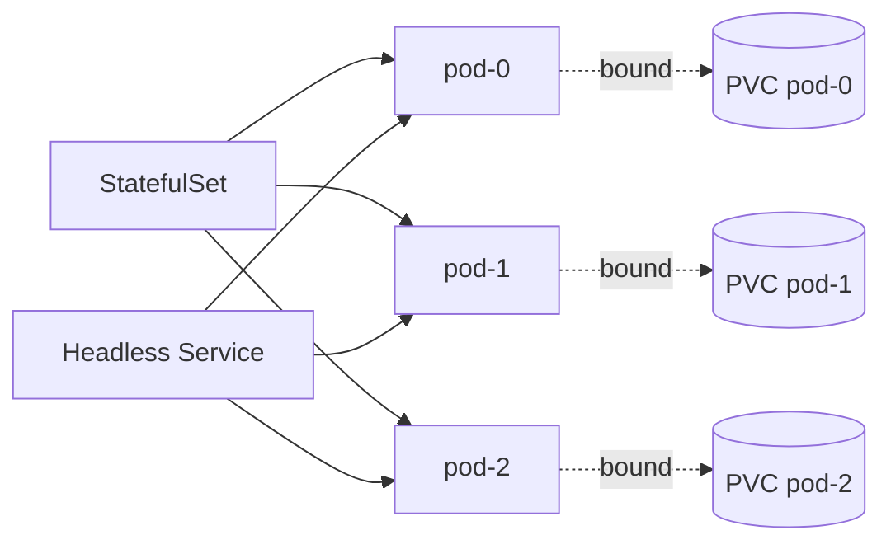
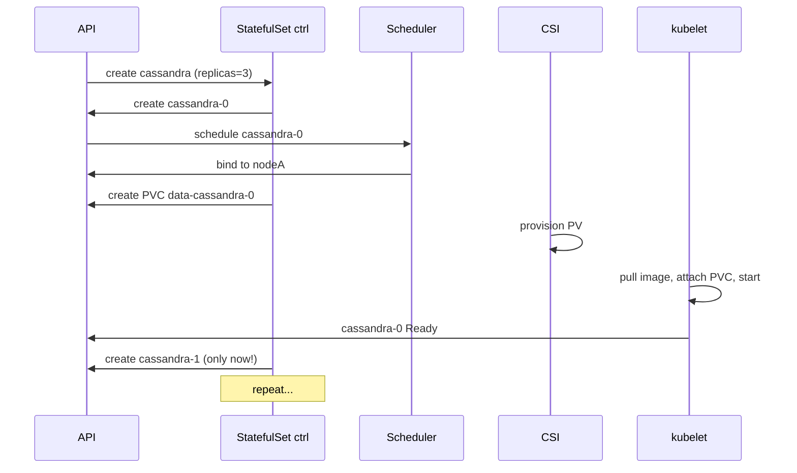

# StatefulSet Guarantees — and Where They Bite

StatefulSets exist because not every workload is a fungible cattle pod. Databases, brokers, and quorum-based systems need stable identity, ordered startup, and durable storage. The guarantees are clear; the gotchas are not.

---

## Mental Model



Each pod has a stable, ordinal name (`<sts>-0`, `<sts>-1`, …) and a stable DNS name through a headless Service.

---

## The Four Guarantees

### 1. Stable Network Identity

Pod hostname = `<sts-name>-<ordinal>`. With a headless Service named `<svc>`:

```
<sts>-0.<svc>.<ns>.svc.cluster.local
<sts>-1.<svc>.<ns>.svc.cluster.local
```

Resolves to that specific pod's IP. Survives reschedules — pod IP changes, DNS name doesn't.

### 2. Stable Storage

Each pod gets its own PVC, generated from `volumeClaimTemplates`:

```yaml
spec:
  volumeClaimTemplates:
    - metadata: { name: data }
      spec:
        accessModes: [ReadWriteOnce]
        resources: { requests: { storage: 10Gi } }
```

PVC name pattern: `<template>-<sts>-<ordinal>` → `data-mysql-0`. When `mysql-0` is rescheduled, it reattaches to `data-mysql-0`.

### 3. Ordered Startup & Termination

Default `podManagementPolicy: OrderedReady`:
- Pod N+1 doesn't start until Pod N is Ready
- During scale-down, highest ordinal terminated first
- During rolling update, highest ordinal updated first

Alternative: `podManagementPolicy: Parallel` — all pods start in parallel (faster, but loses ordering).

### 4. Ordered, Graceful Deployment & Scaling

Apply changes pod-by-pod. `partition` field on update strategy lets you canary specific ordinals:

```yaml
updateStrategy:
  type: RollingUpdate
  rollingUpdate:
    partition: 2  # only pods with ordinal >= 2 are updated
```

---

## PVC Retention (1.27+)

By default, PVCs survive StatefulSet deletion. New field controls this:

```yaml
spec:
  persistentVolumeClaimRetentionPolicy:
    whenDeleted: Retain   # or Delete
    whenScaled: Retain    # or Delete
```

`whenScaled: Delete` removes PVCs when scaling down. Powerful for ephemeral workloads (think Spark workers), dangerous for databases.

---

## Walkthrough — Cassandra StatefulSet



If `cassandra-0` never goes Ready, `cassandra-1` is never created. This is a feature, not a bug — but it can mask why your StatefulSet stalled.

---

## Common Gotchas

### Stuck on the first pod
`cassandra-0` Pending → entire StatefulSet stalled. Fix the readiness probe or resource request, or use `podManagementPolicy: Parallel` if order doesn't matter.

### Headless Service mistake
StatefulSet references `serviceName: cassandra`, but the Service has a ClusterIP. DNS for `cassandra-0.cassandra` won't resolve. Fix: `clusterIP: None` on the Service.

### PVC orphaning
Delete the StatefulSet → PVCs remain (good for safety). Re-create with same name → reuses PVCs (great for upgrades). But if you change `volumeClaimTemplates`, K8s won't update existing PVCs — you must manually delete them.

### Resize PVC
You can edit PVC size if StorageClass `allowVolumeExpansion: true`. But the StatefulSet's `volumeClaimTemplates` won't update (immutable fields). New pods at scale-up will use OLD size unless you recreate the STS.

### Node failure → stuck pod
If a node goes NotReady, the pod stays Terminating forever (because we mustn't risk two pods on the same volume — RWO!). Fix: `kubectl delete pod --force --grace-period=0` only AFTER you're certain the node is truly dead, otherwise split-brain.

### Rolling update can't progress
Update strategy is `OrderedReady`, an updated pod fails readiness, the rollout halts. Use `partition` for canary, or fix the readiness probe.

### Scale-down doesn't release PVCs (default)
With `whenScaled: Retain`, scaling 5→3 leaves PVCs `data-foo-3` and `data-foo-4`. Scaling back to 5 reuses them. Some operators rely on this; others want `whenScaled: Delete`.

---

## StatefulSet vs Deployment — when to use which

| Need | StatefulSet | Deployment |
|---|---|---|
| Stable hostname | yes | no |
| Per-pod persistent storage | yes | manual |
| Ordered start | yes | no |
| Quorum systems (etcd, Zookeeper) | yes | no |
| Stateless web app | overkill | yes |
| Databases | yes (or operator) | no |

---

## Operators usually beat raw StatefulSets

For real production databases use an operator (CloudNativePG for Postgres, Strimzi for Kafka, KubeDB, Vitess). They handle:
- Failover
- Backup orchestration
- Schema/version upgrades
- Read replica setup

A raw StatefulSet handles identity and storage. It does NOT handle "primary failed, promote replica."

---

## Interview Questions

**Q: Why use a StatefulSet for Kafka but Deployment for nginx?**
A: Kafka brokers have identity — broker.id 0, 1, 2 each own specific partitions. They need stable hostnames so other brokers can find them, and stable storage for log segments. nginx is stateless; any replica can serve any request.

**Q: What happens if a StatefulSet pod's node dies?**
A: Pod stays Terminating because Kubernetes can't safely re-schedule a RWO PVC if it might still be attached. Operators often automate node-fence detection; otherwise admin manually force-deletes after verifying the node is gone.

**Q: How does ordered termination work?**
A: Reverse order — highest ordinal first. Each pod gets its termination grace period before the next one starts terminating. Lets quorum systems hand off leadership cleanly.

**Q: Can two StatefulSet pods share a PVC?**
A: No. Each pod claims its own PVC from the template. If you need shared state, use a separate ReadWriteMany volume mounted into all pods (CephFS, EFS, NFS) outside the template.

**Q: How do you do a canary update on a 10-replica StatefulSet?**
A: Set `partition: 9` — only pod-9 updates. Verify, then drop to `partition: 8`, etc. Rollback by reverting the image and the controller updates higher ordinals back.

**Q: Why is my StatefulSet stuck at 0/3 replicas?**
A: Pod-0 isn't Ready. Default OrderedReady halts. Check pod-0 events, probes, PVC binding. If you don't actually need ordering (e.g., stateless workers using stable storage), switch to `podManagementPolicy: Parallel`.

---

## Sources

- StatefulSet — https://kubernetes.io/docs/concepts/workloads/controllers/statefulset/
- StatefulSet basics tutorial — https://kubernetes.io/docs/tutorials/stateful-application/basic-stateful-set/
- PVC retention policy — https://kubernetes.io/docs/concepts/workloads/controllers/statefulset/#persistentvolumeclaim-retention
- Headless services — https://kubernetes.io/docs/concepts/services-networking/service/#headless-services
- Force-deleting StatefulSet pods — https://kubernetes.io/docs/tasks/run-application/force-delete-stateful-set-pod/
