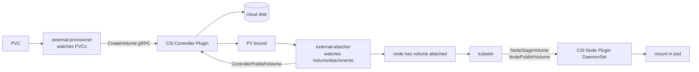
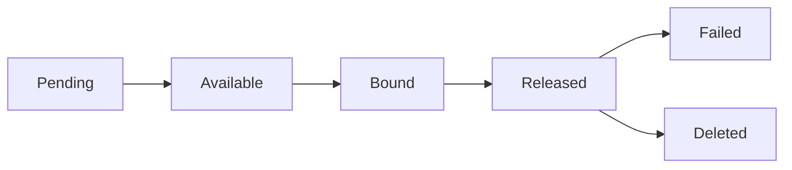

# Storage CSI Flow — Provisioner, Attacher, Mounter

The Container Storage Interface (CSI) replaced in-tree volume drivers and turned storage into a pluggable, out-of-tree concern. Understanding the sidecar architecture is essential for debugging "why is my PVC stuck Pending."

---

## Mental Model

<!-- mermaid:rendered -->
<p align="center"></p>

<details><summary>Mermaid source</summary>



</details>

There are two CSI plugin instances per driver:
- **Controller plugin** (Deployment/StatefulSet) — handles volume lifecycle (create, delete, attach, detach, snapshot)
- **Node plugin** (DaemonSet on every node) — handles mount/unmount inside the kubelet's view

Around them, K8s sidecar containers translate K8s objects into CSI gRPC calls.

---

## The CSI Sidecars

Each is a separate container shipped by the K8s SIG-Storage team:

| Sidecar | Watches | Calls CSI |
|---|---|---|
| **external-provisioner** | PVC objects | `CreateVolume`, `DeleteVolume` |
| **external-attacher** | VolumeAttachment objects | `ControllerPublishVolume`, `ControllerUnpublishVolume` |
| **external-resizer** | PVC size edits | `ControllerExpandVolume`, `NodeExpandVolume` |
| **external-snapshotter** | VolumeSnapshot objects | `CreateSnapshot`, `DeleteSnapshot` |
| **node-driver-registrar** | (runs alongside node plugin) | Registers driver with kubelet's plugin watcher |
| **livenessprobe** | (sidecar) | Calls CSI `Probe` for health |

The CSI driver vendor only writes the controller and node plugins. Sidecars are reusable.

---

## End-to-End Walkthrough — PVC to mounted volume

### Phase 1 — Provision

1. User creates `PVC` referencing a `StorageClass`
2. external-provisioner sees the PVC needs a volume (no PV bound)
3. Calls `CreateVolume` gRPC on CSI controller plugin
4. CSI plugin (e.g., AWS EBS driver) calls AWS API → creates an EBS volume
5. Provisioner creates a `PV` object with the volume handle
6. PV controller binds PV ↔ PVC

### Phase 2 — Schedule

7. Pod referencing the PVC enters scheduling
8. Scheduler considers `volumeBindingMode: WaitForFirstConsumer` storage classes — chooses node based on volume topology
9. Pod bound to a node

### Phase 3 — Attach

10. AttachDetachController creates a `VolumeAttachment` object: "this PV must be attached to nodeX"
11. external-attacher sees the new VA → calls `ControllerPublishVolume`
12. CSI plugin calls AWS API → attaches EBS volume to EC2 instance backing nodeX
13. VA marked Attached

### Phase 4 — Stage and Publish

14. Kubelet on nodeX sees the pod with attached volume
15. Calls CSI node plugin (via Unix socket) `NodeStageVolume` → mount the device once at a global mount point (`/var/lib/kubelet/plugins/.../globalmount`)
16. Then `NodePublishVolume` → bind-mount the global mount into the pod's volume directory (`/var/lib/kubelet/pods/<uid>/volumes/...`)
17. Container starts with the volume mounted

### Phase 5 — Cleanup (reverse)

`NodeUnpublishVolume` → `NodeUnstageVolume` → `ControllerUnpublishVolume` → `DeleteVolume` (if reclaimPolicy=Delete).

---

## Volume Lifecycle States

<!-- mermaid:rendered -->
<p align="center"></p>

<details><summary>Mermaid source</summary>



</details>

- **Pending** — being provisioned
- **Available** — provisioned, no PVC bound
- **Bound** — attached to a PVC
- **Released** — PVC deleted, PV not yet recycled
- **Failed** — recycle/delete failed (manual cleanup needed)

---

## CSI Ephemeral Inline Volumes

Different from PVCs — defined IN the pod spec, no PV/PVC objects. Volume lives only as long as the pod. Useful for secrets injection, image-bound data, anything ephemeral that needs CSI semantics (secrets-store CSI driver, image volume).

```yaml
spec:
  containers: [...]
  volumes:
    - name: secrets
      csi:
        driver: secrets-store.csi.k8s.io
        readOnly: true
        volumeAttributes:
          secretProviderClass: my-vault-class
```

Behind the scenes only `NodePublishVolume` and `NodeUnpublishVolume` are called. No provisioner, no attacher.

---

## Generic Ephemeral Volumes

Looks like a PVC but inline in pod spec. Created/destroyed with the pod, but goes through full CSI flow (provision → attach → mount). Good for scratch space backed by real storage classes.

```yaml
volumes:
  - name: scratch
    ephemeral:
      volumeClaimTemplate:
        spec:
          accessModes: [ReadWriteOnce]
          storageClassName: fast-ssd
          resources: { requests: { storage: 100Gi } }
```

---

## Access Modes

| Mode | Meaning | Backed by |
|---|---|---|
| ReadWriteOnce (RWO) | Mount RW on one node | Block storage (EBS, GCP PD, Azure Disk) |
| ReadOnlyMany (ROX) | Mount RO on many nodes | NFS, CephFS, S3 read |
| ReadWriteMany (RWX) | Mount RW on many nodes | NFS, CephFS, EFS, Azure Files |
| ReadWriteOncePod (RWOP) | Mount RW on one POD (1.27+) | Any RWO driver supporting the mode |

RWO doesn't mean "one pod" — it means "one node". Two pods on the same node can both mount the same RWO volume. RWOP fixes that for cases that need exclusive access.

---

## Common Failures

| Symptom | Likely cause |
|---|---|
| PVC stuck Pending | StorageClass missing, provisioner not running, cloud quota |
| VolumeAttachment stuck | Cloud API throttled, node IAM lacks attach perm |
| `MountVolume.SetUp failed` | Filesystem mismatch (xfs vs ext4), driver socket missing |
| Pod stuck Terminating with volume | NodeUnpublish hangs because mount busy (lsof inside) |
| Two pods can't mount same RWO | Expected — RWO is single-node, use RWX driver or topology-aware scheduling |
| Resize doesn't apply | Driver doesn't support online expansion or filesystem expansion failed |

---

## Diagnostic Commands

```bash
# What's stuck?
kubectl get pvc,pv,volumeattachment

# Why is PVC pending?
kubectl describe pvc my-pvc

# Provisioner logs?
kubectl logs -n kube-system -l app=ebs-csi-controller -c csi-provisioner

# Node plugin logs?
kubectl logs -n kube-system -l app=ebs-csi-node -c ebs-plugin

# What's mounted in the pod?
kubectl exec my-pod -- mount | grep /data

# Kubelet view of the volume:
ssh nodeX
ls /var/lib/kubelet/pods/<uid>/volumes/
```

---

## Interview Questions

**Q: Walk me through what happens when I create a PVC.**
A: External-provisioner watches PVCs, calls `CreateVolume` on the CSI controller plugin, which provisions the cloud disk. A PV object is created and bound. When a pod is scheduled, AttachDetachController creates a VolumeAttachment, external-attacher calls `ControllerPublishVolume` to attach the disk to the node. Kubelet then calls `NodeStageVolume` and `NodePublishVolume` to mount it into the pod.

**Q: Why is my PVC stuck Pending?**
A: Either no StorageClass matches, the provisioner isn't running, the cloud is rate-limited, or `volumeBindingMode: WaitForFirstConsumer` and no pod has been scheduled yet to trigger provisioning.

**Q: What's the difference between RWO and RWOP?**
A: RWO is "ReadWriteOnce per node" — multiple pods on the same node can mount it. RWOP (1.27+) is "ReadWriteOnce per pod" — only one pod cluster-wide can mount it. Useful for things that truly need exclusive write access.

**Q: How does CSI handle volume expansion?**
A: Edit the PVC's storage size. external-resizer detects the change, calls `ControllerExpandVolume` (resize the underlying disk), then `NodeExpandVolume` if the filesystem on the node also needs growing. Driver must declare expansion support.

**Q: A node dies with a pod that has an EBS volume — what happens?**
A: Pod stays Terminating because Kubernetes can't safely re-attach the volume elsewhere if it might still be attached. Operators or external attach-detach reconcilers force-detach after a timeout. `--force` deletion of the pod releases the K8s object, but the volume is still attached to the dead node until the cloud reclaims it.

**Q: When would you use ephemeral inline volumes?**
A: Secrets injection (CSI secrets-store), short-lived scratch data needing block-storage semantics, image-bound data shipped via a CSI driver. The volume's lifecycle is tied to the pod, no PVC/PV objects.

---

## Sources

- CSI spec — https://github.com/container-storage-interface/spec/blob/master/spec.md
- K8s CSI overview — https://kubernetes.io/docs/concepts/storage/volumes/#csi
- CSI sidecars — https://kubernetes-csi.github.io/docs/sidecar-containers.html
- Volume snapshots — https://kubernetes.io/docs/concepts/storage/volume-snapshots/
- ReadWriteOncePod — https://kubernetes.io/blog/2023/04/20/read-write-once-pod-access-mode-beta/
