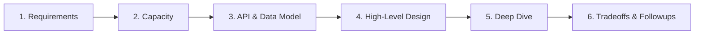
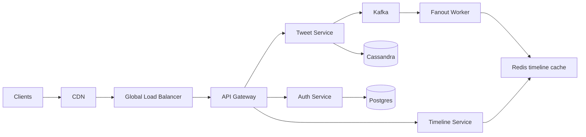

# System Design — How to Attack the Question

System design interviews aren't about knowing every cloud product. They're about a repeatable, calm process for taking ambiguous requirements and producing a defensible architecture in 45 minutes. This file describes the framework. The other files in this folder apply it to specific systems.

---

## The 6-Step Framework

<!-- mermaid:rendered -->
<p align="center"></p>

<details><summary>Mermaid source</summary>



</details>

Time budget for a 45-min interview:
- Requirements: 5 min
- Capacity: 5 min
- API/Data: 5 min
- High-level: 10 min
- Deep dive: 15 min
- Tradeoffs: 5 min

---

## Step 1 — Requirements (5 min)

Drive ambiguity OUT before drawing anything. Two categories:

### Functional
"What does it do?" — list the user-facing actions. For "design Twitter": post tweet, follow user, view timeline, search.

### Non-functional
"What does it need?" — concurrency, latency, durability, consistency, availability.

**Standard questions to always ask:**
- Read-to-write ratio?
- Latency target (p50, p99)?
- Eventual or strong consistency acceptable?
- Multi-region required?
- Compliance constraints (PII, GDPR, FedRAMP)?
- Budget concerns (cost-conscious or enterprise)?

Write the answers down. Refer back when justifying tradeoffs.

---

## Step 2 — Capacity Estimation (5 min)

Convert requirements to numbers. Ballpark, not exact.

**Useful base numbers to memorize:**
- 1M req/day ≈ 12 RPS
- 1B req/day ≈ 12K RPS
- 1 KB tweet × 500M/day ≈ 500 GB/day, ~180 TB/year
- A single MySQL node: ~10K writes/sec, ~50K reads/sec
- A single Redis node: ~100K ops/sec
- A single Kafka broker: ~100 MB/sec write throughput
- 1 ms = "in-memory cache hit", 10 ms = "DB hit", 100 ms = "cross-region", 1 s = "user notices"

**Formula:**
```
Storage/day = item_size × write_rate × seconds_per_day
RPS = active_users × requests_per_user / seconds_per_day
Bandwidth = avg_response_size × RPS
```

State the assumptions out loud. Interviewer corrects them — saves you from over/under-engineering.

---

## Step 3 — API & Data Model (5 min)

Define the contract before the architecture.

**API:** REST or gRPC, list 4-6 key endpoints. Show request/response shapes.

```
POST /v1/tweets        body: {text, media[]}    -> {tweet_id, created_at}
GET  /v1/users/:id/timeline?cursor=...&limit=50 -> {tweets[], next_cursor}
POST /v1/follow        body: {target_user_id}   -> 204
```

**Data model:** entities and their relationships. Relational? Document? Wide-column?

```
users(id pk, handle unique, name, created_at)
tweets(id pk, user_id fk, text, created_at, media_ids[])
follows(follower_id fk, followee_id fk, created_at) pk(both)
timeline_cache(user_id, tweet_ids[], updated_at) -- materialized view
```

State why — "tweets are append-only, denormalized, fits Cassandra; users are relational with strong consistency, fits Postgres."

---

## Step 4 — High-Level Design (10 min)

Draw the boxes. Use mermaid.

<!-- mermaid:rendered -->
<p align="center"></p>

<details><summary>Mermaid source</summary>



</details>

Cover the major flows:
- **Write path** (post tweet)
- **Read path** (load timeline)
- **Async path** (fanout, notifications)

Don't deep-dive yet. Stay at the box level. The interviewer will steer you to the area they care about.

---

## Step 5 — Deep Dive (15 min)

Pick the 1-2 hardest components and go deeper. The interviewer will guide. Common deep-dive areas:

- **Caching strategy** — what's cached, write-through vs write-behind, TTL, invalidation
- **Sharding** — what's the shard key, how do you rebalance, hot keys
- **Consistency** — quorum reads, eventual consistency tolerance
- **Failure modes** — what happens when service X dies, region fails
- **Hot-path optimization** — pre-compute timelines (push), or compute on read (pull), or hybrid

Use sequence diagrams for complex flows.

---

## Step 6 — Tradeoffs & Followups (5 min)

Show you understand what you DIDN'T do.

**Standard tradeoffs to mention:**
- Push vs pull (timeline)
- Strong vs eventual consistency
- Sync vs async writes
- SQL vs NoSQL choice rationale
- Cost vs latency
- Read replicas vs caching
- Single vs multi-region

**End with:** "If we had more time, I'd dig into [X observability, Y disaster recovery, Z security]."

---

## Anti-Patterns to Avoid

| Anti-pattern | Why it hurts |
|---|---|
| Jumping to architecture without requirements | You'll solve the wrong problem |
| Naming specific products without justifying | "I'd use DynamoDB" — why? |
| Skipping capacity math | Architecture choices are wrong without numbers |
| One giant diagram | Layer your design — overview first, then drill in |
| Assuming everything must be real-time | Most things tolerate seconds; async = simpler |
| Ignoring failures | "What if Redis dies?" should be in your head before they ask |
| Defending your first instinct | Interviewer pushback isn't an attack — engage with the alternative |

---

## Useful Patterns to Have in Your Quiver

- **CQRS** — separate read and write models when read pattern differs from write pattern
- **Event sourcing** — durable log as source of truth, materialize views
- **Saga** — long-running distributed transactions via compensating actions
- **Outbox pattern** — atomic DB write + event publish via local outbox table
- **Cache-aside** — app reads cache, on miss reads DB and populates cache
- **Read repair** — eventual consistency systems repair stale data on read
- **Bulkhead** — isolate failure domains so one client/tenant can't take down all
- **Circuit breaker** — fail fast when downstream is unhealthy, retry with backoff
- **Backpressure** — propagate "slow down" upstream when overloaded
- **Sharding by tenant_id** — natural isolation, easy rebalance per tenant

---

## Quick Capacity Cheatsheet

| Item | Rough number |
|---|---|
| L1 cache | 0.5 ns |
| RAM | 100 ns |
| Local SSD | 100 µs |
| Network round-trip same DC | 0.5 ms |
| Disk seek | 10 ms |
| Cross-region (US-EU) | 80-100 ms |
| 1 KB over 1 Gbps | 8 µs |
| Single MySQL writes/sec | 5–10K |
| Single Postgres TPS | 5–20K |
| Single Redis ops/sec | 100K+ |
| Single Kafka partition writes/sec | 1–10K |
| Single S3 PUT cost | ~$0.005 / 1000 |
| Cross-AZ data transfer | $0.01/GB |
| Cross-region data transfer | $0.02–0.09/GB |

---

## Tooling You Should Know

| Layer | Common picks |
|---|---|
| Edge / CDN | CloudFront, Fastly, Cloudflare |
| Load balancer | NLB, ALB, Envoy, HAProxy, NGINX |
| API gateway | Kong, Apigee, Envoy, AWS API GW |
| Service mesh | Istio, Linkerd, Cilium Service Mesh |
| Queues | Kafka, Pulsar, SQS, NATS, RabbitMQ |
| KV / cache | Redis, Memcached, DynamoDB, ScyllaDB |
| Relational | Postgres, MySQL, CockroachDB, Spanner |
| Wide-column | Cassandra, ScyllaDB, BigTable |
| Document | MongoDB, DynamoDB, Couchbase |
| Object storage | S3, GCS, Azure Blob |
| Search | Elasticsearch, OpenSearch, Vespa |
| Stream processing | Flink, Spark Streaming, Kafka Streams |
| Workflow | Temporal, Airflow, Cadence |
| Observability | Prometheus, Grafana, Loki, Tempo, OpenTelemetry, Datadog |

---

## Files in This Folder

- `design-a-container-platform.md` — Heroku/Railway-style PaaS
- `design-a-multi-region-k8s.md` — active-active K8s across regions
- `design-a-secrets-store.md` — Vault-like service
- `design-an-observability-stack.md` — metrics + logs + traces at scale
- `design-a-ci-cd-platform.md` — build runners, artifact storage
- `design-a-service-mesh.md` — control plane + dataplane

Each one applies the 6-step framework to a real system.

---

## Final Tip

The interview measures *how you think*, not whether you arrive at the "right" answer. Speak through your reasoning. State assumptions. Acknowledge tradeoffs. Defend with data, not preference. Be willing to change direction when the interviewer pushes — they're testing your ability to absorb new info, not your ego.
