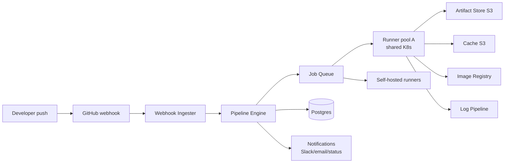
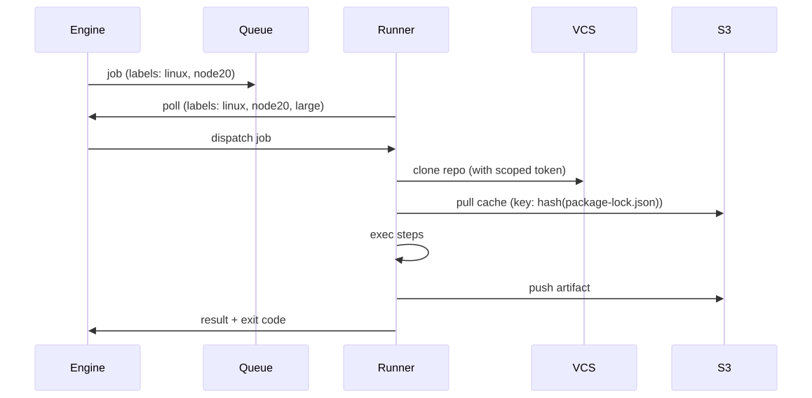
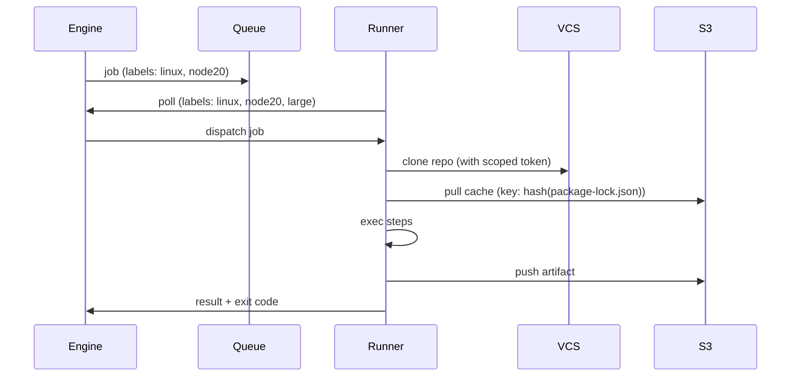

# Design a CI/CD Platform

GitHub Actions / GitLab CI / CircleCI scale problems. Build farm, runners, secrets, artifact storage, fan-out — solving each at 10K builds/hour while keeping it cheap and fast.

---

## 1. Requirements

### Functional
- Run pipelines defined in YAML alongside code
- Triggers: push, PR, schedule, manual, API
- Stages: parallel jobs, sequential dependencies, fan-in/fan-out
- Multi-language matrix (test on Node 18, 20, 22 × Linux, macOS, Windows)
- Secrets injection scoped per repo / org / env
- Artifact upload/download between jobs
- Cache (deps, build artifacts) keyed by hash
- Container image build & push to registry
- Deploy step that talks to K8s / cloud
- Self-hosted runners option (customer's infra)

### Non-functional
- 10K orgs, 100K builds/day, 5K concurrent jobs at peak
- p95 job pickup < 30s from queue
- Build/cache fetch must be fast (LAN-speed object storage)
- Multi-tenant isolation: a malicious build can't see other tenants' secrets/code/runners
- 99.9% pipeline-engine availability
- Cost: scale runners to zero when idle

---

## 2. Capacity

- 100K builds/day, avg 10 jobs each = 1M jobs/day = ~12 jobs/sec, peak 60/sec
- Avg job 5 min CPU = 5M minutes/day = ~3500 concurrent jobs steady state, 5K peak
- Artifacts: 100K builds × 100 MB avg = 10 TB/day → 30 days hot = 300 TB
- Logs: 100M lines/day, ~50 GB/day
- Cache: 1 TB total, 80% hit rate

---

## 3. API & Data Model

### API
```text
POST /v1/orgs/:org/repos/:repo/pipelines    {ref, inputs}    -> {pipeline_id}
GET  /v1/pipelines/:id                                       -> {status, jobs[]}
GET  /v1/jobs/:id/logs                       (SSE)           -> log stream
POST /v1/jobs/:id/cancel                                     -> 204
POST /v1/runners/register                    {labels, token} -> {runner_id}
GET  /v1/runners/:id/jobs/poll                               -> next job (long poll)
POST /v1/jobs/:id/artifacts                  multipart       -> {artifact_id}
GET  /v1/artifacts/:id                                       -> binary
```

### Data model
```text
orgs(id pk, plan, billing_id)
repos(id pk, org_id, name, vcs_id)
pipelines(id pk, repo_id, ref, sha, status, started_at, finished_at, trigger)
jobs(id pk, pipeline_id, name, image, status, runner_id, started_at, finished_at, exit_code)
job_steps(job_id, idx, name, status, exit_code, duration_ms)
artifacts(id pk, job_id, name, size, sha256, s3_key, expires_at)
caches(id pk, repo_id, scope, key, s3_key, size, last_used)
secrets(id pk, scope_org_or_repo, name, value_encrypted)
runners(id pk, org_id [null=shared], labels, last_seen, capacity)
```

---

## 4. High-Level Design

<!-- mermaid:rendered -->
<p align="center"></p>

<details><summary>Mermaid source</summary>



</details>

### Write path (pipeline trigger)
1. GitHub sends webhook to `/v1/webhooks/github`
2. Verify HMAC signature
3. Parse event → fetch `.ci.yaml` from repo at SHA
4. Engine creates pipeline + jobs in Postgres
5. Engine analyzes DAG → enqueues independent jobs
6. Send pending status back to GitHub Checks API

### Job execution path
1. Runner long-polls `/v1/runners/:id/jobs/poll`
2. Engine assigns a job whose labels match runner labels and dependencies are satisfied
3. Runner clones repo at SHA, fetches cache, runs steps in container
4. Streams logs to ingest endpoint
5. Uploads artifacts to S3
6. Reports result; engine evaluates downstream jobs (DAG)

---

## 5. Deep Dive

### Runner Architecture

Two runner pools:

**Shared (managed):** ephemeral pods on a multi-tenant K8s cluster. Each job = one pod, deleted on completion. Use gVisor RuntimeClass — builds run untrusted code.

**Self-hosted:** customer registers a runner agent that long-polls our queue. Auth via signed token. Jobs only dispatched if labels match and the org owns the runner.

<!-- mermaid:rendered -->
<p align="center"></p>

<details><summary>Mermaid source</summary>



</details>

### Autoscaling Runners

- KEDA ScaledJob on queue depth → spawns one pod per pending job
- Karpenter / Cluster Autoscaler provisions nodes (spot for cost, on-demand for critical)
- Per-org concurrency limit (otherwise one org can starve others)
- Priority classes: paid tiers preempt free tier

### Build Cache

S3-backed, addressed by content hash.

```yaml
# pipeline yaml
steps:
  - cache:
      key: node-modules-${{ hashFiles('package-lock.json') }}
      paths: [node_modules]
  - run: npm ci
```

Cache miss → restore-fail; job runs `npm ci`, then post-step uploads cache. LRU eviction after 7 days unused.

For Docker layer cache: BuildKit `--cache-to type=s3` keyed by repo + Dockerfile hash.

### Artifact Store

- S3 (or compatible) with per-org bucket prefix
- Server-side encryption with per-org KMS key
- Pre-signed URLs for direct upload/download (skip our API for bandwidth)
- Lifecycle policy: hot 30d → IA 90d → expire

### Secrets

- Stored encrypted in Postgres (per-org KMS data key)
- Injected as env at runner job start (NOT in YAML)
- Masked in logs (regex match against current secret values; replace with `***`)
- Scope hierarchy: org → repo → environment (deploy-prod gates require approval)

### Pipeline DAG Engine

- Each job declares `needs: [build, test]`
- Engine builds DAG, schedules jobs whose deps are satisfied
- Fan-in: a job with multiple `needs` waits for all
- Fan-out: matrix expansion (10 OS × 3 Node versions = 30 jobs)
- Failure: cancel downstream by default, configurable `if: always()`

### Log Pipeline

- Runner POSTs log lines as NDJSON to `/v1/jobs/:id/logs`
- Backend writes to Kafka (topic per pipeline, partition by job_id)
- Two consumers:
  - **Live** — pushes to dashboard SSE for in-progress viewing
  - **Archive** — batches to S3 every 60s (gzipped Parquet)
- Final log on job complete — read from S3 forever (or until retention)

### Multi-Tenant Isolation

- Shared runner pods: gVisor + per-job NetworkPolicy (no cluster-internal access)
- Per-job egress proxy with allowlist (no exfil to random C2)
- Image pulls authenticated to org-scoped registry creds
- VCS clone uses ephemeral OAuth token scoped to single repo, single sha
- Audit log every secret access by job_id

### Rate Limits & Fairness

- Per-org concurrency cap from plan tier
- Free tier: 5 concurrent, paid: 50, enterprise: 500
- Queue priority: org plan tier + age
- Long-job kill: 6h timeout default

---

## 6. Tradeoffs

| Decision | Alternative | Why |
|---|---|---|
| K8s runner pods (ephemeral) | Long-lived VMs | Clean state per job, autoscale to zero, gVisor for isolation |
| Long-poll queue | Push to runner | Works behind NAT (self-hosted), simpler for self-hosted |
| S3 for cache + artifacts | Local NFS | Infinite scale, durable; tradeoff is per-MB cost + bandwidth |
| Postgres for metadata | DynamoDB | Relational fits pipeline/job/dep model; row-level ACID |
| Kafka for log buffer | Direct write to S3 | Allows live tailing; batching to S3 cheaper than per-line PUT |
| gVisor for shared runners | runc | Customer code is untrusted; perf hit acceptable for CI |
| BuildKit + S3 cache | Direct docker build | Reproducible, distributed cache reuses layers across runs |
| Pre-signed S3 URLs | Proxy through API | Saves bandwidth on our side, faster for users |

### Followups to mention
- **Reusable workflows** — call workflows from other workflows (DRY)
- **Approval gates** — manual approval before deploy-prod jobs
- **OIDC identity for cloud deploy** — no static cloud creds in pipelines (assume role via JWT)
- **Provenance / SLSA** — signed attestation of how artifacts were built
- **Cost dashboard** — per-org build minutes
- **Replay mode** — re-run a failed pipeline with same inputs
- **Service containers** — postgres/redis containers for tests, networked to job

---

## Sources

- GitHub Actions architecture — https://docs.github.com/en/actions/learn-github-actions/understanding-github-actions
- GitLab CI runner — https://docs.gitlab.com/runner/
- BuildKit — https://github.com/moby/buildkit
- KEDA — https://keda.sh/docs/concepts/
- gVisor for CI — https://gvisor.dev/docs/user_guide/quick_start/kubernetes/
- SLSA — https://slsa.dev/spec/v1.0/levels
