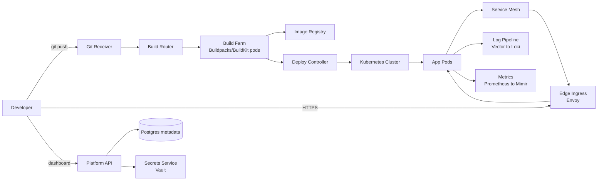
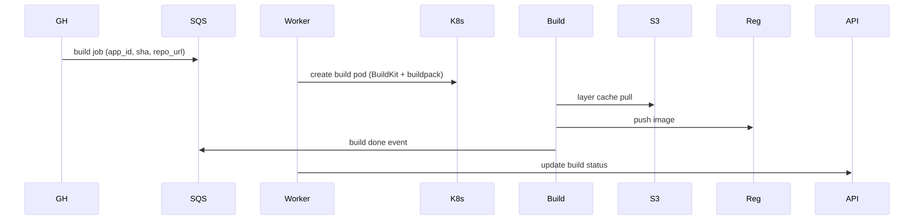
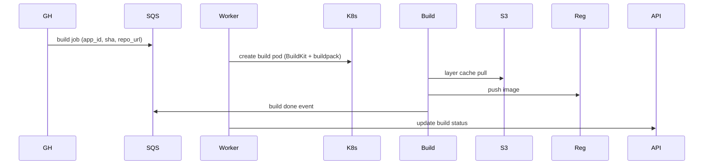

# Design a Container Platform (Heroku / Railway clone)

Build a PaaS where developers `git push` and an app appears at a URL — with autoscaling, observability, secrets, and zero infra knowledge required.

---

## 1. Requirements

### Functional
- `git push platform main` deploys the app
- Detect language/framework from repo (buildpacks)
- Build container image
- Deploy with N replicas, behind HTTPS URL
- Inject env vars / secrets
- View logs and metrics in dashboard
- Roll back to previous deploy
- Add managed datastore (Postgres, Redis) with one click
- Custom domains with TLS

### Non-functional
- 100K active apps, 10K builds/day at peak
- p95 build < 3 min for typical apps
- p95 request latency < 100ms (excluding app code)
- 99.9% uptime SLO (data plane), 99.5% (build pipeline)
- Multi-tenant — tenants must not see each other's logs/secrets
- Cost-conscious (smaller free tier)

### Out of scope (clarified)
- Stateful apps (handled by managed addons)
- Bring-your-own-cluster (we run the cluster)

---

## 2. Capacity

- 100K apps × 2 replicas avg × 200 MB = 40 TB RAM (across N nodes)
- 10K builds/day = ~7 builds/min, p95 burst 50 builds/min
- Image registry: 10K builds × 200 MB image = 2 TB/day raw, dedupe → ~500 GB/day net
- Logs: 100K apps × 1 KB/sec avg = 100 MB/sec = 8.6 TB/day
- Metrics: 100K apps × 50 series × 16 bytes/sample × 60 samples/min = 5 GB/min compressed
- HTTP traffic: 100K apps × 10 RPS avg = 1M RPS at edge

Bottleneck candidates: build farm, log ingestion, edge ingress.

---

## 3. API & Data Model

### API (developer-facing)
```
POST   /v1/apps                  {name, region}                -> {app_id, git_url}
POST   /v1/apps/:id/env          {key, value, secret: bool}    -> 204
POST   /v1/apps/:id/scale        {replicas, plan}              -> {deployment_id}
GET    /v1/apps/:id/builds       ?limit=20                     -> [{build_id, status, sha}]
POST   /v1/apps/:id/rollback     {to_deployment_id}            -> 202
GET    /v1/apps/:id/logs         ?since=...&follow=true (SSE)  -> log stream
POST   /v1/apps/:id/addons       {kind: postgres, plan}        -> {addon_id, conn_url}
```

### Data model

```
users(id pk, email, plan, created_at)
teams(id pk, name)
team_members(team_id, user_id, role)
apps(id pk, team_id, name, region, current_deployment_id)
builds(id pk, app_id, sha, status, image_uri, started_at, finished_at)
deployments(id pk, app_id, build_id, replicas, env_version, status, created_at)
env_vars(app_id, key, value_encrypted, is_secret)  -- versioned
addons(id pk, app_id, kind, conn_secret_id)
domains(id pk, app_id, hostname, cert_status)
```

Logs/metrics: not in the relational DB. Logs → Loki / S3, metrics → Mimir / Prometheus.

---

## 4. High-Level Design

<!-- mermaid:rendered -->
<p align="center"></p>

<details><summary>Mermaid source</summary>



</details>

### Write path (deploy)
1. Developer pushes to `git@platform.com:user/app.git`
2. Git receiver auth's via SSH key, accepts push, enqueues build job
3. Build router schedules a buildpack pod in build farm namespace
4. BuildKit produces OCI image, pushes to registry
5. Deploy Controller sees new image, applies updated Deployment + Service + HTTPRoute to K8s
6. Service mesh routes traffic; gradual canary if configured
7. Health check confirms; old replicas drained

### Read path (HTTP request)
1. DNS for `myapp.platform.app` → Anycast edge
2. Edge Ingress (Envoy) terminates TLS, routes by Host header to app's Service
3. Service mesh load-balances to a healthy pod
4. Response back through edge

---

## 5. Deep Dive

### Build Farm

**Pattern:** dedicated K8s namespace per build, ephemeral pods running BuildKit.

<!-- mermaid:rendered -->
<p align="center"></p>

<details><summary>Mermaid source</summary>



</details>

- BuildKit cache mount → S3 (per-app, per-language)
- Buildpacks (Heroku style) detect framework, no Dockerfile needed
- Per-tenant CPU/memory quota; one bad build can't starve others
- Builds run with `runsc` (gVisor) — untrusted code, hard isolation
- Multi-arch via BuildKit `--platform linux/amd64,linux/arm64`

### Edge Ingress at Scale

- Envoy at every PoP, configuration synced from xDS control plane
- HTTP routing table: ~100K hostnames → mapped to backend service per region
- Use a per-PoP cache of routing config; control plane pushes deltas
- TLS: ACME (Let's Encrypt) for `*.platform.app` wildcard; per-customer domain certs auto-issued via DNS-01
- Per-tenant rate limit at edge (avoid one app DDoS-ing the platform)

### Log Pipeline

- Vector DaemonSet on each node tails container logs
- Tags with `app_id, deployment_id, container, region`
- Ships to Kafka (durable buffer, 7-day retention)
- Consumer fans out: hot (24h, Loki for dashboard), warm (30d, S3 + Athena), cold (1y, S3 Glacier)
- Per-tenant index in Loki — search isolation

### Secrets

- Per-app KMS data encryption key, wrapped by central KMS
- Secrets stored encrypted in Postgres
- Injected via projected volume (CSI secrets-store driver) or env at pod creation
- Audit log on every read

### Autoscaling

- KEDA scales by request rate (from Envoy metrics) and queue depth (for worker apps)
- HPA on CPU/memory as fallback
- Cluster autoscaler / Karpenter adds nodes when pending pods accumulate
- Free tier: scale-to-zero (Knative-style), cold start ~3-5s

### Tenant Isolation

- One namespace per app
- NetworkPolicy: app pods can only reach platform-provided egress proxy
- gVisor RuntimeClass for build pods; runc for app pods (perf vs isolation tradeoff)
- ResourceQuota + LimitRange per tenant plan tier

---

## 6. Tradeoffs

| Decision | Alternative | Why |
|---|---|---|
| BuildKit + Buildpacks | Dockerfile only | Lower friction, Heroku-style UX |
| K8s as substrate | Custom orchestrator | Don't reinvent scheduling, ecosystem |
| One namespace per app | One per tenant | Tighter blast radius, simpler quota |
| gVisor for builds | runc | Untrusted code; perf hit acceptable |
| Loki for logs | Elasticsearch | Cheaper at this volume, label-based |
| KEDA for scaling | HPA only | Scale by request rate / queue depth |
| Postgres for metadata | DynamoDB | Relational fits app/team/deploy nicely |
| S3 for layer cache | Local SSD | Survives build node loss; slower cold |
| Multi-region edge, single-region control plane | Multi-region control | Simpler v1; control plane region failure causes API downtime but data plane keeps serving |

### Followups to mention
- **Observability for the platform itself** — meta-monitoring
- **Disaster recovery** — Postgres point-in-time, S3 cross-region replication, secret KMS replication
- **Compliance** — SOC2, log immutability, audit trail
- **Cost attribution** — per-app usage tracking for billing
- **Add-on marketplace** — third-party Postgres/Redis/Kafka providers via Open Service Broker API

---

## Sources

- Heroku architecture talks — https://www.heroku.com/dynos
- Buildpacks — https://buildpacks.io/docs/concepts/
- Knative scale-to-zero — https://knative.dev/docs/serving/autoscaling/
- KEDA — https://keda.sh/docs/concepts/
- Envoy xDS — https://www.envoyproxy.io/docs/envoy/latest/api-docs/xds_protocol
- Cloud Native Buildpacks — https://buildpacks.io/
