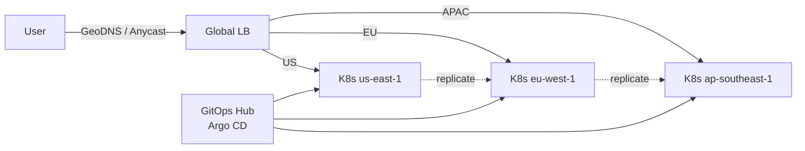
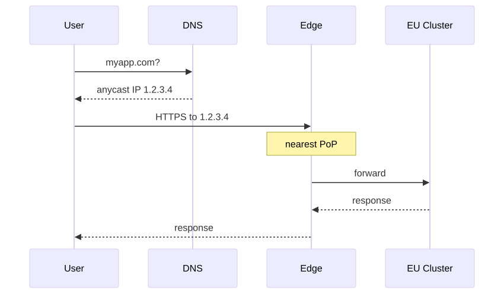
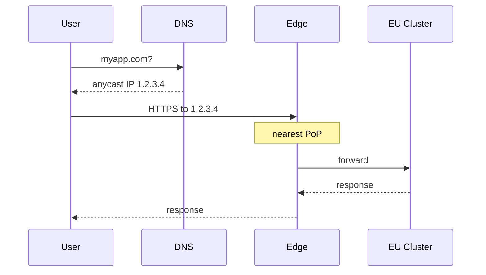

# Design a Multi-Region Kubernetes Platform

Single-region clusters die when the region dies. For revenue-critical workloads you need multi-region — and you need to decide what "multi-region" actually means: active-active, active-passive, or per-region islands behind a global LB.

---

## 1. Requirements

### Functional
- Run stateless web services + a few stateful systems across 3+ regions
- Single global app URL (myapp.example.com) routes user to nearest healthy region
- Survive a full region outage with zero data loss for committed writes
- Centralized GitOps — one source of truth for manifests, applied to all regions
- Centralized policy and identity (RBAC, NetworkPolicy)

### Non-functional
- 99.99% global SLO (52 min/yr downtime)
- p99 latency < 150ms region-local, < 250ms cross-region failover
- RPO ≤ 5s for transactional data, ≤ 1m for analytics
- RTO ≤ 5 min for region failover
- Compliance: data residency (EU data stays in EU regions)

---

## 2. Capacity

- 3 regions: us-east, eu-west, ap-southeast
- 1M DAU, ~30K RPS peak (10K per region)
- 50 stateless services, 5 stateful (Postgres, Redis, Kafka)
- Each region: ~200 nodes, ~3000 pods
- Cross-region bandwidth: ~50 MB/s for replication (Postgres logical replication, Kafka mirror)
- Failover scenario: 1 region drops → other 2 absorb 1.5x load each (capacity must support burst)

---

## 3. API & Data Model

This is infra, not an app — "API" here = the platform API + GitOps repo structure.

### Repo layout
```
infra/
  base/                       # shared K8s manifests
    apps/checkout/...
  overlays/
    us-east-1/
    eu-west-1/
    ap-southeast-1/
  fleets/
    production.yaml           # which apps go to which clusters
```

### Data model
- ApplicationSet (Argo CD) per app → generates one Application per region
- Cluster registry: cluster_id, region, env, capabilities
- Failover policy per app: active_regions[], primary_region, mode (active-active | active-passive)

---

## 4. High-Level Design

<!-- mermaid:rendered -->
<p align="center"></p>

<details><summary>Mermaid source</summary>



</details>

### Active-active vs active-passive

| Aspect | Active-Active | Active-Passive |
|---|---|---|
| Traffic | Each region serves locally | Primary serves; secondary idle/standby |
| Data | Multi-master or per-region writes | Primary writes, replicas read-only |
| Conflict | Possible — needs CRDT or partition by user | None |
| Failover | DNS health-check; <1 min | Promote secondary; minutes |
| Cost | Higher (full capacity per region) | Lower (passive can be smaller) |
| Complexity | High | Lower |
| Suitable for | Stateless + carefully partitioned state | Most stateful systems |

Real-world: usually **active-active for stateless** and **active-passive for stateful** datastores, with regional read replicas.

---

## 5. Deep Dive

### Global Load Balancing

**Layer 1 — DNS (latency-based or geo):** Route 53, Cloudflare, NS1. TTL ~30s. Health checks per region.

**Layer 2 — Anycast IP:** Single IP advertised from each PoP via BGP. Routers steer to nearest. Fast failover (BGP withdrawal in <1s vs DNS TTL).

**Layer 3 — Edge proxy** at each PoP that can also reroute to other regions if local region's apps are unhealthy.

<!-- mermaid:rendered -->
<p align="center"></p>

<details><summary>Mermaid source</summary>



</details>

### Multi-Cluster Manifest Distribution

**Option A — GitOps fanout (most common)**
Argo CD ApplicationSet generator iterates over `clusters/` and creates one Application per cluster.

```yaml
apiVersion: argoproj.io/v1alpha1
kind: ApplicationSet
spec:
  generators:
    - clusters: { selector: { matchLabels: { env: prod } } }
  template:
    spec:
      destination: { server: '{{server}}' }
      source:
        path: 'apps/checkout/overlays/{{name}}'
```

Benefits: simple, each cluster reconciled independently, no global control plane SPOF.

**Option B — Karmada (federation)**
A control plane that schedules workloads across clusters via PropagationPolicy + OverridePolicy. Useful when you want "place this workload in any 2 of 3 regions, prefer EU."

Tradeoff: federation control plane becomes a SPOF unless itself HA across regions.

### Data Replication

**Postgres (per region cluster, primary in one):**
- CloudNativePG with synchronous physical replication within region (HA)
- Asynchronous logical replication to other regions for read replicas
- Global writes pinned to primary region
- Failover: promote secondary, update DNS pointing to write endpoint
- RPO: a few seconds of un-replicated WAL on primary failure

**Postgres (true multi-region writes):**
- Use CockroachDB or Spanner — built-in Paxos/Raft consensus across regions
- Higher write latency (cross-region quorum)
- Worth it only when global strong consistency required

**Kafka:**
- MirrorMaker 2 between regions, or per-region clusters with stretch (high latency, careful)
- Topic strategy: prefix topics with region ("us.orders") or use cluster linking with offsets translated

**Redis:**
- Per-region; for shared state use Active-Active CRDB (Redis Enterprise) or accept eventual consistency

**Object storage:** S3 cross-region replication, or use a multi-region bucket (GCS multi-region).

### Identity & RBAC

- Central IdP (Okta / Azure AD)
- OIDC integration on each cluster
- Single Group → ClusterRole binding template applied via GitOps
- Service accounts: Workload Identity (GKE) / IRSA (EKS) / Azure Workload Identity

### Observability

- Per-region Prometheus + Mimir/Thanos in a global region for long-term storage and global query
- Per-region Loki + cold storage in S3
- Per-region Tempo with global queryFE
- Single Grafana queries across regions via federated datasources

### Disaster Recovery Drill

Quarterly: simulate region kill (`kubectl drain` all nodes in eu-west). Watch:
- DNS failover time
- Capacity headroom in remaining regions
- Stateful failover (Postgres promote)
- Data loss measurement (compare logical replication lag at moment of cut)

Document RTO/RPO actuals vs targets. Adjust capacity / replication topology.

---

## 6. Tradeoffs

| Decision | Alternative | Why |
|---|---|---|
| GitOps fanout (Argo) | Karmada federation | No SPOF, per-cluster autonomy, well-known tooling |
| Active-active stateless + active-passive stateful | All active-active | Most apps don't need multi-master writes; complexity drops a lot |
| GeoDNS + Anycast | DNS only | Anycast handles failover in seconds vs DNS TTL minutes |
| Per-region Postgres + logical replication | CockroachDB global | Cheaper, latency stays local; tradeoff is async cross-region |
| Kafka MirrorMaker | Stretch cluster | Stretch needs <50ms RTT, fragile across continents |
| Mimir for metrics | Per-region Prom only | Need cross-region dashboarding |

### Followups
- **Quota and capacity planning** — failover capacity headroom
- **Per-tenant region pinning** — data residency for EU users
- **Service mesh across clusters** — Istio multi-cluster mesh, Cilium ClusterMesh
- **Network egress costs** — cross-region traffic is $$
- **Centralized policy enforcement** — Kyverno or OPA Gatekeeper distributed to each cluster
- **Cost** — multi-region triples some line items; quantify

---

## Sources

- Karmada — https://karmada.io/docs/
- Argo CD ApplicationSets — https://argo-cd.readthedocs.io/en/stable/operator-manual/applicationset/
- Cluster API — https://cluster-api.sigs.k8s.io/
- Multi-cluster service mesh — https://istio.io/latest/docs/setup/install/multicluster/
- CloudNativePG replication — https://cloudnative-pg.io/documentation/current/replication/
- AWS multi-region patterns — https://docs.aws.amazon.com/whitepapers/latest/aws-multi-region-fundamentals/
