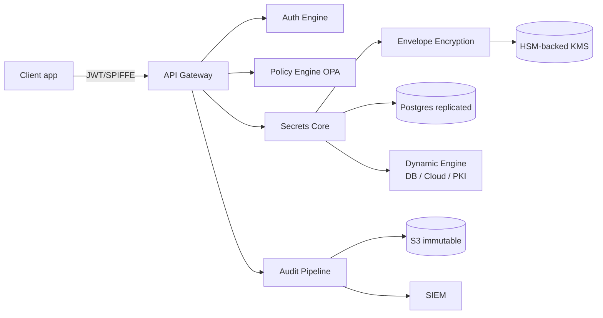

# Design a Secrets Store (Vault-like)

A central service that holds secrets, controls who can read them, audits every access, and rotates them. Think HashiCorp Vault, AWS KMS+SecretsManager, or GCP Secret Manager — but you're building one.

---

## 1. Requirements

### Functional
- Store secrets (key/value, certificates, SSH keys)
- Authenticate clients (humans via SSO, services via JWT/SPIFFE)
- Authorize per-secret reads/writes via policy
- Versioned secrets (rollback)
- Dynamic secrets — generate short-lived DB credentials, cloud creds on demand
- Audit log of every operation (who, when, what)
- Encryption-as-a-service (encrypt arbitrary data with managed keys)
- Auto-rotate secrets (DB passwords, certificates)

### Non-functional
- 99.99% availability — apps depend on us at startup
- p99 read latency < 50ms
- Strong consistency for writes (no stale-read of revoked secret)
- All secrets encrypted at rest with HSM-backed master key
- Audit log immutable, retained 1+ years
- Horizontal scale to 10K req/s, 100M secrets stored

---

## 2. Capacity

- 10K read/s peak, 100 write/s
- Avg secret value: 1 KB; max: 1 MB
- 100M secrets × avg 2 KB → 200 GB raw, ~600 GB with versions/index/encryption overhead
- Audit log: 10K req/s × 500B/event = 5 MB/s = 430 GB/day → S3 + Parquet for long-term
- 5K active dynamic-secret leases → small compared to static
- Multi-region: 3 regions for HA; latency-critical so each region has full read replica

---

## 3. API & Data Model

### API
```text
POST  /v1/auth/login                        -> {token, ttl}
GET   /v1/secret/data/:path                 -> {data, version, metadata}
POST  /v1/secret/data/:path  {data}         -> {version}
DELETE /v1/secret/data/:path                -> 204 (soft delete -> tombstone)
POST  /v1/database/creds/:role              -> {username, password, lease_id, ttl}
POST  /v1/sys/leases/renew {lease_id}       -> {ttl}
POST  /v1/sys/leases/revoke {lease_id}      -> 204
POST  /v1/transit/encrypt/:key {plaintext}  -> {ciphertext}
POST  /v1/transit/decrypt/:key {ciphertext} -> {plaintext}
GET   /v1/sys/audit                         -> stream
```

### Data model
```text
secrets(
  path pk, current_version,
  metadata jsonb,
  created_at, updated_at, deleted_at
)
secret_versions(
  path fk, version,
  encrypted_data bytea,    -- envelope-encrypted
  data_key_wrapped bytea,  -- KMS-wrapped DEK
  created_at,
  PRIMARY KEY(path, version)
)
policies(name pk, hcl_text, version)
identities(id pk, type [user|service|spiffe], display_name, attrs jsonb)
identity_policies(identity_id, policy_name)
leases(id pk, identity_id, secret_path, expires_at, revoked_at)
audit_log(id pk, ts, identity_id, op, path, success, request_id, ip, ...)
```

---

## 4. High-Level Design

<!-- mermaid:rendered -->
<p align="center"></p>

<details><summary>Mermaid source</summary>



</details>

### Write path
1. Client sends `POST /v1/secret/data/foo` with JWT
2. Auth engine validates JWT → issues internal token, attaches identity
3. Policy engine: identity's policies allow `write:secret/data/foo`?
4. Secrets Core: generate fresh DEK, encrypt value with DEK, wrap DEK with KMS master key
5. Write to Postgres in a tx with new version
6. Audit log entry written (synchronous to durable buffer)
7. Response with version number

### Read path
1. Client sends `GET /v1/secret/data/foo` with token
2. Policy check: `read:secret/data/foo`?
3. Fetch version from Postgres (or read replica)
4. Unwrap DEK via KMS, decrypt value
5. Audit log entry
6. Return plaintext

### Dynamic secret path
1. Client requests `POST /v1/database/creds/readonly`
2. Policy check
3. Dynamic engine connects to backend DB, runs `CREATE ROLE ... PASSWORD ... VALID UNTIL ...`
4. Lease created with TTL
5. Returns username/password, lease_id
6. Background job revokes lease at expiry (or on explicit revoke) → drops the DB role

---

## 5. Deep Dive

### Envelope Encryption

Don't encrypt every secret directly with the master key (would require KMS call per read).

```text
plaintext --AES-256-GCM with DEK--> ciphertext
DEK --AES wrap with KEK--> wrapped DEK
KEK lives in HSM, never leaves
```

Stored: `(ciphertext, wrapped_DEK)`. Read: KMS decrypts wrapped_DEK once (cacheable in mem briefly), then decrypt ciphertext locally.

Master key rotation: re-wrap all DEKs with new KEK. Data ciphertext unchanged.

### Unsealing (HashiCorp Vault style)

At startup, the service has the encrypted data but NOT the master key. To start serving, "unseal":
- **Shamir's secret sharing** — N key shares, threshold M required to reconstruct master
- **Auto-unseal** — KMS-managed, master key wrapped by cloud KMS; service auto-unseals on start

Production: auto-unseal with strict KMS audit, otherwise restart = page operators with key shares = bad on-call.

### Authentication Methods

| Method | Use |
|---|---|
| Username/password (with MFA) | Humans, dev workflows |
| OIDC | SSO via Okta/Azure AD |
| Kubernetes ServiceAccount JWT | Pods authenticate via `TokenReview` API |
| SPIFFE/SPIRE | Workload identity, X.509 SVIDs |
| AppRole | Static service identity (least-loved, but simple) |
| Cloud IAM | EC2/EKS instance role authenticates without static creds |

### Policy Engine

Use OPA / Rego or HCL DSL. Policies map identity → allowed paths and operations.

```hcl
path "secret/data/team-orders/*" {
  capabilities = ["read", "list"]
}
path "database/creds/orders-readonly" {
  capabilities = ["read"]
}
```

Cache compiled policies in memory; recompile on policy update via watch.

### Audit Log Pipeline

- Synchronous write to local disk buffer (durable)
- Async drain to Kafka → S3 with object-lock (WORM, immutable)
- Parallel drain to SIEM (Splunk/Elasticsearch)
- Tamper-evidence: hash chain (each entry includes prev hash) → detect deletions

Audit failure must HALT operations (HashiCorp Vault default) — better to fail closed than serve secrets unaudited.

### High Availability & Replication

- Postgres in HA (CloudNativePG) with sync replication
- Service is stateless; deploy 3+ replicas behind LB
- Per-region full replica with async logical replication
- Reads can hit replica; writes go to primary region

### Dynamic Secrets — example for Postgres

```sql
-- on lease create
CREATE ROLE "v-token-readonly-abc123" LOGIN PASSWORD '...' VALID UNTIL '2024-01-01T12:30:00';
GRANT readonly TO "v-token-readonly-abc123";

-- on lease revoke
DROP OWNED BY "v-token-readonly-abc123";
DROP ROLE "v-token-readonly-abc123";
```

App holds a 1-hour-lifetime credential. If a pod is compromised, blast radius = remaining TTL.

### Secret Injection into Pods

- Secrets Store CSI Driver — fetches secrets from us, mounts as files in pod
- Sidecar agent — long-lived, manages auto-rotation, exposes secrets via local socket
- Init container — fetches secrets once, writes to shared volume
- Native env injection — minimum, but env vars leak through `/proc`, ps, crash dumps

### Rotation

- Static secrets: schedule + webhook to rotation function (e.g., rotate API key by calling third-party API)
- Database passwords: dynamic secrets remove the rotation problem entirely
- TLS certs: PKI engine issues short-lived certs; clients renew before expiry
- Notification: webhook on rotation so apps can trigger rolling restart if they cache

---

## 6. Tradeoffs

| Decision | Alternative | Why |
|---|---|---|
| Envelope encryption + HSM master | Encrypt with cloud KMS per call | Avoids KMS call per read, KMS still source of trust |
| Postgres metadata + S3 audit | All in DynamoDB | Postgres for relational policy, S3 for immutable audit log |
| Auto-unseal via KMS | Shamir manual unseal | Operational simplicity at cost of trust dependency on KMS |
| OPA / HCL policies | Hardcoded rules | Flexibility; ops can write policies without code change |
| Dynamic secrets | Long-lived static creds | Massive blast-radius reduction |
| Per-region replica | Single global cluster | Latency for reads in EU/APAC |
| Synchronous audit | Async (best effort) | "Fail closed if we can't audit" is a security requirement |

### Followups to mention
- **Break-glass procedure** — what if all admins lose their keys? Recovery via Shamir share custodians
- **Quorum approval** — `delete /secret/prod/*` requires 2-of-3 admin approval
- **Geo-fenced secrets** — EU secret can only be decrypted by EU service
- **Compliance** — FIPS 140-2 HSM, SOC2 audit trail
- **Client SDK** — handle token renewal, retry, lease expiry
- **Rate limiting per identity** — runaway client can't drown audit pipeline

---

## Sources

- HashiCorp Vault architecture — https://developer.hashicorp.com/vault/docs/internals/architecture
- AWS KMS — https://docs.aws.amazon.com/kms/latest/developerguide/concepts.html
- SPIFFE — https://spiffe.io/docs/latest/spiffe-about/
- Secrets Store CSI Driver — https://secrets-store-csi-driver.sigs.k8s.io/
- Envelope encryption — https://cloud.google.com/kms/docs/envelope-encryption
- Shamir's Secret Sharing — https://en.wikipedia.org/wiki/Shamir%27s_secret_sharing
