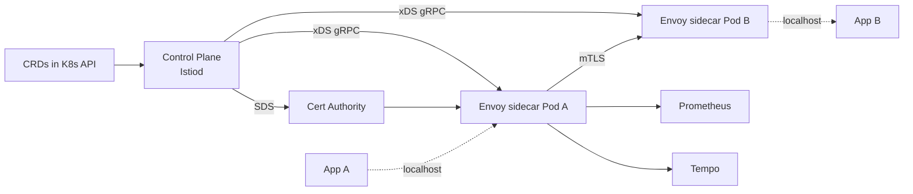
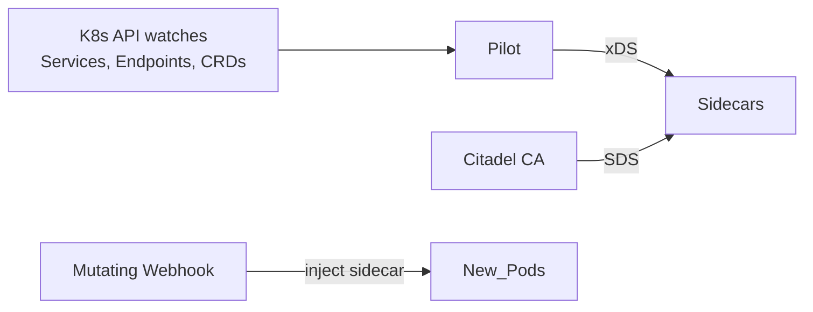
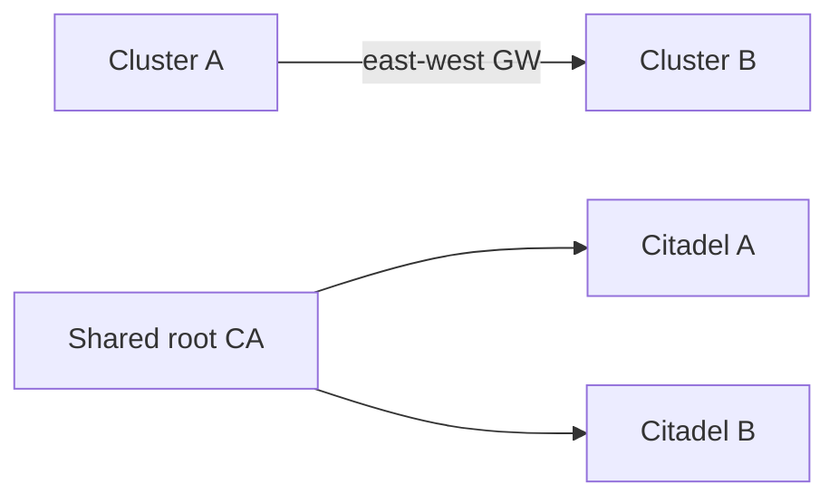

# Design a Service Mesh

A control plane + dataplane that gives you secure, observable, policy-controlled service-to-service traffic without changing application code. Istio, Linkerd, Consul Connect — and now Cilium Service Mesh — all solve the same problem differently.

---

## 1. Requirements

### Functional
- Service discovery + load balancing for all in-mesh services
- mTLS between services with automatic cert issuance and rotation
- L7 traffic policy (route by header, weight-based canary, retries, timeouts, circuit breakers)
- Observability: per-call metrics, distributed traces, access logs
- Authorization policy (which service can call which)
- External traffic ingress + egress control
- Multi-cluster mesh — services in different clusters reachable transparently

### Non-functional
- Support 10K services, 100K pods
- Per-call overhead < 1ms p99 (mTLS + proxy hop)
- Control plane changes propagate to dataplane < 5s
- 99.99% data plane availability (must not become a SPOF)
- Zero-downtime mesh upgrades
- Memory overhead per pod < 100 MB

---

## 2. Capacity

- 100K pods × ~50 MB sidecar = 5 TB memory tax
- Control plane manages 10K services × 10 endpoints avg = 100K endpoints in xDS
- Cert issuance: each pod gets cert lasting 24h → 100K certs/day → ~1.2 issuance/sec sustained, bursts at deploy time
- Telemetry: 100K pods × ~50 RPS each = 5M RPS through mesh → 5M metric samples/sec

---

## 3. API & Data Model

### CRDs (Istio-style)
```
VirtualService     # routing rules: weights, headers, redirects
DestinationRule    # client-side LB, conn pool, outlier detection
Gateway            # ingress/egress configuration
ServiceEntry       # mesh-external endpoints
PeerAuthentication # mTLS mode
AuthorizationPolicy # who can call what
Sidecar            # per-namespace egress allowlist
```

Modern alternative: **Gateway API + GAMMA** (mesh extension to standardize across meshes).

### Internal protocol — xDS

Envoy speaks **xDS** (gRPC discovery): LDS (listeners), RDS (routes), CDS (clusters), EDS (endpoints), SDS (secrets). Control plane streams updates.

---

## 4. High-Level Design

<!-- mermaid:rendered -->
<p align="center"></p>

<details><summary>Mermaid source</summary>



</details>

### Data path
1. App A makes plain HTTP `GET orders.svc/foo`
2. Sidecar (iptables redirect) intercepts, looks up policy
3. Sidecar resolves `orders.svc` → backend pod IPs from EDS
4. Picks endpoint, opens mTLS tunnel using SDS-provided cert
5. Forwards request to remote sidecar
6. Remote sidecar terminates mTLS, applies authz, forwards plain HTTP to App B on localhost

### Control path
1. User edits VirtualService → API server
2. Istiod watches, recomputes config, pushes deltas to affected sidecars via xDS
3. Sidecars apply config in <1s

---

## 5. Deep Dive

### Sidecar vs Sidecarless (Ambient)

**Sidecar (classic):** Envoy injected into every pod. Pros: strong isolation, per-pod policy, proven. Cons: 50–100 MB per pod × 100K pods = serious tax.

**Ambient mesh (Istio Ambient, Cilium):** No sidecar. L4 mTLS via per-node "ztunnel" (or eBPF). L7 features via per-namespace "waypoint" proxy only when needed. Major memory savings; trade-off is a new architecture with its own complexity.

### Control Plane — Istiod

Single binary that combines:
- Pilot (config translation: CRDs → xDS)
- Citadel (CA, issues SPIFFE-format X.509 certs)
- Galley (config validation)
- Sidecar injector (mutating webhook on pod create)

<!-- mermaid:rendered -->
<p align="center"></p>

<details><summary>Mermaid source</summary>



</details>

Run 3+ replicas for HA. Stateless — backed by etcd via API server.

### mTLS

- Workload identity = SPIFFE ID: `spiffe://cluster.local/ns/orders/sa/orders-sa`
- Each pod gets cert at startup via SDS, embedded with SPIFFE SAN
- Cert TTL: 24h; rotated at 50% via SDS push
- mTLS mode per service: STRICT (only mTLS), PERMISSIVE (mTLS + plaintext for migration)

### Authz Policy

```yaml
apiVersion: security.istio.io/v1
kind: AuthorizationPolicy
metadata: { name: orders-allow-checkout, namespace: orders }
spec:
  action: ALLOW
  rules:
    - from:
        - source: { principals: [cluster.local/ns/checkout/sa/checkout-sa] }
      to:
        - operation: { methods: [GET, POST], paths: [/api/orders/*] }
```

Evaluated by Envoy on every inbound request. Default-deny mesh-wide is the goal — start permissive, ratchet down.

### L7 Traffic Policy

```yaml
# canary 5% to v2
apiVersion: networking.istio.io/v1
kind: VirtualService
spec:
  hosts: [orders]
  http:
    - route:
        - destination: { host: orders, subset: v1 }
          weight: 95
        - destination: { host: orders, subset: v2 }
          weight: 5
```

Combine with retries (`retries: { attempts: 3, perTryTimeout: 2s }`), timeouts, circuit-breakers (`outlierDetection`), header-based routing, fault injection (chaos: inject 5% 500s).

### Observability

Sidecars emit:
- Metrics: `istio_requests_total{source, destination, response_code, ...}`
- Spans: continued from incoming `traceparent`, exported to Tempo
- Access logs: per-request log line (sample to control volume)

Service map = aggregate over `source` × `destination` labels in Prometheus.

### Multi-Cluster Mesh

Two models:

**Primary-remote (single control plane):** Istiod in cluster A controls sidecars in cluster B too. Cluster B sidecars join cluster A's CA trust domain. Cross-cluster service discovery via east-west gateway.

**Multi-primary:** Istiod in each cluster, shared root CA. Each cluster's services exposed to others via Gateway. More HA, more complex.

<!-- mermaid:rendered -->
<p align="center"></p>

<details><summary>Mermaid source</summary>



</details>

Cilium ClusterMesh: peers eBPF-based, no gateways needed (pod IPs routable across clusters).

### Performance Optimizations

- **Connection pooling** — sidecar maintains keepalive pools to common destinations
- **HTTP/2 multiplexing** — single conn per (src, dst), many streams
- **Locality LB** — prefer same-zone backends to cut cross-AZ cost
- **Wasm filters** — instead of writing in C++, extend Envoy with WebAssembly modules

---

## 6. Tradeoffs

| Decision | Alternative | Why |
|---|---|---|
| Sidecar (Envoy) | Sidecarless (Cilium/Ambient) | Sidecar = mature, per-pod isolation. Sidecarless = lower memory at cluster scale. |
| Istio | Linkerd | Istio = features (L7, multi-cluster, mature). Linkerd = simpler, lower overhead, Rust |
| mTLS strict mesh-wide | App-level TLS | Centralized cert mgmt, transparent rotation, identity-based authz |
| L7 in mesh | L7 in API gateway only | Mesh handles east-west; gateway handles north-south. Some overlap acceptable |
| CRDs (Istio API) | Gateway API GAMMA | GAMMA is portable across meshes; Istio APIs are richer today |
| Per-cluster control plane | Federated single CP | Per-cluster = no cross-region SPOF; federated = single pane of glass |
| eBPF dataplane (Cilium) | Envoy sidecar | eBPF for L4/mTLS = fast & cheap; L7 features still need Envoy/waypoint |

### Common gotchas
- mTLS bootstrap: how do new pods get certs in time? Pod stalls until SDS responds — a slow CA can prevent pod startup
- Egress traps: STRICT mTLS in mesh + service calling external HTTPS = wrap with ServiceEntry, not arbitrary egress
- Sidecar startup race: app container starts before sidecar is ready → connection refused. Native sidecars (1.29+) fix this
- Upgrades: sidecar version skew with control plane; canary the upgrade per-namespace

### Followups to mention
- **Wasm extensibility** — write filters in Rust/Go without rebuilding Envoy
- **External authz** — sidecar calls OPA / Open Policy Agent for fine-grained decisions
- **Cost** — sidecar memory tax + control plane CPU; ambient/eBPF reduce
- **Operational model** — who owns mesh CRDs (platform team) vs app team
- **When NOT to use a service mesh** — small clusters, mostly-stateless monolith — overhead may exceed value

---

## Sources

- Istio architecture — https://istio.io/latest/docs/ops/deployment/architecture/
- Linkerd design — https://linkerd.io/2.16/reference/architecture/
- Envoy xDS — https://www.envoyproxy.io/docs/envoy/latest/api-docs/xds_protocol
- SPIFFE identity — https://spiffe.io/docs/latest/spiffe-about/
- Istio Ambient — https://istio.io/latest/docs/ops/ambient/architecture/
- Cilium Service Mesh — https://docs.cilium.io/en/stable/network/servicemesh/
- Gateway API GAMMA — https://gateway-api.sigs.k8s.io/mesh/
