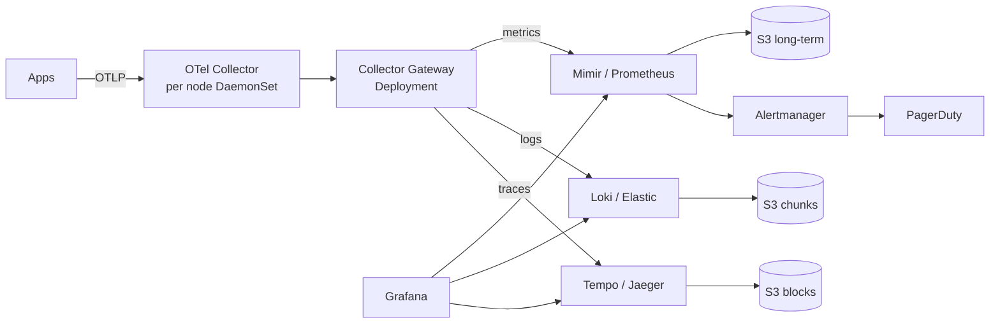
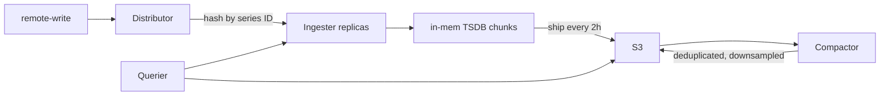

# Design an Observability Stack at Scale

Metrics + logs + traces. Easy at small scale. At 10K services and 50K nodes, every piece becomes a distributed systems problem in itself: high-cardinality metrics, log volume, trace sampling, hot/warm/cold retention, query fairness.

---

## 1. Requirements

### Functional
- Collect metrics, logs, traces from all infra and apps
- Service dashboards (RED/USE), alerting, on-call paging
- Distributed tracing — find slow requests across N services
- Log search across all services with structured filters
- SLO tracking with burn-rate alerts
- Service map / topology
- Cost attribution per team

### Non-functional
- 50K nodes, 500K pods, 10K microservices
- Metrics: 100M active series, 1M samples/sec
- Logs: 1 PB/month ingested
- Traces: 100K spans/sec sustained, 1M peak
- p95 dashboard query < 3s
- 13-month retention for metrics (compliance), 30 days hot for logs
- Multi-tenant — teams query their own data with no cross-team blast radius

---

## 2. Capacity

### Metrics
- 100M series × 1 sample / 15s = 6.7M samples/sec ingest
- Compressed sample: ~1.5 bytes (Gorilla compression)
- 6.7M × 1.5 × 86400 = 870 GB/day raw, ~17 TB/month
- 13 months retention = ~220 TB → object storage tier

### Logs
- 1 PB/month = ~33 TB/day
- 30-day hot index: ~1 PB hot
- After 30d: parquet on S3 + Athena/Trino for ad-hoc

### Traces
- 100K spans/sec × 1 KB/span = 100 MB/sec = 8.6 TB/day raw
- Tail-based sampling reduces to 1-5% kept = ~400 GB/day stored

---

## 3. API & Data Model

### Ingest APIs
- Metrics: Prometheus remote-write, OTLP/HTTP
- Logs: OTLP, Loki push, Fluent Forward
- Traces: OTLP/gRPC, Jaeger, Zipkin

### Query APIs
- Metrics: PromQL
- Logs: LogQL (Loki) or DSL (Elastic)
- Traces: TraceQL (Tempo) / Jaeger query
- Unified: Grafana with multiple datasources

### Data model

**Metric series:**
```
__name__: http_requests_total
labels: {service, env, region, route, status, method}
samples: [(timestamp, value), ...]
```
Series identity = `__name__` + sorted labels. Add high-cardinality label = explode series count.

**Log:**
```
{timestamp, level, service, trace_id, span_id, message, attributes}
```
Indexed by labels (service, level), full-text on message body.

**Trace span:**
```
{trace_id, span_id, parent_id, service_name, op_name, start, end, attributes, events, links, status}
```

---

## 4. High-Level Design

<!-- mermaid:rendered -->
<p align="center"></p>

<details><summary>Mermaid source</summary>



</details>

Two-tier collection:
- **Per-node DaemonSet collector** — scrapes /metrics, tails container logs, receives OTLP from local pods
- **Gateway Deployment** — central routing, attribute enrichment, sampling decisions, fan-out to backends

---

## 5. Deep Dive

### High-Cardinality Metrics — the silent killer

A single label like `user_id` or `request_id` can blow up series count from 100K to 100M overnight.

**Defenses:**
- Strict label allowlist per metric (admission webhook on PrometheusRules / dashboards)
- Cardinality limits per service in Mimir (`max_series_per_user`)
- Pre-aggregation rules (e.g., `sum by (service)(rate(http_requests_total[1m]))`) drop high-card labels at query time
- Metrics linter in CI — flag PRs that add high-cardinality labels

**Detection:**
```promql
topk(20, count by (__name__) ({__name__=~".+"}))
```
Find which metrics have the most series. Often points to runaway labels.

### Metrics Architecture (Mimir style)

<!-- mermaid:rendered -->
<p align="center"></p>

<details><summary>Mermaid source</summary>



</details>

- Distributor: hashes series → 3 ingesters (replication factor 3)
- Ingester: 2h chunks in memory + WAL on disk
- Long-term: S3 blocks, queried via store gateway with bloom filter cache
- Query frontend: splits + caches queries

### Log Pipeline at Scale

**Loki model:** index labels only, store log lines as chunks in S3.

```
labels: {service=orders, env=prod, level=error}
chunks: gzip-compressed log lines, 1MB each
```

Query: filter by labels first (fast index lookup), then grep within chunks (fast S3 range read).

**Vs Elasticsearch:** Loki is 10-100x cheaper at the cost of slower full-text. Pick Loki when most queries filter by service+level then search within. Pick Elastic when you frequently need free-text across petabytes.

**Sampling:** drop noisy logs at the agent (e.g., 100% errors, 10% info). Keep 100% in dev, sample in prod.

### Distributed Tracing — Sampling

Tracing every request = unaffordable. Three approaches:

1. **Head-based sampling** — at the entry point, decide to sample (1%). Same trace_id propagates. Cheap but you might miss the slow ones you actually wanted.

2. **Tail-based sampling** — collect 100% in a short buffer, then decide to keep based on attributes (errored? p99 slow?). Expensive (need to buffer everything for ~30s) but keeps the interesting traces.

3. **Probabilistic + interesting** — head-sample 1%, plus 100% of error/slow.

Tempo's tail sampler:
```yaml
processors:
  tail_sampling:
    decision_wait: 30s
    policies:
      - name: errors
        type: status_code
        status_code: { status_codes: [ERROR] }
      - name: slow
        type: latency
        latency: { threshold_ms: 1000 }
      - name: random-1pct
        type: probabilistic
        probabilistic: { sampling_percentage: 1 }
```

### Retention Tiers

| Tier | Window | Storage | Cost/GB/mo | Use |
|---|---|---|---|---|
| Hot | 0–7 days | Local SSD on ingester | $$$$ | Live dashboards |
| Warm | 7–30 days | S3 standard | $$ | Recent investigation |
| Cold | 30d–13mo | S3 IA / Glacier | $ | Compliance, post-mortem |
| Archive | >13mo | Glacier Deep | ¢ | Legal hold |

Downsample metrics at tier boundaries: 15s → 1m → 5m → 1h. Lossy but cheap; raw kept only short-term.

### Alerting

- Prometheus / Mimir Ruler runs PromQL queries on a schedule
- Alerts grouped by SLO burn rate (multi-window, multi-burn-rate from Google SRE book)
- Alertmanager dedupes, routes to PagerDuty/Slack
- Inhibition: high-severity alert silences related lower-severity ones

```
expr: (
  sum(rate(http_errors_total[1h])) / sum(rate(http_requests_total[1h]))
) > 14.4 * 0.001  # burn rate 14.4x for 1% error budget over 1h
```

### Multi-Tenancy

- All ingest paths require `X-Scope-OrgID: team-orders` header
- Mimir, Loki, Tempo all natively multi-tenant — store data partitioned by tenant
- Per-tenant query rate limit (no team can hose the cluster)
- Per-tenant cardinality limits
- Per-tenant retention overrides (paid teams get 13mo, free teams 30d)

### Cost Attribution

- Track ingest bytes per tenant per day
- Bill internally — discourages metric-spam habit
- Surface "your top 10 cardinality metrics" weekly to teams

---

## 6. Tradeoffs

| Decision | Alternative | Why |
|---|---|---|
| Mimir for metrics | Single Prometheus | Single Prom dies at ~5M series; Mimir scales horizontally and uses object storage |
| Loki for logs | Elasticsearch | 10-100x cheaper at petabyte scale; tradeoff is slower full-text |
| Tail-based sampling | Head-based 1% | Catches the slow/errored traces you actually need |
| OTel Collector everywhere | Vendor agents | Vendor-neutral; switch backends without re-instrumenting |
| Two-tier collection (DaemonSet + Gateway) | DaemonSet only | Gateway centralizes sampling, enrichment, fan-out; DS-only spreads expensive logic |
| Object storage for long-term | Local SSD | Cheap, infinite, durable; tradeoff is slower cold queries |
| Multi-tenant single deployment | Per-team deployment | Operational simplicity, per-tenant limits enforce fairness |

### Followups to mention
- **Pre-aggregation rules** — recording rules to materialize common queries
- **Exemplars** — link metrics to traces (`http_request_duration_seconds` exemplar → trace_id)
- **Continuous profiling** — Pyroscope/Parca for CPU/memory profiles alongside metrics
- **Synthetic monitoring** — Blackbox prober for endpoints
- **Anomaly detection** — ML on metrics for unknown unknowns
- **Disaster recovery** — cross-region replication of long-term storage
- **Self-monitoring (meta-monitoring)** — separate small Prometheus monitors the big one

---

## Sources

- Grafana Mimir architecture — https://grafana.com/docs/mimir/latest/references/architecture/
- Loki design — https://grafana.com/docs/loki/latest/get-started/architecture/
- Tempo / tail-based sampling — https://grafana.com/docs/tempo/latest/operations/best-practices/
- OpenTelemetry collector — https://opentelemetry.io/docs/collector/
- SRE multi-burn-rate alerts — https://sre.google/workbook/alerting-on-slos/
- Prometheus high cardinality — https://prometheus.io/docs/practices/naming/
