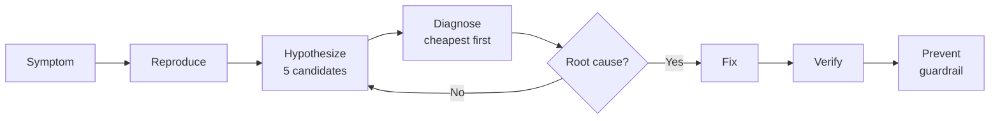

# Troubleshooting Scenarios — The 12-Scenario Battle Pack

> **Purpose:** Twelve high-signal Kubernetes / platform incidents that recruiters and tech leads love to probe. Each file teaches the **failure mode**, the **diagnostic loop**, the **fix**, and the **guardrail** that prevents recurrence.

---

## How to use this pack

| Phase | Goal | Time |
|-------|------|------|
| **Read** | Understand symptom, root causes, kubectl commands | 15 min/scenario |
| **Reproduce** | Spin up kind/minikube, replay the failure | 30 min/scenario |
| **Drill** | Close the file, walk through the diagnostic loop aloud | 10 min/scenario |
| **Interview** | Use the "Common Interview Qs" admonition as flash cards | 5 min/scenario |

**Total prep time:** ~12 hours for full mastery. ~3 hours for read-only review.

---

## The 12 Scenarios

| # | File | Domain | Difficulty |
|---|------|--------|------------|
| 1 | [pod-crashloopbackoff.md](./pod-crashloopbackoff.md) | Workload | Easy |
| 2 | [intermittent-503.md](./intermittent-503.md) | Networking | Medium |
| 3 | [slow-pod-startup.md](./slow-pod-startup.md) | Scheduling | Easy |
| 4 | [disk-pressure-eviction.md](./disk-pressure-eviction.md) | Node | Medium |
| 5 | [dns-resolution-failures.md](./dns-resolution-failures.md) | Networking | Medium |
| 6 | [network-partition.md](./network-partition.md) | Control plane | Hard |
| 7 | [cert-expired.md](./cert-expired.md) | Security | Medium |
| 8 | [slow-api-server.md](./slow-api-server.md) | Control plane | Hard |
| 9 | [memory-leak.md](./memory-leak.md) | Workload | Medium |
| 10 | [ingress-503.md](./ingress-503.md) | Networking | Medium |
| 11 | [helm-stuck.md](./helm-stuck.md) | Tooling | Easy |
| 12 | [upgrade-broke-everything.md](./upgrade-broke-everything.md) | Lifecycle | Hard |

---

## The universal diagnostic loop

<!-- mermaid:rendered -->
<p align="center"></p>

<details><summary>Mermaid source</summary>



</details>

---

## Cheat-sheet — first 5 commands for ANY pod issue

```bash
kubectl get pod <p> -o wide
kubectl describe pod <p>
kubectl logs <p> --previous --tail=200
kubectl get events --sort-by=.lastTimestamp | tail -30
kubectl top pod <p> --containers
```

## Cheat-sheet — first 5 commands for ANY cluster issue

```bash
kubectl get nodes -o wide
kubectl get componentstatuses           # deprecated but still works
kubectl get --raw /readyz?verbose
kubectl -n kube-system get pods
journalctl -u kubelet --since '10 min ago' -n 200
```

---

## Interview meta-rules

> **Always state the symptom first, hypothesis second, command third.**
> Interviewers grade **structure**, not just the right answer.

> **Cheapest diagnostic first.** `kubectl describe` before `tcpdump`.

> **Fix the root cause, not the symptom.** Restarting a pod ≠ a fix.

> **Always end with prevention.** "And to prevent this we'd add ..." is the gold answer.

---

## Related
- [../03-kubernetes-internals](../../03-kubernetes-internals) — internals reference
- [../06-questions-bank](../06-questions-bank) — flat Q/A bank
