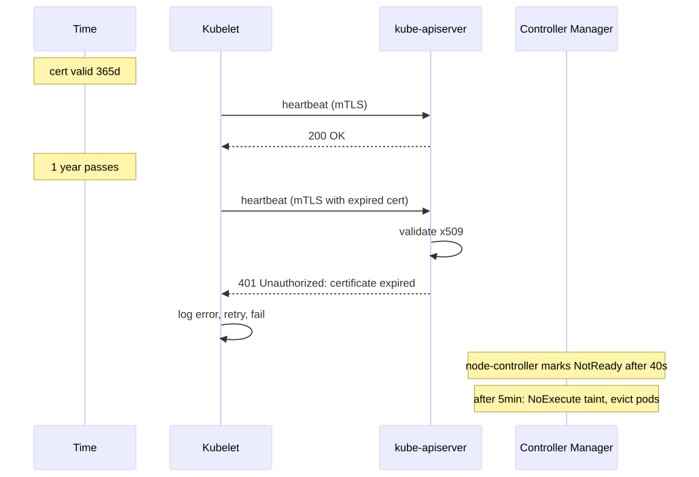
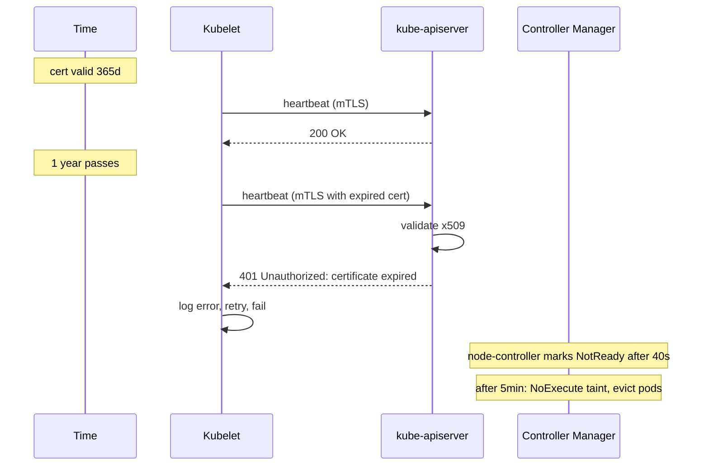

# Certificate Expired

> **Symptom**
> One morning, `kubectl` returns `Unable to connect to the server: x509: certificate has expired or is not yet valid`. Or pods can't pull from a private registry. Or webhooks return `tls: failed to verify certificate`. Or kubelet's logs scream `Unauthorized` and the node falls off the cluster.

Cluster certs are silent until the day they aren't. Most kubeadm clusters have **a 1-year clock ticking from install day**.

---

## Reproduce

```bash
# Move time forward on the cluster (do NOT do this in prod)
sudo timedatectl set-time '2027-01-01 12:00:00'
kubectl get nodes
# x509: certificate has expired
```

Real reproduction is just calendar drift; expiries are deterministic.

---

## Diagnose — 5 candidate root causes

### 1. kubeadm-managed cluster certs expired

```bash
sudo kubeadm certs check-expiration
```

Output table shows expiry per cert: `apiserver`, `apiserver-kubelet-client`, `apiserver-etcd-client`, `front-proxy-client`, `etcd-server`, `etcd-peer`, `etcd-healthcheck-client`, `controller-manager.conf`, `scheduler.conf`, `admin.conf`, `kubelet.conf`. CA certs typically valid 10 years.

### 2. Kubelet client cert expired (and rotation off)

```bash
ssh <node>
openssl x509 -in /var/lib/kubelet/pki/kubelet-client-current.pem -noout -dates
journalctl -u kubelet | grep -i 'certificate\|x509'
cat /var/lib/kubelet/config.yaml | grep -E 'rotateCertificates|serverTLSBootstrap'
```

If `rotateCertificates: false` (or absent on older clusters), kubelet's client cert rolls off → API server rejects it → node `NotReady`.

### 3. Webhook serving cert expired

```bash
kubectl get validatingwebhookconfiguration -o json | jq '.items[].webhooks[].clientConfig.caBundle' | head
# Find the webhook target
openssl s_client -connect <webhook-svc>:<port> -servername x </dev/null | openssl x509 -noout -dates
```

`cert-manager` issues most webhook certs. If cert-manager itself is broken, renewals stop.

### 4. Service Account signing key rotated; old tokens still in use

```bash
kubectl describe pod <p> | grep -A2 'token'
kubectl logs <p> | grep -i 'token expired\|invalid bearer'
```

Bound service account tokens (k8s 1.21+) auto-rotate. Legacy long-lived tokens do not. After signing key rotation, old tokens fail.

### 5. Private registry / external CA cert expired

```bash
kubectl describe pod <p> | grep -A3 'Failed to pull image'
# Likely: x509: certificate signed by unknown authority
crictl pull <image>
```

Registry's TLS cert expired, OR the CA bundle on nodes is stale (Let's Encrypt cross-sign).

---

## Resolve

### kubeadm cert renewal (the standard procedure)

```bash
# Backup first
sudo cp -r /etc/kubernetes /etc/kubernetes.backup.$(date +%F)

# Renew all
sudo kubeadm certs renew all

# Restart static pods so they pick up new certs
sudo crictl ps -a | grep -E 'kube-apiserver|controller-manager|scheduler|etcd' \
  | awk '{print $1}' | xargs -r sudo crictl stop

# Update kubeconfigs
sudo cp /etc/kubernetes/admin.conf $HOME/.kube/config
sudo chown $(id -u):$(id -g) $HOME/.kube/config

# Verify
sudo kubeadm certs check-expiration
kubectl get nodes
```

### Enable kubelet auto-rotation

```yaml
# /var/lib/kubelet/config.yaml
rotateCertificates: true        # client cert auto-renew
serverTLSBootstrap: true        # serving cert via CSR
```

The CSR controller in kube-controller-manager must be running, with `--cluster-signing-cert-file` and `--cluster-signing-key-file` pointing at the CA. Pending CSRs:

```bash
kubectl get csr
kubectl certificate approve <name>      # or autoApproveBootstrap
```

### Webhook cert with cert-manager

```yaml
apiVersion: cert-manager.io/v1
kind: Certificate
metadata:
  name: webhook-cert
  namespace: my-webhook
spec:
  secretName: webhook-tls
  duration: 2160h           # 90d
  renewBefore: 360h         # 15d
  dnsNames:
    - my-webhook.my-webhook.svc
  issuerRef:
    name: selfsigned-issuer
    kind: ClusterIssuer
```

Then `caBundle` injection via `cert-manager.io/inject-ca-from` annotation.

---

## Prevent

1. **Upgrade your cluster regularly.** `kubeadm upgrade` rotates control-plane certs every run. Annual minor upgrade = annual rotation.
2. **Enable kubelet `rotateCertificates: true` cluster-wide.** Default in modern installers but verify.
3. **Monitor cert expiry as a metric.**
   ```promql
   apiserver_client_certificate_expiration_seconds_count
   apiserver_client_certificate_expiration_seconds_bucket
   ```
   Or run `cert-manager` with Prometheus exporter, alert at 30 days remaining.
4. **`kubeadm certs check-expiration` in a daily CronJob → push to alerting.**
5. **Off-cluster CA bundle distribution.** Ansible/configmgmt to refresh nodes' `/etc/ssl/certs`.
6. **Document the renewal runbook.** Annual fire drill.

---

## Failure-mode sequence

<!-- mermaid:rendered -->
<p align="center"></p>

<details><summary>Mermaid source</summary>



</details>

---

> [!IMPORTANT]
> **Common interview Qs**
> - "kubectl returns `x509: certificate has expired`. Walk me through the recovery."
> - "What does `kubeadm certs renew all` do? Does it require a restart?"
> - "Why does upgrading the cluster usually fix expired certs?"
> - "Difference between client cert and serving cert for kubelet?"
> - "How does kubelet bootstrap its first cert? (TLS bootstrap + CSR)"
> - "Webhook is failing with TLS error after deploy. What changed?"
> - "How long are kubeadm CA certs valid for?" (10 years)
> - "How would you monitor cert expiry proactively?"
