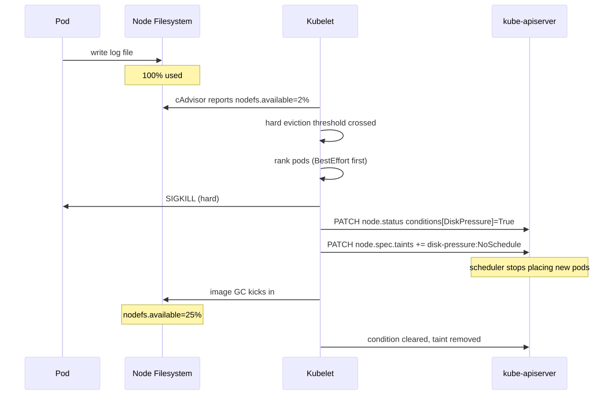
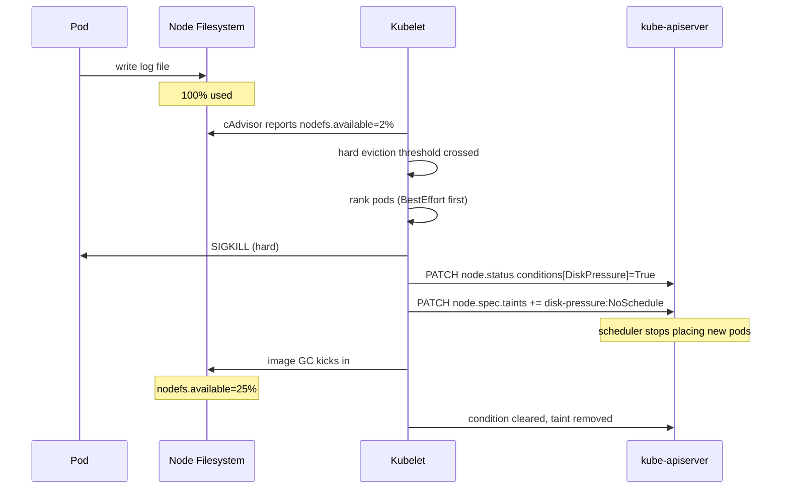

# Disk Pressure & Eviction

> **Symptom**
> Pods are evicted with `Reason: Evicted, Message: The node was low on resource: ephemeral-storage`. Node taints `node.kubernetes.io/disk-pressure:NoSchedule`. Throughput collapses as pods get rescheduled and re-pull images.

Disk pressure is kubelet's **last-resort defence** against a node going completely full and breaking the runtime. It is loud, sudden, and cascades.

---

## Reproduce

```bash
# On a kind node:
docker exec -it kind-control-plane bash
fallocate -l 50G /tmp/big.bin     # fill the rootfs
# Within ~10s, kubelet logs:
journalctl -u kubelet | grep -i evict
kubectl get nodes -o wide
kubectl describe node kind-control-plane | grep -A5 Conditions
```

You'll see `DiskPressure: True` and pods being evicted in priority order.

---

## Diagnose — 5 candidate root causes

### 1. Container logs have eaten the disk

```bash
ssh <node>
du -sh /var/log/pods/*  | sort -h | tail
du -sh /var/lib/docker/containers/*/*-json.log | sort -h | tail
```

A noisy app writing 1GB/hr with no log rotation = ticking bomb.

### 2. Image cache bloat

```bash
crictl images       # list
df -h /var/lib/containerd
# or for docker:
docker system df
```

If `--image-gc-high-threshold` (default 85%) is too high or rarely triggered, junk images pile up.

### 3. emptyDir filling up

```bash
kubectl get pods -A -o json | jq '.items[].spec.volumes[]? | select(.emptyDir)'
kubectl exec <p> -- du -sh /tmp /scratch
```

`emptyDir` lives on node ephemeral storage. No quota by default. One bad pod fills the node.

### 4. ephemeral-storage requests not set

```bash
kubectl get pods -A -o json | jq '.items[] | select(.spec.containers[].resources.requests."ephemeral-storage" == null) | .metadata.name'
```

Without `requests.ephemeral-storage`, scheduler over-packs the node.

### 5. PVC not actually bound to network storage

```bash
kubectl get pvc -A
kubectl get pv | grep -i hostpath
```

`hostPath` or `local` PV consumes node disk. Treat as ephemeral.

---

## Resolve

### Immediate triage

```bash
# Clear the fire
crictl rmi --prune                 # delete unused images
journalctl --vacuum-size=200M
rm /var/log/pods/<noisy-pod>/*/*.log.gz
# Cordon node, drain, reboot if filesystem corrupt
kubectl cordon <node>
kubectl drain <node> --ignore-daemonsets --delete-emptydir-data
```

### Permanent fix

| Cause | Fix |
|-------|-----|
| Logs eat disk | Configure container runtime log rotation: `containerd` `max_size = "100MB"`; ship logs out via Fluent Bit/Vector. |
| Image bloat | `--image-gc-high-threshold=80 --image-gc-low-threshold=60`; use slim base images. |
| `emptyDir` runaway | `emptyDir.sizeLimit: 1Gi` to enforce quota; kubelet evicts on overrun. |
| Missing requests | Pod admission policy / OPA Gatekeeper requires `ephemeral-storage`. |
| `hostPath` abuse | Migrate to network PV (EBS/EFS/Ceph). |

### kubelet eviction signals (memorize)

| Signal | Default Soft | Default Hard |
|--------|--------------|--------------|
| `memory.available` | — | `100Mi` |
| `nodefs.available` | — | `10%` |
| `nodefs.inodesFree` | — | `5%` |
| `imagefs.available` | — | `15%` |
| `imagefs.inodesFree` | — | `5%` |

**Soft eviction:** signal crossed for `--eviction-soft-grace-period`; respects `terminationGracePeriodSeconds`.
**Hard eviction:** immediate kill. `terminationGracePeriodSeconds` ignored.

### Eviction order

1. `BestEffort` (no requests/limits)
2. `Burstable` exceeding requests
3. `Guaranteed` (requests == limits) — last to die

---

## Prevent

1. **Always set `requests.ephemeral-storage`.** OPA / Kyverno enforce.
2. **Log rotation at runtime.** containerd `max_size = "100MB"`, `max_file = 5`.
3. **External log pipeline.** Fluent Bit DaemonSet → Loki/ELK; never let logs grow unbounded.
4. **Node disk monitoring.** Prometheus `node_filesystem_avail_bytes` < 20% → page.
5. **`emptyDir.sizeLimit` mandatory.** Policy.
6. **Node-level `imageMinimumGCAge: 2h`.** GC actually runs.
7. **Larger root disk on nodes.** 100GB minimum for general workloads, 200GB+ if large images.

---

## Failure-mode sequence

<!-- mermaid:rendered -->
<p align="center"></p>

<details><summary>Mermaid source</summary>



</details>

---

> [!IMPORTANT]
> **Common interview Qs**
> - "Node is in DiskPressure. Walk me through what kubelet did."
> - "Difference between soft and hard eviction?"
> - "In what order does kubelet evict pods?"
> - "What is `imagefs` vs `nodefs`? When are they the same?"
> - "How do you prevent one pod's log from filling the node?"
> - "A pod has no resource requests. Is it more or less likely to be evicted?"
> - "What taint does kubelet add when DiskPressure starts?"
