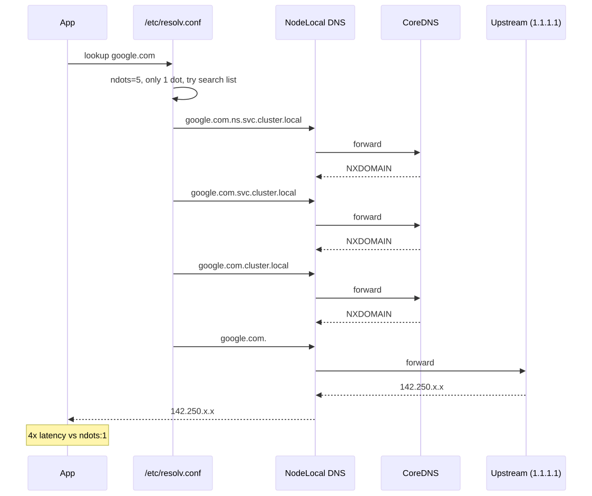
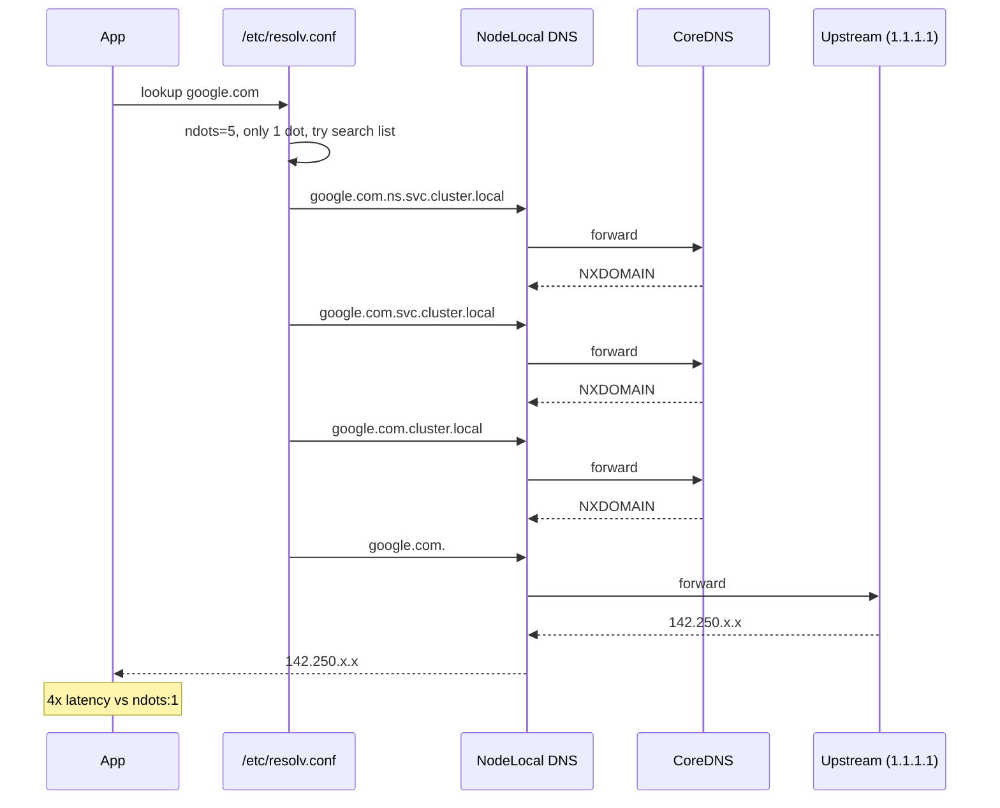

# DNS Resolution Failures

> **Symptom**
> Apps log `getaddrinfo: Temporary failure in name resolution`, `EAI_AGAIN`, or 5-second timeouts on every external HTTP call. The cluster "feels slow." Sporadic, namespace-scoped, or cluster-wide depending on the cause.

DNS in Kubernetes is a four-hop chain: **app → /etc/resolv.conf → CoreDNS pod → upstream resolver**. Failures usually originate at hop 2 or 3.

---

## Reproduce

```bash
# Run a debug pod
kubectl run -it --rm dnsutils --image=registry.k8s.io/e2e-test-images/jessie-dnsutils:1.7 -- bash
# Inside:
cat /etc/resolv.conf
nslookup kubernetes.default
nslookup google.com
time dig +short google.com         # observe latency

# Slow it down: scale CoreDNS to 0
kubectl -n kube-system scale deploy coredns --replicas=0
# Now every lookup times out. Restore: --replicas=2
```

---

## Diagnose — 5 candidate root causes

### 1. `ndots:5` causes 5x lookup fan-out

```bash
kubectl exec <p> -- cat /etc/resolv.conf
# Default:
# search ns.svc.cluster.local svc.cluster.local cluster.local
# options ndots:5
```

`ndots:5` means: any name with **fewer than 5 dots** is searched against the search domains first. So `google.com` becomes:
1. `google.com.ns.svc.cluster.local` → NXDOMAIN
2. `google.com.svc.cluster.local` → NXDOMAIN
3. `google.com.cluster.local` → NXDOMAIN
4. `google.com.` → finally answers

Five round-trips per external lookup. With CoreDNS under load, latency explodes.

### 2. CoreDNS overloaded / OOMKilled

```bash
kubectl -n kube-system get pods -l k8s-app=kube-dns
kubectl -n kube-system top pods -l k8s-app=kube-dns
kubectl -n kube-system logs <coredns-pod> --previous
kubectl -n kube-system describe pod <coredns-pod> | grep -E 'Reason|OOM'
```

Default 2 replicas. At ~10k QPS each, they OOM. Look for `i/o timeout`, `read udp ... cancelled`.

### 3. Conntrack table full

```bash
ssh <node>
sysctl net.netfilter.nf_conntrack_count net.netfilter.nf_conntrack_max
# current vs max — if close, drops
dmesg | grep -i 'nf_conntrack: table full'
```

UDP DNS packets create conntrack entries. Default 30s timeout. Heavy traffic + low max → drops → DNS timeouts.

### 4. NodeLocal DNSCache misconfigured / not deployed

```bash
kubectl -n kube-system get ds node-local-dns
kubectl get cm -n kube-system node-local-dns -o yaml
```

If absent, every pod query crosses the pod network to CoreDNS. Adds latency, multiplies conntrack pressure.

### 5. Wrong `dnsPolicy`

```bash
kubectl get pod <p> -o jsonpath='{.spec.dnsPolicy}{"\n"}'
```

| dnsPolicy | Behaviour |
|-----------|-----------|
| `ClusterFirst` | (default) cluster DNS → falls back to upstream |
| `Default` | inherit node's `/etc/resolv.conf` |
| `None` | use `dnsConfig` block only |
| `ClusterFirstWithHostNet` | required when `hostNetwork: true` |

A `hostNetwork: true` pod with `dnsPolicy: ClusterFirst` (default) → uses node's resolver, not CoreDNS → cluster names fail.

---

## Resolve

| Cause | Fix |
|-------|-----|
| ndots fan-out | Per-pod `dnsConfig.options: [{name: ndots, value: "1"}]` for external-heavy workloads. Or use FQDNs (trailing dot). |
| CoreDNS overloaded | HPA on CoreDNS; raise replicas; raise memory limit. |
| Conntrack full | `sysctl net.netfilter.nf_conntrack_max=1048576`; tune udp_timeout to 10s. |
| Missing NodeLocalDNS | Deploy NodeLocal DNSCache DaemonSet. Each node listens on `169.254.20.10:53`, caches, talks to CoreDNS only on miss. |
| Wrong dnsPolicy | `ClusterFirstWithHostNet` for hostNetwork pods. |

### dnsConfig override example

```yaml
spec:
  dnsConfig:
    options:
      - name: ndots
        value: "1"     # only do search-domain dance for single-label names
      - name: timeout
        value: "2"
      - name: attempts
        value: "2"
  dnsPolicy: ClusterFirst
```

### NodeLocal DNSCache snippet

```yaml
# pod spec uses 169.254.20.10 as nameserver via iptables redirect
# CoreDNS becomes the upstream for the local cache, not the hot path
```

---

## Prevent

1. **Deploy NodeLocal DNSCache cluster-wide.** Single biggest DNS reliability win.
2. **HPA on CoreDNS** with min=2, max=10, target=70% CPU.
3. **Bump conntrack max** on every node (DaemonSet).
4. **Set `ndots:1`** for external-API-heavy workloads.
5. **Use FQDNs in code** for external services: `api.stripe.com.` (trailing dot).
6. **Monitor:** `coredns_dns_requests_total`, `coredns_dns_responses_total{rcode="SERVFAIL"}`, p99 query latency.

---

## Failure-mode sequence (ndots fan-out)

<!-- mermaid:rendered -->
<p align="center"></p>

<details><summary>Mermaid source</summary>



</details>

---

> [!IMPORTANT]
> **Common interview Qs**
> - "What does `ndots:5` do? Why is it the default?"
> - "Pod can resolve `kubernetes.default` but not `google.com`. What's wrong?"
> - "What is NodeLocal DNSCache? Why deploy it?"
> - "Pod with `hostNetwork: true` cannot resolve service names. Why?"
> - "DNS is slow only for external names. What's the most likely cause?"
> - "Difference between `dnsPolicy` and `dnsConfig`?"
> - "Why do UDP DNS lookups time out under load? (conntrack)"
