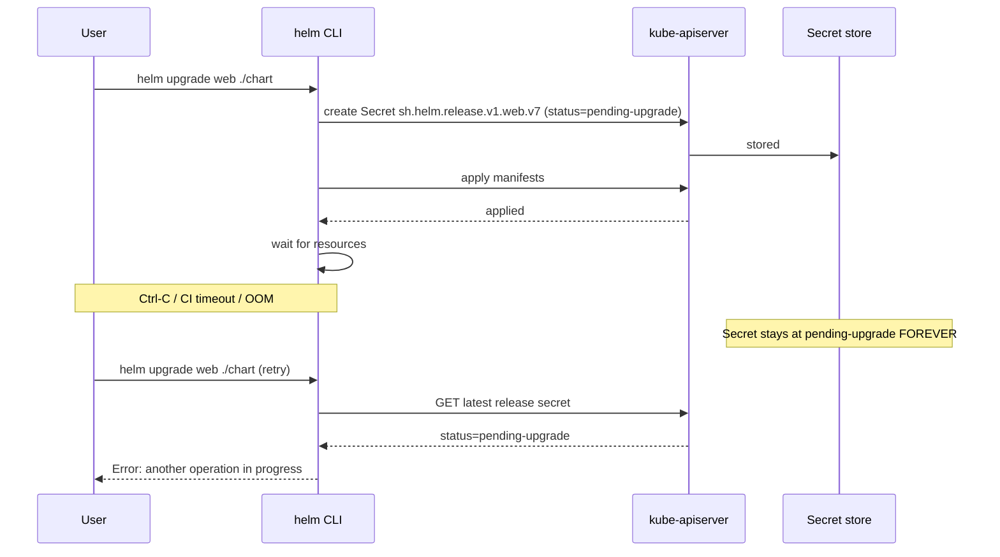

# Helm Stuck

> **Symptom**
> ```
> $ helm upgrade myapp ./chart
> Error: UPGRADE FAILED: another operation (install/upgrade/rollback) is in progress
> ```
> Or `helm list` shows status `pending-upgrade`, `pending-install`, or `pending-rollback` for hours. Subsequent commands all refuse. Your release is wedged.

Helm 3 stores release state as Secrets (`sh.helm.release.v1.<release>.v<rev>`). When a `helm` process dies mid-flight, the state stays `pending-*` and Helm refuses concurrent operations. There is no built-in `helm unstuck`.

---

## Reproduce

```bash
# Start a long upgrade
helm upgrade web ./chart --wait --timeout 60s &
PID=$!
sleep 5
kill -9 $PID                         # simulate crash / Ctrl-C
helm list -A | grep pending
helm upgrade web ./chart             # FAILS: another operation in progress
```

---

## Diagnose — 5 candidate root causes

### 1. Previous helm process killed mid-operation

```bash
helm list -A --all                       # --all shows pending too
helm history web                         # see status per revision
kubectl get secret -l owner=helm,name=web --sort-by=.metadata.creationTimestamp
```

Most recent secret: `STATUS=pending-upgrade`. Helm checks this before any operation.

### 2. `--wait` timed out but resources are still applied

```bash
helm status web
kubectl get all -l app.kubernetes.io/instance=web
```

The chart applied successfully; only the readiness wait failed. State is `failed` or `pending-upgrade`. Resources exist.

### 3. Stuck finalizers on resources owned by the release

```bash
kubectl get <resource> <name> -o json | jq '.metadata.finalizers'
kubectl describe <resource> <name>
```

Common culprits: `kubernetes.io/pvc-protection`, custom operator finalizers, `external-secrets.io/finalizer`. Helm's `helm uninstall` hangs waiting for them.

### 4. CRD owned by chart, but resources of that CRD still exist

```bash
kubectl get <crd-kind> -A
helm uninstall web    # blocks because CRDs deleted before instances
```

Helm 3 by default does NOT delete CRDs. But if your chart deletes them and instances remain, deletion stalls.

### 5. Validation/admission webhook rejecting Helm's secret writes

```bash
kubectl get validatingwebhookconfiguration
kubectl logs -n <ns> <webhook-pod> | grep -i 'sh.helm.release'
```

Some restrictive admission policies block writes to `Secret` objects with the `sh.helm.release.v1` prefix. Helm cannot record state.

---

## Resolve

### A. Manually clear pending state (most common path)

```bash
# Identify the bad release secret
kubectl get secret -n <ns> -l owner=helm,name=web,status=pending-upgrade
# e.g. sh.helm.release.v1.web.v7

# Patch status to "failed" so Helm allows another upgrade
kubectl get secret sh.helm.release.v1.web.v7 -n <ns> -o yaml > /tmp/r.yaml
# Helm encodes the release as base64-then-gzip in `data.release`. Easier path:
kubectl delete secret sh.helm.release.v1.web.v7 -n <ns>
# This rolls Helm back to v6 in its history. Then:
helm history web -n <ns>
helm rollback web 6 -n <ns>           # OR
helm upgrade web ./chart -n <ns>      # forward
```

### B. Mark release as failed via patch (preserves history)

```bash
# Decode, mutate, re-encode (advanced)
kubectl get secret sh.helm.release.v1.web.v7 -n <ns> -o jsonpath='{.data.release}' \
  | base64 -d | base64 -d | gunzip > release.json
jq '.info.status="failed"' release.json > release2.json
gzip -c release2.json | base64 -w0 | base64 -w0 > encoded.txt
kubectl patch secret sh.helm.release.v1.web.v7 -n <ns> --type=merge \
  -p "{\"data\":{\"release\":\"$(cat encoded.txt)\"}}"
```

### C. Stuck `helm uninstall` due to finalizers

```bash
# Find offending resources
kubectl get <resource> <name> -o json | jq '.metadata.finalizers'
# Remove finalizer (LAST RESORT — understand what it protects)
kubectl patch <resource> <name> -p '{"metadata":{"finalizers":[]}}' --type=merge
```

### D. Use the `helm-mapkubeapis` plugin if upgrade is blocked by deprecated APIs

```bash
helm plugin install https://github.com/helm/helm-mapkubeapis
helm mapkubeapis web -n <ns>
helm upgrade web ./chart
```

---

## Prevent

1. **Always run with `--atomic`.** Failed upgrade → automatic rollback → state lands in a clean place.
   ```bash
   helm upgrade web ./chart --atomic --timeout 5m
   ```
2. **Use `--wait` with a sane timeout** so you fail fast.
3. **CI runs Helm in a wrapper script** that traps signals and runs `helm rollback` on EXIT.
4. **Avoid CRDs in regular chart.** Keep them in `crds/` directory (Helm 3 manages separately) or a separate "infra" chart that's never `helm uninstall`ed.
5. **Don't put finalizers on resources you're going to ship in a chart** unless your operator can clean them up reliably.
6. **Argo CD / Flux** instead of imperative `helm upgrade` from CI — declarative reconciliation avoids the "killed mid-flight" class of bug.
7. **Document the unstick runbook.** Every team hits this.

---

## Failure-mode sequence



---

> [!IMPORTANT]
> **Common interview Qs**
> - "Helm release is stuck in `pending-upgrade`. How do you recover?"
> - "Where does Helm 3 store release state?"
> - "What does `--atomic` do?"
> - "How do you handle CRDs in a Helm chart?"
> - "`helm uninstall` is hanging. What's the most likely cause?"
> - "Difference between `helm rollback` and deleting a release secret?"
> - "Why is Argo CD considered safer than `helm upgrade` from CI?"
> - "What is `helm-mapkubeapis` for?"
