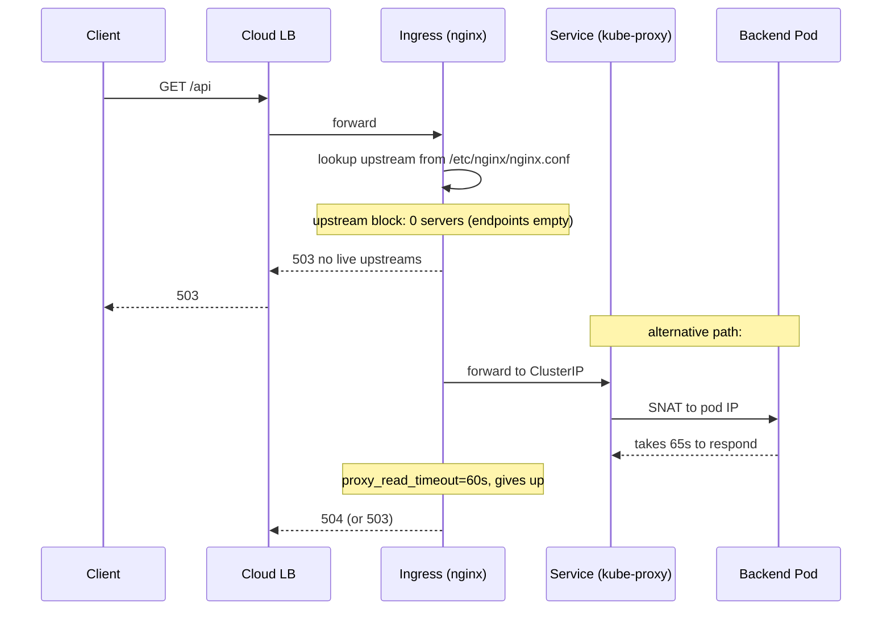

# Ingress 503

> **Symptom**
> The ingress controller is up. Backend pods are `Ready`. But external clients receive `503 Service Temporarily Unavailable` from nginx (or `upstream connect error` from Envoy). `kubectl exec` into the pod and `curl localhost:8080/healthz` returns 200. Yet the ingress can't reach it.

The ingress controller sits between the public LB and Service endpoints. There are five **distinct hops** that can each return 503; pin down which one.

---

## Reproduce

```bash
# Deploy ingress + backend
kubectl create deploy back --image=hashicorp/http-echo --port=5678 -- -text=hi
kubectl expose deploy back --port=80 --target-port=5678
kubectl create ingress test --rule='test.local/=back:80'

# Now break it: scale backend to 0
kubectl scale deploy back --replicas=0
curl -H 'Host: test.local' http://<ingress-ip>/
# 503 Service Temporarily Unavailable
```

---

## Diagnose — 5 candidate root causes

### 1. No endpoints behind the Service

```bash
kubectl get endpoints <svc>
kubectl get endpointslices -l kubernetes.io/service-name=<svc>
kubectl get pods -l <selector>
```

Empty `ENDPOINTS` column → ingress has nothing to forward to → 503. Causes: pods not ready, label selector mismatch, all replicas crashed.

### 2. Service selector doesn't match pod labels

```bash
kubectl get svc <svc> -o jsonpath='{.spec.selector}'
kubectl get pods --show-labels | grep <expected-label>
```

Off-by-one in `app: foo` vs `app.kubernetes.io/name: foo`. Service is healthy in the UI; nothing routes.

### 3. Ingress controller logs show upstream timeout

```bash
kubectl -n ingress-nginx logs -l app.kubernetes.io/name=ingress-nginx --tail=200 \
  | grep -E '503|upstream'
# look for: upstream timed out (110: Connection timed out) while reading response header
# or:       no live upstreams while connecting to upstream
```

Pod accepts connection but takes too long to respond → ingress times out (default 60s) → 503.

### 4. Request body too large

```bash
kubectl -n ingress-nginx logs <pod> | grep -i 'client intended to send too large'
kubectl get ingress <i> -o yaml | grep -A3 annotations
```

nginx default `client_max_body_size` is 1MB. POST a 10MB file → 413 (or 503 if config wrong).

Fix: `nginx.ingress.kubernetes.io/proxy-body-size: "20m"`.

### 5. Backend protocol mismatch (HTTP vs HTTPS, h1 vs h2)

```bash
kubectl get ingress <i> -o yaml | grep -i backend-protocol
kubectl exec <backend-pod> -- ss -tlnp
```

Ingress sends HTTP/1.1, backend speaks HTTPS only → handshake fails → 503.
Annotation: `nginx.ingress.kubernetes.io/backend-protocol: "HTTPS"`.

---

## Resolve

| Cause | Fix |
|-------|-----|
| No endpoints | Fix readiness; check label selector; restore replicas. |
| Selector mismatch | Align labels. Use Helm chart constants. |
| Slow backend | Optimise app or raise `proxy-read-timeout`/`proxy-send-timeout`. |
| Body too large | `nginx.ingress.kubernetes.io/proxy-body-size: 50m`. |
| Protocol mismatch | `backend-protocol` annotation. |

### Helpful nginx ingress annotations

```yaml
metadata:
  annotations:
    nginx.ingress.kubernetes.io/proxy-body-size: "20m"
    nginx.ingress.kubernetes.io/proxy-read-timeout: "120"
    nginx.ingress.kubernetes.io/proxy-send-timeout: "120"
    nginx.ingress.kubernetes.io/proxy-next-upstream: "error timeout http_503 http_504"
    nginx.ingress.kubernetes.io/backend-protocol: "HTTP"
    nginx.ingress.kubernetes.io/affinity: "cookie"
    nginx.ingress.kubernetes.io/load-balance: "ewma"
```

### Diagnose from inside the controller

```bash
kubectl -n ingress-nginx exec -it <ingress-pod> -- /bin/sh
cat /etc/nginx/nginx.conf | grep -A5 'upstream <svc>'
# Should list real pod IPs. If "no live upstreams", endpoints empty.
curl -v -H 'Host: test.local' http://localhost/
```

---

## Prevent

1. **Synthetic health checks against ingress hostname** — not just the pod. End-to-end SLO.
2. **Readiness gates strict.** Pod hits `/readyz` that touches DB/cache.
3. **PDB + maxSurge** for ingress backend deployments.
4. **Default ingress annotations** baked into Helm chart: body size, timeouts, retries.
5. **Alert on `nginx_ingress_controller_requests{status=~"5.."}` rate.**
6. **Smoke test in CD** — after deploy, curl ingress hostname, fail rollout if not 200 within 60s.
7. **Document body-size and timeout limits in API contracts.**

---

## Failure-mode sequence



---

> [!IMPORTANT]
> **Common interview Qs**
> - "Ingress returns 503 but pods are Ready. What's wrong?"
> - "How does the ingress controller learn about pods coming and going?"
> - "What does `no live upstreams` mean in nginx logs?"
> - "Difference between Service-routed ingress and direct-pod-IP ingress?"
> - "How do you upload a 50MB file through nginx ingress?"
> - "Ingress returns 502 vs 503 vs 504 — what's the distinction?"
> - "Backend speaks HTTPS only. How does the ingress reach it?"
> - "Why might the ingress controller's view of endpoints lag the API server?"
