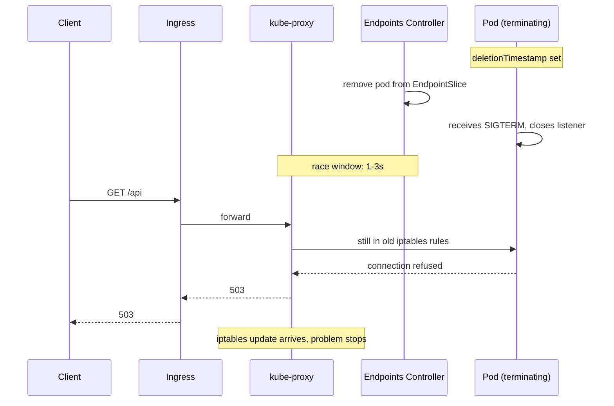

# Intermittent 503s

> **Symptom**
> p99 latency normal, but ~0.5% of requests return `503 Service Unavailable`. Errors are bursty, often clustered around deploys, scale events, or node restarts. No single pod's logs show the failure.

This is the **canonical "ghost in the machine"** scenario. The failure lives between components: Service ↔ Endpoints ↔ kube-proxy ↔ ingress ↔ client.

---

## Reproduce

```bash
# Deploy a flaky service: readiness lies.
kubectl create deploy webby --image=hashicorp/http-echo --replicas=3 -- -text=ok
kubectl expose deploy webby --port=80 --target-port=5678
# Loop traffic
while true; do curl -so /dev/null -w '%{http_code}\n' http://<svc-ip>; done | grep -v 200
# Now scale down: kubectl scale deploy webby --replicas=1
# You'll see a burst of 503s during the EndpointSlice update window.
```

---

## Diagnose — 5 candidate root causes

### 1. Readiness probe lies (returns 200 before app is actually ready)

```bash
kubectl describe pod <p> | grep -A4 Readiness
kubectl logs <p> --since=2m | grep -i 'starting\|listening'
```

App opens the listener but is not yet warm; readiness `tcpSocket: 8080` succeeds → traffic routed → app drops connections.

### 2. EndpointSlice update lag

```bash
kubectl get endpointslices -l kubernetes.io/service-name=<svc>
kubectl get pod <terminating-pod> -o yaml | grep -A2 deletionTimestamp
```

Pod enters `Terminating`. Endpoints controller removes it from EndpointSlice → kube-proxy must update iptables/IPVS on every node. Window: typically **0.5–3 seconds**. During this window, kube-proxy still routes to the dying pod.

### 3. No `preStop` + no graceful shutdown

```bash
kubectl get pod <p> -o jsonpath='{.spec.containers[0].lifecycle}'
kubectl get pod <p> -o jsonpath='{.spec.terminationGracePeriodSeconds}'
```

`SIGTERM` arrives → app closes listener instantly → in-flight requests get RST → 503.

### 4. Connection draining / keep-alive at LB

Long-lived HTTP/1.1 keep-alive connections from upstream LB pin to a specific pod IP. When that pod dies, the connection hangs / 503s for the next ~60s.

```bash
# At the ingress controller (e.g. nginx):
kubectl -n ingress-nginx logs <ingress-pod> | grep -E '503|upstream'
# Look for: upstream prematurely closed connection
```

### 5. HPA scaled down too aggressively

```bash
kubectl get hpa
kubectl describe hpa <h>
kubectl get events --field-selector involvedObject.kind=HorizontalPodAutoscaler
```

Scale-down window during traffic peak → too few pods → 503 from overload.

---

## Resolve

| Cause | Fix |
|-------|-----|
| Readiness lies | Real `httpGet /readyz` that exercises DB, cache, downstream. Add `initialDelaySeconds`. |
| EndpointSlice lag | `preStop` `sleep 10` so pod stays in slice during sync. |
| No graceful shutdown | App must trap SIGTERM, stop accepting, drain in-flight, exit. `terminationGracePeriodSeconds: 60`. |
| Keep-alive pinning | At ingress: `proxy_next_upstream error timeout http_503`; configure `keepalive_requests`; enable retries on idempotent verbs. |
| HPA flapping | `--horizontal-pod-autoscaler-downscale-stabilization=300s` (default 5m); set `behavior.scaleDown.stabilizationWindowSeconds`. |

### Pod template — the gold standard

```yaml
spec:
  terminationGracePeriodSeconds: 60
  containers:
  - name: api
    lifecycle:
      preStop:
        exec:
          command: ['sh','-c','sleep 10']  # stay in EndpointSlice
    readinessProbe:
      httpGet: { path: /readyz, port: 8080 }
      periodSeconds: 5
      failureThreshold: 2
    livenessProbe:
      httpGet: { path: /healthz, port: 8080 }
      initialDelaySeconds: 30
      periodSeconds: 10
```

App-level (Go example):

```go
srv := &http.Server{Addr: ":8080", Handler: mux}
go srv.ListenAndServe()
sig := make(chan os.Signal, 1); signal.Notify(sig, syscall.SIGTERM)
<-sig
ctx, cancel := context.WithTimeout(context.Background(), 30*time.Second)
defer cancel()
srv.Shutdown(ctx)   // drains in-flight, closes idle keepalives
```

---

## Prevent

1. **Synthetic traffic during deploys.** A canary that hits `/api/healthz` every 200ms; alert on any 503.
2. **PDB:** `minAvailable: 50%` so rolling update never strips capacity.
3. **`maxUnavailable: 0` + `maxSurge: 25%`.** Strict zero-downtime rolling update.
4. **Test SIGTERM in CI.** `docker run` the image, send SIGTERM during a request, assert 200.
5. **SLO budget for 503s.** 0.1% / 30 days. Violate → freeze deploys.

---

## Failure-mode sequence



---

> [!IMPORTANT]
> **Common interview Qs**
> - "Service has 5 replicas. You scale to 4. Why might users see 503s?"
> - "Walk me through what happens between SIGTERM and pod removal from EndpointSlice."
> - "What does a `preStop` `sleep 10` actually solve?"
> - "Explain `terminationGracePeriodSeconds` vs `preStop` timeout."
> - "Why does `maxUnavailable: 0` not guarantee zero-downtime?"
> - "How does kube-proxy know when an endpoint is gone?"
> - "Difference between EndpointSlices and Endpoints?"
