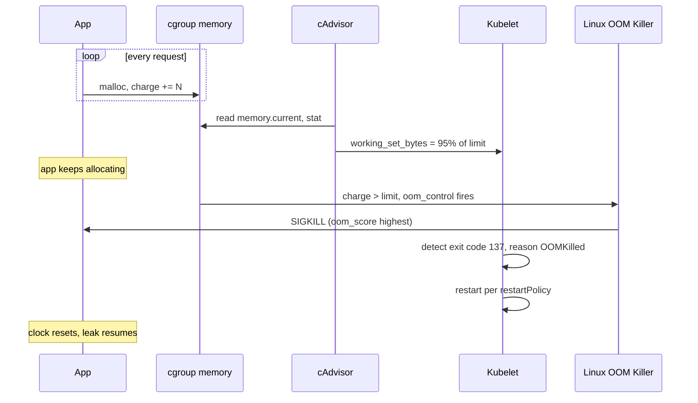

# Memory Leak

> **Symptom**
> A pod's memory usage climbs steadily over hours or days. Eventually it hits its limit and gets `OOMKilled` (exit 137). Restart resets the clock; the leak resumes. Throughput is fine until the kill, then a brief outage during restart.

A memory leak in Kubernetes is harder to diagnose than on a VM because there are **three different "memory" numbers** that disagree, and the kernel makes the kill decision on a fourth.

---

## Reproduce

```bash
# A leaky Go pod
kubectl run leaky --image=ghcr.io/some/leaky-image \
  --limits=memory=128Mi --requests=memory=64Mi
kubectl top pod leaky --containers
# Watch it climb every minute
kubectl get events --field-selector reason=OOMKilling -w
```

---

## Diagnose — 5 candidate root causes

### The 4 memory numbers (memorise)

| Source | What it measures | Used for |
|--------|------------------|----------|
| `RSS` (`ps`, `top` inside container) | Pages physically resident | Process accounting |
| `container_memory_working_set_bytes` (cAdvisor) | RSS + active page cache − inactive cache | **OOM decision (kubelet)** |
| `container_memory_usage_bytes` | Working set + cached files | Misleading — includes recoverable cache |
| `cgroup memory.current` (cgroupv2) | Total cgroup charge | Source of truth for limit enforcement |

The **OOM killer fires when working_set hits the limit**, not RSS, not usage. People stare at RSS and miss it.

### 1. Application-level leak (heap, goroutines, file descriptors)

```bash
# Go: pprof
kubectl port-forward <p> 6060:6060
go tool pprof http://localhost:6060/debug/pprof/heap
go tool pprof http://localhost:6060/debug/pprof/goroutine

# Java: heap dump
kubectl exec <p> -- jcmd 1 GC.heap_dump /tmp/heap.hprof
kubectl cp <p>:/tmp/heap.hprof ./heap.hprof
# analyze with Eclipse MAT

# Python: tracemalloc, py-spy
kubectl exec <p> -- py-spy dump --pid 1
```

### 2. Page cache filling up (false leak)

```bash
kubectl exec <p> -- cat /sys/fs/cgroup/memory.stat | grep -E '^file|^anon'
```

If `file` is huge but `anon` is small, app is reading large files. Working set grows because pages are *active*. Fix: read with `O_DIRECT`, smaller buffers, or accept it.

### 3. Off-heap leaks (JVM direct memory, native libs)

```bash
kubectl exec <p> -- jcmd 1 VM.native_memory summary
# Direct buffers, Metaspace, native code
```

JVM `-Xmx` only bounds heap. Direct buffers, Netty pools, JNI allocations live outside. Container limit must accommodate `-Xmx + metaspace + direct + JIT + threads * stack`.

### 4. Goroutine / thread leak

```bash
kubectl exec <p> -- ls /proc/1/task | wc -l
# Or via pprof goroutine endpoint
```

Each goroutine = ~8KB stack. 100k leaked goroutines = 800MB.

### 5. Cgroup accounting bug / shared mount memory

```bash
kubectl exec <p> -- cat /sys/fs/cgroup/memory.current
kubectl top pod <p>
# Compare. If wildly different, cgroup version mismatch or shared-memory mount.
```

`tmpfs` mounts (e.g. `emptyDir.medium: Memory`) count against the pod's cgroup. Filling `/dev/shm` looks like a leak.

---

## Resolve

### Immediate

```bash
# Bump limit to buy time
kubectl set resources deploy <d> --limits=memory=512Mi
# Or restart on schedule
kubectl rollout restart deploy <d>
```

### Real fix per cause

| Cause | Fix |
|-------|-----|
| Heap leak | Fix code. Add object pool flush. Periodic full GC. |
| Page cache | Increase limit, or use `O_DIRECT`, or accept. |
| Off-heap (JVM) | `-XX:MaxDirectMemorySize`, `-XX:MaxMetaspaceSize`; use container-aware flags. |
| Goroutine leak | `defer cancel()` on every context. Use `errgroup`. Profile-driven fix. |
| tmpfs | `emptyDir.sizeLimit`. Don't use `medium: Memory` casually. |

### JVM container-aware sizing

```yaml
env:
  - name: JAVA_TOOL_OPTIONS
    value: >-
      -XX:+UseContainerSupport
      -XX:MaxRAMPercentage=70.0
      -XX:MaxDirectMemorySize=64m
      -XX:MaxMetaspaceSize=128m
resources:
  limits:
    memory: 1Gi   # heap=700m, direct=64m, meta=128m, threads/JIT/native=~108m
```

---

## Prevent

1. **Always set memory `requests` AND `limits`.** Differ if you want bursting; equal for `Guaranteed` QoS.
2. **Monitor working set, not RSS.** PromQL:
   ```
   container_memory_working_set_bytes{pod=~"app-.*"} / container_spec_memory_limit_bytes
   ```
   Alert > 0.85.
3. **Soft restart at 80% utilisation.** Better than OOMKill.
4. **Profile in CI.** Smoke test with pprof / heap dump compares between releases.
5. **GOMEMLIMIT (Go 1.19+):** soft memory cap that triggers GC, prevents OOMKill in many cases.
6. **VPA recommendations:** run VPA in `recommendation` mode, review monthly.
7. **PDB so restart doesn't take down service.**

---

## Failure-mode sequence



---

> [!IMPORTANT]
> **Common interview Qs**
> - "Pod is OOMKilled. Which memory metric does the kernel use?"
> - "Difference between RSS and working set?"
> - "JVM pod with `-Xmx512m` and `limit: 512Mi` keeps getting OOMKilled. Why?"
> - "What is GOMEMLIMIT? When do you use it?"
> - "Pod's memory usage looks high but it's all page cache. Should you worry?"
> - "How do you take a heap dump from a running pod?"
> - "What does exit code 137 mean?"
> - "VPA vs HPA — when do you use each?"
