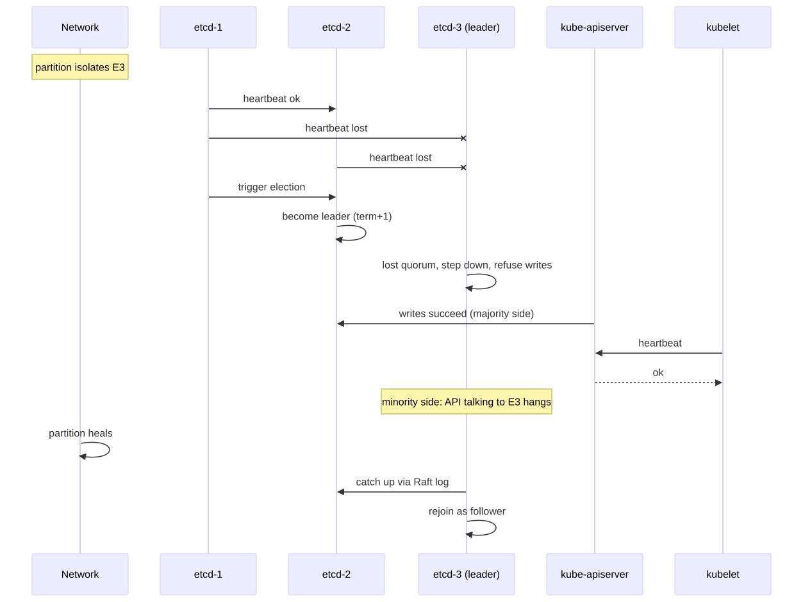
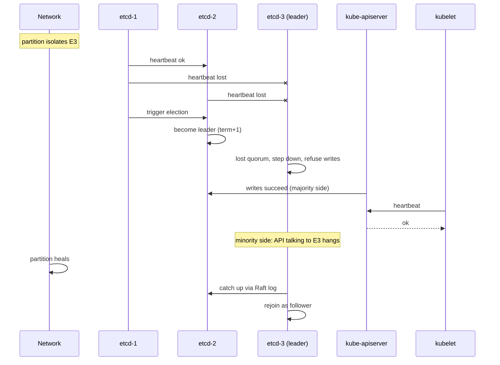

# Network Partition

> **Symptom**
> Half the cluster goes silent. `kubectl get nodes` shows nodes as `NotReady`. etcd peers log `lost the TCP streaming connection`. The API server returns `etcdserver: request timed out`. Some workloads keep running, some die. Confusion reigns.

A control-plane network partition is the **hardest cluster-failure mode to reason about** because every component reacts differently — and the cluster *might* still be partly functional.

---

## Reproduce (lab)

```bash
# 3-node etcd cluster on a kind multi-node setup
docker network disconnect kind <etcd-2-container>
# Or with iptables on a node:
iptables -I INPUT -p tcp --dport 2380 -j DROP
iptables -I INPUT -p tcp --dport 2379 -j DROP

kubectl --request-timeout=5s get nodes        # should still respond if quorum holds
kubectl logs -n kube-system etcd-cp1 | tail -50
```

---

## Diagnose — 5 candidate root causes

### 1. etcd lost quorum (split-brain prevention)

```bash
# From any reachable etcd:
ETCDCTL_API=3 etcdctl --endpoints=https://127.0.0.1:2379 \
  --cacert=/etc/kubernetes/pki/etcd/ca.crt \
  --cert=/etc/kubernetes/pki/etcd/peer.crt \
  --key=/etc/kubernetes/pki/etcd/peer.key \
  endpoint status -w table
endpoint health
member list
```

If quorum lost: API server reads/writes block. **etcd never serves stale writes** — it would rather be unavailable.

3-node cluster tolerates 1 failure. 5-node tolerates 2. Even-numbered clusters do NOT increase tolerance.

### 2. API server isolated from etcd

```bash
kubectl logs -n kube-system kube-apiserver-cp1 | grep -E 'etcd|timeout'
nc -zv etcd-host 2379
```

API server alive, etcd alive, but the link between them is dropped. API server is useless.

### 3. Kubelets isolated from API server

```bash
ssh <worker>
journalctl -u kubelet -n 100 | grep -E 'Failed to update node status|Unauthorized|timeout'
```

After `--node-monitor-grace-period` (default 40s), node-controller marks the node `NotReady`. After 5 minutes, pods on it get `NoExecute` taint, evicted (rescheduled if possible).

**Critically:** kubelet keeps running existing pods. Workloads do not stop just because the API server is gone.

### 4. CNI control-plane lost (Calico/Cilium)

```bash
kubectl -n kube-system get pods -l k8s-app=calico-node
kubectl -n kube-system logs <calico-node-pod> | grep -i 'connection refused'
```

Calico needs etcd or Kubernetes API for IPAM and BGP peering state. Lose it → no new pod IPs allocated → new pods stuck `ContainerCreating`.

### 5. Asymmetric partition (one-way packet loss)

```bash
# Test bidirectional
ping -c 5 <other-node>
nc -zv <other-node> 6443
# From the other side:
nc -zv <this-node> 10250    # kubelet port
```

The trickiest case. A → B works, B → A doesn't. Each side sees the other as healthy in some checks, unhealthy in others.

---

## What different components do

| Component | Behaviour during partition |
|-----------|---------------------------|
| **etcd minority** | Refuses writes. Reads return stale or fail. |
| **etcd majority** | Continues serving. Elects new leader if old one was in minority. |
| **kube-apiserver** | If etcd unreachable → 503 on writes; reads from cache may work briefly. |
| **kube-scheduler** | Loses leader lease → other replica takes over. New scheduling stops if API server is down. |
| **controller-manager** | Same — leader-elected, stops mutating if API down. |
| **kubelet** | Keeps existing pods running. Cannot create new pods (no API). Reports `NotReady` after grace period. |
| **kube-proxy** | Caches Service/Endpoints. Existing connections keep working. Stale state until it reconnects. |
| **CoreDNS** | Same — cached records continue resolving. |
| **Pods** | Already-running pods unaffected. New pods cannot be scheduled. |

---

## Resolve

### If quorum lost — restore etcd

```bash
# Option A: bring back the lost member
systemctl start etcd
etcdctl member list

# Option B: force new cluster from snapshot
etcdctl snapshot save snap.db                  # if any member alive
etcdctl snapshot restore snap.db --name=cp1 \
  --initial-cluster=cp1=https://10.0.0.1:2380 \
  --initial-advertise-peer-urls=https://10.0.0.1:2380
# then restart etcd as a new single-member cluster
# add other members back one by one
```

### If kubelets isolated — they self-heal once link restored

No action needed. When kubelet reconnects, node returns to `Ready`. Watch for split-brain pod state if controller already rescheduled the pod elsewhere.

### Watch for "ghost pods"

Pod evicted from NotReady node + rescheduled elsewhere + original node returns. Two pods, same name, different UIDs. The old one is stopped by kubelet on reconnect.

---

## Prevent

1. **Run etcd on dedicated nodes**, not co-resident with workloads, with low-latency network.
2. **etcd cluster size: 3 or 5.** Never even. Never 1 in prod.
3. **Spread across failure domains** — different racks, different AZs (with <10ms RTT).
4. **Monitor:** `etcd_server_has_leader`, `etcd_network_peer_round_trip_time_seconds`, `etcd_disk_wal_fsync_duration_seconds`.
5. **Backups:** etcd snapshot every 30 min, stored off-cluster.
6. **`--node-monitor-grace-period` tuning** if your network is flaky — but 40s is good default.
7. **PDBs everywhere** so that "pod evictions due to NotReady node" don't kill a service.
8. **Test partitions in game-days.** Chaos Mesh `NetworkChaos` `partition`.

---

## Failure-mode sequence

<!-- mermaid:rendered -->
<p align="center"></p>

<details><summary>Mermaid source</summary>



</details>

---

> [!IMPORTANT]
> **Common interview Qs**
> - "etcd has 3 members. One dies. What happens?"
> - "etcd has 3 members. Two die. What happens to the cluster?"
> - "Why is a 4-node etcd cluster *worse* than a 3-node one?"
> - "API server is down for 30 minutes. Do my running pods stop serving traffic?"
> - "What's the difference between `NotReady` and tainted with `NoExecute`?"
> - "Kubelet loses connection to API server. How long before pods are evicted?"
> - "How does Raft prevent split-brain?"
> - "Two pods with the same name, same namespace, different UIDs. How?"
