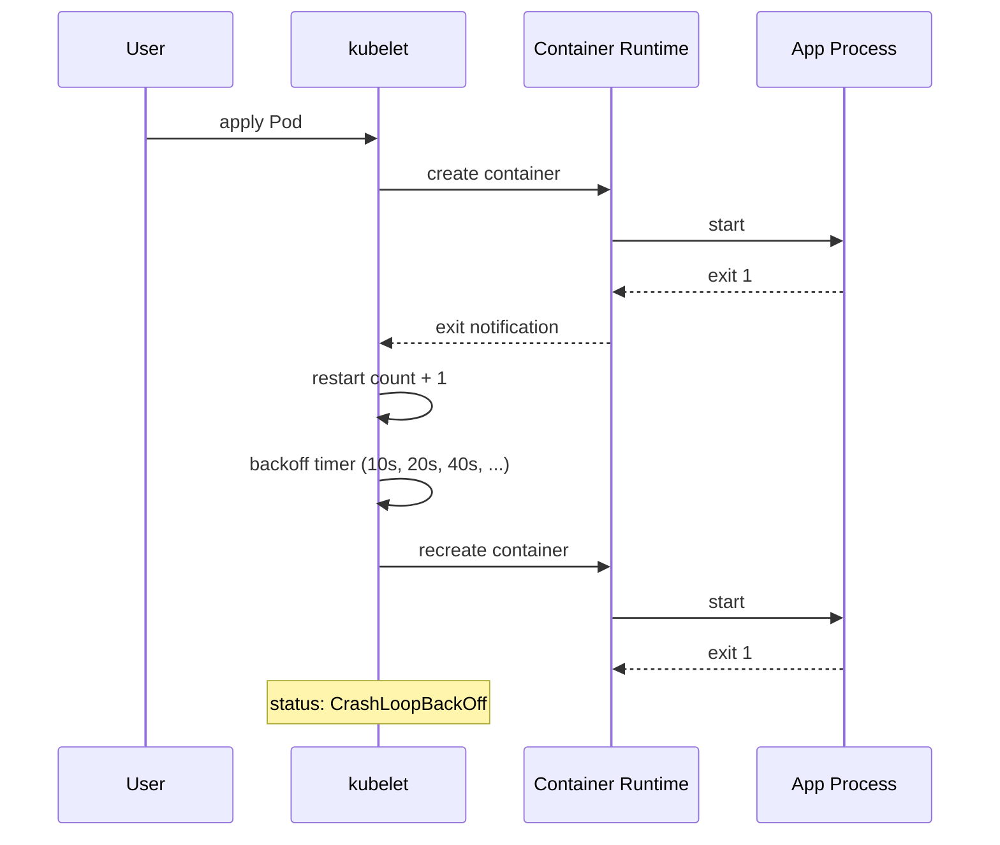

# Pod CrashLoopBackOff

> **Symptom**
> ```
> NAME       READY   STATUS             RESTARTS   AGE
> api-7d8c   0/1     CrashLoopBackOff   6          7m
> ```
> Pod restarts repeatedly with exponential backoff (10s → 20s → 40s → ... → 5m max).

`CrashLoopBackOff` is **not an error type** — it is the kubelet's *response* to a container that exits and is restarted by the `restartPolicy`. The real error is upstream of the loop.

---

## Reproduce

```bash
kubectl run crasher --image=busybox --restart=Always -- sh -c 'echo boom; exit 1'
kubectl get pod crasher -w
# wait ~30 seconds, then:
kubectl describe pod crasher | grep -A2 'Last State'
```

You will see `Reason: Error, Exit Code: 1` with the kubelet backing off.

---

## Diagnose — the 5 candidate root causes

### 1. Application crashes on startup (most common)

```bash
kubectl logs <pod> --previous --tail=200
kubectl logs <pod> -c <container> --previous
```

Look for stack traces, panic, `unhandled exception`, missing env vars, config parse errors.

### 2. Failed liveness probe

```bash
kubectl describe pod <pod> | grep -A5 Liveness
kubectl get events --field-selector involvedObject.name=<pod>
```

Event line you want: `Liveness probe failed: HTTP probe failed with statuscode: 500`.
Probe restarts the container — but the container itself was healthy. Classic false-positive loop.

### 3. OOMKilled

```bash
kubectl describe pod <pod> | grep -E 'Reason|Exit Code'
# Reason: OOMKilled, Exit Code: 137
kubectl get pod <pod> -o jsonpath='{.status.containerStatuses[*].lastState.terminated.reason}'
```

`Exit 137 = SIGKILL = 128+9`. cgroup memory limit exceeded.

### 4. Missing config / secret / volume

```bash
kubectl describe pod <pod> | grep -E 'MountVolume|FailedMount|CreateContainerConfigError'
```

Status `CreateContainerConfigError` means the secret/configmap referenced does not exist. Pod will never start.

### 5. ImagePullBackOff misdiagnosed as CrashLoop

```bash
kubectl get pod <pod>
# STATUS: ImagePullBackOff is distinct, but novices conflate them
kubectl describe pod <pod> | grep -A5 'Failed'
```

Look for `manifest unknown`, `pull access denied`, `no such host`.

---

## Resolve

| Cause | Fix |
|-------|-----|
| App crash on startup | Fix the bug. `kubectl logs --previous`, redeploy. |
| Bad liveness probe | Loosen `initialDelaySeconds`, increase `failureThreshold`, use `/healthz` distinct from `/`. |
| OOMKilled | `resources.limits.memory` raised; profile heap; check JVM `-Xmx` is < limit. |
| Missing secret | `kubectl create secret generic ...`; check namespace; check spelling. |
| ImagePull | Fix tag; add `imagePullSecrets`; check registry auth. |

### Liveness probe fix example

```yaml
livenessProbe:
  httpGet:
    path: /healthz       # NOT /
    port: 8080
  initialDelaySeconds: 30  # let JVM warm up
  periodSeconds: 10
  failureThreshold: 6      # 60s of failure before kill
  timeoutSeconds: 2
```

### OOM fix example

```yaml
resources:
  requests:
    memory: 256Mi
  limits:
    memory: 512Mi   # was 256, JVM heap was 384, OOMKilled
env:
  - name: JAVA_OPTS
    value: '-Xmx384m -XX:+UseContainerSupport'
```

---

## Prevent

1. **Separate `/healthz` and `/readyz`.** Liveness should test "is the process functioning?". Readiness should test "is it ready for traffic?". Conflating them causes restart loops on temporary downstream blips.
2. **`initialDelaySeconds` ≥ p95 startup time.** Or use `startupProbe`.
3. **Set requests AND limits.** `requests` for scheduling, `limits` to prevent noisy-neighbor.
4. **JVM apps:** `-XX:+UseContainerSupport` + `-XX:MaxRAMPercentage=75.0`. Let JVM read cgroup memory limit.
5. **CI gate:** lint manifests with `kubeval` / `kube-linter`; reject pods with no liveness or no resource limits.
6. **Pre-merge smoke test:** spin up the image in `kind`, hit health endpoint, fail PR if it doesn't return 200 in 60s.

---

## Failure-mode sequence



---

> [!IMPORTANT]
> **Common interview Qs**
> - "A pod is in CrashLoopBackOff. Walk me through the first five commands you'd run."
> - "What is exit code 137 and how do you fix it?"
> - "Why is `kubectl logs` empty but `kubectl logs --previous` shows the error?"
> - "Difference between ImagePullBackOff and CrashLoopBackOff?"
> - "Liveness probe failing kills your pod every 30 seconds. Probe hits `/`. The home page does a DB query. What's wrong and how do you fix it?"
> - "What's the maximum backoff interval?" (5 minutes)
> - "How does kubelet decide whether to restart?" (`restartPolicy`: Always / OnFailure / Never)
