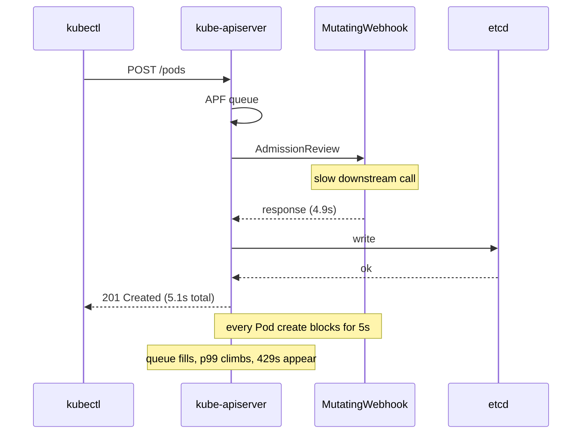

# Slow API Server

> **Symptom**
> `kubectl get pods -A` takes 30+ seconds. `kubectl apply` returns `the server was unable to return a response in the time allotted`. Controllers fall behind, reconcile loops stretch from seconds to minutes. Latency dashboards on `apiserver_request_duration_seconds` look like a city skyline.

The API server is the bottleneck of every cluster operation. When it slows, *everything* slows. The cause is almost always **upstream of the API server** — etcd, large objects, watch storms, or admission webhooks.

---

## Reproduce

```bash
# Create 5000 ConfigMaps and watch the API server crawl
for i in $(seq 1 5000); do
  kubectl create cm cm-$i --from-literal=k=v -n default >/dev/null &
done; wait

time kubectl get cm -A
# Now LIST is slow because etcd serves them all
```

---

## Diagnose — 5 candidate root causes

### 1. etcd I/O latency

```bash
# Inside an etcd pod / on etcd node
ETCDCTL_API=3 etcdctl --endpoints=https://127.0.0.1:2379 \
  --cacert=... --cert=... --key=... endpoint status -w table
# look for raftAppliedIndex lag, db size

# Prometheus key metrics:
# etcd_disk_wal_fsync_duration_seconds (p99 should be < 25ms)
# etcd_disk_backend_commit_duration_seconds (p99 < 25ms)
# etcd_server_proposals_failed_total
```

Slow disk = slow etcd = slow API. Spinning disks, throttled EBS, noisy neighbour all surface here.

### 2. Large objects in etcd

```bash
# Find big keys
ETCDCTL_API=3 etcdctl get / --prefix --keys-only | head
ETCDCTL_API=3 etcdctl --command-timeout=60s endpoint status -w json | jq '.[].Status.dbSize'

# K8s side: which kinds are big?
kubectl get --raw /metrics | grep apiserver_storage_objects | sort -k2 -n -r | head
```

ConfigMaps with 1MB binary blobs, Events table with 100k entries, Secrets used as caches — these inflate etcd. Default object size cap: **1.5MB**. Default etcd db cap: **2GB** (configurable to 8GB).

### 3. Watch storms

```bash
kubectl get --raw /metrics | grep apiserver_registered_watchers | sort -k2 -n -r | head
kubectl get --raw /metrics | grep apiserver_longrunning_requests
```

A buggy operator opens 5000 watches, each delivering every change of every Pod across all namespaces. API server CPU saturates broadcasting events.

### 4. APF (API Priority and Fairness) starving requests

```bash
kubectl get --raw /metrics | grep apiserver_flowcontrol_request_wait_duration_seconds
kubectl get --raw /metrics | grep apiserver_flowcontrol_rejected_requests_total
kubectl get flowschemas
kubectl get prioritylevelconfigurations
```

If a noisy client matches a low-priority FlowSchema and saturates its queue, requests get rejected with **HTTP 429**. Other clients OK; the noisy one is throttled.

### 5. Admission webhook latency

```bash
kubectl get --raw /metrics | grep apiserver_admission_webhook_admission_duration_seconds | sort -k2 -n -r | head
kubectl get validatingwebhookconfiguration
kubectl get mutatingwebhookconfiguration
```

A mutating webhook with 5s timeout that times out on every Pod create blocks every Pod create. `failurePolicy: Fail` makes it worse.

---

## Resolve

| Cause | Fix |
|-------|-----|
| etcd slow disk | Move etcd to NVMe / provisioned-IOPS storage. Defragment: `etcdctl defrag`. |
| Large objects | Enforce object size limits in admission. Move blobs to object storage. Reduce Event retention: `--event-ttl=1h`. |
| Watch storms | Identify culprit by user-agent in audit logs; add label selectors / field selectors; use Informers with shared cache; rate-limit operators. |
| APF starvation | Add custom FlowSchema for the priority workload; raise PriorityLevelConfiguration concurrency. |
| Slow webhook | `timeoutSeconds: 5`, `failurePolicy: Ignore` on non-critical, `namespaceSelector` to scope, exclude `kube-system`. |

### etcd defrag procedure

```bash
# do it per-member, with leadership transfer
ETCDCTL_API=3 etcdctl --endpoints=$E1,$E2,$E3 endpoint status -w table
ETCDCTL_API=3 etcdctl --endpoints=$E1 defrag
ETCDCTL_API=3 etcdctl --endpoints=$E2 defrag
# transfer leadership before defragging the leader
ETCDCTL_API=3 etcdctl --endpoints=$E3 move-leader <other-id>
ETCDCTL_API=3 etcdctl --endpoints=$E3 defrag
```

### Custom FlowSchema example

```yaml
apiVersion: flowcontrol.apiserver.k8s.io/v1
kind: FlowSchema
metadata: { name: critical-controllers }
spec:
  priorityLevelConfiguration: { name: workload-high }
  matchingPrecedence: 100
  rules:
    - subjects:
        - kind: ServiceAccount
          serviceAccount: { namespace: prod, name: critical-controller }
      resourceRules:
        - verbs: ['*']
          apiGroups: ['*']
          resources: ['*']
```

---

## Prevent

1. **etcd on NVMe, dedicated nodes, monitored.** Top SLI: `etcd_disk_wal_fsync_duration_seconds` p99 < 25ms.
2. **Object size policy.** OPA/Kyverno reject ConfigMap/Secret > 256KB.
3. **Event TTL = 1h.** Events flood etcd otherwise.
4. **Audit log review** for high-cardinality watchers; quarterly cleanup.
5. **Webhook discipline:** `timeoutSeconds <= 5`, `failurePolicy: Ignore` unless critical, `namespaceSelector`.
6. **Cluster size budget:** for >5k nodes, expect to tune APF, etcd, scheduler.
7. **SLO:** `apiserver_request_duration_seconds` p99 (read) < 1s, (write) < 1s. Alert.

---

## Failure-mode sequence (slow webhook)



---

> [!IMPORTANT]
> **Common interview Qs**
> - "kubectl is slow. What's the first metric you'd look at?"
> - "What is APF? What problem does it solve?"
> - "etcd db is 7GB and growing. What do you do?"
> - "Mutating webhook with `failurePolicy: Fail` and `timeoutSeconds: 30`. Why is this dangerous?"
> - "How do you find which client is causing watch storms?"
> - "What is `etcdctl defrag`? When do you run it?"
> - "Difference between LIST and WATCH on the API server?"
> - "Why does kubectl sometimes return data from cache and sometimes from etcd?"
